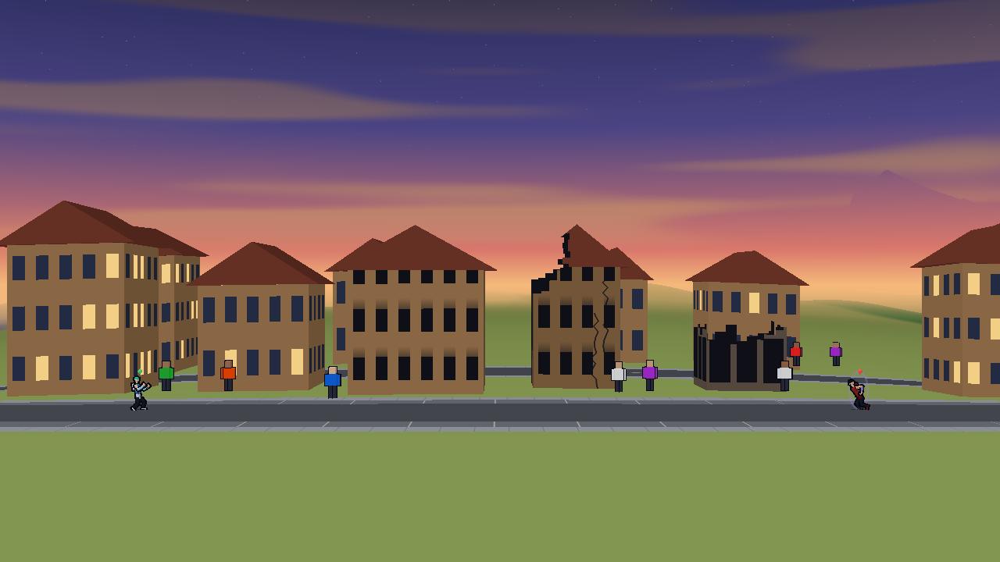
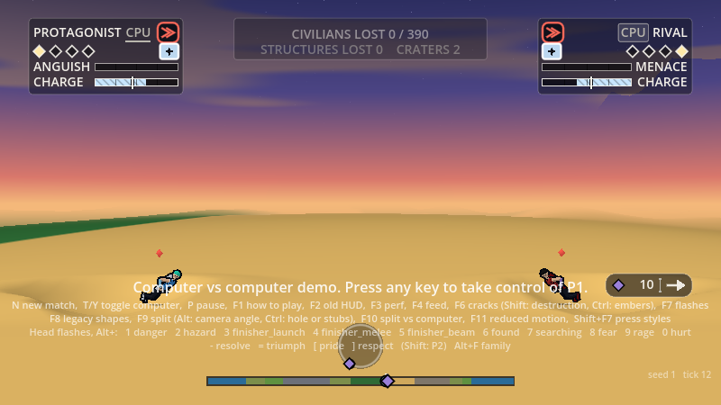
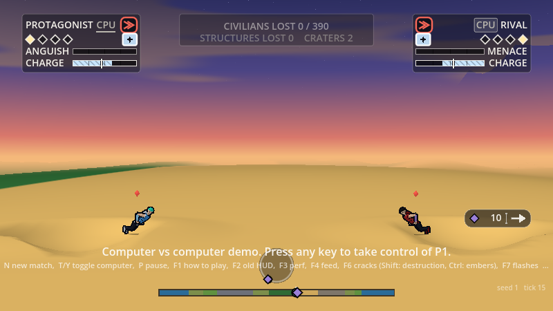
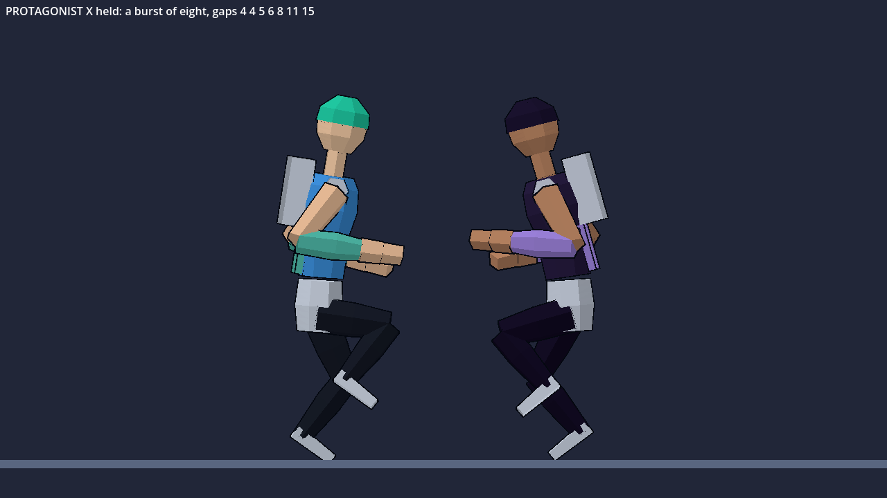
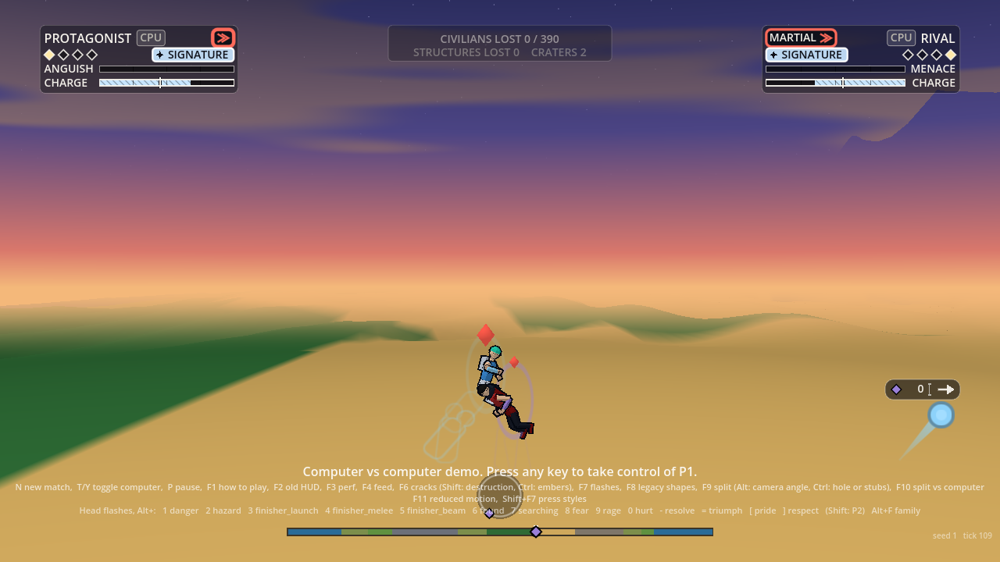
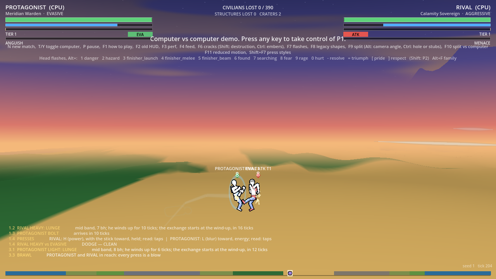
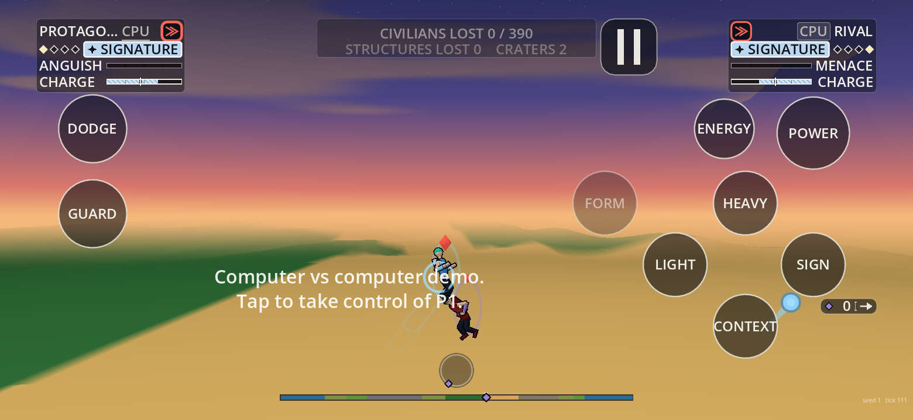
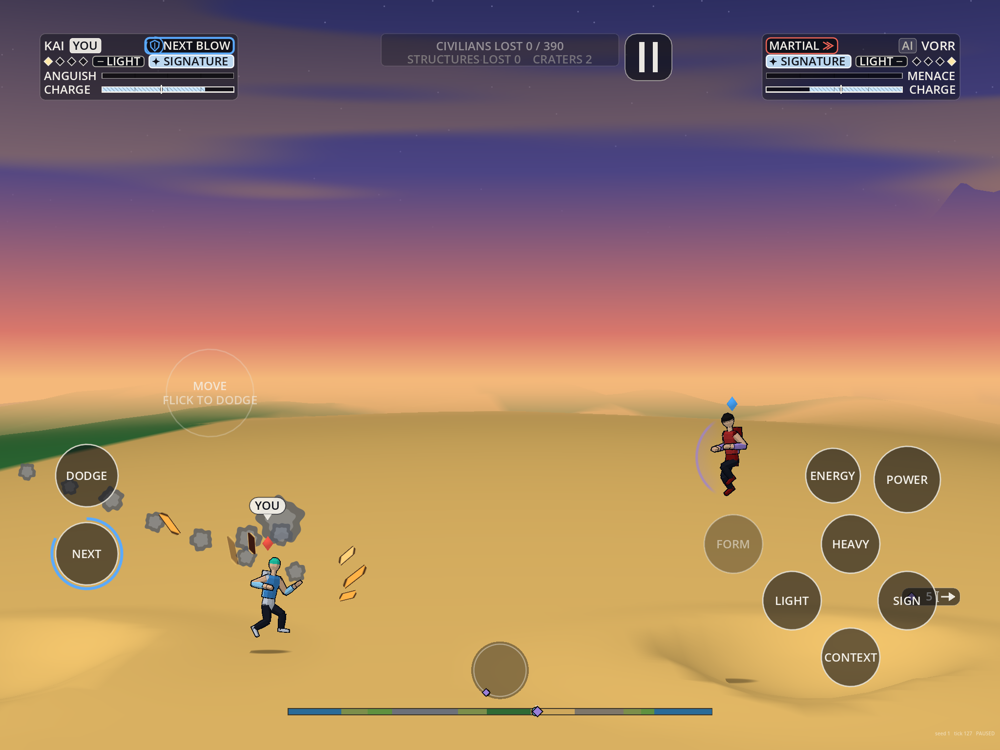
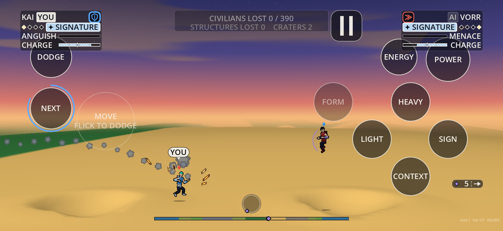
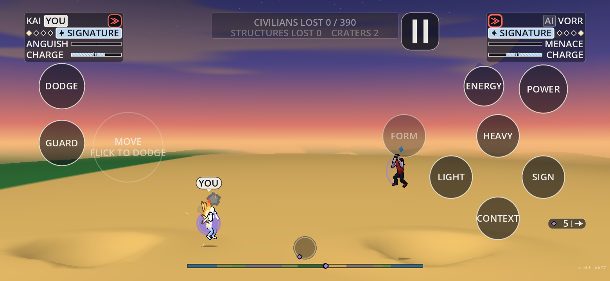

# Rendering: the greybox

Owner: Rendering and Technical Art. Code: `render/`. Status: first playable greybox (P1), 2026-09-29; civilians and planet-scale pass, craters, scorch and water, and one world to the horizon, the same day.

The main scene runs the GDScript sim (`sim/`) as a 60 Hz fixed-step loop and draws it every frame in a 2.5D side-on view of the wrapped planet. Frames are interpolated between the last two ticks. It starts as an AI-vs-AI demo; any key or click hands P1 to a human, as the prototype did. Everything on screen is a greybox made of simple meshes and flat colours. The cel-shaded look comes later with Art.

## Run it

Godot 4.7.2 (`C:\Users\itsha\AppData\Local\Programs\Godot\4.7.2\`; use `_console.exe` for headless runs). On a fresh clone, import once so the `class_name` scripts register:

```
godot --headless --path . --import
```

Then press F5 in the editor, or run:

```
godot --path .
```

| Key | Action |
| :--- | :--- |
| any key or click | take control of P1 (the demo starts AI vs AI) |
| the fighters' keys, pad and touch | Controls' layouts (`data/input/layouts.json`; F1 shows them for the device in use) |
| Start on a pad | the pause menu; on a pad that is not playing while a second player could join, it joins |
| N / T / Y / P | new match / P2 joins on the keyboard, or is handed back to the AI / toggle P1 AI / pause (UI's pause menu: Resume, How to play, Settings, Send feedback, New match; keys, pad, mouse and touch) |
| F1 | UI's How to play card, open or close (it also opens at the first run) |
| F2 | swap UI's HUD for the greybox HUD (until UI's playtest) |
| F3 | performance overlay |
| F4 | the director feed in UI's HUD |
| F6 / Shift+F6 / Ctrl+F6 | VFX's ground cracks (on) / its destruction: shards, collapse dust, holes (off until World's B2) / its scorch embers (on) |
| F7 / F8 | head flashes on and off / their legacy shapes |
| F9 | Camera's split screen on and off (on by default) |
| Alt+F9 / Ctrl+F9 | the camera's pitch: straight on, 11 degrees, 49 degrees / the occlusion method: a hole around the fighter, or stubs |
| F10 / F11 | the split against the AI (UI's `split_solo`) / reduced motion (UI's `reduced_motion`) |
| Alt+1 to Alt+[ (Shift: P2), Alt+F | fire each head flash in the data's order; cycle a fighter's shape family |
| Esc | quit (desktop) |

The mapping is Controls': the host hands every key, pad and touch event to `SimInputHub` (`sim/input/hub.gd`), which builds each human slot's intent from its layout. `render/core/key_codes.gd` only turns Godot's physical keys into its code names. The host's part:
- P, Start on a pad and the touch pause button toggle UI's pause menu (`ui_hud.toggle_pause_menu`; `docs/ui/hud-spec.md` section 28). The host only wires its signals: opened, the sim freezes and held keys are let go; closed, it runs again; New match starts one. The greybox menu is gone. With the greybox HUD (F2) UI's HUD is hidden, so P is a plain pause there.
- A pad that is unplugged lets go of what it held.
- When a pause ends (P, or an overlay closing) the hub resumes, so nothing pressed during it fires.
- A pausing set piece (Simulation's Q10: `S.pause.left` frozen ticks, `pause_start` and `pause_end`) is treated the same way by Controls' rule: the host drops what is pressed on each of its frozen ticks and resumes the hub on the last, so holds are read afresh and no pile of presses fires. A hit-stop is different: it lasts a few frames and its presses are kept for the next live tick. On any frozen tick match time stands still, so everything on sim time holds (the crowd's flight and startle, the head flashes, the fighters' turns, the grooves' glow); the particles creep at a tenth of their speed, as the `tick` event's rule says.
- How to play, Settings and Send feedback open over the menu inside the HUD and hold the sim; closing one restores the pause it found, so the menu comes back.
- UI's options the host owns go to the hub: `pad_preset` (player one's pad layout), `pad_preset_p2` (player two's) and `touch_preset`. After a player's remap (`remap_slot_changed`; UI applies and saves it through Controls) the hub reloads its layouts. UI's `pad_slot_fn` is told which player a pad drives, so the Remap screen opens on the player whose pad pressed. The hub's defaults are pushed into the HUD first.
- The options the player saved there are loaded at start (after those defaults, so the saved choice wins), except in the tools, the bench and scripted runs (`--frames`, `--shot`), which keep the defaults so a saved option never changes a check.

Command-line options go after `--`: `--seed=N`, `--human` (take P1 at start), `--frames=N` (quit after N frames), `--shot=file.png` (save the last frame), `--bench` (vsync off; print frame-time statistics at quit), `--novsync`, `--nosplit` (one view), `--pitch=DEG` and `--occl=hole|stub` (the two debug toggles' starting values), `--nostreets` (no street paint), `--nodamage` (no battle damage on the fighters), `--noclouds` (a bare sky), `--skyreact` (the clouds part for a fighter at tier 3 and 4; off by default; on the web, `/play/?skyreact=1`), `--study` or `--study=zip` (Animation's study scene in place of the game; on the web, `/play/?study=1`), `--nowindows` (blank walls), `--nointro` (start from the intro's end state; on the web, `/play/?nointro=1`; `--bench` starts that way too). Add Godot's own `--fixed-fps 60` to get exactly one tick per frame, for screenshots at a known tick.

## Scene structure (`render/main.tscn`)

```
Main            Node3D               core/main.gd         the frame loop, input, match start, bench and shots
├ Pane          Node3D               core/pane_world.gd   one camera's view of the world (built in main.gd)
│ ├ Camera      Camera3D             camera/camera_rig.gd the reference camera as a 3D camera
│ ├ Environment WorldEnvironment                          sky gradient (shaders/sky.gdshader)
│ ├ Planet      Node3D               core/planet_view.gd  ground and water to the horizon (5 copies), buildings, trees, crowd (3)
│ ├ Fighters    Node3D                                    one core/fighter_view.gd per fighter, built per match
│ ├ Beams       Node3D               core/beam_view.gd    signature beams and beam clashes
│ ├ Particles   MultiMeshInstance3D  core/particle_view.gd  the fx consumer's particles, one draw call
│ └ Vfx         Node3D               vfx/vfx_layer.gd     VFX's drawing for the pane (its hub is SimHost.vfx, shared)
├ HUD           CanvasLayer
│ ├ UiHud       Control              ui/hud/ui_hud.gd     UI's HUD (added in main.gd; docs/ui/hud-spec.md)
│ └ Overlay     Control              core/hud.gd          take-over prompt, seed and tick, F3 perf; the whole greybox HUD on F2
└ AudioVoices   Node                 audio/audio_voices.gd  Audio's voice pool (added in main.gd)
```

| File | Role |
| :--- | :--- |
| `core/sim_host.gd` | The host: the fixed-step accumulator (overview.md section 2), keyboard intents, draining `S.out.feed` and `S.out.fx` after each tick, the reference camera and fx consumer, the camera-shake stream, and the two snapshots that frames interpolate between. It is the only render-side code that calls into the sim. |
| `core/look.gd` | Every colour and dimension of the greybox look, in one place (the prototype's palette). |
| `core/mats.gd` | Flat and glow materials over the shaders; an instance per pane holds that camera's material state. |
| `core/pane_world.gd` | One camera's view of the world (see Panes and the split screen). |
| `core/crowd_mesh.gd` | The generated civilian figure (see Civilians below). |
| `core/ground_field.gd` | The ground band's data for the GPU and its CPU mirror: round crater bowls in depth, scorch, water (see Craters, scorch and water below). |
| `core/impact_fx.gd` | Render-side live effects for World's crater, scorch and splash events: ejecta, rim dust, shock rings, the glow of fresh grooves, embers (sparks, dropped while VFX's embers are on), ripples and skim spray. |
| `shaders/` | `flat` (opaque and alpha) and `glow` (additive) for props and fighters; `terrain` and `water` over `ground.gdshaderinc` (the ground field); `crowd`; `building` (every row's buildings: the hole, the stub and the floor cut, per pane); `particle` (shapes per instance); `sky` over `skycol.gdshaderinc` (the horizon-anchored gradient the ground also fogs into, space, stars); `bend.gdshaderinc` (horizon curvature). |
| `tools/seam_sweep.gd`, `tools/determinism.gd` | The seam and determinism checks (see below). |
| `tools/shots.gd` | Posed screenshots for these docs (see below). |
| `tools/ground_check.gd` | The ground check: the drawn ground against the sim's (see Verification). |

## How it draws

- **Camera.** A perspective camera with a 30° vertical FOV looks straight down -z. For the reference camera's x, y and zoom z (pixels per world unit, `sim/core/view/camera.gd`), the rig places the camera at distance `vh / (2 z tan(fov/2))`. On the fighter plane (z = 0) a point therefore lands on the prototype's `w2s()` pixel exactly. Things in front of or behind that plane get perspective parallax: the ground, buildings and trees. Screen shake is the fx consumer's `shake`, with jitter drawn once per tick from the `camera` stream.
- **Floating origin and the seam.** Everything is placed relative to the camera's wrapped x, so the camera sits at x = 0 and no coordinate grows large. World-anchored content (ground, water, buildings, trees, crowd) is built once per match over x in [0, 9600). It is drawn as identical copies at `k * W - cam.x`, sharing meshes and MultiMeshes: the ground and water for k = -2 to 2 (`PLANET_COPIES`, because the horizon is wide), the props for k = -1 to 1. The seam is therefore invisible by construction, and a view wider than the planet (tiny zoom on an ultra-wide or phone screen) shows everything wherever it appears. Fighters, beams and particles are placed by the shortest arc `sdx(cam.x, x)`. A beam is laid out from its tail along its direction, so one crossing the seam stays in one piece.
- **Terrain.** The ground is one surface of static meshes: per column, a top face from past the camera back to the horizon. The vertex shader reads heights from a float data texture (layout in `ground_field.gd`). The planet view re-uploads the texture only when `S.deform` changes, so craters never rebuild geometry. Crater, sea-floor and biome colours come from the same data, and water is drawn only where the base terrain is below sea level (the sim's `seaAt` rule).
- **Props.** Buildings, roofs, trees and civilians are MultiMeshes, one draw call per kind per copy. Only instances whose building, tree or ground changed are updated. The sim has civilians only as counts per building, so the greybox stands `popAlive` figures around each building. Where each one stands, the tree depths, and each civilian's shirt and skin tone come from render-side streams seeded from the fixed world seed, never from the sim stream.
- **Fighters.** Each fighter is generated from its roster colours and role: boxes, a low-poly head, and hair and cape extruded from 2D outlines. Stance shows as a badge colour and a lean, a held guard as the guard arc ("The guard arc" below), and the HUD labels both. A dash or a dodge leaves thin outlines behind him ("Afterimages" below). A hit makes the body flash white for 0.12 s after `hurtT`. The aura grows with tier, and aura streaks appear at tier 3 or above and while charging. A hidden fighter fades to 22 % inside a sonar ripple. The beam charge orb grows at the hand. The placeholder hero's hair is a teal, swept-back crest.
- **Shading.** All greybox materials are unshaded, with one fixed fake light in the shader. That means no light passes and the same look on every renderer. In 4.7.2 Compatibility, vertex and MultiMesh instance colours reach shaders already linear (checked by sampling rendered pixels), so the shaders use `COLOR` as it is. A MultiMesh without instance colours multiplies `COLOR` by zero there, so the crowd tags its parts in `UV` and takes its colours from custom data.
- **Interpolation.** After each tick the host snapshots fighter x, y and rotation and the camera. Frames draw at `alpha = acc / DT` between the last two snapshots, with x interpolated along the shortest arc. Beams, particles, terrain and props show the latest tick.

## Civilians and planet scale

Orb's notes on the first live build were "civilians seem too tiny" and "make the scale of the map seem more like a full planet". Both answers are presentation only: the sim's positions and counts are untouched.

**Civilians.** Each civilian is a generated figure, seen from the front so it reads as a person at a few pixels. It has legs, torso, arms and a head, is about 17 units tall, and has a dark outline shell (an inverted hull pushed out in the shader, sized to about 1 px on screen). Shirts come in eight bright colours over dark trousers, with two skin tones. They are drawn at about twice real scale: a person would be about 7 units against 120 to 660-unit towers. As the camera zooms out they grow about their feet, up to 2x, so they stay about 12 px tall down to zoom 0.35. About half of them hop idly, out of step. The crowd is still one MultiMesh, and one draw call, per copy. Tunables are in `look.gd` (`CROWD_*`).

| Before | After |
| :---: | :---: |
|  |  |

**Evacuation: people fleeing, not immortal civilians.** World's `evacuate {b, x, n, cx, reason, owner, dest}` (`docs/world/collateral-caps.md` §5, in the sim since 3612ebc) comes in the same tick as the building's `popAlive` falls. `crowd_flight.gd` decides and draws it:
- **The crowd thins.** A building never shows more figures at home than the people it has, `int(popAlive)` up to its figures (one a person of its starting `pop`). No one a blow took is ever left standing, and an emptied district stays empty.
- **Who runs.** When figures vanish from a building a blow hit this frame (its `debris` event; the sim's damage always throws one), as many run as its events have reported fled, farthest from the blow first. The rest, nearest the blow, were casualties and go at once. From a building no blow hit, everyone who vanished left on foot (people die only by damage), so they all run, even before the lot that reports them. World reports flights in lots of half a person.
- **How they run.** Runners use their own crowd instances, on sim time (pause and hit-stop hold them). They run away from the event's `cx`, up to 60% faster the closer they were (`RUN_*` in `look.gd`), and drift `RUN_BEHIND` back past their own row's face. About one in seven looks back once, and each fades out by dither at the end of its 2.4 to 4 s run. The crowd shader plays the run cycle in the figure's own plane, as a runner seen side-on: legs and arms scissor, the body bobs and leans into the run. The figure stays nearly face-on (back-on running left; it looks the same from behind), so it never thins to a plank.
- **To shelter.** An event with a `dest` (World's `shelter()`, when its `RELOCATE` is on) sends its runners straight to that building's street, arriving as the run ends (they speed up past `RUN_DEST_MAX`, 6 s). `RELOCATE` is on now, and about half of all runners go to a shelter. The shelter never loses a figure to it. It gains figures only as runners arrive: one for each arrival while any are on the way (`CrowdFlight.incoming`, `arrived`), and whatever it is still owed once no one is. A figure that left that same building a moment ago is not put back until its own run is over. A shelter holds up to twice its `pop`, so it can hold more people than it has figures: the extra are indoors and never drawn, and when they flee in turn its events report more people than figures leave it (runners are counted against the figures that left, `CrowdFlight._lost`).
  - *What this replaced (fixed 2026-10-01).* The first rule was "people less the runners on the way". World moves a district's flight a fraction of a person a tick, so a shelter's people rose by 0.6 while one whole runner set off for it, and the shelter lost a figure, who ran off as a runner no event reported (the check's three seeds ran 130 runners before the fix and 105 after, for events of 124.0 people). A shelter drawn before its source in the same frame also showed its new people a frame early, then dropped them. `planet_view.gd refresh` now takes figures away in its building loop and adds them in a second pass after it, and `CrowdFlight.arrive` retires finished runs before the refresh.
- **Survivors are startled.** Figures still standing within `STARTLE_R` of a blow (a crater, a beam's scorch or a building hit) stop their idle hop for `STARTLE_S` (4 s). They cower, hands over their heads, crouch a little and tremble, until the flight takes them or they calm down. The crowd shader draws it from the instance colour's red channel, and the planet view refreshes it only when a blow lands or the earliest calm-down comes. Cost with the mock, on desktop: frame p50 1.33 → 1.37 ms. Survivors in a fresh crater: 

A blow on the city's edge, every second (left to right), from before World's events, when a render-side mock made them:  Two runners close up: 

The mock (`render/tools/evac_mock.gd`, `--mock-evac`, `PlanetView.crowd_extra`) and its strip tool are gone now that the sim sends the events.

`render/tools/flight_check.gd` runs AI matches on World's events (seeds 4, 12345 and 7; 16,200 frames) and checks:
- every frame, no building shows more figures than its people, and it shows fewer only while a shelterer is still running to it (or its next figure's own run is not over);
- no runner outlives its run, none also stands at home, and each building's incoming count is the runners heading to it;
- per building, the runners are no more than the events' n and no fewer than the events' n or the figures that left it, whichever is smaller, within 2. Result with `RELOCATE` on: 105 runners for 124.0 people, 58 of them to a shelter; the worst building is off by 1.19, since figures are whole people and lots are half a person. Eight more seeds (1, 2, 3, 24, 5, 8, 13, 21) pass with the worst at 1.00.

Cost on desktop, measured with the mock (seed 4, 4,800 frames, about 70 runners at most): frame time p50 1.19 → 1.24 ms, p95 2.00 → 2.15 ms, p99 2.60 → 2.91 ms. The flight step itself is under 0.08 ms at p99.

**Planet scale.** I picked the three cheapest cues that read at the zoom real fights use. In AI matches the zoom stays around 0.3 to 0.7 and the camera below about 850 units, so cues that only showed at extreme zoom would rarely be seen. All three are static meshes or shader uniforms, with no per-frame CPU work beyond a few uniforms.

1. **Horizon curvature** (`bend.gdshaderinc`). World geometry sags by `bend * x^2` across the screen, weighted by depth: nothing moves within 60 units of the fighter plane, and the weight is full from 1,260 units behind. So the fight, the ground under the fighters, the HUD mapping and the seam proof are exactly as before, while the world behind curves away like a horizon. The weight also divides out perspective, so every layer from 1,260 units back to the horizon sags by the same number of pixels at the screen edge: 3.5 % of screen height at close zoom and 10 % at wide zoom, plus up to 10 % more as the camera climbs (`CURVE_*`). It is a function of the camera-relative x, so it is identical in every planet copy and invisible at the seam.
2. **The rest of the planet, behind the fight.** The ground continues to the horizon as the same planet's terrain (see One world to the horizon, below). Depth shows a wider stretch of it than of the fighter plane, so the biomes ahead around the planet come into view before the fighters reach them.
3. **Atmosphere and the view from altitude.** The sky's gradient is anchored to the horizon, and the far ground hazes into it. As the camera climbs, the sky darkens to space, stars come up and the glow thins to a narrow rim along the horizon. The planet below is the real ground, curving away.

(The first version of cues 2 and 3 used a separate far-land silhouette, ridge cut-outs, a glow band and a limb painted in the sky. Orb found them disconnected from the playfield, and the next section replaces them.)

| Before | After |
| :---: | :---: |
|  |  |

Both pairs come from `godot --path . --script res://render/tools/shots.gd -- --out=DIR`, which poses the fighters on a fresh match without stepping the sim. That keeps the pictures stable while the sim's behaviour changes. The "before" images are the committed renderer (2ebdb53) run on the same sim. Other poses: `city`, `wide`, `high`.

## One world to the horizon

Orb's notes on the live build: a mountain the fighters clip against was "replicated in the distance by a silhouette with a gap in between", there were "multiple shorelines", and at high altitude "a glowing circle" appeared. The cause was one design flaw: the backdrop was separate vertical cut-outs (far land, ridges, a glow band) behind a ground band that ended 520 units back, and the planet seen from above was a disc painted in the sky. All of that is gone. There is now one world:

- **One ground surface.** The ground grid keeps its crater rows (to `Z_TERRAIN_BACK`) and continues behind them in widening rows (`FAR_ROWS`) to 12,000 units. Behind the crater rows the height blends, over `FAR_BLEND`, into the far terrain. That is the same columns' own base height (`S.base`), scaled per biome, with smooth relief (`FAR_RELIEF`, smoothed across biome borders, in whole harmonics of the planet so it wraps). The mountain beside the fighters is the start of a massif that runs into the distance, and high peaks whiten (`SNOW_*`). So the far land doesn't run back in straight stripes, the column each far point reads wanders with depth (`MEANDER`), interpolated between columns. Heights and biome colours both follow it, so coastlines, ranges and forests meander. The crater rows and the fighter plane are untouched: the ground check still passes bit for bit.
- **One sea.** The water grid covers the same rows. In the crater rows it comes from `S.water`. Behind them it lies at sea level wherever the far ground is below it, in the sea's own columns (the sim's base-below-minus-30 rule). The sea therefore runs on to the horizon with one shoreline, and islands rise where the far sea floor does.
- **No edge.** Distant ground takes the sky's own colour in its own screen direction (`skycol.gdshaderinc`). The haze is thickest along grazing views near the horizon line and clears below it, there is a light haze with distance, and the last eighth before the far edge fades out completely. The ground's end never shows, even where the curvature drops it below the horizon line at the screen sides. The sky's gradient is anchored to that horizon, the elevation of the ground's far edge from the camera, so sky and ground meet with no seam at any zoom or height.
- **From altitude.** Nothing switches at a threshold. As the camera climbs, the horizon sinks toward the bottom of the screen and the curvature grows. The haze band and the sky's glow thin together to a narrow rim (`SKY_THIN`), and the sky above turns to space with stars. You see the actual planet below, with its biome colours and terrain, curving away.

**No front face.** The ground used to end 600 units in front of the fighter plane in a vertical face, which at far zoom filled the lower screen as a dark wall. The ground and the sea now run toward the camera and past it (`Z_FORE`), so there is nothing to see end. A foreground rule (`fore_fall` in `ground.gdshaderinc`) keeps the side-view read the face gave. In front of the fighter plane, land and water never rise above the sight line from the camera to the fighter plane's own ground or water, less `FORE_DROP` (3%) of their depth. So nothing in front hides the fight, and the camera is never inside a ridge or under a water sheet.
- Where the foreground would rise into view, it falls away and shows just under the fighter plane's profile: a soft, lit face.
- Where water has to fall (the camera near or below the waterline), it shows its body colour, so a fighter under the sea reads as under it.
- The camera sits about a tenth of its distance above the fighters, so in normal play the rule never bites. It acts only in the cases the old face existed for: a ridge higher than the camera, and a camera at the waterline. In 20 AI-vs-AI matches the camera was below the ground under it in 1.5% of frames and below sea level in 15%.
- The near plane comes from the same rule: the lowest view ray can't meet the ground closer than `FORE_DROP` × distance / (tan 15° + `FORE_DROP` + 2). At far zoom it sits about 1,400 units out instead of 20, which also improves depth precision.

Before and after, left to right. Far zoom (pose `far`):  Camera below the sea (`sea`):  Camera below a ridge between the fighters (`ridge`; the right-hand fighter was hidden behind the old face):  The close and mid-zoom poses (`craters`, `coast`, `lake`, `stage_close`, `wide`, `high`) are unchanged. Cost on desktop (1280×720, seed 4, 4,800 frames, before → after): render CPU mean 0.490 → 0.491 ms, GPU 0.298 → 0.301 ms, draw calls about 155 both.

| Before | After |
| :---: | :---: |
|  |  |
|  |  |

Poses `coast` and `max` in `tools/shots.gd`. Both columns use the committed sim (51cdbec). "Before" is the committed renderer.

## Buildings in depth (World's B1)

World's B1 (`docs/world/buildings-in-depth.md`, in the sim since 3612ebc) gives every building a depth `z`, a depth size `d` and a row: 0 in front of the fighter plane (about +750 at world scale), then 1, 2 and 3 behind it (about -600, -1,650 and -2,800). The planet view draws them there:
- **Rows.** Each box spans its own `z ± d/2` and stands on the lowest ground under its footprint (a 3×3 sample of the ground field). Its civilians stand on its street side, `CROWD_GAP` out from the face and up to `CROWD_DEEP` more: behind a row-0 building (towards the plane), in front of the others.
- **Row 0.** Row 0 stands between the camera and the fight. Its buildings are their own MultiMesh, with their own material of `building.gdshader`. It used to fade whole by dither while it covered a fighter; since 2026-10-01 it opens like every other row, by the occlusion method ("Occlusion" below).
- **The implode ripple.** A `building_fall` in mode `implode` carries a `delay` (the distance from the blast over World's `IMPLODE_SPEED`, at most 1 s). The building stands until then and sinks straight down into its footprint over `IMPLODE_S` (0.5 s, easing in). A fold (`b = -1`, the falls past World's event cap) gives its buildings the same delay by their own distance. VFX draws the dust skirt.
- **Rubble heaps.** The sim adds each fallen building's heap to the ground on the fighter plane (`S.rubble`, part of `S.deform`). The ground field carries it in depth as a plateau from the plane back to the fallen building's far face (row 0: forward to its near face), easing off over `RUBBLE_EDGE` beyond (three more rows in the ground texture). The terrain shader tints it `RUBBLE` in a blocky noise, full at `RUBBLE_TINT_H` of heap. The plane's row still reads `S.deform` bit for bit (ground check).
- **One collapse, not two.** While VFX's destruction is on (Shift+F6), the particles skip a fall's dust and debris, which VFX draws instead (`SimHost._without_fall_debris`, falls in a fold included). While its embers are on (Ctrl+F6), ImpactFx drops its scorch sparks and keeps the groove's glow.

A blast in a city block: the row-0 house in front of the fighter plane stands until its delay, sinks into its footprint and leaves its heap at the crater's front edge. Before, then 0, 0.25, 0.5, 0.8, 1.4 and 2.5 s after: 

A wider blast (`--x=2900 --r=4000`), as drawn before the occlusion methods replaced the fade: the row-0 house on the right fades while it covers P2, then sinks with the ripple. Before, then 0, 0.25 and 0.5 s after: 

Both come from `godot --path . --script res://render/tools/b1_strip.gd -- --out=DIR` (`--x`, `--r` and `--row` pick the blast), which poses the fighters and steps time by hand, sending each tick's events to the planet view and VFX as in the game. VFX's destruction is off in both, so the dust is the particles'.

Cost on desktop (seed 4, 4,800 frames, split on, against HEAD 254ec59): frame p50 1.58 → 1.72 ms, p99 3.65 → 4.0 ms. Turning VFX's cracks and embers on by default adds nothing measurable (1.73 against 1.73 ms p50).

## The fighter in depth (B3)

Orb's top visual complaint was that a launched fighter "bounces off an invisible wall" when the building it hit stands in the background. World's B2 (`docs/world/b2-plan.md` §10) gives a launched fighter a real depth: `Fighter.z` eases toward the aimed building as he flies, he punches through its floors (`Building.fmask`), may chain to the next, and `z` returns to 0 when the flight ends. B3 draws that. It is render only: it reads `Fighter.z`, the aim and the buildings' floors, and writes nothing.

- **The fighter at the sim's depth.** `SimHost.fighter_z` interpolates `Fighter.z` like the pose, and `FighterView` sits at that depth. The hybrid projection already places a fighter's pivot with the world's perspective, so he shrinks by `s = d / (d + w)` and draws `s` of the way out from the camera's axis, as Camera's `depth-and-chains.md` §2 has it, and the buildings sort around him by true depth. The planet's bend lowers the world at depth, so the fighter's node is lowered by the same amount (`RenderMats.sag`, the CPU twin of `bent_world`).
- **Outline.** `fighter_hull.gdshader` scales its width by the same `s`, down to `OUTLINE_MIN_PX` (0.75 px), so a small far fighter is not all outline.
- **Ground shadow** (new, `shadow.gdshader`). A soft dark ellipse on the ground as drawn under each fighter at his depth, or on the water over it. It fades to a quarter and widens by half with height (`SHADOW_*`). It is what says where a fighter is over the ground once he leaves the plane. One draw call a fighter a pane.
- **The porthole.** A fighter two rows back is behind towers. Whatever of a building lies nearer the camera than he does is cut away inside a dithered circle around him on that pane's screen (`building.gdshader`: `hole`, `hole_near`; `HOLE_*`). It stops short of the front of the building he is aimed at, so that one stays whole. As built for B3 it opened over the first 250 units of depth; it is now one of two occlusion methods and always on ("Occlusion" below).
- **The tunnel, from `fmask`.** A cleared floor with a standing floor above it is a tunnel. Its front and side walls open and the back wall shows its dark inside, so the fighter is seen flying through the tower at his own depth, and the hole stays as the building's state says (a seek or a second pane draws the same). The masks go to the shader as a float texel a building (`cut_tex`). A MultiMesh's own custom data is half floats in the Compatibility renderer, too coarse for a 62-floor mask (the first try showed no cut for that reason). Only cut towers draw their insides: an uncut instance throws its back faces away in the vertex stage.
- **Footings.** A building's top is `WorldStructures.baseY` (World's T4: the highest ground under the footprint on the plane) plus its height, the same numbers the brunt's geometry uses. The box still runs down to the lowest ground as drawn under it. VFX's building reads use `baseY` too.
- **Row 0** shares the shader (`front.gdshader` is gone).
- **The back-face cull, and the stripe it drew (fixed 2026-10-02).** An uncut instance's back faces are thrown away in the vertex stage, a corner at a time. From B3 until this fix the test used the face's normal without the instance's inverse scale. A roof is scaled unevenly, so its slopes were tested against a normal up to 55 degrees off, and the corners of one face could disagree. A face thrown away at some corners only is drawn stretched to the screen's corner: a dark stripe or wedge from a roof, in ordinary play whenever a roofed house sat near the screen's centre column, and roof slopes missing in other views. The test now uses the face's plane and nothing of the corner: the true normal, and one point of the plane that is the same from every corner (lowered with the stub). `tools/cull_check.gd` guards it.

Before and after, the same view:  

A brunt launch through a row-1 tower and on to a second (seed 24 from tick 7178; the tool's stand-in camera follows the launched fighter): 


`godot --path . --script res://render/tools/b3_strip.gd -- --out=DIR [--seed=24 --tick=7178 --count=56 --every=3]` runs the AI match to that tick through the full scene and saves the frames, a strip and raw frames for `render/anim/tools/gif.mjs`. `--ref` draws the game's own camera.

Another frame of it, with the tunnel:  And the back row (seed 4, tick 6948), where the porthole opens the towers in front of a fighter 2,640 units deep: 

**Checks and cost.** determinism (and `--live`), pane, ground, flash, cue, the seam sweep at both sizes, the outline check and VFX's hash check pass. Desktop frame time (1280×720, seed 4, 4,800 frames, two runs each): p50 2.47 and 2.67 ms before, 2.51 and 2.64 ms after: nothing measurable.

**Still open, for others (through the EP):**
- **Camera:** the rig does not read `Fighter.z` yet, so in the game the launched fighter drifts toward the screen's centre and shrinks as he goes deep, and in the split the HUD anchors (`SplitFrame.hud_anchor`) stay on the plane position. `depth-and-chains.md` §5 covers it: the depth-aware focus and zoom, and `hud_anchor(slot, x, y, z)` (main will pass `host.fighter_z`).
- **VFX:** the motion trail is laid on the plane, so its tip does not meet a fighter at depth. The trail history needs his `z`.
- **Size.** In the back row (2,640 units deep) a fighter is about 20 px tall at best. Camera's note already says so; the fix is World's tuning or Camera's framing, not rendering.

## Occlusion: a hole or stubs

ADR 0009 puts fighters at depth all the time, so a building between the camera and a fighter is the normal case, not a launch's. Orb picked "a circular cut-away around the fighter"; both methods are built so Orb can judge them in the game. Ctrl+F9 swaps them (`--occl=hole|stub`), per pane, render only. Today's sim keeps fighters on the plane except during a brunt launch, and the hero's AI keeps fights out of the city: in two AI matches of 7,200 ticks no fighter was ever behind a building. So the pictures below are posed (`render/tools/lanes_shots.gd`), and in play the methods show mostly during brunts until the fight-lanes slices land.

Either way a building counts as in front of a fighter when it stands between that pane's camera and his chest (`PlanetView.occluders`: the sight line against each box, with a margin; one bucket query a pane a frame). The building a launched fighter is aimed at stays whole, so its cut floors show him inside.

- **The hole (the default).** A dithered circle around each fighter cuts whatever of a building is nearer the camera than he is. Its radius is Camera's rule, `max(70 px, 1.6 x his drawn height)` (`HOLE_PX`, `HOLE_BODY`). It is always there, so a wall is eaten as he passes behind it and nothing pops. **One hole for two.** When both fighters are in view within 60% of the screen's width (`HOLE_JOIN`) and buildings are in front of at least two of the three points (each fighter and the point between them), each hole stretches to the other fighter over 0.25 s, its radius and its depth easing to his along the way. One opening then shows both fighters and the gap between them. A fighter behind a wall and one out in the open keep two round holes.
- **The stub.** The buildings within `STUB_MARGIN` (110 units) of a fighter's sight line, and those in front of the stretch between two fighters in view together, sink to stubs `STUB_H` (40 units) tall over 0.2 s, and stand again over 0.35 s when no longer in the way. The shader lowers every vertex above the height in `stub_tex` (a float texel a building, per pane), so the box sinks to a solid stub with its own top, and a house's roof folds flat under it. The easing runs on tick time (`PlanetView.tick_time`: the sim's ticks, frozen ones included), as do the joined hole and the lane cue. So the player's pause holds it, and it keeps running through a hit-stop and through a pausing set piece (Q10), when the camera moves and a building newly in the way must still open.
- **Row 0** no longer fades whole: it opens by the same method as the rows behind.
- **Camera's request** (`docs/camera/camera-v2.md` section 6). Each pane takes a `cutaway` dictionary each frame, every key optional: `request` (false: no cut-away, for a shot that wants the wall whole), `radius_px` (the hole's radius; absent: the rule above) and `only` (a fighter slot: only his). Main takes it from `split_frame.cutaway[i]` once Camera's frame carries one. Until then, in a split each pane opens the buildings in front of its own fighter only. Each pane also publishes `occluded` (per fighter: a building is in front of him), for Camera.

One fighter behind a block, the other on the plane: the hole, then stubs.  

Both behind the block: the joined hole, then stubs.  

`godot --path . --script res://render/tools/lanes_shots.gd -- --out=DIR` poses a fresh match's fighters behind a block of row-1 towers (the tool's own state; no ticks run) and saves these, the pitch pictures and the inset picture below.

**What I see in them.** The hole keeps the buildings and shows the fighters with a little of the street. With both behind a block it reads as a slot, tight above their heads. The stubs give a clean view of the whole street, and the skyline behind them is the next row. The hole only opens buildings: trees, rubble heaps and props in front of a fighter are not opened yet.

**Cost.** Desktop, 1280x720, seed 4, 4,800 frames: the gameplay hash and the draw calls are identical with either method, and frame time is inside run-to-run noise (the machine was shared with other sessions: 2.5 to 3.2 ms mean for one view, before and after). On the web (Chrome 154 and Edge 154, WebGL2) the posed scene draws with both methods and at each pitch with no console messages.

## The camera's pitch

Camera's plan (`camera-v2.md` section 8) wants two angles: side-on raised 11 degrees, and three-quarter at 49. `CameraRig.frame` takes a pitch in degrees. The camera orbits the point of the fighter plane at the screen's centre: that point stays at the centre at the same distance, so the zoom across holds there. Heights on the plane draw `cos(pitch)` as tall, and a point `w` behind the plane moves up the screen by about `w sin(pitch) zoom`. Pitch 0 gives the same numbers as before (the closed-form `w2s` mapping), so every existing check is unchanged.

- **Alt+F9** steps main's `cam_pitch` through `RenderLook.PITCH_STEPS` (0, 11, 49); `--pitch=DEG` sets it at start. The default stays 0 until Camera's mapping takes the pitch. Today's view already sees the ground from about 6 degrees through its raised lens.
- **For Camera.** Main sets `split_rig.pitch_deg` when the rig has that property, and draws every pane at `split_frame.pitch` when the frame has one (else at `cam_pitch`). `SplitFrame.screen_pos` and `hud_anchor` are still the closed form, so with a pitch the framing and the HUD markers are off until Camera maps through the 3D camera: at 49 degrees a fighter deep in the rows is off the top of the screen.
- **What I changed to hold a pitch.** The ground's and water's fog read the view direction in world axes (they assumed the camera never turns). The horizon, the near plane, the planet's bend and the fore rule take the camera's position and distance (`CameraRig.dist`), not its z.
- **Known costs of the three-quarter angle.** Flat quads that face the plane are seen from above: the head flashes, the particles and VFX's effects draw 0.66 as tall at 49 degrees. Billboarding them is a small job each (flashes and particles mine, the rest VFX's), not done until Orb picks the angle. VFX reads `cam_rig.position.z` as the camera's distance (`vfx_layer.gd`); under a pitch it should read `cam_rig.dist`.

The pair behind the block at 11 degrees (the hole), and at 49 degrees (stubs; the fighters are above the frame until Camera's mapping, their shadows at the top):  

**A negative pitch (Camera's transformation break, -8 degrees).** The rig takes it as it takes any pitch: the camera drops below the point at the screen's centre and looks up. Checked on the real renderer, in a real match (seed 4, tick 7785: the fighter transforms 1,450 units up) and posed with the fighter standing on the ground, framed as the rig frames him (his chest about 170 px below the centre at 720p), at zooms 0.8 and 1.2, on plains, in the city, on a mountain slope, at the coast, over the sea and in a crater bowl:
- the sky is behind the fighter and nothing is missing at the horizon;
- the ground is not below the frame: with a fighter on the ground it fills about the bottom fifth of the screen, seen at a grazing angle;
- the foreground rule holds, also from inside a bowl 87 units deep, where the near wall is cut to the sight line;
- the cut-away holds: in the city a foreground house covers most of the frame and the hole opens round both fighters. The silhouette against the sky is lost there; Camera can ask for a wider hole with `cutaway.radius_px`.

The limit is the ground under the fighter. With that anchor the camera is `45 - 16 / zoom` units above his feet at -8 degrees (27 at zoom 0.8), so it stays above the ground down to zoom 0.36. At -12 degrees with the same anchor it is 88 units under the ground: the far ground disappears behind a flat slab, and at the coast the sea shows through the land. So the angle and the anchor have to be chosen together: the chest's offset below the centre, in pixels at 720p, must stay above `1343 sin(pitch) - 45 zoom`.

In the air, on plains, in a bowl and in the city:    

## The inset pane

For Camera's launch following (`camera-v2.md` section 3: stay on the attacker, the launched fighter in an inset). `main.make_inset(size) -> SubViewport` makes a third follower pane at the size given. It is not one of the split's two (`main.panes`); `main.all_panes()` lists all three. Each frame main asks `compositor.inset_view(alpha)` for its camera: `{cam_x, cam_y, cam_z}` (and optionally `jitter`, `pitch`, `cutaway`), or `{}` when the inset is not shown, and draws it from that. The compositor places the viewport's texture and switches its updates on and off. A follower costs nodes and draw submission only while it is shown. The inset's fighters draw without their head badges (`PaneWorld.markers` off, which `FighterView.markers` follows): a badge is a HUD-space marker, and in Camera's panel strip it showed as a red wedge at the strip's top edge.

A stand-in compositor in the tool: fighter 0 behind the block in the main view, fighter 1 high and far off in the inset. 

## Streets and the lane cue

The depth aids of the fight-lanes plan (`fight-lanes-render.md` section 4), besides the ground shadow. Both are drawn by the ground shader (`ground.gdshaderinc`), so neither costs a draw call, and both follow craters and slopes.

- **The lane table.** World's L1 will put it in state as `S.lanes`, a flat packed array (`docs/world/fight-lanes-world.md` section 10). Until then `render/core/lanes.gd` builds the same array as a stand-in: the plan's band (front street +375 to -300, block row 1 to -900, back street to -1,350, block row 2 to -2,025), its street strips, and a district wherever today's buildings stand in a run along x (a gap over 1,500 units starts a new one). `RenderLanes.table(S)` gives `S.lanes` itself once the state has it. Today's building rows already fall inside the plan's block lanes, so the paint and the buildings agree.
- **Painted streets.** In a district the ground under the street lanes is painted by strip: sidewalks with slab joints, kerb parking with bay marks, and carriageways with a dashed centre line (`STREET_*`). The paint fades in over 120 units at a district's ends, lies under craters, rubble, cracks and scorch, and its thin lines fade out before they alias at far zoom. The district weight is found in the vertex stage (up to 16 districts); a pixel only walks the 8 strips. `--nostreets` leaves the ground unpainted, for A/B. Avenues (the cross streets) and the districts' own looks are in World's table and not drawn yet.
- **The lane cue.** A soft stripe on the ground, or on the water, at a fighter's depth, in his colour, 450 units each way along the street (`LANE_CUE_*`). It shows only while it says something: the two fighters are more than 40 units apart in depth, or his own depth is changing faster than 60 units a second. It comes up in 0.15 s and goes in 0.6 s, on tick time. It is never thinner than about a pixel. In today's sim that means during brunt launches only.

The front street at 11 degrees, both fighters on the plane: 

One fighter in the street behind the block, the other on the plane, at 11 and at 49 degrees (stubs): each has his stripe.  

**Checks and cost.** Every check passes with them (determinism and `--live`, pane, ground, flash, flight, cue, both seam sweeps, VFX's hash check, Camera's split sweep). Desktop, 1280x720, seed 4, 4,800 frames, with and without the paint, two runs each: 2.83 and 2.89 ms mean with, 2.93 and 2.69 without; GPU 0.28 and 0.29 ms with, 0.30 and 0.25 without. Nothing measurable. On the web (Chrome 154 and Edge 154) the posed street scene draws at each pitch with no console messages.

## The guard arc

A held guard (ADR 0008) shows as an arc in front of the fighter, on the side he faces, in his lane colour: a thin line with a faint fill behind it, fading out toward its two ends. It replaces the guard glow, a sphere squashed to a slab that drew as a pale flat rectangle beside the body.
- **When.** While the guard is held (`Fighter.act.guardSince`) or the defensive stance stands, in the free and locked states, or while a cue shows it. It comes up in 0.08 s and goes in 0.15 s.
- **A perfect block** (the sim's `parry` event, for the one who blocked) flashes it for 0.3 s: the line thickens and goes solid, the fill deepens, and a second line runs outward and fades. The flash shows even if the guard is already down.
- **Colour.** The lane colour at every moment. Nothing in it is white, gold or red, and it blends as a plain mix, so bright ground does not wash it pale (the old glow was additive and went cream over sand). Legal's aura rule (`docs/design/rule-of-cool.md` section 3b) is the reference; Legal has not seen it yet.
- **How.** One quad on the fighter's pivot, drawn by `guard.gdshader` with the fighters' hybrid projection. It sits on the pivot and not the body, because the body turns through the camera when he changes side. The line is never thinner than two and a half pixels. Sizes are in `RenderLook.GUARD_*`.
- **Reduced version:** the line alone, no fill. On at VFX's lowest quality.
- It is not the only cue: UI's plate shows GUARD.

No guard, guard, the flash at its start and half gone, and the reduced version, for each fighter: 

At the fight's own size, and on the web build (Chrome):  

## Afterimages

The sim's `after` events mark where a fighter was: one for a dodge or an escape, one a tick along a rush. They were drawn as flat blocks in the fighter's colour, in front of him. Since contact closed to 58 units a block sat on the attacker himself (a pale blue block over his hips and legs in a chain), and a row of blocks trailed a dash.
- **Now:** the thin outline of a figure, a head on a body, in his lane colour. A line and nothing inside it, at half opacity at most.
- **Never on him.** It is drawn behind the fighter's depth, and it shows only as far as he has moved off the spot: nothing within 24 units, all of it from 60. A fighter who steps in and strikes wears nothing.
- **Gone in 0.1 s** (six ticks), whatever life the event gives it (0.16 s for a rush tick, 0.45 s for a dodge).
- **A rush's trail lies head first along the way he went;** a dodge's or an escape's stands as he stands.
- **Reduced version:** none are drawn. On at VFX's lowest quality.
- **How.** Still one quad a particle in `ParticleView`'s single draw call; `particle.gdshader` gains shape 4. The pane passes the fighter views, so the particle knows whose it is (the nearest fighter in its colour).
- **Legal's rules as I read them:** it never hides the fighter, and it is not a vanish, since the fighter is on screen and it marks where he came from. Legal has not seen it.

VFX's two frames (seed 1; a dash at tick 81, a chain at tick 133), before and after:    

The same match on the web build (Chrome; the browser froze it at tick 84 and 133):  

**The other particle kinds, as they show in play** (three AI matches of 90 s, seeds 1, 4 and 12345, VFX on as in the game):

| Kind | Drawn as | Made | At most at once | A placeholder? |
| :--- | :--- | ---: | ---: | :--- |
| `after` | the outline above | 6,131 | 14 | Replaced |
| `spark` | a thin solid streak along its motion | 2,803 | 93 | Reads as a spark; flat colour |
| `deb` | a small solid square, 3 to 7 units, never turning | 1,598 | 90 from the sim's, 84 from the impact effects | **Yes: flat squares.** Hits, craters and building damage throw them |
| `dust` | a soft disc | 1,344 | 41 and 117 | Reads as dust |
| `flame` | a solid disc | 267 | 67 | **Yes: flat discs** on burning buildings |
| `ring` | a ring line | 179 | 3 | A plain ring; reads as a pulse |
| `shock` | a ring lying on the ground | 16 | 1 | Reads as a shock ring |
| `splash`, `ripple` | discs and rings | 0 | 0 | Not drawn while VFX's water is on |

The two that still read as greybox are `deb` and `flame`. Both are small, and neither covers a fighter. **VFX has since taken them over** ("VFX's earth effects" under "Hosting UI's HUD and Audio"): while its earth effects are on, `deb`, `flame` and `dust` are not drawn here, from the sim's events or from the impact effects.

## Battle damage, the sky and windows (rule of cool, wave 0)

Game Design's list (`docs/design/rule-of-cool.md`) from Orb's picks. All three parts are presentation only: they read the sim and write nothing. The plan-only items (land scars, the mountain tunnel, throwable vehicles) are in `rule-of-cool-render.md`.

**Battle damage on the mannequin (feature 1, Rendering's part).** Marks that stay and build, by wound region, from the wounds state the sim already has (`Fighter.stage`: head, core, arms, legs; 1 bruised, 2 battered, 3 broken).
- **Three kinds of mark.** Scuffs on clothing and gear, bruises on skin, and tears: patches of cloth open to the skin under them, with a dark frayed edge. Tears are not drawn on the head or on gear (plates, boots, the pack), which only scuff.
- **How much of each comes from Art's data.** `RenderDamage` (`render/core/damage_look.gd`) reads `data/art/damage.json` and counts each outfit's layer ids at each stage:
  - decals named `scuff_` or `dent_`, and hard damage in the geometry list (chip, cracked, dented, holes, gone), count as scuffs, 7% of the surface each;
  - decals named `bruise_` count as bruises, 6% each (a `_large` one counts twice);
  - geometry named torn, frayed, trailing or loose counts as tears, 5% each (`torn_open` and `torn_wide` count twice).
  - Each kind is capped at 55%. For the protagonist's outfit that gives scuffs 14%, 21%, 21%, bruises 12%, 24%, 24% and tears 0%, 15%, 30% at stages 1 to 3.
  - Blood decals are not drawn; they wait for the graphic dial.
  - The mannequin has no outfit meshes, so no id has a place of its own yet. The ids set the amounts; a noise places the marks. The mesh swaps and silhouette changes in the data are Animation's.
- **Which outfit.** `RenderLook.DAMAGE_OUTFIT` maps the roster id PROTAGONIST to `protagonist` and RIVAL to `empress`, placeholders until the roster names each fighter's outfit. An outfit the data does not list gets `RenderDamage.FALLBACK`.
- **They stay.** A region shows the worst stage it has reached this match, whatever the wear does after, and through transformations. A new stage's marks grow in over 0.6 s. The view remembers the worst stage itself, so after a replay seek it shows the stages as they are at that point.
- **How.** `fighter_body.gdshader` draws them from a noise in the mesh's rest space, so a mark stays on its spot of the body in every pose. `OutlineBake` now also leaves each vertex's bone (which gives its region) and its rest position in the mesh. Nothing is added to the rig, there are no textures, and the draw calls are unchanged. Two fighters are marked differently (a seed from the name).
- **Reduced version:** a flat tint by stage, no pattern. It is on at VFX's lowest quality. `--nodamage` switches the marks off, for A/B.
- Not in this: the hanging limb (Animation), the flickering aura (VFX), heavy breathing and the stagger (Animation).

Each fighter at stages 0 to 3, then the first again in the reduced version: 

At the fight's own size, both wounded: 

**Clouds, and the reaction that is off by default (feature 12, Rendering's part).**
- **Clouds.** The sky has a band of long clouds above the horizon: two octaves of noise in the sky shader, lit warm from the horizon. They move with the camera's place round the planet (the pattern wraps with the planet) and a slow wind. There are none at the horizon line, where the ground's haze meets the sky, and none in space.
- **A camera move only slides them.** The pattern is read at the plain height above the horizon. Only the band's limits and its lighting thin with altitude, so the band still narrows to a rim near space (see "The shimmer" below).
- **The clouds stay at low quality** (EP's ruling, 2026-10-02: they cost nothing measurable, below). `--noclouds` takes them away.
- **With reduced motion** the clouds stand still (no wind). It follows UI's `reduced_motion` option.
- **The reaction to tier 3 and 4 is off** (EP's brief, 2026-10-02, after GB-002 came back). The game shows plain clouds at every tier. The code stays behind `PaneWorld.sky_react_on`: `--skyreact` turns it on, and on the web `/play/?skyreact=1`. With reduced motion it is off whatever the switch says. `docs/rendering/sky-gap-anchored.md` describes a version that would not follow a fighter; it is not built.

**The reaction, when it is switched on.**
- For a fighter at tier 3 or more, a gap opens in the cloud band above him, wider than tall, and the clouds round the gap are lit in his colour. Half strength at tier 3, full at tier 4, easing over 1.5 s of tick time. Nothing happens below tier 3.
- **Only clouds.** No cloud is made, nothing is drawn where there is no cloud, and the sky inside the gap is the sky as it was. Under a clear patch of sky a tier 4 fighter shows nothing.
- **It stays in the cloud band.** The gap's middle sits 0.45 above the fighter and between 0.46 and 1.0 above the horizon (in half screen heights); nothing parts in the last 0.14 above the horizon.
- **Only for a fighter the pane shows.** It fades out as he leaves that pane's screen, over 15% of the screen's width. In a split each pane parts the clouds for its own fighter.
- **It only lightens a cloud, and never to white.** Nothing darkens and there is no lightning (Legal's screen of the list). Where two fighters' gaps meet, their colours blend by weight.
- **It stands down** (stacking rule 9) while that fighter charges, charges a beam, breaks into a transformation, is the actor of a set-piece pause, or has VFX's transformation effect on him.
- Rubble floating and cracks spreading under a standing fighter are VFX's and World's parts of the same feature. They are not switched off.

The pictures below are of the reaction switched on (`tools/cool_shots.gd` turns it on for them).

Calm, then one fighter at tier 3 and at tier 4:   

Both at tier 4, and the same with `--noclouds`:  

**What it was, and why it changed (QA's GB-002, 2026-10-02).** The first version cleared the clouds in a tall opening above the fighter, lifted to the horizon, and paled the sky inside it toward his colour. Orb, flying high with both fighters at tier 4, saw a "strange aura": from a high camera the opening sat against the horizon glow as a pale blurred pillar, it slid across the sky with the far fighter's direction, and nothing explained it. The pale fill is gone, the opening is a gap in the clouds and nothing else, and a fighter off the screen parts nothing.

The high camera, both at tier 4, before and after:  

The low camera, before and after:  

The split view, before and after (each pane now parts the clouds for its own fighter only):  

**GB-002 came back (2026-10-02), and the reaction was switched off.** On the live web build, with both fighters at tier 4 and high up, Orb saw the gap and its lit edge as a big glowing texture over each fighter, and the clouds shimmering as a fighter moved left and right. Two faults were found.
- **The reaction follows the fighter.** The gap and the lit edge keep their place over him while the clouds slide under them, so the edge lights whichever cloud is passing. That is the glow, and most of the shimmer. It is off now.
- **The shimmer that was the clouds' own.** The pattern was read at the height thinned with altitude. The thinning grows as the camera climbs (from 4,800 units up), so each frame the camera rose or fell the pattern was squeezed toward the horizon by a different amount, and near space it was squeezed into streaks a few pixels tall. The pattern is now read at the plain height, so a camera move only slides it. Below 4,800 units up the picture is the same as before.

Measured on the web build in headless Chrome (1280×720, seed 1, fighters and effects hidden). Each frame is drawn with and without clouds, and their difference is the cloud layer. Between the two frames of a 300 unit camera move, the best whole-pixel slide is taken out; what is left is the share of the cloud that changed shape.

| The camera's move | Before (42cd4dd) | Now |
| :--- | ---: | ---: |
| Sideways at 3,000 up, both at tier 4 | 11% | 5% |
| Sideways at 9,000 up | 5% | 3% |
| Up at 9,000 | 23% | 13% |
| Across the planet's seam at 9,000 up | 5% | 4% |
| Up at 600 (no thinning there: the control) | 7% | 7% |

- **What is left on a climb** (13%) is the band's upper limit coming down as the air thins: its top clouds fade. That is meant.
- **The planet's wrap** is clean: across the seam is the same as anywhere else.
- **The web build's precision** is not a cause. These are web frames, and a sideways move leaves 3%. The numbers the shader works with are small (the pattern's place stays under 35 cells).
- **The split panes** were checked by reading the code, not in pictures. Each pane's sky has its own material, fed from that pane's camera, and nothing in it knows about the split. A pane's sky is as steady as its camera.

Both at tier 4, 3,000 up, before and now (the pale streaks to the right are the lit edge):  

At 9,000 up, the camera then 300 higher, before:  

The same two frames now:  

`tools/sky_check.gd` guards it in two halves. The numbers run always, and are all of it under `--headless` (20 checks): by default nothing parts at tier 4, from a camera on the ground, 3,000 and 9,000 up; `--skyreact` turns it on and the web page's URL may name it; switched on it is full at tier 4, half at tier 3, nothing for a fighter off the screen and nothing with reduced motion; the pattern's place steps the same across the planet's seam and stands still with reduced motion. The pictures need a window and test the reaction switched on: with the clouds off, tier 4 changes no pixel of the sky; with them on, the last of the band above the horizon is unchanged; a tier 4 fighter off the screen changes nothing; with reduced motion nothing parts; and the clouds do part somewhere round the planet. Low and high camera, 8 places each. The pictures were last run on 8fd6aba, before this change.

**Buildings by damage stage (2026-10-04).** A building has its own look at each of World's four stages: 1 its windows are out, 2 it is cracked with a top corner sheared off, 3 it is a shell (the bare frame, no roof, a broken top), 4 it falls as before. The look is read from the state (`WorldStructures.stage`), all of it is in `building.gdshader`, and VFX's effects are drawn over it. `docs/rendering/building-stages.md` has the stills, the cost and what the ground part would need.

Houses at stages 0 to 3: 

**Windows, and windows blowing out (feature 12).** The buildings had no windows, so VFX's glass came out of blank walls.
- **Windows.** `building.gdshader` draws them on every wall: a row a floor (the building's height over its floor count), a column every 62 units along the wall (`WINDOW_PITCH`), 30% of them lit by a hash of the building and the cell (`WINDOW_LIT_SHARE`). No textures, no geometry, no draw call. They fade to the wall's tone before they alias at far zoom. `--nowindows` leaves the walls blank, for A/B.
- **Blow-outs.** VFX throws the glass and lists each blow-out in `host.vfx.react.blowouts` as `{b, at, strength, lo, hi}`. Each frame the first pane passes the list to `PlanetView.blow_windows`. From `at` the facade's windows on VFX's rows of floors draw as dark openings: `round(floors x strength x 0.6)` rows, at most VFX's `floors_max`, spread up the building. I apply VFX's row rule to the building and do not read `lo` and `hi`.
- **They stay out** for the match, and a new match clears them. One bit a floor a building, in a small data texture the panes share (62 floors at most).
- **Limit.** VFX prunes its list after six seconds, so a replay seek does not bring back blow-outs older than that. A sim record of them would fix it.
- **Windows going out from the sim's own building damage** are part of the damage stages, below.

A block as it stands, and after a blow-out wave from between the fighters:  

`godot --path . --script res://render/tools/cool_shots.gd -- --out=DIR` poses a fresh match's fighters, sets their wound stages and tiers by hand (the tool's own state), blows a block's windows through `blow_windows`, and saves these pictures.

**Checks and cost.** On an exported HEAD (5fe078a) plus these files, all pass: determinism and `--live`, pane, ground, flash, flight, cue, both seam sweeps, the outline check (the bake's new attributes do not disturb the outline), VFX's hash and effects checks, Camera's split sweep, Animation's anim check and UI's HUD check.
- **Desktop,** 1280x720, seed 4, 4,800 frames, two runs each, before the windows went in: frame mean 2.38 and 2.41 ms on HEAD, 2.28 and 2.21 with damage and sky.
- **Web,** Chrome at a 4x CPU slowdown, with the windows in: 16.6 and 13.5 ms on HEAD, 16.0 and 15.8 with all three. Unthrottled: 4.56 and 4.70 against 4.68 and 4.13.
- Nothing measurable in either. The runs differ from each other by more than the change.
- **Web look,** Chrome 154 and Edge 154: posed damage, the sky at tier 4 and 3, and a city block with its windows whole and blown all draw with no console messages.
- **The clouds at a phone's resolution** (2340x1080, the web bench, 300 frames, 2026-10-02). With software rendering (SwiftShader, where every pixel's shader work is CPU time): frame mean 317.7 ms with clouds, 318.4 and 317.0 ms without. On the GPU: p50 4.0 ms with, 4.2 and 4.8 without. The clouds are under about 0.3% of the frame's pixel work, which is below what these runs can resolve. So cost was no reason for the reduced version to drop them, and they now stay.
- **Not measured:** a real phone. The software floor counts pixel work but is not a phone's GPU.

## Craters, scorch and water

World's sim change (`docs/world/craters-scorch-water.md`) gives craters raised rims in the sim's own profile and adds three pieces of persistent state: `S.craters` (records), `S.scorch` (a permanent burn per column) and `S.water` (water depth per column). It also adds `crater` and `scorch` events. The renderer draws them as Orb asked ("craters, not canyons"; "beams should scorch and leave trails of destruction, more powerful beams... more intense").

**Bowls in depth.** The ground band is now a grid of terrain columns by 24 rows in depth (`RenderLook.BAND_ROWS`), dense near the fighter plane. The row that lies exactly on the fighter plane reads `S.deform` itself, so the ground the fighters stand on is the sim's, bit for bit. Every other row is summed on the GPU (`ground.gdshaderinc`):
- each nearby crater's `WorldCrater.profile`, taken at the round distance `sqrt(dx^2 + z^2) / r`: a bowl, a rim and an apron that fade away from the fighter plane in every direction;
- each glancing impact's furrow, a trench from the side the fighter came from into the bowl;
- the residual `G = deform - (the same sum at z = 0)`, spread across the band like a groove. It carries scorch grooves (which have no records), dents from records the sim dropped, and clipping.

At z = 0 the sum gives `deform` back, so the rows beside the fighter plane join it without a step (checked within 0.000002 units). Normals come from the formula's own gradient, so bowls shade smoothly. The CPU keeps, per column, the up-to-6 most energetic craters that reach it, plus the residual, updated only for columns that changed. `ground_field.gd` holds the layout and the CPU twin of the shader.

**Scorch.** The ground chars toward near-black by `S.scorch`, across the groove's width in depth. The sim's burn already scales with the beam power P, and so does the groove's width. Fresh grooves glow: each `scorch` event heats its columns to `0.35 + 0.28 P`, which then cools with a 1.6 s time constant. A strong beam's trail therefore starts yellow-white and stays lit for about 5.5 s, while a weak one is a dull red for about 3.6 s. Embers rise from each sample, more and brighter for strong beams. A crater's `crater` event throws ejecta sized by its energy, raises dust on its rim and sends a flat shock ring across the ground.

**Water.** Water is drawn from `S.water`: the sea and crater lakes. There is a surface grid at each wet column's standing level, depth-tested against the ground, so a lake shows only inside its bowl. Off the sea, water also needs the ground there to be dug, so low coastal land beside a lake stays dry, as the sim has it. **The shore follows the land (Playtest 2).** A grid vertex on land that stands at or above the level of the water beside it keeps that level (the level of the nearest wet column within `SHORE_COLS`, 16, is a ground-texture row that is updated only around the columns whose water or ground changed). The sheet from water to land therefore stays flat, and it ends where the land rises through it. Before, the land vertex took the ground's height, the sheet sloped up the bank, and it was cut halfway between the vertices: a jagged wedge climbing the land at the mesh's stride (Orb's "water against the shoreline looks strange"). A lake in a bowl, before and after:  The slab Orb saw at the sea was the sim's: the sea filled only where the base was below -240 (`WorldWater.RESERVOIR_BASE`) but stood at 0, so the land beside its edge was 240 units below the water. World's fix (da5fb09) makes the sea's edge follow `S.water`, with a step of at most 0.25 bh. The shaders now take the sea to be wherever the sim's water stands at sea level, at every depth and in the far terrain, rather than using the base rule, which had left a strip of the new sea undrawn: a dark band of bare sea floor along both coasts. Dry land at most `SHORE_FLOOD` (24 units) below the water beside it is drawn flooded at that level, so the waterline is where the land rises through sea level and the drop at the sea's last column stays under water. Deeper low land beside water stays dry, as the sim has it. The east coast before and after:  Cost, on the ticks where water moves: the ground update p50 0.17 → 0.23 ms, p99 0.44 → 0.6 ms. A splash on a water surface leaves ripple rings lying on it. A fighter skimming low and fast over water throws spray and marks the surface every few ticks, so a skim reads as a skipping stone. Since VFX's dramatic water (`render/vfx/water.gd`, on by default) these three stand down while it is on (`ImpactFx.water_marks`), so the two do not stack; with it off they draw as before.

**Rebuilt from state.** Bowls, char and water come only from state: `S.craters`, `S.deform`, `S.scorch` and `S.water`. When the crater list only grew, the new records are added; anything else (a new match, a replay seek, a snapshot restore, the sim dropping its oldest record) triggers a full rebuild from state. Only the transient effects need events: the glow of fresh grooves, ejecta, embers and ripples. A seek shows the marks without the glow, just as it shows no particles. Props (buildings, trees, civilians) stand on the ground as drawn at their own depth, so a bowl in depth does not leave them floating.

| Before | After |
| :---: | :---: |
|  |  |
|  |  |

The staged damage comes from World's own functions on a posed state, in `tools/shots.gd` (`craters`, `lake`):
- a straight-down hit;
- a glancing hit with its furrow;
- a P = 4.2 beam trail ending in its strike crater;
- an E = 25 crater at the coast that the sea floods, with a splash on the new lake.

"Before" is the committed renderer (0bfc605) on the same sim.

## World scale (SC)

World's life-size scale (`docs/world/scale.md`: WS 8, PS 16, MS 12; a planet of 153,600 units, 4,800 columns of 32) is followed through `look.gd`. World sizes there are written at the original scale and multiplied by the sim's own knobs: buildings, trees, roofs, crater and groove widths and the ground's depth by WS; mountain snow by MS; the far land's meander by PS; fighter-scale sizes are not scaled. Civilians are life-size, as tall as a fighter (`CROWD_SCALE`), with the zoom boost keeping them legible when far out. The curvature's zoom range is on a log scale (`ZOOM_CLOSE` 0.3 to `ZOOM_WIDE` 0.015), the space and limb cue on fractions of the flight ceiling, and the horizon row is 120,000 units out, so the planet fills the lower screen even from the ceiling. The sim's sea, wet-depth and dent thresholds reach the shaders as uniforms from `WorldWater` and `WorldCrater`, not literals.

The ground mesh no longer covers every column at every depth. Rows are generated with spacing that grows with depth (`ROW_STEP0`, `ROW_GROWTH`), and columns coarsen with distance from the fighter plane, in front and behind (`STRIDES`: every column within 400 units, every 2nd to 2,000, every 4th to the back of the crater rows, every 8th beyond). The finer run's boundary row snaps to the coarser stride, so runs meet without a crack. The finest and middle runs are cut into 15 chunks of 320 columns that the frustum culls; the coarsest is one light mesh per copy. The ground data texture keeps its byte layout but is laid out at most 2,048 texels wide (WebGL2's guaranteed minimum), `rpl` texture rows per data row.

The seam sweep's position tolerance is float32 rounding at the largest copy offset (0.0625 units at this W, about 0.07 px at the closest zoom). The worst measured join is 0.0156 units (0.018 px). Its separations are fractions of half the planet, up to 0.998.

## Staging: fighters cheat out

Orb (`docs/ep/vision.md`, "Staging the fighters"): no strict side profile. Fighters turn toward the camera like stage actors "cheating out", so stances and demeanour read. The fighter rig (`fighter_view.gd`) does three things.
1. **Three-quarter turn.** The body is turned toward the camera by a pose angle measured from a pure profile. The angle comes from `RenderLook.TURN` by state (free, locked, charging, launched, down, and sliding while a knockback slide runs), plus `TURN_STANCE` by stance: aggressive squares to the opponent, defensive opens to the camera. The head leads by `TURN_HEAD`. Pose changes ease at `TURN_RATE_DEG`. Each fighter's `turn_scale` and the table are Art's to set for its turnarounds.
2. **Mirroring, never the back.** When the facing flips, the figure turns through facing the camera in `TURN_TIME` (0.16 s) and mirrors at that front-on moment, so the same side always faces the camera. The turn runs on sim time, so it holds in hit-stop and pause. This includes passing each other and crossing the seam, since facing comes from the sim's `face`, which the seam doesn't affect. Checked through a flip: the body's forward keeps z ≥ 0.42 toward the camera, and its near side z ≥ 0.05, so the back never shows.
3. **Hybrid projection** (`shaders/ortho.gdshaderinc`). The world keeps its perspective. Each fighter's pivot is projected with that perspective, so the fighter lands exactly where it did (the `w2s` mapping, the seam proof, UI's `anchor_fn` and Camera framing are unchanged). Every vertex of the fighter is then placed around the pivot orthographically at the pivot's own scale, keeping its true depth for sorting. A fighter therefore looks the same at the screen centre and the edges, at any zoom. Each fighter has its own materials for this, with the pivot as a per-frame uniform, and its glows fade at their orthographic silhouette.

| Centre, close zoom: before, after | Edge, mid zoom: before, after |
| :---: | :---: |
|  |  |

A flip, frame by frame (left to right, 1/60 s apart): 

The placeholder rig was drawn as a side sprite with its limbs spread across the screen, so the turn is subtle on it. Art's turnarounds will carry it. Poses `stage_close`, `stage_edge` and `stage_wide` are in `tools/shots.gd`. "Before" is the same build with the profile rig.

**Knockback slides and skims.** A sliding fighter stays upright, leaning back against the slide (`SLIDE_LEAN`) and crouched (`SLIDE_CROUCH`), a placeholder pose. The trench carved behind the fighter is drawn from the sim's own profile, and across the band's depth at the width its `S.slides` record gives. Paved ground cracks from `S.crack`, with a slab-and-crack pattern. Each `slide_dust` sample throws dust and rubble chips, grey on pavement and earth elsewhere, more at speed, and the slide's end throws a burst off the berm. Each `skim` leaves ripple rings that grow with the speed and a spray burst, so a skim reads as a skipping stone. Pose `slide` in `tools/shots.gd` stages one mid-slide across a plaza: 

## Combat's cues as poses (placeholder)

Orb's "fighters lock together and do nothing" is partly that Combat's `cue` events drew nothing. Each cue (`{actor, kind}`; the vocabulary is `data/combat/finishers.json` `cues`) is now a short pose on the fighter it names, or on both.
- **The pose.** It blends onto the rig on sim time: in over 0.08 s, out over 0.14 s, 0.3 to 1.2 s in all (`RenderLook.CUE_POSES`). It changes the hands' targets, the lean, crouch, step, head turn, body turn and tremble, plus a brief chest flare, a spark at the front hand, the guard glow, a badge pop, or a ring around the other fighter.
- **Readable at gameplay zoom.** The body signals carry each pose, since the placeholder's arms are a few pixels there: tell leans back and pops the stance badge; brace crouches and flares; overextend and pursue lean hard forward; turn_read and glance_back turn toward the camera; glance and catch spark; circle rings the defender; struggle trembles.
- **Covered.** brace, glance, tell, turn_read, overextend, circle, guard_set, the finisher set (struggle, last_look, breaks_hold, holds_on), and catch, glance_back, pursue and reset. The rest (finisher_open, ascend_charge, exposed, recover, bind, parry, recoil, whiff_recover, pull_up, scan) are left to Camera, UI and VFX, or wait for a pose.
- **Presentation only.** Main sends each cue to every pane's fighter views; `cues_on` switches it off for A/B runs.

Every pose at its peak on P1, facing P2 (`tools/cue_sheet.gd`), left to right and top to bottom: brace, glance, tell, turn_read, overextend; circle (the ring on P2), guard_set, struggle, last_look, breaks_hold; holds_on, catch, glance_back, pursue, reset. 

`tools/cue_check.gd` runs AI matches with a templates profile forced through `DirData.templatesProfile`. It checks:
- every cue with a pose starts that pose on the fighter it names;
- `circle` rings the other fighter;
- no pose outlives its duration;
- the gameplay hash is the same with the poses on and off.

On the `spaced` profile, over two full matches (seeds 4 and 12345, 21,570 and 36,260 ticks), it passes 46 checks: 167 posed cues (58 and 109), including the finisher's struggle and last_look. The `dynamic` profile fires no template cues yet: the director reads only `spaced` or `parity` step lists (`DirData.spaced()`, `sim/director/data.gd` lines 66 and 101).

## Head flashes (prototype)

Orb (`docs/ep/vision.md`, "Head flashes"): the transient aura becomes brief, iconic pops at a fighter's head that say what it senses or feels, then nothing. This is Art's spec, `docs/art/flash-prototype-spec.md`, built on the placeholder fighters so Orb can judge it in motion. It is data-driven from Art's `data/art/flashes.json`: 13 active flashes (4 of them info) today. A flash added, held or renumbered there shows up with no code change.

**The playtest revision (data version 3).** Orb found the first version "a little too large and visible, a bit distracting", so Art revised it (`docs/art/marked-aura.md`, "Playtest revision"):
- about half the size, the surge a third, and fewer shapes;
- thinner blades and wedges (half widths 2.3 and 5.2, `FLASH_BLADE_W`, `FLASH_WEDGE_W`), glyphs at 1.1 (`FLASH_GLYPH_SCALE`), Hurt's jitter 4% of a body height; Rage no longer sweeps forward;
- **pulses** instead of hold-and-fade (the data's `pulse`; spec §5). Two or three quick swells, each rising to full in 30% of its `on` and shrinking away, with a beat of nothing between. The last holds to the end of its `on` and fades. Reduced motion gives one pulse and a plain fade. A flash firing again extends its last pulse's hold. The surge is three slow pulses (1.85 s) and is never held;
- **keep-out**: every layout shape sits 65–175° in the facing frame, up and back of the head, never forward or below it (the surge's two ground shards excepted). `FlashView.layout_shapes` gives the shapes as drawn, with Legal's rules applied. `keep_out_breaks` finds any outside the zone; a debug build warns once per flash and family, and the flash check fails on them.

**How it draws** (`flash_view.gd`, `flash.gdshader`, `flash_set.gd`).
- One `FlashView` per fighter, placed each frame at the head. It faces the camera, mirrors with the body's facing and uses the fighter's hybrid projection.
- A flash is one MultiMesh of quads, one draw call, glyphs included. Each shape is placed by the vertex stage from its instance data and filled by a signed distance: discs, blades, wedges or snapped squares, by the fighter's family. Each shape is a rim and a core (58% for emotions; 84% for info flashes, with their pale core and thin keyline).
- Glyphs are drawn in the family's own primitives: the bang, the question and Hazard's double bang. A glyph's place mirrors with the facing but its shape never does.
- Legal's rules come from the data when a flash starts: the Anti-hero's round tips, the low crest, and Danger's pointer train turned to the opponent's bearing, clamped to 60–200°. F8 shows the legacy shapes.
- Hurt jitters (4% of a body height, seeded from the tick on the cosmetic `vfx.flash` stream). Reduced motion (UI's option) gives one pulse, no jitter and a plain fade.
- Idle, the view is hidden and costs nothing. Its first frame draws one transparent quad, so the shader compiles then rather than mid-fight (about 210 ms on the web).

**The state machine** runs on sim time, so hit-stop and pause hold it (spec §5 and §7):
- One flash at a time. A higher priority preempts (the lower fades in 0.1 s). The same flash again extends its last pulse's hold. A lower one waits up to the data's 0.25 s, then is dropped.
- Never together with UI's wear crown (`crown_up`). A flash due while it is up waits; the crown coming up fades a flash. The surge is the exception.
- Resolve (the data's `sequence`) starts 0.1 s after the crown goes down, holds back anything lower meanwhile, and gives up after 2 s.
- Cooldowns hold. Info flashes follow UI's `info_flashes()`, and a hidden fighter shows none.
- UI's `set_flash_up` dims an always-on crown, and each start plays Audio's cue (`AudioCues.flash`).

**Triggers today:**
- `found`; heavy `damage` and `region_broken` (Hurt); `ko` (Triumph for the winner).
- Stand-ins: `tier_up` for the surge, until the cinematic events; `brink_exit` for Resolve, until `rally`; clash banners for Rage.
- The rest wait for Encounter's events. Every flash also has a debug key: Alt plus 1–9, 0, -, =, [ in the data's order (Shift: P2), and Alt+F cycles a fighter's family.
- F7 switches the prototype off, back to the placeholder aura, streaks and charge orb, which are hidden while it is on. The demo prompt lists the keys.

**Where it departs from the spec, and why** (each is one constant in `look.gd`):
1. **The layout unit is a twelfth of the fighter's head size**, as the data's own note says. That equals the spec's hundredth of a body height at Art's proportions. The placeholder's head is far larger (20 units on a 90-unit body), and at the body unit the smaller flashes vanished into it.
2. **The flash draws in front of the head and hair, with the head's disc cut out**, rather than behind the head. The placeholder's deep hair crest swallowed it. The face is never covered, as the spec wants.
3. **Steps snap in the flash's own frame, not world space**, so they don't crawl as a fighter moves.
4. **The stance badge hides while a glyph shows**, since they share the space above the head.

The contact sheet, every flash at its peak (`tools/flash_sheet.gd`). Columns follow the data's order. Rows: circles, blades, wedges and steps; blades and wedges as they were before Legal's conditions (F8); blades on P2, facing left. 

**Checks.** `tools/flash_check.gd` (185 checks on version 3):
- nothing is drawn at rest;
- each flash shows from the frame after it fires and is gone by its total time, within a frame; the data's `total` matches its pulses; there is nothing between the first pulses; reduced motion gives one pulse;
- the keep-out, for every flash in every family, danger turned to any bearing. On version 3's data, 10 cases fail, and they are the data's to fix: triumph has a shape at 55° (every family, and 192° after the Empress's low crest), respect one at 14° (forward, every family), and the surge 183° after the crest (the Anti-hero and the Empress);
- arbitration: a heavy hit cancels a taunt in 0.1 s, a crown pop drops a waiting flash, the surge preempts and ignores the crown, Resolve's sequence, holds extend, cooldowns, the info setting, hidden fighters;
- the gameplay hash is identical with flashes on and off (seeds 12345 and 4). Determinism and its negative control pass as before.

In two AI matches, Hurt fired 37 times, Rage 4 and the surge 4. Frame time with flashes cycling on both fighters (`--flash-soak`, a new flash every 40 frames):
- Desktop: p50 1.23 → 1.25 ms, p95 1.96 → 1.99, p99 2.50 → 2.57; render CPU and GPU unchanged; about 1.6 more draw calls.
- Web, two runs each: p50 2.3 both, p95 3.6–3.8 → 3.9–4.1, p99 4.8–5.0 → 5.9–6.5. The p99 rise comes with the starts, which also double Audio's cues (74 played against 38).

## Panes and the split screen

Camera's dynamic split screen (`docs/camera/split-screen.md` §11) needs the world drawn twice, from two cameras. The view stack is now one `PaneWorld`: the camera rig, the planet, the fighters, the beams, the particles, the sky, and the per-camera material state (`RenderMats`, now an instance per pane).

**In the game the split is on by default.** `main.gd` makes Camera's `SplitView`, which sits under UI's HUD, and attaches it. (From 6417062 until 2026-10-01 it attached only on a first run, my mistake when the How to play card went in: every later run, and `--bench`, drew one view from the reference camera.) F9 toggles it, and `--nosplit` starts with one view from the reference camera. Pressing F9 twice used to leave the screen grey (QA's GB-001): attaching again made the panes again. The panes are now made once, by `SplitView.attach` and by `move_pane0` and `make_pane` themselves. The tools (`manual`) keep one view unless they attach a compositor themselves, so their pictures and checks are unchanged. Each frame main applies UI's options, since UI has no change signal:
- `split_solo`: split against the AI, or follow your own fighter;
- `reduced_motion`: the rig's quick swap, and a quarter of the shake;
- `camera_zoom` and `camera_shake` (0 to 10, defaults 7 and 2): `SplitView.set_zoom_pref` and `set_shake_pref`, and the single view's shake. `camera_shake` alone is the shake setting now (`shake_scale` is no longer read);
- `camera_launch_follow`: `SplitView.set_launch_follow`;
- `camera_panels` (full, still or off): `SplitView.set_panel_mode`, for Camera's panel cut-ins. While VFX's quality is at its lowest, main passes "still" in place of "full"; the player's own "still" or "off" stands;
- UI's `panel_floor_y()`: `SplitView.set_panel_floor`, so the strip's top band starts below the plates.

UI's `lane_colors_changed(a, b)` goes to `SplitView.set_panel_colors` when it fires.

**What the panel strip costs.** The strip is a second world render (the inset pane) for as long as it is up. Held up for a whole run:
- desktop: frame mean 2.21 ms without, 2.61 to 2.70 ms live (28 more draw calls), 2.28 ms still;
- web, unthrottled: 4.56 to 4.90 ms without, 5.21 to 5.41 ms live;
- web at a 4x CPU slowdown: about 16.3 to 18.9 ms without, 19.4 to 19.6 ms live, 16.2 ms still.

A still strip costs nothing measurable, and a live one costs about 3 ms where the frame is already at its budget. That is why low quality gets the still one.

F10 and F11 flip the first two through UI's `set_option`. Camera's `render/camera/split_main` scene is retired: its lines live in `main.gd`, and `--bench` now also splits frame time by whether two full panes were drawn.

**Two panes, one world.** A second pane is a follower (`source`).
- It shares the first pane's ground field and its texture, the ground meshes, and the props' MultiMeshes (buildings, roofs, trees, the crowd with its runners and startled survivors).
- Its fighters' head flashes follow the first pane's: the same MultiMesh, and no state machine of their own.
- Its own nodes and materials carry its camera: the floating origin, the curvature, the sky, the fore rule, the crowd boost and the fighters' anchors.
- So the world's logic, the ground uploads, and the flashes' sounds and UI hooks all happen once, in the first pane, which is always drawn.

**The plug-in contract for Camera's `SplitView`.** Main owns Camera's `SplitRig`. While a compositor is attached, main steps it after every tick with that tick's events (`step(S, vw, vh, events)`), and it resets it when the compositor attaches and on each match. Without one the rig costs nothing (it is about 0.045 ms a tick on desktop) and nothing changes. To composite, `SplitView`:
1. calls `main.move_pane0(size) -> SubViewport`, the first pane moved into a SubViewport with its own World3D (it keeps its nodes and state), and `main.make_pane(size) -> SubViewport`, a follower pane in another, built into the current match. It adds both to the tree and samples their textures.
2. sets `main.compositor` to itself. Main then calls, once per displayed frame, after the ticks:
   - `split_frame = split_rig.frame(alpha)`;
   - each pane `i` rendered from `split_frame.cam_x[i]`, `cam_y[i]` and `cam_z[i]`: pane 0 always, pane 1 while `split_frame.shows(1)`. The shake comes from `compositor.pane_jitter(i) -> Vector2` if it has one (else the host's for pane 0, none for pane 1). The pitch is `split_frame.pitch` and the cut-away request `split_frame.cutaway[i]` when the frame has them ("The camera's pitch" and "Occlusion" above);
   - the inset pane, if `main.make_inset` made one, from `compositor.inset_view(alpha)` ("The inset pane" above);
   - `compositor.present(split_frame)`, to set its mask from the divider.
3. gets the HUD wired for free. `UiHud.split_fn` returns `split_frame.split_record()`, and `anchor_fn` gives `split_frame.hud_anchor(slot, …)` in the fighter's own pane. Both return the one-camera values while no compositor is attached (`split_fn` gives `{}`).

`main.panes` lists them (pane `i` is fighter slot `i`'s in a split), and `main.split_frame` is this frame's. Setting `main.compositor = null` goes back to one view from the reference camera. The first pane stays in its SubViewport, so the compositor shows it unmasked.

`tools/pane_check.gd` plugs in a stand-in compositor with the fighters posed far apart. It checks (37 checks, passed):
- the sharing: same ground, meshes and props; its own materials and material state;
- each pane's camera puts a fighter's chest exactly where the rig's frame says (within 0.5 px), and its fore rule carries its own camera;
- a flash fired on the first pane shows in the second, with one Audio cue;
- `split_fn` gives the rig's record with a compositor and `{}` without;
- a match played with the compositor attached ends on the same gameplay hash as one without;
- a pane's cut-away follows Camera's request (none, one fighter's, a given radius);
- at each pitch the plane's centre point stays at the screen's centre at the zoom's distance, and a deep point moves up;
- the inset is a third follower outside the split's two and draws at its own viewport's size;
- Camera's own compositor attached, detached and attached again keeps the same two panes (GB-001).

The first pane and the second, drawn from the rig's two cameras: 

## Hosting UI's HUD and Audio

**How to play and touch** (`docs/ui/hud-spec.md` §16 and §17). At the first run, main opens UI's How to play card (`show_howto(true)` unless `howto_seen()`). The card doesn't open under the tools (`manual`), `--bench`, `--frames` or `--shot`. F1 opens and closes it anywhere, and the HUD handles that key. P opens UI's pause menu ("Run it" above). While the card is open the sim is frozen, and held and pending keys are released. Closing it restores the pause state it found, so a card opened from the menu goes back to the menu. The last input device sets UI's `touch_ui` option: a touch turns it on, a key or a pad turns it off, and a mouse leaves it. In touch mode a tap on UI's pause button pauses and resumes. That is glue until Controls' touch scheme hit-tests the HUD; the stance ring is left to them. The demo prompt becomes one tap line at 16 dp. The pause menu also has **Send feedback**, which opens UI's feedback panel (`show_feedback("pause")`, §20). The panel freezes the fight like the card and restores the pause it found. `feedback_fn` gives the report the seed, the match time from sim ticks, whether the match has ended, and the setup: the fighters as the HUD names them, plus the view and effects this build runs. Keys typed into the panel don't switch touch mode off, since a phone's on-screen keyboard sends key events. `set_density` isn't called, since UI's own detection (`devicePixelRatio` on the web) is right. A scratch check drives real key, click and touch events through the full scene with the prefs in a scratch file, 24 checks.

**Local two-player** (`docs/controls/local-two-player.md`, `docs/ui/hud-spec.md` section 30). Controls' input hub decides who plays on what; the host carries it out and tells UI.
- **Joining and leaving.** Every tick `SimHost.take_players()` takes the hub's joins and leaves, turns the slot's AI off or on, and emits `input_note` for each `{kind, slot, device}`. Pad events already carry their device id, so a second pad's first button reaches the hub as a new device and joins as player two.
- **Start joins on a pad that is not playing** while a second player could join (`hub.start_joins(device)`, Controls' rule), like any other button. On a playing pad, in the demo and with both players in, Start opens the pause menu.
- **T** makes P2 human (two on the keyboard's halves) when P2 is the AI, and hands the slot back through `hub.leave(1)` when P2 is a person.
- **The pause menu** takes any pad: Start opens it, the d-pad moves, A chooses, B goes back. That is UI's HUD; main only marks Start as handled so the same press does not close the menu again. Its "Player two: hand back to the AI" entry (`player_two_leave_requested`) calls `hub.leave(1)` and then `take_players()`, so the slot changes hands at once, with the sim still frozen, and the entry leaves the open menu.
- **What UI is told each frame** (`_sync_players`): `set_join_available(hub.joinable(), no pad is connected)`, and for each human slot `set_device(slot, family)` and `set_slot_layout(slot, hub.layout_of(slot))`. A pad's family (xbox, ps, switch, deck, generic) comes from the name the system gives it. A touch player's layout is left to UI's touch mode. `input_note` for slot 1 also calls `show_join_note`.
- **Each player's own pad layout.** UI's `pad_preset` goes to slot 0 and `pad_preset_p2` to slot 1 (`hub.set_pad_preset(id, slot)`), at start and on every change. The hub's default for both slots is never used: changing between the default and a slot's own at the moment of a join drops player one's pad layout, and whatever they hold with it.
- **The split.** Camera's rig reads who is human: with two people it splits, each pane on its own player, and follows a launch in the split. A join attaches the split if F9 had turned it off.

A scratch test drives real pad events for three devices through the full scene (61 checks): join, a third pad ignored, the menu from each pad, the hand-back, rejoin, unplug, a pad beside the keyboard, T, a new match. On the web (Chrome 154 and Edge 154) the same run with two scripted gamepads passes, 33 steps each, with no console messages. No real controller has been used yet.

One pad playing, the join prompt on the AI's side; two on the keyboard; the menu with two players:   

**The intro phase** (`docs/architecture/intro-phase.md`; my side in `tumble-intro-render.md` section 2.3, and the end-to-end reel with the faults seen in 2.3a). A match starts with an intro composed from its seed (2026-10-05; section 2.3c of that page): the host sends `{"intro": {"play": true}}`, with no facts (the sim uses its default ones), and adds what it remembers of the pair this session: `take` on a rematch of the same seed and `avoid`, the pair's last five scenarios (`SimHost.intro_record`; section 2.3d). `--nointro` adds nothing, and on the web `/play/?nointro=1` does the same; the sim's default then stands (the match starts from the intro's end state: two entrance craters, the fighters 900 apart). `--bench` starts that way too. A tool-driven match never adds anything. `--intro` is accepted and does nothing. A fighter is not drawn, nor his shadow, until his fall starts (`SimHost.intro_held`). On a pre-clock tick the host passes intents, drops the edges after, and puts no head badge on the fighters. Any key, button, click or touch from a player skips it; in the demo the take-over skips it. Tested on the committed sim, 34 checks.

**VFX's earth effects** (`docs/vfx/earth-plan.md`): material chunks for debris, cel flames, dust, and the ground-contact effects. While they are on, the host keeps the `debris`, `fire` and `dust` events from the reference consumer (`VfxHub.reference_events`) and switches off `ImpactFx`'s own ejecta, rim dust and slide dust (`ejecta_marks`), so nothing is drawn twice. A crater's shock ring and a beam's heat in the ground stay here. With the effects off, the old squares and discs are back.
- **Checked** in a real match (seed 1, 3,600 ticks, ground contact on): with the effects on, the particle view made no `deb`, `dust` or `flame` from either source (afterimages, sparks, rings and shock rings only); with them off it made 160 `deb`, 150 `dust` and 42 `flame`.

A slam on the web build (Chrome, seed 1, tick 219): VFX's chunks and flames, none of the old squares. 

**The thick pale arc beside that slam is VFX's flight trail** (traced 2026-10-02). It is the launched fighter's trail ribbon, drawn by the VFX layer's `Trails` MultiMesh: with that one node taken off the camera the arc and the thin streak above it are gone and nothing else changes. It is not the guard arc, a particle of this renderer, a UI layer or Camera's divider (each was hidden in turn), and none of VFX's effect flags switches it off. The same frame on desktop, whole and without the trails:  

**The form-ready haptic** (`docs/ui/hud-spec.md` section 31). When UI's form-ready prompt comes up for a human fighter (`form_prompt_shown(slot, device)`, once at the rising edge), main gives a 15 ms haptic on that player's own device: the pad that drives the slot (`Input.start_joy_vibration`, 0.3 and 0.3), or a phone (`Input.vibrate_handheld(15)`); nothing on a keyboard. It is never the only cue. An option named `haptics` set to false would switch it off; UI has no such option yet.

**Animation's quality and reduced motion.** Each frame main passes Animation UI's reduced motion (`RenderAnim.reduced_motion`) and a quality level: `RenderAnim.set_quality("low")` while VFX's quality is at its lowest, else `"high"`, set only when it changes. A tool that drives the scene itself (`manual`) and `--anim-quality=NAME` keep their own value. On the web the four levels were switched in a running match in Chrome 154 and Edge 154: each level's layers went off as `data/anim/quality.json` lists them, the fight ran on, and nothing was logged.

**What the animation overhaul costs on the web** (Chrome 154, the web bench, 1366x768, 2,400 frames, 2026-10-02). The machine was busy with other sessions' runs, and the same build's frame time moved between 15 and 25 ms at a 4x CPU slowdown from run to run, so frame time cannot settle it. Each run also reports its own sections, and the view update and the per-tick effects step divided by the sim tick of the same run hold steady:

| Build (runs) | View update / sim tick, no slowdown | at 4x | Effects step / sim tick, no slowdown | at 4x |
| :--- | :--- | :--- | :--- | :--- |
| Overhaul on, high (3) | 6.22, 5.99, 6.03 | 7.01, 7.03, 6.98 | 2.04, 1.94, 1.94 | 2.04, 2.06, 2.02 |
| `--noragdoll` (3) | 5.98, 5.84, 5.82 | 6.59, 6.74, 6.77 | 1.80, 1.77, 1.72 | 1.76, 1.81, 1.83 |
| medium (1) | 6.15 | 6.91 | 2.02 | 2.07 |
| low (1) | 6.02 | 6.72 | 2.01 | 2.00 |
| minimal (1) | 5.79 | 6.72 | 1.73 | 1.84 |

- **The overhaul adds about 3 to 5% to the view update and about 13% to the per-tick effects step** (where the ragdoll is stepped).
- **In milliseconds,** scaled to the quietest run (sim tick 0.785 ms at 4x, 0.175 ms without): about 0.43 ms a frame at a 4x slowdown, of a 15.1 ms frame, and about 0.07 ms without a slowdown.
- **By level** (one run each, so within the spread above): low takes the view update close to the `--noragdoll` level and keeps the ragdoll's per-tick cost; minimal takes both back.
- The runs were interleaved (on, off, off, on, on, off). Every run ended on the same gameplay hash.

**Keys on the web.** The export's own key handler calls `preventDefault` on every key press and release while the canvas has the focus, and the page focuses the canvas at start. So a game key does not reach the browser (Firefox's Quick Find on `/`, the space bar's scroll). If the canvas loses the focus the game gets no keys at all and the browser gets them; a page-level handler in the web shell would close that, and the shell is Tools'. Firefox is not installed on this machine, so this is read from the export's code, not tested there.

**VFX** (`docs/vfx/plan.md` §5). `SimHost` owns VFX's `VfxHub`: it resets on each match and consumes each tick's events just before they are cleared. Each pane has a `VfxLayer` ("Vfx"), drawn after the fighters, sharing the one hub. Each frame main passes the hub the frame time (for its automatic quality) and UI's reduced motion. `--novfx` turns it off for A/B runs, and `--vfx-quality=0|1|2` fixes the quality (the bench fixes it too). `planet.ground` stays public for VFX's cracks. Desktop cost with VFX on against off: frame p50 1.44 against 1.43 ms.


Both are other directors' work, hosted here as their docs ask (`docs/ui/hud-spec.md` section 14, `audio/README.md` "Hooking it up"). Both only read.
- **By roster id (2026-10-06; `docs/architecture/pending/fighter-split.md` section 10).** The old HUD looks a fighter up by his roster id: his name and his title are UI's (`UiData.display_name`, `display_title`), and with no title the line is his stance alone. The sim keeps no title and its name is the id. The damage marks' seed belongs to the outfit (`RenderLook.DAMAGE_SEED_97`, the numbers the marks have always had), so the roster's rename moved no mark. The old spellings of the two ids are gone from `DAMAGE_OUTFIT` since the rename (part C). `tools/hud_words_check.gd` asks for the old HUD's words, since no other headless gate draws that HUD.
- **The demo's key help on a short screen (2026-10-06).** The key help under the demo's prompt keeps to the screen's lowest fifth: lines go from the end, the debug keys first, and the prompt always shows. At 720 high nothing changes; at 450 it is one line, which used to be four lines over the fighters. Before and now at 800 by 450:  
- **A debug route to Animation's study scenes (2026-10-06).** `--study` opens the flurry study in place of the game, `--study=zip` another by name (`res://render/anim/tools/<name>_study.tscn`); on the web `/play/?study=1` or `?study=zip`. Only the game's own main scene takes it, never a tool's (a study drives a main of its own). Without the argument nothing changes. 
- **Flashes (2026-10-06).** Every full flash Rendering draws asks VFX's shared flash register first (`SimHost.ask_flash`): a hit's white body, a perfect block's guard flash, head flashes, a cue's flare, a beam and a clash's flare. Refused, each has a calmer form (a hit lights the outline). `docs/rendering/flash-sources.md` has the table of every source and the numbers.
- **The words a player reads (2026-10-06).** Nothing the greybox overlay draws says the roster's placeholder names or "AI". Names go through UI's display names (`UiData.display_name`, `ui/data/fighter_names.json`), and text the sim wrote (the banner, the feed, the floating words) through `UiData.display_text`. The computer opponent is "computer" in a sentence and "(CPU)" beside a name: the demo's line is "Computer vs computer demo. Press any key to take control of P1." (touch: "Tap to take control of P1."), and the key help says "T/Y toggle computer" and "F10 split vs computer". The sim, the data, the ids and the option keys keep their names. The touch line is longer than it was, so it now sits in the gap between the touch buttons, on two lines when the gap is short. The demo, the old HUD (F2) and the touch line, on the web build:   
- **UI's HUD.** `main.gd` adds `ui/hud/ui_hud.tscn` under the `HUD` layer and calls `setup(ids, names)` at match start (`UiSimBridge.fighters`). `anchor_fn(slot)` returns the fighter's torso on screen, through the 3D camera, and its height in pixels (`FighterView.HEIGHT` times the zoom). `strip_fn()` returns `UiSimBridge.strip_data(S, cam_x, view width)`. Each tick, `SimHost.drained(events, lines)` fires just before `S.out.fx` is cleared, and the HUD takes the events (`consume_all`) and feed lines. Each frame it gets `UiSimBridge.patch`, and `advance(delta)` (0 while paused). The greybox HUD stays behind F2.
- **The armed stance (2026-10-06).** Each frame the host hands UI's bridge the input hub as well as the state (`UiSimBridge.patch(ui_hud, S, host.hub)`). The bridge only reads it (Controls' `armed_stance`, `armed_share`, `energy_latched`), so the plate's badge says NEXT BLOW while a tapped stance is armed. On Full touch in the web build a tap on the guard button armed it (share 0.8 when the still was taken) and it was gone after the lapse: 
- **Full touch on a short screen (fixed 2026-10-06).** At 1560 by 720 and density 2 the top buttons ran under the plates: DODGE under player one's by about 45 px, POWER and ENERGY under player two's by about 40 (). Controls' layout now takes a top limit, UI passes its plates' lower edge, and the host passes the same value in `main.touch_layout()` (`ui_hud.touch_top_limit()`, -1 when the layout is not Full touch), so what is drawn is what is hit. On the web build with touch emulated: the drawn and the hit-tested circles are the same, no button lies under a plate, a touch on the drawn DODGE, POWER and ENERGY (at the centre and near the top edge) holds that button, and the smallest button is 51 dp across. At 1280 by 720 and density 1 the layout is the same as without the limit: nothing moves. 
- **Audio.** `SimHost` owns an `AudioCues`, reseeded per match, that reads each tick's events before they are cleared into `pending_cues`. `main.gd` adds an `AudioVoices` pool and plays the frame's cues relative to the camera's x and zoom. The bank renders every sound once at startup (about 0.3 s on desktop), so none renders mid-fight; headless tools skip that and render lazily. On the web, the page's AudioContext starts suspended and Godot resumes it on the first key or click, which is also the greybox's take-over key. This was checked in Chrome with a DevTools key press: "suspended" before, "running" after, and 23 sounds played.

## The sim boundary

Rendering reads and never writes. The views read `S`, the fx consumer (`sim/core/view/fx.gd`) and the reference camera. Only `SimHost` steps the sim, toggles AI, starts matches and drains `S.out`, which is exactly the host's job in `docs/architecture/overview.md`. How many ticks run per frame is the only thing that depends on frame timing, so the tick sequence and every gameplay hash are the same at any frame rate.

## Verification

All commands run from the repo root; each exits 0 on success.

| Check | Command | Result (2026-09-29) |
| :--- | :--- | :--- |
| Seam sweep | `godot --headless --path . --script res://render/tools/seam_sweep.gd -- --size=1280x720` | passed at 1280×720, 2560×720 and 720×1280 |
| Determinism | `godot --headless --path . --script res://render/tools/determinism.gd` (add `-- --intro` to start every rendered run as the game does: a composed intro with the host's intro memory on, each run against the sim alone from the setup the host sent) | passed (seeds 12345 and 4), and with `--intro`; `--intro --negative-control` fails as it must |
| Ground check | `godot --headless --path . --script res://render/tools/ground_check.gd` | passed (seeds 4, 12345, 7) |
| Flight check | `godot --headless --path . --script res://render/tools/flight_check.gd` | passed (seeds 4, 12345, 7; World's evacuate events) |
| Flash check | `godot --headless --path . --script res://render/tools/flash_check.gd` | 185 checks on data version 3: all of the code's pass (the hash is the same on and off at 12345 and 4); 10 keep-out cases fail on the data (see Head flashes) |
| Pane check | `godot --headless --path . --script res://render/tools/pane_check.gd` | passed (37 checks; hash with and without a compositor; the cut-away request, the pitch, the inset, attaching again) |
| Cue check | `godot --headless --path . --script res://render/tools/cue_check.gd -- --profile=spaced` | passed (46 checks over two full matches; hash with and without the poses) |
| Outline check | `godot --path . --script res://render/tools/outline_check.gd` (needs a window; under `--headless` it exits with code 2, not run) | passed: 0 crack pixels over 24 poses; the unbaked control 9,024 (`docs/rendering/outline-normals-plan.md`) |
| Sky check | `godot --headless --path . --script res://render/tools/sky_check.gd` (with a window it also compares pictures of the reaction switched on) | passed headless: 20 checks (the reaction is off by default; `--skyreact`; the pattern's place across the seam). The 10 picture checks were last run on 8fd6aba |
| Flash register check | `godot --headless --path . --script res://render/tools/flash_reg_check.gd` | passed: 10 checks (three matches of 3,600 ticks never pass 3 flashes a second; a mash whitens the body at most once a second; reduced flashing; the low rule; head flash pulses) |
| HUD words check | `godot --headless --path . --script res://render/tools/hud_words_check.gd` | passed: 23 checks (the old HUD's words by roster id; each id's damage outfit and seed; the key help's room on a short screen) |
| Stage check | `godot --headless --path . --script res://render/tools/stage_check.gd` | passed: 10 checks (a building is handed World's damage stage from the state; a fallen one is placed once) |
| Cull check | `godot --path . --script res://render/tools/cull_check.gd` (needs a window; under `--headless` it exits with code 2, not run) | passed: 7 buildings, 504 views, the game's picture and the rasterizer-culled reference at most 30 of 255 apart (tolerance 64); the control with the old fault put back fails 52 of 72 views, up to 229 apart |
| Sim parity (Simulation's) | `godot --headless --path . --script res://sim/core/tools/parity.gd` | still passes |

**Ground check.** It runs three matches through the full scene and checks every 120 ticks:
- the GPU's base, deform, scorch and water rows are the sim's bytes;
- the fighter-plane row reads `S.deform` directly, and the bowl formula at z = 0 is within 0.000002 units of it;
- a field rebuilt from state alone, as for a seek or a snapshot restore, equals the one kept up to date frame by frame, bit for bit.

A crater dug on the seam (x = 0) is exactly symmetric across it at every depth. The mesh has one exact row per column. Three matches gave 49 craters, 12 of them with furrows.

**Seam sweep.** The tool poses the two fighters by hand (it never steps the sim) and runs the real scene on 1,331 frames. It covers flying together through the seam at separations 0, 1, 60, 400, 1500, 3000, 4500 and 4790; meeting head-on on the seam; the smallest zoom (one fighter under the sea, one at the ceiling); and one fighter lapping the planet. Per frame it checks four things:
1. Each fighter lands on the prototype's `w2s()` pixel (worst 0.0005 px).
2. Its frame-to-frame screen motion matches the reference motion (worst 0.0005 px), with no step over 120 px.
3. The ground drawn under it is the sim's ground at its own x (worst 0.0005 world units).
4. The planet copies meet exactly one planet apart (worst 0.001 units) and cover the whole view. At 2560×720 the view is 14,889 units wide against a 9,600-unit planet.

`-- --shots=DIR` (without `--headless`) also saves frames around each seam crossing; those were inspected by eye, and nothing marks the seam.

**Determinism.** For each seed the tool compares gameplay hashes every 60 ticks and at the end, across the sim alone and the full scene at 1/60 s frames, 1/144 s frames and irregular 2 to 50 ms frames (twice). All are identical. `--negative-control` nudges a fighter by 0.001 once, as a renderer write would, and the check then fails at the next checkpoint. `--live` without `--headless` also renders every frame on the GPU; it passed for seed 4. The web build reproduces the desktop gameplay hash (seed 4, tick 2400: `60432212cae42156`).

**Performance** (seed 4, one tick per frame, vsync off; frame time is wall clock per frame; Ryzen 7 9800X3D and RTX 5070 Ti, a high-end machine):

| Build | Frame mean / p95 / p99 | Sim tick mean | View update mean | Draw calls |
| :--- | :--- | :--- | :--- | :--- |
| Desktop, Compatibility, 1280×720 | 0.98 / 1.38 / 2.11 ms | 0.056 ms | 0.12 ms | about 85 |
| Desktop, Compatibility, 1920×1080 | 0.99 / 1.39 / 2.14 ms | 0.056 ms | 0.12 ms | about 85 |
| Web (Chrome 154, WebGL 2 over D3D11), 1280×720 | 1.83 / 2.50 / 3.30 ms | 0.12 ms | 0.18 ms | about 82 |
| Desktop 1280×720, after the scale pass | 0.97 / 1.32 / 2.05 ms | 0.057 ms | 0.11 ms | about 80 |
| Web 1280×720, after the scale pass | 1.82 / 2.20 / 3.10 ms | 0.13 ms | 0.16 ms | about 79 |
| Desktop 1280×720, craters, scorch and water | 1.03 / 1.42 / 1.82 ms | 0.082 ms | 0.13 ms | about 77 |
| Web 1280×720, craters, scorch and water | 1.81 / 2.30 / 2.80 ms | n/a | 0.17 ms | about 80 |
| Desktop 1280×720, one world to the horizon | 1.03 / 1.42 / 1.80 ms | n/a | 0.14 ms | about 75 |
| Web 1280×720, one world to the horizon | 1.93 / 2.30 / 2.80 ms | n/a | 0.19 ms | about 76 |
| Desktop 1280×720, with UI's HUD and Audio | 2.88 / 3.66 / 4.14 ms | n/a | 0.18 ms | about 303 |
| Desktop 1280×720, Audio, greybox HUD (`--legacy-hud`) | 1.08 / 1.52 / 2.03 ms | n/a | 0.17 ms | about 73 |
| Web 1280×720, with UI's HUD and Audio | 5.09 / 6.30 / 7.70 ms | n/a | n/a | about 300 |
| Web 1280×720, Audio, greybox HUD (`--legacy-hud`) | 2.00 / 2.80 / 3.70 ms | n/a | n/a | about 72 |

| Desktop 1280×720, scaled world, staging and slides, UI's HUD | 1.42 / 2.12 / 2.71 ms | n/a | 0.30 ms | about 165 |
| Desktop, the same with the greybox HUD (F2) | 1.33 / 1.87 / 2.49 ms | n/a | 0.30 ms | about 82 |
| Web, scaled world, staging and slides, UI's HUD | 2.47 / 3.40 / 4.20 ms | n/a | 0.38 ms | about 153 |
| Web, the same with the greybox HUD (F2) | 2.31 / 2.80 / 3.90 ms | n/a | 0.38 ms | about 77 |
| Desktop, S2 sim, split screen on (the default; two full panes in 12% of frames) | 1.95 / 2.94 / 3.69 ms | n/a | n/a | about 186 |
| Desktop, the same with `--nosplit` | 1.42 / 1.97 / 2.56 ms | n/a | n/a | about 154 |
| Web, S2 sim, split screen on (two full panes in 21% of frames) | 3.97–4.09 / 5.2–5.3 / 6.7–6.8 ms | n/a | n/a | about 186 |
| Web, the same with `--nosplit` | 3.43–3.51 / 4.5–4.7 / 5.9–6.0 ms | n/a | n/a | about 153 |
| Web, the committed build before this (one view) | 3.23–3.32 / 4.1–4.2 / 5.6–5.9 ms | n/a | n/a | about 153 |
| Web, split on with UI's split elements off (a test build) | 3.35–3.64 / 4.6–4.9 / 6.2 ms | n/a | n/a | about 156 |

After UI's caching (c5a339c), its HUD costs about +0.09 ms on desktop and +0.16 ms on the web (UI projected about +0.5 ms). The web still has a first-use shader compile hitch of about 215 ms.

**The split's cost on the web.** Measured on the committed build plus only these changes, two runs each (the ranges). Camera measured 3.39 ms mean and 6.72 p99 with the split on. The p99 holds, at 6.7–6.8. The mean is 0.6 above, for three reasons:
- the whole build is slower today: the committed one view is 3.23–3.32 against Camera's 2.82 (the gameplay hash is the same);
- seed 4 now spends 21% of frames in two panes, against 10%;
- UI's split elements cost about 0.5 ms a frame. With them off, the split costs about what one view does, so the compositor and the second pane are nearly free here.

The four rows before these are on the committed sim after S1 (b2e30a5 and later), same seed, and each pair ends on the same gameplay hash. UI's HUD drawing costs about 1.8 ms a frame on desktop (GPU 0.18 to 0.67 ms) and about 3 ms on the web, plus about 230 canvas draw calls: it redraws every frame in GDScript (`_draw`). Audio's share is small (86 cues over the desktop run, none dropped). Optimising the HUD is UI's, for example by caching the plates and redrawing only what changed.

One world to the horizon, against the committed renderer on the same sim: desktop before was 1.07 / 1.47 / 1.74 ms with a 0.177 ms GPU frame; after, the GPU frame is 0.183 ms. The first run after a fresh import had one 169 ms shader-cache hitch, which did not repeat. Draw calls fell slightly: the backdrop meshes are gone, and the extra ground and water copies are frustum-culled except in very wide views.

Craters, scorch and water, against the committed renderer on the same sim: desktop before was 0.95 / 1.24 / 1.62 ms, with a 0.099 ms view update and a 0.168 ms GPU frame; after, the GPU frame is 0.171 ms. The ground field adds about 0.03 ms of view update a frame and no measurable GPU time here. Both renderers end the match on the same gameplay hash, and the web build reproduces the desktop hash (seed 4, tick 2400: `01e6e465b88a1b05`).

The scale pass was measured against the committed renderer on the same sim, the same day. Desktop before was 1.05 / 1.56 / 2.30 ms, with a 0.115 ms view update and a 0.178 ms GPU frame; after, the GPU frame is 0.166 ms. The rendering cost is unchanged within noise. The sim numbers moved because Encounter Systems is changing the director. The first three rows came from an earlier sim, so compare their rendering columns only.

The fx consumer and camera cost 0.06 ms per tick on desktop (p99 0.8 ms in explosion ticks). The web build has one 176 ms hitch on first use (shader compilation) and downloads about 10.1 MB gzipped (wasm) plus a 0.16 MB pack. Not yet measured: minimum-spec hardware (an old laptop, integrated GPU, mobile).

To reproduce the desktop numbers:

```
godot --path . --fixed-fps 60 --resolution 1280x720 -- --seed=4 --frames=4800 --bench
```

For the web: export with a Web preset (single-threaded) and pass `--fixed-fps 60 -- --seed=4 --frames=2400 --bench` in the page's engine `args`. Then drive the page with `node research/engine-spike/tools/bench-browser.mjs`, which reads the `window.__benchResult` the bench publishes. The repo has no export preset yet; the smoke test used a scratch copy of the project.

## What is placeholder

- Every visual: primitive-box fighters, box buildings, cone trees, box-figure civilians, flat colours, the sky gradient, and the far terrain's relief and meander. Art's palette and the cel-shaded look replace `look.gd` and the flat shaders.
- The planet-scale cues are tuned by eye (`CURVE_*`, `FAR_*`, `MEANDER`, `FOG_*`, `SKY_*`). The curvature is a presentation lens, not the planet's true radius: at 9,600 units around, the true curve would be far stronger. All of them are `look.gd` numbers, for the coming rescale (`docs/world/scale.md`).
- The far terrain is decoration beyond the crater rows. Nothing there is in the sim, so craters, scorch and the crowd live only in the rows near the fighter plane. Where the meander carries a biome border diagonally across the sparser far rows, its colour edge is slightly saw-toothed. There are no far towers yet: the city's distant stretch is flat ground.
- Known issue: the crowd's idle hop runs on the shader's `TIME`, so civilians keep hopping while the game is paused. Accepted for the greybox; drive it from sim time when it matters.
- Known issue: the web build's fallback font has no arrow glyph, so the feed shows a box for the director's "→".
- Crater limits: the GPU sums at most 6 craters per column (the most energetic). Dents of any others, and of records the sim dropped, still match the sim on the fighter plane and spread across the band like a groove. The shader repeats the crater profile's polynomials; every size is a uniform fed from `WorldCrater` and `RenderLook`, so a world-scale change needs no shader edit. Buildings on a rim sit on the lowest ground under their footprint.
- The prototype's palette and the fx event colours (CSS hex strings) are used as they are.
- The camera is the reference camera. Camera will own framing. When the fighters' separation passes half the planet, it re-targets the other arc and pans across (up to about 80 to 180 px per frame, depending on the window size). That is reference-camera behaviour, not a render pop.
- The HUD is a debug HUD drawn with the fallback font. UI will own the real one.
- No window lights on towers, no damage state on towers beyond height and colour, no burning trees. Rubble is a smooth heap with a flat tint, not chunks.
- Particles follow the reference consumer (`sim/core/view/fx.gd`), one quad each, except that they skip a fall's dust and debris while VFX's destruction is on. VFX will own the real effects.

## Next

- Rendering: `docs/rendering/pipeline.md` and the procedural generator specs (the extruded-outline path in `fighter_view.gd` is the seed of it), LOD and draw-call budgets once Performance sets them, and a measured run on minimum-spec hardware.
- Others, through the EP: a repo Web export preset (Tools), the half-planet camera re-targeting (Camera), and the palette and cel look (Art).
