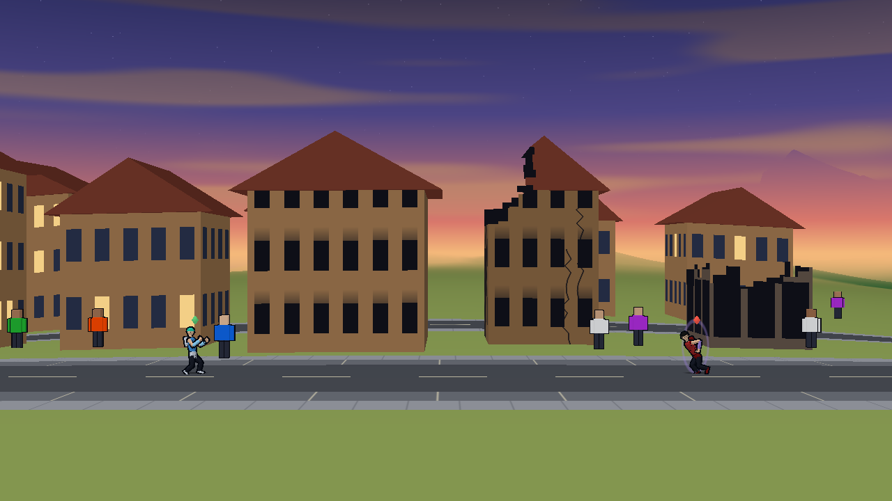
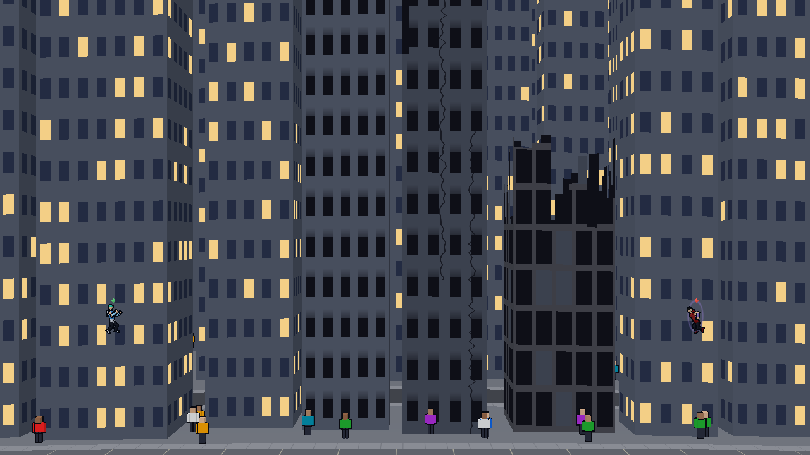
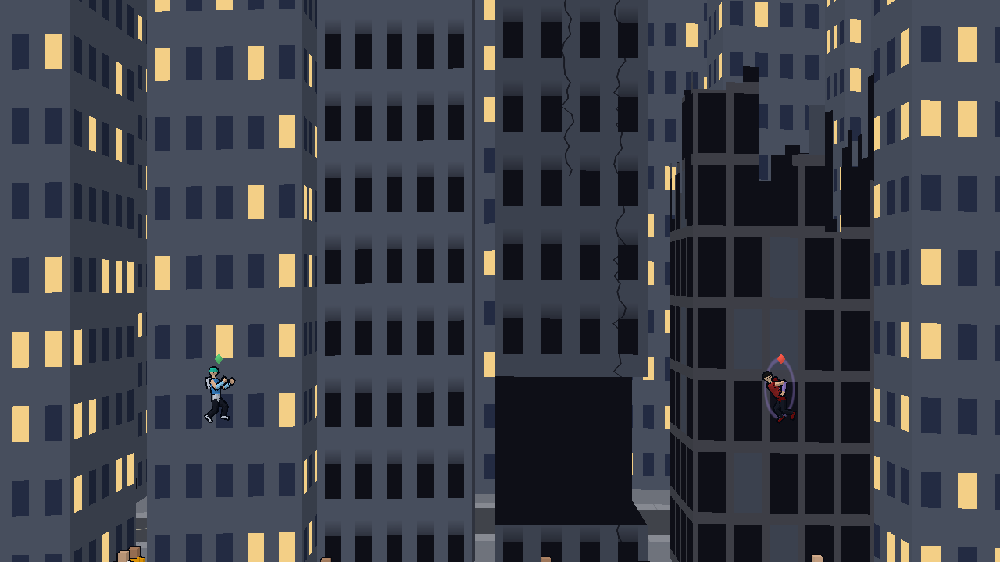
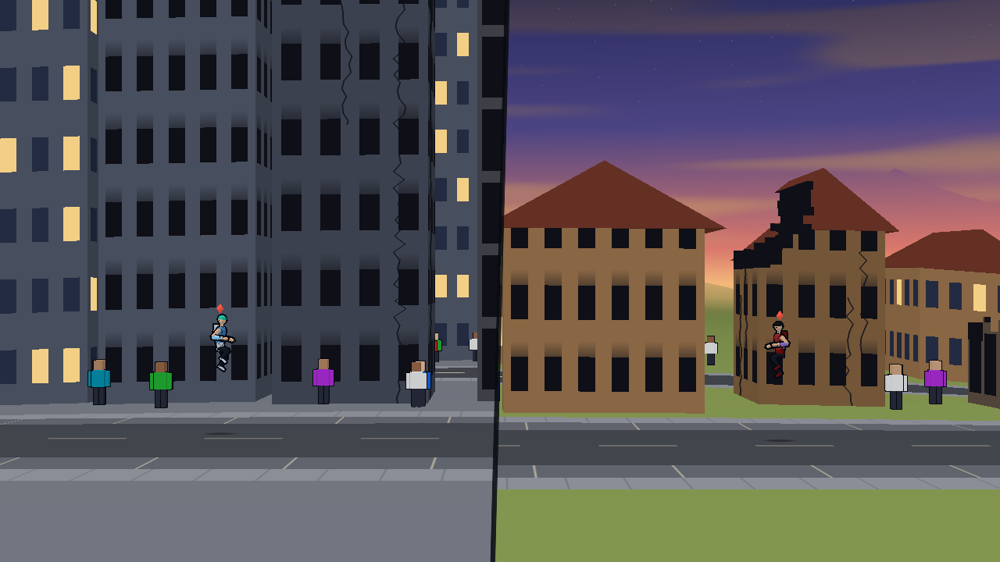

# Buildings by damage stage

Owner: Rendering and Technical Art. Status: built 2026-10-04, for World's staged destruction (`docs/world/staged-destruction.md`, sections 2, 9 and 10). VFX's effects at each change of stage (`render/vfx/stages.gd`) are drawn over these.

## What each stage looks like

| Stage | World's name | The building's own look |
| :--- | :--- | :--- |
| 0 | Intact | As before: windows a floor, some lit. |
| 1 | Windows out | Every pane is a dark hole with soot above it. From too far to draw panes, the wall is darker by their share. |
| 2 | A part gone | The walls are sooted and carry two cracks. One top corner is sheared off in steps, and a house's roof loses its end over it. The dark inside shows through the gap. Any cut floors are the tunnels they were. |
| 3 | A shell | The cladding is stripped to the frame: a post a column, a slab a floor, a panel left here and there, the dark inside between. No roof and no lid, and the walls end in a broken line. It stands at World's height for it, 30 to 54% of full. From far off it is a low dark block. |
| 4 | Fallen | As before: it sinks and is gone, and the rubble heap is ground. |

- **A jump shows at once.** The look is read from the state, so a house that goes from intact to shell in one blast (the common jump) is a shell on the next frame.
- **A shell is a hit-point state.** A tower with cut floors stays at stage 2 however much of it is gone, as World says. Nothing here reads a stump as a shell.
- **Stage 1 is by damage.** Windows blown by a shock wave alone are still VFX's list, a floor at a time, as before. They now get the same soot.
- **A falling building keeps its look.** While it sinks it is drawn at the stage it last stood at, windows and all. Before, it lost its windows the moment it fell.

## Stills (web build, headless Chrome, 1280×720)

Four neighbours set to stages 0, 1, 2 and 3, left to right, in a scratch copy (their hit points at 100, 80, 50 and 20%; the repo never writes the sim).

Houses, the fighters 900 apart: 

Houses, the fighters 1,800 apart: 

Towers, the fighters 1,800 apart and flying 420 up: 

Towers closer, the stage 2 tower with two floors cut as well: 

The split view, towers in one pane and houses in the other: 

**What I see in them.** The four are told apart at both distances and in the panes. The weakest pair is 0 against 1 on a tower seen from far off, where it is only that the lit windows are gone and the wall is a little darker. At the match camera a tower's top is usually off the screen, so its stage 2 reads by the cracks and the soot, not by the sheared corner.

## How it is drawn

- **From state, nothing saved.** `PlanetView` calls `WorldStructures.stage(b)` when a building's height, hit points or floors change, and writes the stage beside the window data (`win_tex`, the second texel's blue). A replay seek or a late join reads the right look. Rendering never writes the sim.
- **All in `building.gdshader`.** No textures, no new geometry, no draw call. The sheared corner, the broken top and the missing lid are discards; the cracks, soot, panes and frame are colour.
- **Insides.** A building at stage 2 or 3 draws its back faces, dark, so the gap and the open top show an inside. Stages 0 and 1 keep their back faces culled as before.
- **Numbers** are `RenderLook.DMG_*`.
- **A fallen building costs nothing a frame now.** Before, every fallen building was placed again each frame (its height never matched what was remembered). It is placed once, when it falls.

## Cost

Nothing measurable. Web build at VFX's low quality, headless Chrome, 1366×768, 900 frames of the bench match (seed 4), HEAD against HEAD plus this change, two runs each, taken in turn. "Every building at stage N" is a scratch build that holds every standing building's hit points there each frame, in both builds, so on HEAD they are short plain boxes and here they are all shells or all cracked.

| Scene | Run | HEAD frame ms | With stages | HEAD view update ms | With stages |
| :--- | :--- | ---: | ---: | ---: | ---: |
| Every building a shell (stage 3) | no throttle | 7.70, 7.33 | 7.89, 7.75 | 1.31, 1.27 | 1.42, 1.35 |
| | CPU x4 | 28.5, 24.7 | 26.2, 26.5 | 9.19, 8.13 | 8.66, 8.73 |
| | no GPU (SwiftShader) | 212, 201 | 204, 208 | | |
| Every building cracked (stage 2) | no throttle | 7.57, 7.74 | 7.35, 7.81 | 1.31, 1.35 | 1.28, 1.39 |
| | CPU x4 | 25.1, 27.7 | 25.1, 26.4 | 8.31, 9.22 | 8.33, 8.84 |
| | no GPU (SwiftShader) | 212, 200 | 199, 201 | | |
| The plain match | no throttle | 7.89, 7.48 | 7.58, 7.61 | 1.39, 1.31 | 1.34, 1.35 |
| | CPU x4 | 25.6, 28.6 | 27.5, 25.7 | 8.59, 9.58 | 9.27, 8.65 |
| | no GPU (SwiftShader) | 199, 199 | 201, 199 | | |

- **Read it as: no difference.** Two runs of the same build differ by up to 4 ms a frame at CPU x4 and 11 ms with no GPU. The two builds differ by less than that in every row.
- **The no-GPU rows** are the ones that would show a dearer pixel shader, since software rendering pays for every pixel. They show none, with every building on the screen at the dearest stage.
- **The gameplay hash** at the end of each run is the same in both builds, in all three scenes.
- **Not measured:** a real old laptop or phone. These are a throttled desktop and a software renderer, as the bench tool says of itself.

## The ground part (not built): what it would need

Orb's direction is that pavement cracks and shatters differently from dirt. World's plan for it is section 3 of their page (a later slice). From Rendering's side:

- **Already there.** The ground shader darkens cracked paving and draws crack lines wherever `S.crack` is set. Only the knockback slide writes it today. When World's craters, skids and landings on paving write it too, cracked rings appear with no change here.
- **A star, not a grid.** Today's crack lines are a fixed grid of slab joints and diagonals, right for a dragged body. A blast should crack outward from its centre. That needs the crater's place and World's `crackR` in the ground shader. The ground's data already says which craters overlap a column, so it is a shader change plus `crackR` on the crater's record.
- **Slabs.** Broken paving reads by its slabs being out of line: the street paint's joints shifted and tilted a slab at a time where the crack value is high. A shader change in the street paint.
- **Dirt under the paving.** A bowl dug deeper than World's 3 units is dirt, not paving. The shader needs to know the surface a column: one more row in the ground's data texture, filled from `WorldContact.surfaceAt`.
- **Not mine:** the thrown slabs and chips are VFX's, the lower rim and wider bowl are World's heightfield.
- **Size.** About a day once World's slice is in the sim. No sim change is needed from Rendering.

## Checks

On an export of HEAD (014c56a) plus this change, every Godot run headless.

- **`tools/stage_check.gd`** (new, headless, 10 checks, passed). It sets hit points and floors on its own fresh match and reads back the stage `PlanetView` wrote for the shader: a house and a tower at 100, 80, 50 and 20% are handed stages 0 to 3; hit points put back hand back stage 0; a tower with a cut floor is stage 2 at full hit points and its stage then follows its hit points though its height does not change; a fallen building stands no more and is not placed again on later frames. It does not judge the look, and a headless run cannot read a roof's place back, so the roof going at stage 3 is only in the stills.
- **Determinism** and **determinism `--live`** pass: the gameplay hash is the same with the renderer drawing. The bench runs above end on the same hash in both builds.
- **Pane check** passes (58 checks), and ground, flight, both seam sweeps, cue, flash, VFX's hash and effects checks, Camera's split sweep, UI's hud check, Animation's check and the sky check.
- **Camera's `panel_shot`** run headless exits 0 and prints `panel_shot ok` (the strip opens over the real renderer). It cannot save its picture without a window.
- **Not run, because they need a window:** `cull_check`, `outline_check` and `panel_shot`'s picture. In place of the cull check, the same intact scenes were drawn on the web by HEAD and by this change and compared. They differ in the crowd's own motion and in a strip one or two pixels wide of windows on walls seen edge-on (the windows' fade is now worked out for the whole wall, not inside a pane's branch). Nothing else of an intact building changed.
- **The web build** compiles the shader and logs no console message (headless Chrome, ANGLE on Direct3D 11).
