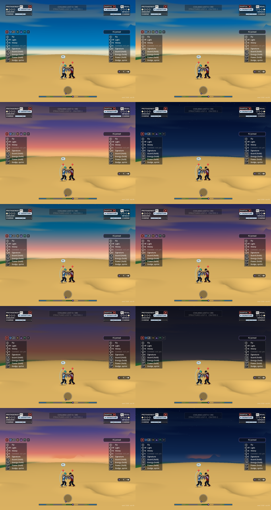

# The dynamic sky

Owner: Rendering and Technical Art. 2026-10-06. Art's direction is `docs/art/dynamic-sky.md` (approved by Orb); the keys and numbers are Art's `data/art/sky.json`, and the blend and the rate limiter are a port of Art's reference code `art/concepts/sky/keys.mjs`. The code is `render/core/sky_drive.gd` (`SkyDrive`), with a few lines in `pane_world.gd`, `sim_host.gd`, `main.gd` and `sky.gdshader`.

## What it does

The sky keeps its four bands (top, upper, lower, horizon) and its clouds and stars. Only the bands' colours change, and never fast.

- **By place.** A lap round the planet is one day: noon, golden, sunset, night, dawn. Each key holds a little, then blends to the next in OKLab, band by band, along the path Art chose. A match starts on the sunset, which is the sky the game had before. In a split each pane shows the sky of its own camera's place, so two panes far apart show two skies.
- **By time.** A drift of 0.0125 of a cycle a minute is added to the place.
- **By the fight.** Frenzy deepens the bands and warms the horizon. Ruin takes the bands toward dark brown smoke and thins the stars. A wrecked town on the screen gives the horizon above it a low ember glow.

The ground, the buildings and the fighters are lit as they always were: at the night key a daylit ground stands under a dark sky. Art's direction changes the sky's colours and nothing else, and this follows it; whether the world should dim at night is Art's to say.

## What it reads from the sim

It reads the sim and writes nothing to it.

| Driver | The sim read | How it is used |
| :-- | :-- | :-- |
| Frenzy | `S.mood.band` (calm, tense, frenzied) | 0, 0.4 or 1 is asked for, eased over at least 30 s |
| Ruin | `S.world.casualties` over `S.world.pop0`, and `S.world.structuresLost` over the count of buildings | the mean of the two shares, eased over at least 120 s |
| A burning town | none exists; in its place, each town's buildings at damage stage 2 or worse (`WorldStructures.stage`) | half a town cracked or worse is a full glow, eased over at least 50 s |

A town is a run of buildings along the ground with no gap wider than 2,400 body units (`RenderLook.SKY_TOWN_GAP`).

**Missing, for others:**
- **World or Simulation:** a burning state for a town or a building, with a duration. Today the glow follows damage, so it comes on as a town is wrecked and never dies down.
- **Encounter or Combat:** a frenzy number from 0 to 1. Today it is the mood's three bands.
- **Art or Tools:** the mood's amounts (18%, 25%, 10% and the rest) are prose in `sky.json`. They are numbers in `RenderLook.SKY_FRENZY` and `SKY_RUIN`, taken from `keys.mjs`; as data they would not have to be kept in step by hand.

## Nothing fast

Art's limit: no band's luminance changes faster than 0.05 a second and the four bands' weighted mean no faster than 0.02, whatever drives the sky. Three things hold it.

- **The place follows through `slew`** (Art's `slewStep`): each frame the shown place moves toward the wanted one as far as the place budget allows (0.035 a band, 0.015 the mean). After a camera cut the sky catches up; it never jumps.
- **The mood eases** at Art's least durations.
- **A last limiter works on the colours themselves** (`SkyDrive.limit`): whatever the step asked for, only as much of it is taken as the total budget allows. A driver nobody foresaw still cannot make the sky change quickly.

A new match, a pane that was not drawn for half a second, and a debug hold start from the sky of their place at once: nobody was looking at the old one.

## Checked

`render/tools/sky_check.gd` (headless), on an export of ccaf474b with this change and Art's `sky.json`:

- **The start is the sunset to the bit:** after one frame the shader has the four colours and the stars' strength it always had.
- **Every key is its own colours** on its place of the lap.
- **The port agrees with Art's reference code** at five places between the keys and three mood extremes, to 0.61 of 255.
- **One lap at the limit takes 48.7 s** (the reference: 48.7).
- **The stress drive** (the camera flying a quarter of a lap a second and turning back every 3 seconds, for 3 minutes): the place alone changes no band by more than 0.0350 in any second and the mean by no more than 0.0148, which are Art's own figures. With the mood and the damage slammed on and off as well, and a driver that jumps: 0.0500 and 0.0188.
- **The mood's durations:** asked for all at once, frenzy is full after 30.0 s, ruin after 120.0 s, a town's glow after 50.0 s.
- **Reduced motion:** the drift and the mood hold; the place blend stays (Art's rule).

**On the web build the first 300 ticks of a match are the same to the pixel** as the build before (frames 1, 60, 150 and 300 of the mash clip, captured with Tools' driver: 0 pixels differ).

## How it looks

From the web build, both fighters over each key, then frenzy, ruin, the night with frenzy and ruin together, and a town's glow at the sunset and at night. Art's sheet of the same is `art/concepts/sky/sky-stills.svg`.

The two glow stills are staged in a scratch build, with the glow put straight ahead on an open horizon. In play it sits above a wrecked town, a third of the horizon band tall as Art drew it, and from a camera at ground level inside the town the town's own buildings hide it; it shows from above or from outside.

## Cost

Worked out in GDScript once a frame for each pane: 65 microseconds while the sky is moving, on the development PC; while the camera stands it is worked out on about one frame in fifteen. The shader gains a loop of two that does nothing without a glow. No bench was run for it: the machine was saturated all day.

## Switches

For stills and comparisons, on the command line or, on a local host only, in the page's URL:

- `--staticsky`: the sunset everywhere, as before.
- `--sky=night` (or any key's name, or a place of the lap such as `--sky=0.45`): every pane holds that sky.
- `--skymood=F,R,G`: frenzy, ruin and every town's glow held at those values, 0 to 1.

Without `data/art/sky.json` the sky is the sunset and stands still.

## Limits

- **Tools' analyser has not read it.** A long clip flying a lap at full speed is wanted, to show the sky is never counted; it needs a new scenario in both stagings (Tools' and the capture hook's), added together.
- **The glow follows the camera.** As the camera pans, the glow slides across the horizon with the town. It is small and soft, but it is not under the band limit, which is about the bands' colours.
- **The clouds are lit by the bands** and follow them; nothing else in the world does.
