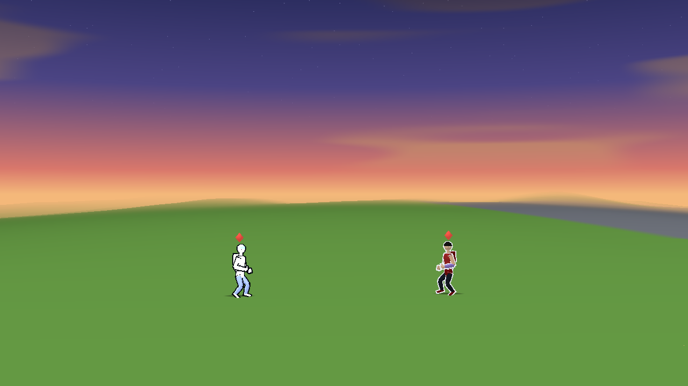
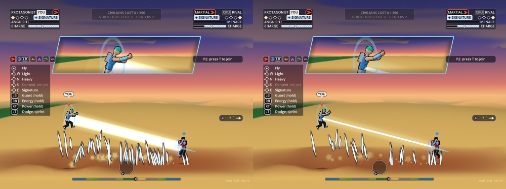
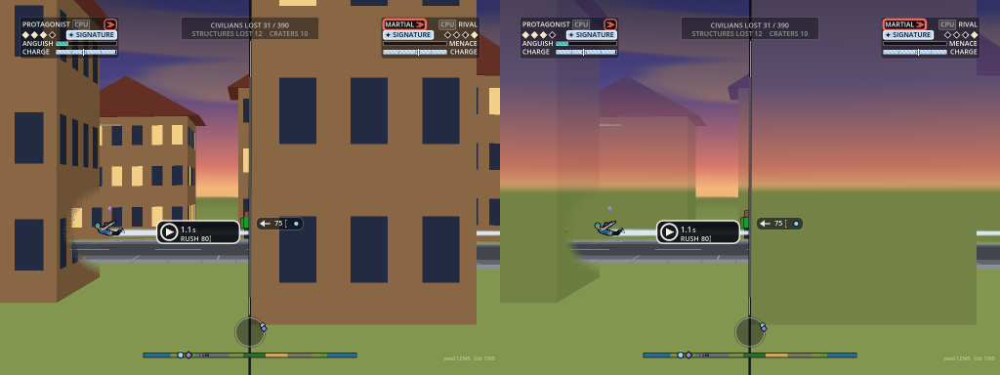
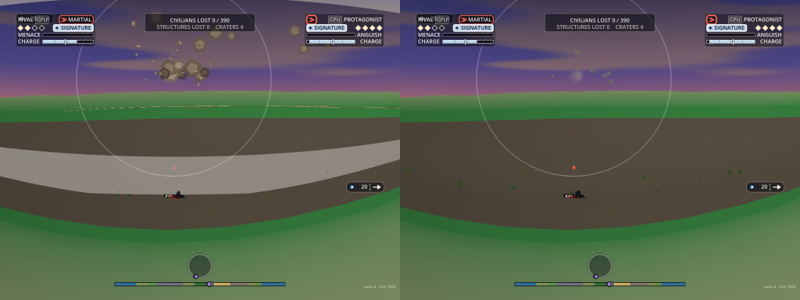
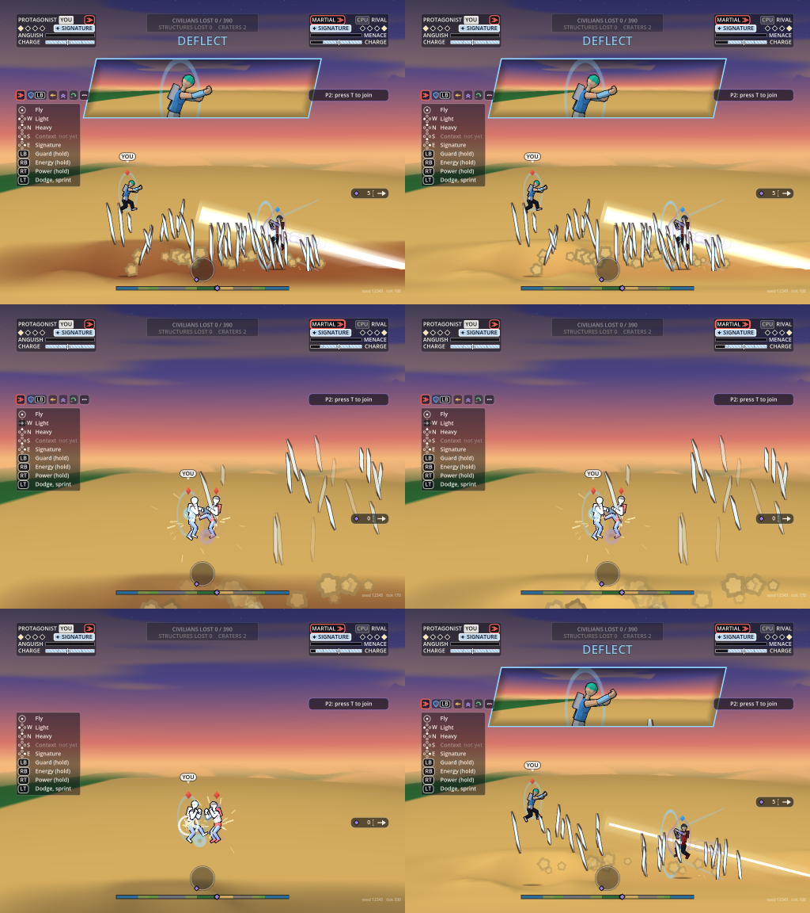

# Rendering's flashes and the shared flash register

Owner: Rendering and Technical Art. 2026-10-06. Legal's condition for the public web build (`docs/legal/photosensitivity-note.md`): at most three full flashes in any second across the whole screen, one under reduced flashing, never red. VFX built the register (`render/vfx/flash_registry.gd`, `hub.flashes`; `docs/vfx/flash-registry.md`). This page is Rendering's half: every full flash drawn from `render/core` and `render/shaders` asks it first.

## How a flash of Rendering's asks

- **One call:** `SimHost.ask_flash(source, colour, area_px, step)`. It returns whether the flash may be drawn. The register weighs a flash by the area it covers against a quarter of the standard's 341 by 256 window (21,824 px at 1024 by 768), and a step under a tenth of full luminance costs nothing. In any second the granted weights sum to at most 2.5 (1.0 under reduced flashing), the low class's to 1.5 (none), with at most 3 flashes of half weight or more and 6 of any weight. A red colour is never granted. The rules are VFX's (`docs/vfx/flash-registry.md`).
- **Each source gives its own area and step.** Sizes are world units on the fighters' plane (`RenderLook.FLASH_*`), turned into pixels at the camera's scale by `SimHost.flash_px`. A beam counts its body's width along as much of its length as one window holds (426 px), so a beam seen from far is a thin strip and weighs little. The steps are estimates.
- **The camera's scale** is `host.vfx.px_per_unit`, set by main every frame: 768 over the visible world height on the fighters' plane. In a split it is the closer pane's, where a flash covers the most.
- **Once for the screen.** The host asks, not a view, so a flash seen in both panes of a split is one flash and one slot.
- **After VFX.** Each tick the host asks after VFX has consumed the tick's events, so the register's clock is that tick's and VFX's big events (an explosion, a transformation) have asked first. Rendering's order is: head flashes, a perfect block's guard flash, a cue's flare, a new beam, a beam clash, and last a new hit's white body. UI's divider asks from the frame, so after all of the tick's.
- **Low priority is the register's own list.** `body_hit`, `head_flash`, `cue_flare` and UI's `divider_slam` are sources a fight makes many of: they share at most 1.5 of the 2.5 and get nothing under reduced flashing. `guard_flash` is not low (the EP's ruling, 2026-10-06: a perfect block is a moment the player earned), nor is a beam or a clash. The host keeps no list of its own, so every ask and every refusal is in the register's log.
- **With VFX off** (`--novfx`) the hub does not run its register, so the host ticks it. Rendering's flashes keep to the limit either way.
- **Presentation only.** Nothing here reads a random number or writes the sim.

## Every flash source in Rendering's paths

| Source | Where | What it is | Under the register | When refused |
| :-- | :-- | :-- | :-- | :-- |
| **A hit's white body** | `fighter_view.gd` (through Animation's `anim_body.set_look`), 0.12 s | The whole body goes white. At a mash's 5 to 10 hits a second it was the largest strobe risk in the game | **Yes**, `body_hit` (low). The host asks once for each new hit (`SimHost._ask_hits`) | **The outline lights** pale for the same 0.12 s (`RenderLook.HIT_EDGE`). It is a line a pixel or two wide, not a flash. The hit still lands; its sparks, the flinch and the damage marks are as before |
| The same on the placeholder parts | `fighter_view.gd` (`solid`) | The box figure's parts go white with the body (the old look, `--noanim`) | **Yes**, the same grant | They keep their colour |
| **A perfect block's guard flash** | `fighter_view.gd`, `guard.gdshader`, 0.3 s | The guard arc's line thickens, a second line leaves it, and its fill deepens | **Yes**, `guard_flash` (not low: it may take the slot kept for big events), once for each block | The two lines still flash; the fill does not deepen (`flash_fill` 0). Lines are not a flash |
| **Head flashes** | `flash_view.gd` | Small shapes at the head that swell two or three times in under a second | **Yes**, `head_flash` (low). Each swell asks as the flash starts, so a three-swell flash plays as many swells as were granted | With none granted the flash still shows once, calm: it fades in, holds and fades, with no swell, sweep or jitter (the reduced-motion form). The player still gets what it says |
| **A cue's flare** | `fighter_view.gd` (`flare`) | A soft glow at the chest, up to a body and a half across, on four of Combat's cue poses | **Yes**, `cue_flare` (low), once for each fighter the cue plays on | No flare. The pose, the hand spark and the ring still play |
| **A signature beam** | `beam_view.gd` | Three additive cylinders, the inner one white, with soft edges. Its strength rises over 0.1 s, holds and falls to nothing at its end: one rise and one fall | **Yes**, `beam` (not low: a big event), once for each beam. Under reduced flashing it does not ask | **Calm:** a thin line in the beam's own colour where the white core was (0.3 of its width), and the glow at 18% of its strength, which adds under a tenth of full luminance. Always calm under reduced flashing |
| **A beam clash's flare** | `beam_view.gd` | A white glow where two beams meet, with the two clash beams. All three rise over 0.15 s and fall over the clash's last 0.25 s | **Yes**, `beam_clash` (not low), once for each clash. Under reduced flashing it does not ask | No flare; the two beams are drawn calm, as a refused beam is |
| **The split divider's slam flash** | UI draws it (`ui_hud.gd`, `_slam_scale`); Camera's rig gives the amount (`slam` in the split record); the host answers (`main._hud_flash`, set as `UiHud.flash_fn`) | The divider's light line widens to two and a half times and goes fully opaque for 0.08 s as a slam shuts the split | **Yes**, `divider_slam`, once as a slam begins. Not in the register's low list yet (see below) | UI draws the divider as it is, with no flash (the answer is all or none) |
| A cue's hand spark and ring | `fighter_view.gd` | A small spark at the hand; a hollow ring | No: small or hollow, not a flash | |
| The placeholder aura, speed streaks and charge orb | `fighter_view.gd` | The old look in place of head flashes (F7 off) | No: a debug view, not in normal play | |
| Sparks, debris, dust, splashes, ripples, shock rings, after-images | `particle_view.gd`, `impact_fx.gd` | Points a few pixels across, hollow rings, thin outlines | No: not a flash | |
| **A fresh groove's glow and char** | `impact_fx.gd` (the heat), `terrain.gdshader` | A beam's burn: a glow along the groove that cools over seconds, and the dark char it leaves | No ask: it is the ground, not an effect. The char comes in as the groove cools (two to three seconds), where it used to turn a broad strip dark in one tick | Under reduced flashing the glow is drawn at 30% and the char at 35%, so a camera moving over a groove changes little |
| Windows going out, a building's damage stage | `building.gdshader` | A step in a building's look, once | No: one change, never repeated | |
| The sky's reaction to tier 3 and 4 | `sky.gdshader` | Off by default | No: off | |
| The old HUD's banner and floating words | `hud.gd` | Text, in the F2 debug view | No: a debug view | |

Not Rendering's, though they are drawn near these: the glare on the rival's glasses (VFX's `glare.gd`), every ring and burst in `render/vfx`, and Camera's three sources, which ask the register themselves with their area and step: `cut_dip` (a camera cut's brief dip), `cut_in_panel` (the inset panel) and `transform_cut` (a transformation's two cuts, the whole frame). `SimHost.ask_flash(source, colour, area_px, step)` passes the area and step through for any caller. The divider's slam flash is UI's to draw and Camera's to time; only the ask goes through the host.

## What it does in play

`render/tools/flash_reg_check.gd` (headless, through the real scene, the three matches in Camera's split screen as the game runs it), on HEAD 75446511 with VFX's area-weighted register:

- **Three AI matches of 3,600 ticks** (seeds 12345, 4 and 7): in every second the register's four limits hold, Rendering's, VFX's and the divider's together. The worst second's weights sum to 2.40, 1.95 and 2.35.

| Seed | Body white: granted, refused | Head flash pulses | Guard flash | Beams |
| :-- | :-- | :-- | :-- | :-- |
| 12345 | 147, 104 | 9, 9 | 1, 1 | 3, 1 |
| 4 | 172, 119 | 11, 7 | 1, 5 | 1, 0 |
| 7 | 142, 97 | 15, 7 | 1, 4 | 2, 0 |

- **A body's white is granted more often than under the count rule** (about three hits in five, where it was one in five), because at the camera's usual distance one body is about 0.15 of the area that makes a flash. Close up it weighs more and is refused more.
- **A mash:** one fighter hit every 6 ticks for 4 seconds, 40 hits. The body whitens 5 times, at most twice in a second, and the outline is lit for the rest.
- **The same with UI's Reduce flashing on:** the body never whitens, and the reduced limits hold.
- **The camera's scale** reaches the register every frame.
- **Weights at the close framing** (1.3 px a world unit): a body's white 0.17, a head flash 0.07, a guard flash 0.19, a tier 4 beam 1; the same tier 1 beam seen from far weighs 0.25.
- **The weighted rule through the host's ask:** the low class takes 1.5 and no more; a perfect block's guard flash takes what the low class may not; a full flash over the budget is refused; a step under a tenth costs nothing; six small flashes and no seventh; three of half weight and no fourth; a red flare refused.
- **Head flashes:** a three-swell flash asks for three; with none granted it shows once, calm; with two it swells twice.
- **UI's Reduce flashing option:** the register goes into its reduced mode and comes back with the option off.
- **The divider:** the HUD's `flash_fn` gets all of the flash with room in the second and none with the second full, and both asks are in the register's log.
- **Controls' two charge settings:** with Controls' uncommitted hub copied in, each goes to the hub for the player who set it and off again. On HEAD the hub has no such functions and the check says so.
- **A beam and a clash:** each strength curve has one rise and one fall. A new beam asks with its own weight and is granted; under UI's Reduce flashing it does not ask and is calm.
- **The pan haze:** off unless switched on; then none at a fifth of a screen width a second, full within 6 ticks of two a second, unmoved by a cut, cleared in one fall.

A hit granted (left) and a hit refused (right), on the web build: 

## UI's Reduce flashing setting

`main.frame` gives UI's `reduce_flashing` option to `host.vfx.reduced_flashing` every frame, beside reduced motion. Either one puts the register in its reduced mode: a budget of 1.0 by weight in a second on the whole screen (one full flash), and nothing for a low source. For Rendering's sources that means:

- **A hit's white body, head flashes, a cue's flare (low):** never granted. The outline lights on every hit, a head flash shows once in its calm form, a cue has no flare.
- **A perfect block's guard flash (not low):** it may take the second's one slot, with VFX's big events. Refused, the arc's lines flash without the fill.
- **A beam and a beam clash:** always calm, and they do not ask, so the one slot is left to others. A beam is a thin line with a faint glow; a clash has no flare.
- **The divider's slam flash:** UI draws none and does not ask.
- **A groove's glow and char:** the glow at 30% of its strength with no brightening past its colour, the char at 35%.
- **The pan haze** does not follow the setting: it is off unless switched on.
- **Nothing of Rendering's reads the option itself.** Each source asks the register, so there is one rule and one log.

The setting is behind UI's `reduce_flashing` flag, which is off, so today the option is always false.

## The divider's slam flash is not seen in play today

The ask is wired and checked, but in play it is never made, because the flash is never drawn.

- **Camera's rig starts the flash on the tick the slam closes the split** (`split_rig.gd`, `_slam_step`): the same lines set `sep` to 0 and the flash to 0.08 s. The line's opacity follows `sep`, so it is 0 too.
- **UI draws the divider only while the panes are open** (`UiSplit.divider_active`: `sep` and `fade` above 0.01), and `_slam_scale` is only reached then.
- **Measured:** three AI matches of 3,600 ticks in the split screen had one slam each. At 60 frames a second, on all 14 frames with a slam amount above zero `sep` and `fade` were 0, the divider was hidden and the register was asked 0 times. At 144 frames a second (in-between frames), 40 such frames: the divider was drawn on one, at under 1% opacity with a quarter of the slam amount, and again nothing was asked.

So this source adds no flash to the screen now. It is Camera's and UI's to decide whether the flash should show (start it before the panes close, or draw the line while it runs); if it does, the ask is already in place.

**Priority: low is right.** It is a flourish on a camera move, not something a player has to read, and it should not take the slot kept for an explosion, a transformation or a perfect block. VFX has added the name to `VfxFlashRegistry.LOW` (1bf5d903).

## The frame analyser's clips: Rendering's half (2026-10-06)

Tools' analyser reads recorded frames against the standard, and the gate is 2.5 flashes in the worst second (`docs/tools/flash-check.md`; `docs/legal/photosensitivity-note.md`). This is what the frames show, what changed in Rendering's paths, and what the same clips read before and after.

**Method.** Twelve clips were captured from a web export of 2dc8a663 with Tools' runner (1024 by 768) as the "before", and again from the same commit with this batch's files. Every clip was then read with one copy of Tools' committed analyser (501e19c5, the one whose count no longer depends on where a clip starts). An earlier table in this file's history used the analyser before that fix and read higher; it does not stand. The captures are before VFX's area-weighted register and Camera's scroll governor, so they show this batch's drawing changes alone, not today's tree.

| Clip | Before: normal, reduced | As shipped (haze off) | With `--panhaze` |
| :-- | :-- | :-- | :-- |
| collapse | **4.5, 4.5** | **4.5, 4.5** | 2.5, **3** |
| ai, seed 12345 | **3, 3** | **3, 3** | **3, 3** |
| ai, seed 4 | 2.5, 2 | 2.5, 2 | 2.5, 2 |
| ai, seed 7 | 2.5, 2.5 | 2.5, 2 | 2.5, 2 |
| clash | 2, 2 | 1.5, **3** | the same |
| mash | 2.5, 2 | 2.5, 2 | the same |

Bold is over the gate. The analyser also reads each clip with the area threshold 15% up and down: clash reduced reads 2 to 3, collapse reduced with the haze 2.5 to 3, seed 4 normal 2.5 to 3.5. Those sit on the threshold's edge.

### What changed

- **A beam comes and goes once.** Its strength rises over 0.1 s, where it was at full strength on its first tick, and its three layers have soft edges, where the glow was flat-topped with a hard edge.
- **A refused beam, and every beam under reduced flashing, is calm:** a thin line in the beam's colour with a faint glow. It still shows where the beam is. Before, a "reduced" beam could take the second's one slot and be drawn at full size.
- **A clash's flare and beams rise and fall** over 0.15 and 0.25 s, where they came on and went off in one tick.
- **The pan haze, off unless switched on** (`--panhaze`, on the web `?panhaze=1`; `RenderLook.PAN_HAZE_DEFAULT` is the one line that flips it). While a pane's camera travels along the ground faster than 0.35 screen widths a second, the buildings lose their windows and marks and melt toward what is behind them: the sky's colour above the horizon line, the ground's below it. It is complete at 0.9 widths a second and 70% strong, comes in over 0.1 s and clears over 0.6 s.

### What each costs the look

- **The beam** reads softer at its edges and a little slimmer; the rise is too quick to see. Granted (left) and calm (right): 
- **The pan haze** is the large one, which is why it ships off: it is Orb's to decide. In a rush through a town the buildings turn to pale ghosts until the camera slows, and a building a fighter is flying at is a ghost until then. They keep their shapes and come back in about half a second. Before (left) and with the haze (right), the same tick of the collapse clip: 
- Nothing changes in a frame with no beam, no clash and no haze: frames of the mash clip are the same to the pixel before and after.

### Clip by clip

1. **collapse, ticks 1351 to 1397 (4.5; with the haze 2.5 normal, 3 reduced).** Both fighters rush through a village and the camera goes with them: the picture is a different set of buildings every three ticks, and 100,000 to 200,000 pixels change in each direction on each frame (lit and dark windows, walls against the sunset, walls against the grass). As shipped that is unchanged. With the haze that second is calm, and the clip's worst second moves to ticks 67 to 112, where the changes are at 103 to 107% of the area threshold; some of them are the haze itself coming and going as the camera's speed crosses its thresholds. The camera's speed is the cause, and Camera's scroll governor limits it.
2. **ai, seed 12345 (3, unchanged).** The worst second is tick 559: a transformation, where the whole screen dims at tick 582 and comes back at 612, with white spikes on the scorch. Not Rendering's. The beam's impact at tick 3290 read worst under the earlier analyser and no longer does.
3. **ai, seed 4 and seed 7 (2.5, unchanged).** At the gate, not over it.
4. **clash (2, 2 to 1.5, 3).** The changes in its busy seconds are the camera's reframe as a beam lands, with the ground's scorch band darkening in the same tick; Camera's inset panel opening and closing; and the camera moving over the glowing groove and the dark scorch on pale sand as the split opens. The reduced clip went from 2 to 3 with this batch: two more changes at 100 and 101% of the threshold in the second from tick 1137, where the calm beam's thin line replaces the broad dim one. It reads 2 with the threshold 15% higher. It is over the gate as read, and it is the groove's glow under a moving camera that it counts.
5. **mash (2.5, unchanged).** A launch's trail, VFX's rings and speed lines, UI's prompt chips and the swinging divider; nothing of Rendering's was changed for it.

### The broad grey band was VFX's

In seed 4 and seed 12345 a broad pale band lay across a fresh crater and came and went as the camera moved. With VFX's drawing off it was not there; with the terrain's fog off, or the water off, it still was. Baseline (left) and VFX off (right), seed 4, tick 1830: 

It was the crater's shock ring, drawn as a band a third of its radius thick; VFX has made it a thin line (1bf5d903).

### Limits of this half

- **The clips are from before VFX's and Camera's changes.** Tools reads the combined tree; these numbers are this batch alone.
- **The counts sit on the threshold.** Many counted changes are 100 to 115% of the area threshold, so half a flash either way is noise; a fall from 4.5 to 2.5 is not.
- **The groove's glow and char** were the clash's remaining reading; see "The groove" below.
- **The haze sees travel along the ground only, and buildings only.** A camera climbing or zooming past a tower, and a rush through a forest, are not covered. Its own coming and going is a change of its own.
- **The areas and steps given to the register are estimates** of what changes by a tenth of full luminance, not measurements.

## The groove (2026-10-06, evening)

A beam's burn used to do two things the analyser counts: turn a broad strip of ground dark in one tick, and leave a bright glow beside a dark char for a moving camera to sweep over.

- **The char comes in as the groove cools.** While a groove is hot the ground under its glow keeps its own colour; the char eases in over two to three seconds as the heat falls (`RenderLook.CHAR_FRESH`, on the heat `ImpactFx` already keeps, so nothing new is uploaded). A weak beam's groove starts as a faint red tint, where it was a dark red band at once.
- **Under reduced flashing the groove is calm:** the glow at 30% and the char at 35% (`HEAT_CALM`, `CHAR_CALM`). Scorch marks are fainter for a player with the setting on.

Before and after, on exports of 1172a4e8 (today's tree, with VFX's register and Camera's governor), read with that commit's analyser. The second figure is the reading with the area threshold 15% lower.

| Clip | Before | After |
| :-- | :-- | :-- |
| clash, normal | 1.5 (2) | 2 (2.5) |
| clash, reduced | **3** (3) | 2 (2) |
| signature, normal | 2.5 (3) | 2.5 (2.5) |
| signature, reduced | 2.5 (2.5) | 1 (1) |

Every clip is at or under the gate of 2.5 after, and none reads over 3 with the lower threshold. Clash in normal mode moved from 1.5 to 2: the char's darkening no longer lands on the tick of the camera's reframe, and one change at 118% of the threshold now stands apart where it merged before. The two-second-memory reading was not run.

What it costs the look: the mark of a beam appears late. The ground glows, then darkens over a few seconds, where the black scar used to be there the moment the beam passed. Top row: tick 108, before and after. Middle: tick 170, before and after. Bottom: tick 330 after, when the char is in; and the reduced form at tick 108. 

## The capture hook for Tools' frame analyser

Tools' analyser measures pixels against the standard (`docs/tools/flash-check.md`). It needs clips that are exactly one tick a frame, so the game offers a hook, **only** when started with `--flashcap` or, on the web, `/play/?flashcap=1` (`render/tools/flash_capture.gd`, `FlashCapture`; the contract is at the top of `tools/flash/capture-web.mjs`). Normal play never makes one: without the argument the page has no `window.__flashcap`.

- **`window.__flashcap`** has `ready`, `start(scenario, {reduced, seed})`, `step()` and `tick`, and three extras: `scenario`, `error` and `in_window` (the flashes the register counts in its current second, for a cross-check).
- **In this mode the game does not run by itself:** no first-run card, no notice, no intro, and no tick until `step()` asks for one.
- **`start`** sets one of Tools' worst cases up as `tools/flash/flash_worst.gd` does: `mash`, `clash`, `signature`, `transform`, `collapse`, `ai`. The same seed (12345, or `seed`), the same slots human or AI, the same inputs through the real pad path, and the same few writes into the sim. An unknown name plays `ai` and says so in `error`.
- **`step`** runs exactly one tick, draws it, and resolves with the tick when the next animation frame starts, by which time the frame has been shown.
- **Run with Tools' own driver:** `node tools/flash/capture-web.mjs --dir <site> --path "/play/?flashcap=1" --scenario mash --ticks 1800 --out <folder>`. Short clips of all six scenarios, and `mash` reduced, were captured this way on a clean export, and the analyser read them.

**What the hook cannot do.**
- **It is not the game's own pacing.** A tick is a frame here whatever the machine does. Real play interpolates between ticks at the display's rate, so a real screen shows in-between frames these clips do not have. Each frame is drawn at the end of its tick.
- **The crowd runs on the shader's clock.** The crowd's run and startle cycles use `TIME` in `crowd.gdshader`, not ticks, so between two captured frames they move by however long the capture took. Nothing else in `render/` or `render/vfx` does.
- **The picture is the page's canvas** at the size the driver gives the window, at a device scale of 1. The hook sets no size. The standard's own reference is 1024 by 768; the driver's default is 960 by 540.
- **The scenes are Tools' staging, not play.** They write the sim (full ki, forms made ready, a tier raised, staged blasts), so a capture match is not one the determinism tools know. The code that does it is in the build and unreachable without the argument.
- **`collapse` moves the fight.** At the start the nearest building is 18,000 units away, so on tick 0 both fighters are set down beside the tallest tower (Tools' `_to_the_city`, the same lines in both stagings) and the blasts that follow are in view.
- **The scenarios' rules are a copy** of Tools' file, because `tools/` is not in an export. Tools' drift check fails when the two differ (`docs/tools/flash-check.md`), so they are changed together.

## Cost

Nothing measurable. An ask is a few whole-number comparisons, a tick has a handful at most, and a refused flash draws less than a granted one. Web build, headless Chrome, 1366 by 768, 1,500 frames of the bench match, two runs each taken in turn: frame mean 7.29 and 7.20 ms on HEAD against 7.43 and 7.24 with this change; at a 4x CPU slowdown 33.0 and 27.4 against 29.8 and 29.6. Two runs of one build differ by more than the two builds do. The gameplay hash at the end is the same in all four runs.

**This batch (the beam, the building shader's haze branch, the areas given to the register), 2026-10-06.** The same bench, on 2dc8a663, two runs each taken in turn; frame mean in ms, plain and at a 4x CPU slowdown:

| Build | Run 1 | Run 2 |
| :-- | :-- | :-- |
| 2dc8a663 | 11.54, 52.98 | 10.31, 51.25 |
| this batch, haze off (as shipped) | 10.13, 57.01 | 9.80, 51.53 |
| this batch, `?panhaze=1` | 9.47, 49.92 | 9.22, 50.68 |

Nothing measurable: two runs of one build differ by more than the builds do, and the times fell through the session as the machine quietened. The gameplay hash is the same in all twelve runs. (The bench reads about 10 ms where it read 7.3 at 00c4c90e earlier the same day; other sessions were running, and it was not traced.)

## Limits, and what is not done

- **The register counts flashes; it does not measure them.** Tools' frame analyser does, on clips from the capture hook above (`docs/tools/flash-check.md`). The white body of a hit is being read again against Legal's corrected area threshold; if it fails there, the white gets smaller or dimmer, or the outline alone.
- **A granted head flash still swells up to twice in a quarter of a second.** Its shapes are small (about a head across), well under the standard's area, and each swell takes a slot.
- **Head flashes are thinned a great deal:** in the three matches 5 pulses of 58 were granted. The flash always shows, but mostly in its calm form. The EP is putting the order to Art once Orb has played the build; it stays as it is until then.
- **The glow materials are additive.** A refused beam is dimmer, not gone; nothing here measures its luminance.
