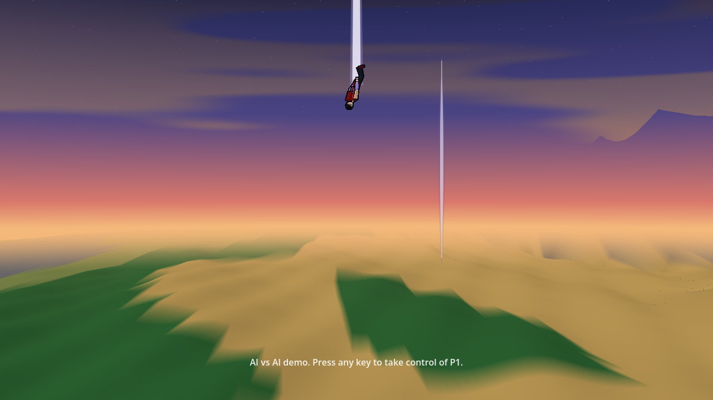
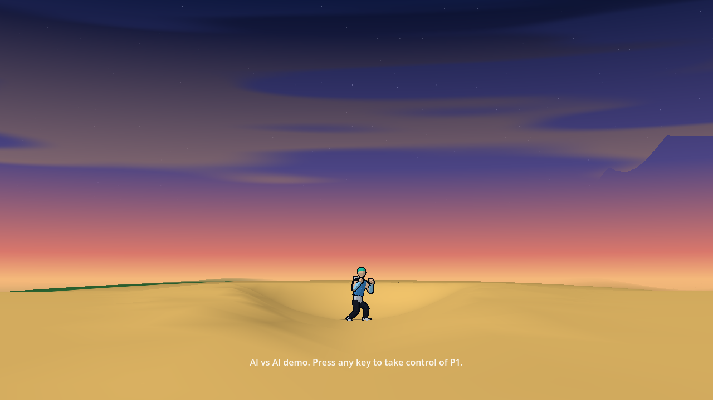
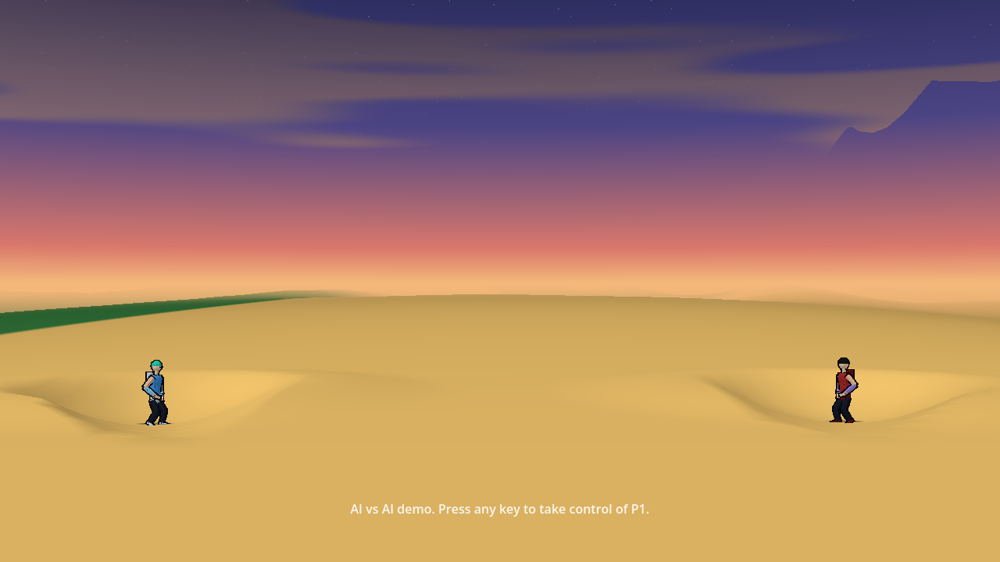
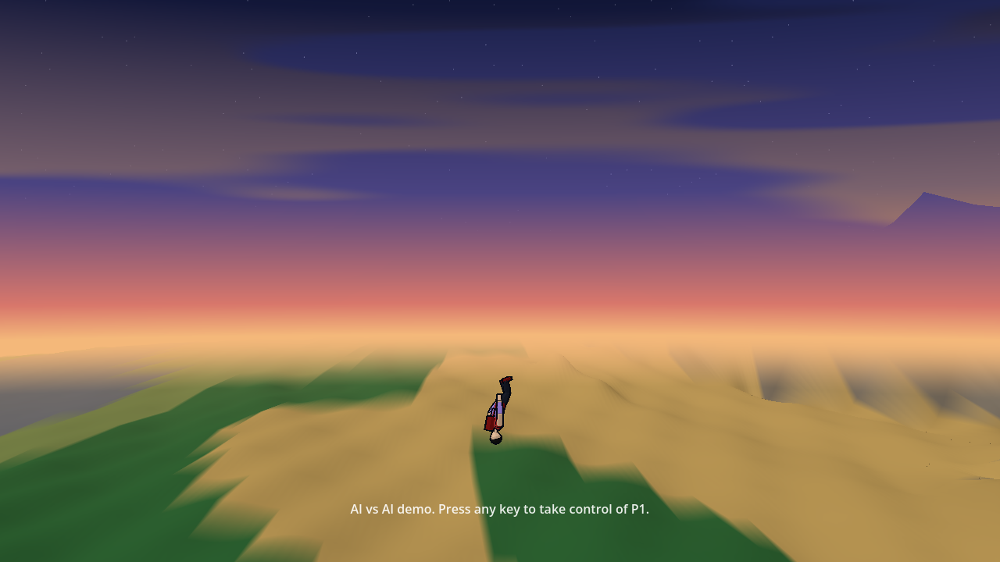
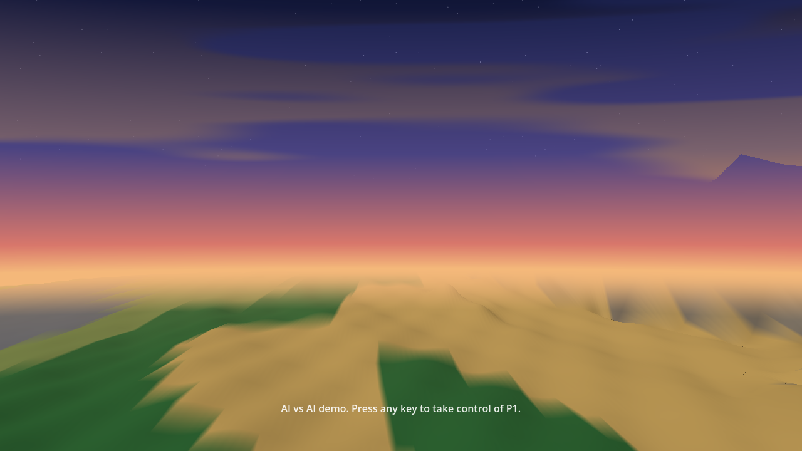

# The tumble and the intro's sky shot: Rendering's plan

Owner: Rendering and Technical Art. Status: plan, 2026-10-02. Section 2.3 (the host's side of the intro) is built and tested on the committed sim (74ede76); the rest is not built. It covers Rendering's part of two things other directors have planned:
- the tumble (World's `docs/world/ground-contact.md`: skid, bounce, tumble, rims; Animation's active ragdoll);
- the entrance (Camera's `docs/camera/rule-of-cool-shots.md` row 7; Simulation's `docs/architecture/intro-phase.md`).

Rendering reads the sim and writes nothing in both.

## 1. The tumble

**Who draws what.** The body's pose is Animation's (the ragdoll reads `mode`, `spin` and `bounces`). Dust, the contact flash and tumble blur are VFX's. Rendering has the fighter's place on screen, his shadow, the ground he marks and the rims he flies off.

### 1.1 The body touches the ground at a bounce

The host draws a fighter between his last two ticks. A bounce turns him round inside one tick, so the straight line between the two ticks cuts the corner and the body never reaches the ground.
- **How far off:** at most a quarter of a tick's travel in and out. A 1,500 units a second landing that rebounds at 675 is drawn up to 9 units above the ground at the bounce, 12% of a fighter's height. At twice the speed it is 18 units.
- **The fix:** on a tick with a `bounce` or `land` event the host draws prev, then the contact point, then cur, in two straight pieces. The events already carry the contact's `x`, `y` and `z`.
- **What it needs:** the share of the tick at which the contact happened (a field `u`, 0 to 1, on `bounce` and `land`). Without it I split the tick by the two speeds, which is close.
- **Not needed if** the sim leaves the fighter on the contact point at the end of the bounce tick. World should say which it is.

Spin needs nothing: `rot` is not wrapped in the sim, so the plain blend between ticks turns the right way at any spin World allows (3 turns a second is 18 degrees a tick).

### 1.2 The shadow

The ground shadow already follows the ground as drawn, fades to a quarter and widens by half with height, and sits on water. Two changes for bounces:
- **Height above the ground under him, not above his start.** A bounce over a rim or a slope changes the ground under the arc, so the shadow's fade must come from the gap to the ground at his x and depth each frame. It does today; a check is added to the pane check for a body over a rim.
- **A tumbling body's shadow is round.** Today's ellipse is as wide as a standing fighter. In a tumble or a skid it takes the body's drawn extent along the ground (Animation's pose bounds), so a body lying flat has a long shadow.

### 1.3 Marks on the ground

- **The trench of a skid** is sim terrain and is drawn today.
- **A tumble's scuffs** (Game Design: one scuff a contact, at most three a second, no trench). If World records them (as it records scorch), the ground shader draws them from state and they survive a replay seek. If they are cosmetic, they are VFX's decals. I prefer the record: marks that stay are pillar 4, and the shader path costs no draw call. World and VFX should settle which.
- **Wider rims** (World's G1: a lip 0.5 R wide, a crest up to 0.40 of the depth). The renderer rounds each crater into a bowl in depth from its record, and the rim must come out as a ring, not a wall across the band. The bowl function needs World's new rim profile. It must be the same pure function the sim uses, or the drawn lip and the one a skid leaves from will differ.

### 1.4 What stays as it is

- **The cut-away** follows a tumbling fighter behind buildings as it follows any fighter.
- **The lane cue** shows while his depth changes; the events' `z` is the body's depth.
- **Battle damage** comes from wounds only. A tumble adds no marks to the body unless the sim's wear says so.

### 1.5 Cost

Nothing per pixel. The contact point is a few numbers a tick. The rim term is part of the bowl function that already runs when a crater is dug.

## 2. The intro's sky shot

Camera's beat: a low wide angle on the empty landing spot (pitch -6 degrees, the fighter 7% of the screen's height), the sky above, a speck falls into frame, he lands in a crater.

### 2.1 What works today

- **The low angle.** A negative pitch is checked on the real renderer (`README.md`, "The camera's pitch").
- **The landing's crater** is a real dig, drawn like any crater at the tick it happens.
- **The fall's motion.** The fall is fast (a body height or more a tick) but straight, so the blend between ticks is smooth.

### 2.2 What needs building

- **No speck is needed.** I planned a small bright point for a fighter too far up to see. At Camera's framing (the fighter 7% of the screen's height) he is 50 pixels tall the moment he enters the frame, and he is never small: he is simply above the frame until the last ticks of the fall (6,000 units up, 36 ticks). What he needs is to read at speed, over 100 pixels a frame at the end, and that is a trail or a smear: VFX's and Animation's. A far point would matter for orbit launches (row 19) and is left for then.
- **The sky stays plain for the entrance** (EP's ruling, 2026-10-02). I had proposed that the clouds part round the falling fighter with the tier-3 opening. It is not built and will not be: Legal's stacking rule keeps the opening's sky plain, and the tier-3 reaction is its own thing.
- **Clouds at the low angle.** At -6 degrees the top of the frame looks higher than the fight ever does, where the cloud band has faded out. I will check the frame and, if the top is bare, lift the band's upper edge for the shot.
- **No head badges before the clock (built).** The badge is a HUD-space marker. Each pane switches its fighters' markers off while the intro runs, as UI hides the HUD.
- **A clock for easing (nothing to build).** The sky's opening and the lane cue ease on tick time. `S.tick` advances on pre-clock ticks in Simulation's code, so they run through the intro as they are.

### 2.3 The host (`sim_host.gd`, `main.gd`): built

Built on 2026-10-02 and tested through the real main scene on the committed sim (`SimIntro`, 74ede76; 34 checks of my own, with real key, mouse and pad events). It is behind `--intro`; without the flag nothing below runs, because the sim skips the intro by default.

- **Who gets an intro.** `--intro` plays it: `main._match_setup()` adds `"intro": true` to the match setup. Without the flag nothing is added and the sim's own default stands (it starts from the intro's end state: both entrance craters dug, no pre-clock tick), until Camera, Animation and UI have their sides. A tool that drives the scene itself never adds anything, so its matches are the ones its own reference sim plays. `start_match(seed, ai, setup)` takes a setup of its own for tests.
- **Pre-clock ticks.** `SimHost.intro_running()` says whether the intro runs. On a pre-clock tick the host passes the intents as on any tick (the sim reads them only to skip), then drops the input edges, and on the intro's last tick reads every hold as if it began then. So a press is seen on its own tick, and the press that skipped fires nothing at the clock.
- **Events** reach the host's drain on pre-clock ticks as on any tick: the test saw `intro_start`, both `entrance_fall` and `entrance_land`, `staredown_start` and `clock_start` on their ticks.
- **Any button skips.** The sim reads only the fight's own buttons as a skip. The host asks for the skip itself on any key, pad button, click or touch from a player (`SimHost.skip_intro()`: it puts a press into the first human slot's intent on the next pre-clock tick). A stick or a trigger pushed is not a press. A press before the sim's `skipFrom` tick is ignored and not remembered, as the sim ignores a button still held from the menu. The press that opens the pause menu does not skip.
- **The demo.** The key, click or button that takes player one over also skips a running intro (EP's ruling). An AI's intent never skips, so this request is kept until `skipFrom` lets it through.
- **Overlays.** The host's pause (the first-run card, the pause menu) holds the intro; it runs on when the pause ends.
- **Markers.** No head badge while the intro runs.
- **Effects run at full speed.** The sim marks intro ticks live for effects (my finding below, taken into 74ede76), so the host has nothing to do: the landing's dust and debris settle during the staredown.
- **The falling fighter draws as he is.** Nothing was needed in the fighter view. He is drawn at the sim's place each tick, blended between ticks; Animation poses him head first, VFX draws his trail, and the view from altitude and the ground shadow hold at 6,000 units up.
- **What it looks like today** (`--intro`, the game's own cameras, 2026-10-02): Camera's rig chases each fighter down in a solo shot and then holds a two-shot for the staredown. UI's plates still show before the clock. The first tick shows fighter A upright in his fight pose before the fall pose takes over.

Fighter A falling (tick 20), just landed (tick 40), and the staredown (tick 200):   

- **The default, on the live page** (74ede76, checked 2026-10-02 in Chrome): the match starts from the intro's end state. At tick 0 the toll chip reads "craters 2", and both fighters stand in their entrance craters, 900 units apart. 

### 2.3a The intro end to end, with everyone's side in (2026-10-02)

Run on desktop from an export of HEAD 55edf60: the real sim with `"intro": true`, Camera's rig and compositor, Animation, VFX and UI's HUD, seed 4, both fighters the AI (the demo), 1280x720. A frame every 8 ticks, left to right and top to bottom, ticks 1 to 329:

  

What plays: Camera chases fighter A down (ticks 1 to 36), drops to its low angle on his landing (pitch -6 degrees, ticks 41 to 81), does the same for B (89 to 137), holds a two-shot for the staredown (145 to 233), cuts to each fighter in turn (241 to 281), returns to the two-shot (289) and the clock starts at tick 300. UI's HUD is hidden until the clock and fades in after it. No head badge shows before the clock.

**On the web** the page's URL switches it on: `/play/?intro=1` (`main.URL_ARGS`; the page passes the game no arguments, so the host reads `location.search` itself). Without the query, or with `intro=0`, the match starts from the intro's end state as before. Checked in Chrome 154 and Edge 154: off by default, on with the query, the demo leaves it alone, a key takes player one over and skips it, and left alone it ends at the clock.

The staredown on the web build (Chrome, `?intro=1`, the demo): 

**Faults seen, by owner.**

| Owner | Fault | Where |
| :--- | :--- | :--- |
| Camera | The staredown's two-shot opens with fighter A off the left edge; he is in frame about 24 ticks later | ticks 145 to 165 (A at x -98 px at 145, 198 at 169) |
| Camera | The same when it returns to the two-shot after the face cuts, just before the clock | ticks 289 to 297 (A at x -93, then -14) |
| Camera | The fall is a chase with the fighter pinned at the screen's centre, not the planned low wide angle on the landing spot with the fighter falling into frame. To confirm as intended | ticks 1 to 36 and 89 to 114 |
| VFX | The landings' dust hangs between the fighters through most of the staredown and draws the eye | ticks 145 to about 240 |
| VFX | Settled chunks lie flat on the sand and read as dark dashes at the side-on camera | ticks 240 to 310, beside both craters |
| VFX | The landing ring is an upright ring that grows across the whole sky, and a pale arc lies on the ground under the falling fighter. To confirm as intended | ticks 41 to 65 and 121 to 137; ticks 17 to 33 |
| UI | None seen. Its skip hint is for a human player; the demo has none by design | |
| Rendering | The greybox overlay's key help (three lines) and seed line showed during the intro. Fixed in this batch: only the demo's one-line prompt stays until the clock | the web frames |
| Animation | None seen. The upright first frame is fixed (55edf60) | |
| Simulation | None seen | |

**The cloud band at Camera's low angle** (my open item): nothing to change. At pitch -6 degrees and Camera's zoom after a landing (1.13 to 1.21) the clouds reach the top of the frame; the sky there is not bare. 

### 2.3c A composed intro by default (2026-10-05)

A normal match now starts with an intro composed from its seed (Simulation's dynamic intros, `docs/architecture/dynamic-intros.md`). `main._match_setup()` sends `{"intro": {"play": true}}`: no facts and no no-repeat list yet. `--nointro` starts from the end state, and on the web `/play/?nointro=1` does. `--bench` starts that way too, so its frames stay a fight's. A tool-driven scene adds nothing. `--intro` and `?intro=1` now do nothing.

**Which intro a seed gets.** The same seed opens the same way every time.

| Seeds (1 to 12) | Scenario | Length | Gap |
| :--- | :--- | ---: | :--- |
| 1, 4 to 11 | Double Drop | 300 ticks | 32 to 69 |
| 2, 3 | Long Look | 420 | 48 |
| 12 | Latecomer | 456 | 197 |

Slot 1 arrives first on seeds 1, 3, 5, 6, 10 and 11, slot 0 on the rest.

- **It ends where a skip starts.** Each scenario played to its clock leaves the fighters and the craters a skip gives.
- **Skipping is as before.** A press after tick 30 skips it and fires nothing at the clock. In the demo a click takes player one over and skips it (checked on the web too).
- **Gestures need facts.** The sim sends `intro_gesture` only for gestures in the setup's facts, and the game sends no facts yet, so none play. With facts carrying four gestures, all four events started Animation's motion through the host.

**The camera through the longest intro** (the Latecomer at its longest gap, 200: the first lands at tick 36, the second falls at 236 and lands at 266, the staredown is from 346, the clock at 456).

- **Split view (the game's default, Camera's rig).** It cuts: on the first to arrive from tick 1 to 236 (his fall, his landing, his wait); on the latecomer from 237 to 346; a two-shot from 347 to 395; a close-up of each (396 to 419, 420 to 443); a two-shot to the clock. Each fighter is on the screen whenever he is the subject. Both are on it together for about 60 of the 456 ticks.
- **One view (`--nosplit`, the sim's reference camera, `sim/core/view/camera.gd`).** It frames the midpoint of the two, and it counts the fighter who has not started to fall, who is held 6,000 units up. From tick 24 to 295 it sits about 4,600 units up at zoom 0.09, and the fighter who has landed and waits is off the bottom of the screen. Neither is wholly on the screen during either fall. Both are in frame from tick 296.

**Faults seen, by owner.**

| Owner | Fault | Where |
| :--- | :--- | :--- |
| The reference camera (Simulation's file; Camera's call) | In one view it chases the fighter held in the sky, so the one who has arrived is off the screen for most of the wait | The Latecomer, ticks 24 to 295. The other two scenarios were not measured in one view |
| VFX | A thin pale vertical line stands beside each falling fighter, 90 to 320 pixels to one side. It is gone with VFX's layer hidden | Seed 1 at ticks 20 and 120; seed 12 at tick 255 |
| Rendering | The fighter who has not started to fall was drawn, hanging 6,000 units up. Fixed 2026-10-05: see below | One view, until his fall |

Stills from the web build (headless Chrome, the demo). Seed 1, the Double Drop, the first falling at tick 20: 

Seed 12, the Latecomer, the first waiting alone at tick 150: 

Seed 2, the Long Look, at tick 260: 

**A fighter is out of sight until his fall starts (2026-10-05).** The sim holds a fighter 6,000 units above his start spot until his fall beat. Until then his view, his ground shadow and his lane cue are not drawn (`SimHost.intro_held`, read from `S.intro` and the sim's own timeline each frame; `PaneWorld.render`). Nothing is remembered, so a skip shows both at once.
- Over the three templates, either arrival order, one view and the split view: nobody is drawn while held, no shadow lies on a landing spot early, and each fighter is first drawn on the tick after his fall beat, 5 to 7 units below the top. A skip while the latecomer is held shows both with their shadows on the next frame.
- On the web (seed 12, the Latecomer, tick 150, a camera put on the held fighter and then on his landing spot): both frames are the same, pixel for pixel, as with every fighter, effect, particle and beam layer hidden. So nothing of VFX's or Animation's is drawn for him there, and UI's HUD is hidden for the whole intro.

The held fighter's place in the sky, before and now:  

**Checks** (export of HEAD 99eb9ee plus the two files, headless): determinism and determinism `--live` pass; `determinism --intro` and `--intro --live` pass (new: every run starts with a composed intro, and the sim alone starts from the host's own setup), and its negative control fails as it must; pane check passes. On the web: the match opens with an intro, closing the first-run card does not skip it, a click skips it, `?nointro=1` starts with both craters dug, no console message.

### 2.3d The host's intro memory (2026-10-06)

A rematch does not open the same way, and a pair does not soon repeat a scenario. The host remembers, for the session, what each pair of fighters opened with, and says so in the setup's intro record (`docs/architecture/dynamic-intros.md` sections 14 and 16).

- **What is sent.** `SimHost.intro_record(seed)` builds the record: `{"play": true}`, with `take` and `avoid` when there is something to say. `take` is how many matches the pair has already played on this seed; the sim uses it as the index of its keyed draws. `avoid` is the scenarios the pair opened with lately, the newest first, five at most. A fresh session sends `{"play": true}` and nothing else, so its first match is the one a seed always gave.
- **Whose.** The pair is the two roster ids, whichever side each is on. A new seed starts the count again; the list of five stays with the pair. It is kept in the host for the session and never saved (saving is UI's later). The sim never reads it: the record goes into the setup, which is a match input like the seed.
- **Only the game's own matches.** A match started with its own setup (a tool, a replay) is sent as given and is not filed. `--nointro` and `--bench` file nothing.
- **`SimHost.setup_used`** is the whole setup the last match started from (the input hub's keys, then the record). A reference sim or a replay starts from it. `determinism --intro` now starts every rendered run as the game does, so a seed's four runs are a first match and three rematches, each compared with the sim alone from the setup the host sent.

Ten matches of seed 7 in one session, as take, scenario, who arrives first and the gap: 0 double_drop 0 56; 1 double_drop 0 45; 2 latecomer 1 177; 3 long_look 1 48; 4 double_drop 1 50; 5 latecomer 1 153; 6 double_drop 1 67; 7 long_look 0 48; 8 latecomer 1 167; 9 double_drop 0 43. Ten different openings, and a fresh session gives the same ten in the same order.

- **In the live game today** every new match draws a fresh seed (the N key, UI's new match), so `take` stays 0 there and `avoid` is what varies the openings. `take` works for any caller that starts the same seed again.

**Two sightings looked for and not reproduced (2026-10-06).** Both came from the EP's browser pane, which runs the game very slowly. Each was tried on HEAD plus this change and on the live page, in headless Chrome, at 1280 by 720 and at 800 by 450, at full speed and with the browser's frame callback slowed to one a second (six ticks a frame).
- *Fighters not drawn for the first third of a second with `?nointro=1`.* Both bodies are drawn in every frame from the first, with the first-run card and without it, on the GPU and on software rendering. It is not the hiding rule: `intro_held` is false when no intro runs (checked headless and on the web). It is not the pose bake: the bake blocks before the first frame, and the first frame after it already draws both.
- *A thin black diagonal line across the screen during a falling shot.* No frame of a fall shows it: every near-black pixel is inside the falling fighter's own outline. Over 16 seeds, as the demo and with two humans, Camera's rig never shows two panes during an intro and no panel strip is up.
  - **What the capture says about its owner.** The line runs through the screen's centre along the rig's divider, and it is one solid near-black line. Only one thing draws that: the gap in Camera's compositor mask (`render/camera/split_mask.gdshader`, the `gap` and `gap_alpha` line), which shows while `SplitView.present` has its mask rect visible (`render/camera/split_view.gd`, `_rect.visible = two`). UI's divider is a light line over a half-clear dark edge and would not look like that. The host draws nothing along the divider: `main._split_record` hands UI the frame's own record and nothing else.
  - The capture's framing also differs from every frame here: the faller is small and off to one side, as when the rig composes two panes, where here the rig follows him alone at the screen's centre. So in that pane the rig was, or had just been, in a two-pane frame.

### 2.3b Found against Simulation's parked code (fixed in 74ede76)

- **The landing's dust and debris hang in the air until the clock.** The parked `sim.gd` marks an intro tick as frozen for effects (`SimFx.tickMark(S, dt, true)`), and every effects consumer steps frozen ticks at a tenth speed (the hit-stop's slow motion). Fighter A lands at tick 36; at tick 200 his crater's debris is still airborne. Marked live (`false`) in my scratch copy, the dust and debris settle as they should, and my host test still passes. **Ask for Simulation:** mark intro ticks live for effects. The fight's clock is stopped, but the entrance is a live presentation. Simulation did so in 74ede76.

Tick 200 with the parked code, and with intro ticks marked live:  

### 2.4 Cost and the reduced version

- Nothing is added: no speck, and the sky does not react to the fall.
- **Reduced:** with reduced motion the sky is calm (the clouds stand still and do not part), as in a fight.

## 3. What I need, in one list

| From | What |
| :--- | :--- |
| World | Whether a bounce tick ends on the contact point; if not, `u` on `bounce` and `land`. The rim profile as a shared pure function. Whether a tumble's scuffs are recorded |
| VFX | Agreement on who draws scuffs |
| Animation | The pose's extent along the ground, for the shadow |
| Game Design | Nothing: the sky stays plain for the entrance (ruled) |
| Simulation | Intro ticks marked live for effects (section 2.3b). The tick count and the events are fine as parked |
| Controls | Nothing: the take-over press also skips the intro in the demo (EP's ruling: it matches "any press skips") |
| UI | Nothing new (the HUD hides itself) |

## 4. Build order

1. With World's G3 (the contact events): the contact point in the blend, the shadow's extent, the pane check for a body over a rim.
2. With World's G1 (rims): the rim term in the bowl function.
3. With Simulation's intro slice: the host's side is built (section 2.3) and the intro runs end to end (section 2.3a). A composed intro is the default since 2026-10-05 (section 2.3c).
