# HUD spec: the fight with no health bars

Owner: UI and UX. Status: revision 2, 2026-09-29 (Orb's transient-HUD feedback). Draft for the EP. Numbers are starting values. Colours are semantic roles with provisional hex; Art owns the palette. Pictures are the greybox demo (`ui/demo/hud_demo.tscn`) driven by a mock event feed, not real art and not the live sim.

**Sources.** `docs/design/spec-wounds.md` (binding: no health meters, the readout rows, §4 events, §8 cinematics), `docs/design/pitches.md`, `docs/narrative/line-system.md` and `glossary.md`, `docs/architecture/fx-events.md` (the S1 events), `docs/legal/originality-rules.md` (no scanner, no numeric power readout, no hair-colour cue, "ki" internal only).

## Revision 2: what Orb asked, and what changed

Orb: "if the rings pop up momentarily then fade back it looks good as far as I can tell. I don't want clutter in the way of the actual fight choreography." The rule now is **at rest, the fighter area is clean. Only a momentary pop is allowed over the fighters.**

| Layer | Before (revision 1) | After (revision 2) |
| :--- | :--- | :--- |
| Aura crown | Always drawn around both fighters | **Transient, and it owns wear only.** Pops for a stage change, brink enter or exit, a Rally, the facade crack and a boil-over, then fades in about 1 to 1.5 s. Not for a plain hit (Art's head flashes own emotion and sense). Down during a transformation cinematic. At rest: nothing |
| Brink | Part of the crown | The one persistent cue: a **thin, faint, slow ring** (alpha 0.16 to 0.38, about 1.2 Hz), only while a fighter is on the brink. Plus a small icon on the plate |
| Stance and hidden marker over the fighter | Always | Only while the crown is up |
| Nameplate | 440 by 166 (15% of the height), five rows, tier names | **380 by 114 (11%)**, four rows: the stance chip shares the name's row, the state chips share the pips' row. Lighter scrim, no tier-name text |
| Wound cards | 1.5 s, up to three per side | **1.2 s** (1.8 s for a break, 0.7 s for a bruise), up to **two** per side, smaller |
| World toll chip | Always bright | Dim (50%) at rest; bright for 2.5 s after it changes |
| Silhouette | On in the greybox demo | **Off by default.** An option: on in `training` and as the accessibility default |
| Empress numeral on her silhouette | On | **Off by default**, still removable by data (`numeral` in her profile) |
| Bark panels | 66% scrim | 55% scrim |

Before and after, the same moment of the mock fight:

| Before | After |
| :---: | :---: |
|  |  |
|  |  |
|  |  |
|  |  |

At rest, and a moment after a stage change (the crown has popped and is fading back):

| At rest | A stage change (arms battered), the crown popped |
| :---: | :---: |
|  |  |

## 0. The idea in one screen

- **Damage is read on the body, briefly.** Each fighter's **aura crown** pops around the body when something happens, then fades. A **silhouette** (an option) shows the same state as a small figure. A **wound card** announces each change for about 1.2 s. There is no HP number anywhere.
- **The plate says what the fighter is doing.** A small strip in the screen corner: name, stance, tier pips, the ego meter (Respect, Pride, Wrath or Hunger), charge.
- **Words are barks.** Lines of dialogue appear in a lane at the bottom corner on the speaker's side, carried by a grunt mark and, with captions on, a bracketed tag such as `[wince]`.
- **The HUD gets out of the way.** In a hazard it thins. In a respected cinematic it recedes and a letterbox band carries the set piece. Nothing persistent sits in the fighters' space.

## 1. Audit of the prototype and greybox HUD

What `prototype/index.html` `drawHUD()` and Rendering's `render/core/hud.gd` draw today, and what happens to each.

| Element today | Verdict | Why |
| :--- | :--- | :--- |
| HP bar (12 px, green, amber at 50%, red at 25%) | **Cut** | Orb: no health meters. Colour-graded bars also fail for colour-blind players. Replaced by crown, silhouette and cards |
| Damage numbers over hits (`damage` events) | **Cut** (an option in `training`) | A number over every hit is an HP readout in disguise. The event now pops the crown; its `number` flag is ignored |
| Ki bar (7 px), "NEED 45 KI" | **Change** | Becomes **Charge**, a labelled bar with a tick at the signature's cost. "ki" stays an internal label |
| Unlabelled power bar and "TIER n" text (10 px) | **Change** | Four **tier pips**; the next pip fills with momentum. No number, no tier name on the plate (originality rules: no numeric power readout) |
| Menace or anguish bar | **Change** | The fighter's **ego meter** (Respect, Pride, Wrath, Hunger; the greybox fighters keep Menace and Anguish). Labelled, striped, ticked |
| Stance as text only (ATK, DEF, EVA, ESC) | **Change** | A **stance chip** with an icon and the glossary word (PRESS, GUARD, DODGE, ESCAPE) |
| Floating label over each fighter | **Cut** | Nothing over the fighters at rest. The stance icon rides with the crown pop |
| "HIDDEN" ripple and the "?" strip marker | **Keep, make shape-coded** | Behind the `hiding` flag (off: hiding is out of the base game). When on: a `HIDDEN` chip with an eye-slash icon on the plate; a hollow strip marker with a ping at the last seen spot |
| CIVILIANS LOST, STRUCTURES LOST, CRATERS | **Keep, dim at rest** | A top-centre chip. Bright for 2.5 s after a change. Portrait keeps only the civilians line |
| Chain counter (22 px, centre) | **Change** | `CHAIN ×N` chip on the plate plus chevrons on the crown while the window is open |
| Centre banner at 28% of the height | **Move** | To the top, under the toll chip. Wording renamed by the glossary |
| Planet strip | **Keep, make shape-coded** | Circle for the left fighter, diamond for the right. Optional region label |
| Director feed | **Keep as a debug toggle** | Capped by mode; the "→" is a vector arrow (section 9) |
| Seed, tick, PAUSED text; take-over prompt naming KAI and VORR | **Dev only / cut for public capture** | Narrative flags them (glossary §12) |
| Parry window, chain window, signature cost | **Missing today, added** | Sections 3 and 6 |

## 2. Layout

Everything scales by `s = min(width / 1920, height / 1080)` (landscape) or `min(width / 1080, height / 1920)` (portrait), clamped to 0.45 to 2.5. Design sizes are at s = 1. Numbers come from `ui/core/ui_layout.gd` and `ui/core/ui_look.gd`; a headless check proves them (`ui/tools/hud_check.gd`).

**Rules.**
- **Minimum text is 14 real pixels** for anything a player reads (debug text 12). Design sizes are 18 or more (name 24, stance 20, cards 24, barks 28, set pieces 34).
- **Safe area:** 4% of the width and 4.5% of the height, floors 24 and 16 px (portrait 14 and 16).
- **Fighter-clear zone:** a rectangle in which nothing persistent and nothing transient draws. Camera should keep fighters inside it. The crown pop and the brink ring belong to the fighter and ride with it.
- **Edge-anchored:** every persistent piece hugs a screen edge (the plates in the top corners, the strip at the bottom, the toll chip at the top). The middle is the fight.

### 2.1 Landscape (16:9 and wider)

| Piece | 1920 by 1080 | 1366 by 768 | Notes |
| :--- | :--- | :--- | :--- |
| Safe area | x 77, y 49, 1766 by 983 | x 55, y 35, 1257 by 699 | |
| Nameplate (each side) | 380 by 114 at the top corner (**11% of the height**) | 270 by 88 (11.5%) | Mirrored. Bars fill from the outer edge inward |
| Silhouette panel | 120 by 168 under the plate | 85 by 119 | Off by default |
| Wound-card column | beside the silhouette (or under the plate), up to 2 cards of 60 px | 43 px cards | Newest on top |
| World toll chip | 380 by 58, top centre | 270 by 46 | Dim at rest |
| Banner slot | centre x, y 147 | y 109 | One line. A world card (the fold) takes the same slot |
| Bark lanes | 601 by 120 at each bottom corner | 427 by 86 | Panels grow upward from the lane's bottom edge |
| Planet strip | 813 by 20, bottom centre | 578 by 14 | |
| Planet ring map (split-screen support) | 92 px across, centred above the strip (8.5% of the height, 52 to 120 px) | 65 px | Between the bark lanes, below the clear zone |
| Letterbox | top and bottom bars, 9% of the height each | | Only during a cinematic |
| Director feed (debug) | 520 by 324 at the left, under the cards | | Off by default |
| **Clear zone** | **x 469 to 1451, y 193 to 865: 51% by 62% of the screen** | x 333 to 1032, y 142 to 615 | Between the plate columns, under the banner, above the bark lanes |
| Frame rect | full safe width, y 331 to 865 | y 242 to 614 | Below the plate columns (the plates are shorter now, so it is taller) |

### 2.2 Portrait fallback (phones)

Designed against 1080 by 1920. From the top: two half-width plates (name, stance, pips, ego, charge on separate rows: a phone plate is too narrow to share a row), the planet strip, one row of [silhouette, card, card, silhouette], the toll chip (civilians only), the clear zone, the bark lane, and a **touch-controls reserve** of the bottom 22% for Controls.

| Piece at 390 by 844 | Rectangle |
| :--- | :--- |
| Plate (each) | 176 by 104 (12% of the height) |
| Card (one per side) | 113 by 40; a title that does not fit splits in two ("CORE" over "BROKEN") |
| Silhouette | 57 by 80 (on); dropped under 700 px tall |
| Clear zone | full safe width, **31% of the height** (25% at 360 by 640) |
| Touch reserve | y 658 to 844 |

Recommendation: **landscape is the phone default**; portrait is a fallback. The brink icon and the SIGNATURE star replace their words on narrow plates.


## 3. The aura crown (transient)

The crown is Orb's readout, made momentary. It is drawn on the HUD layer around each fighter's screen position (a host callback gives position and height), so Rendering does not build it in 3D.

**When it pops.** The crown owns **wear** and nothing else. Art's head flashes (`docs/art/marked-aura.md`) own emotion and sense, and a flash and a crown are never up together on one fighter. Each pop sets the fighter's `crown_hold`; a second pop extends the hold, never shortens it.

| Event | Hold (plus 0.1 s rise and 0.5 s fall) | Total |
| :--- | :--- | :--- |
| A region got worse (`region_stage`, a bruise or more; also internal core wear) | 0.60 s | about 1.2 s |
| A break, brink enter or exit, a Rally, a boil-over, the facade crack | 0.90 s | about 1.5 s |
| **A plain hit** (`damage`), a tier-up, a heat stage, Drop the Act on its own | **none** | |
| A recovery (a region improving) | none: quiet | |
| A stage change hidden by the Anti-hero's Pride mask | none (the front holds) | |
| **During a transformation cinematic** (`transformation`, `revision`) | **none, and a crown showing fades out in 0.1 s**: the surge owns the fighter | |

A hit still marks its region (the silhouette flashes it if it is on); it just does not pop the crown. The region that got worse flashes at double thickness for 0.3 s.

**Flash arbitration: `crown_up(actor) -> bool`.** `UiHud.crown_up(actor)` is true while that fighter's crown is popped for wear or still fading, and false at rest, false for the faint brink ring, and false during a transformation cinematic. Rendering's FlashView calls it: a flash due while the crown is up waits up to 0.25 s and is then dropped; a wear event arriving while a flash is up fades the flash in 0.1 s (the crown pops on the same event). **With the `crown_always` accessibility option `crown_up` is always false**: an accessibility option must never remove a whole information channel, so that player still gets the flashes. Instead the always-on crown **dims to 30% under a flash**: Rendering reports it with `UiHud.set_flash_up(actor, up)` each time a flash starts or ends on a fighter, and the crown (which is at full opacity the rest of the time) steps back so the flash reads. Chosen over drawing the flash above the crown because the crown's ring sits around the head anchor and would overlap it.

**Colours.** Crown strokes use **neutral role colours only** and never a fighter's accent: fresh is a pale neutral (`#dfe6f0`), then the wound roles (bruised, battered, broken). Art's flashes carry the accent. The silhouette and the cards' body glyph still take the fighter's colour for fresh regions; if Art wants them neutral too it is one constant.

**At rest.** Nothing. The one exception is **brink**: a thin ring at 1.1 R, alpha 0.16 to 0.38, breathing at about 1.2 Hz. Justification: brink is the only state that must be findable at a glance at any moment (spec §5 test 8, "who was closer to losing"; the finisher follows it), it is a state and not an event, and a slow, low, thin ring costs almost nothing over the choreography. It sits with the plate's brink icon, the `ON THE BRINK` card and the silhouette panel, which are all at the edge. It is an option (`brink_cue`, on by default); under reduced motion it is a static dashed ring. When the crown pops on a brink fighter the ring gives way to the full crown's own gutter.

**Geometry.** Radius `R = 0.78 × the fighter's height on screen`, floored at 46 design px and capped at 150, so a pop is readable at the widest zoom (spec §5, test 10). Arc thickness is 8.5% of R, at least 3 px, times the thickness option (0.75, 1.0 or 1.5).

| Region | Arc |
| :--- | :--- |
| Head | top arc, 84 degrees |
| Arms | a matched pair of side arcs, 50 degrees each |
| Legs | bottom arc, 84 degrees |
| Core | an inner ring at 0.5 R |
| Mantle (Empress) | a hem arc at 1.2 R under the legs, with blade teeth; never counts toward the brink |

**Stage language.** Shape carries the stage; colour repeats it.

| Stage | Shape | Motion | Colour role |
| :--- | :--- | :--- | :--- |
| Fresh | solid arc | none | a neutral (pale) |
| Bruised | solid, thinner, a tick at each end | none | pale |
| Battered | dashed, thinner | flickers about 4 Hz | amber |
| Broken | two short stubs and a spark tick: **a gap** | none | rose |
| Any change for the worse | a bright flash at double thickness, 0.3 s | one-off | white |
| Any mend | a bright dot runs along the arc, 0.5 s | one-off | white |

Every arc has a dark under-stroke. A hidden fighter's pop is at 35% opacity.

**Per fighter** (`ui/data/readout_profiles.json`):

| Fighter | Crown |
| :--- | :--- |
| Protagonist (spread) | All arcs thin together as wear spreads (from the sim's `wear`, or the stage). The core ring thickens and shimmers with each heat stage; a thin inner ring shows internal wear in cool white, never red |
| Anti-hero (pride mask) | While Pride holds, bruised and battered are masked: the popped crown is whole, with a thin unbroken **front ring** outside it. Broken regions show. Each shame stack adds a dark notch. On the facade crack the front ring shatters outward and the crown drops to its true state at once |
| Empress | Ordinary arcs plus the mantle hem. No paperwork and no processing gauge |
| Cyborg (regrowth) | A mending arc shows a slowly rotating dash, so regrowth reads while the crown is up |

**Windows on the crown** stay drawn while they last (they are short by nature, and useful only then):
- **Parry window.** A bright ring closes from 1.75 R to 1.25 R over the window, with four bracket ticks. It draws only when the sim reports a window (section 11), which fixes "a parry window with nothing parryable".
- **Chain window.** A warm arc shrinks to nothing over the window, with one chevron per link. The plate shows `CHAIN ×N`.
- Reduced motion: the parry ring is fixed at 1.32 R; the chain arc is a fixed three-fifths circle.

**Accessibility option:** `crown_always` keeps the crown up (low vision: the pitches noted the crown is weakest for low vision). Off by default. It does not disable head flashes: `crown_up` returns false for it and the crown dims under a flash (see the arbitration paragraph). It costs a redraw of the crown layer every frame while on.

**Options as data.** All player-facing HUD and display options and their defaults are in `ui/data/options.json` (label, help, group, an `accessibility` mark). It also holds the two the camera reads: **`split_solo`** (split screen against the AI; default on) and, since 2026-10-01, the camera settings `camera_zoom`, `camera_shake` and `camera_launch_follow` (section 26; `shake_scale` is gone), and the shared **`reduced_motion`** (the split swaps with a quick fade under it, and the camera caps shake at a quarter). `UiHud` loads the defaults over its own. **`info_flashes`** (danger sense, found, searching; on by default) is there for Rendering's FlashView: read `ui_hud.opts["info_flashes"]` or call `ui_hud.info_flashes()`. Turning it off hides only those flashes; emotion flashes and the wear crown are separate.

**Unaided discovery.** The first hit a new player takes shows the whole crown, with the hit region flashing, beside a card naming it. That pairing teaches the mapping without a tutorial screen.

## 4. Wound cards

A card is a small callout in the fighter's outer column under the plate: a body glyph with the region ringed and patterned by stage, and one line such as `ARMS: BROKEN`. Never over the fighters. The stage is also on the card's edge: solid = broken, dashed = battered, dotted = bruised, thin = a state card.

**Timing** (brief, Orb):
- Shown **1.2 s**, **1.8 s** for a break, **0.7 s** for a bruise. It fades in 0.08 s and out in 0.25 s. The stamp-in is a 0.18 s flash and a small slide (a still under reduced motion).
- **Merge, do not stack.** A card for the same region on the same side updates in place and restarts its timer.
- **Priorities.** 1 = a break, the brink, a Rally, a boil-over, the facade crack, Drop the Act, a cracked chip. 2 = a battered region, a heat stage, a hatch. 3 = a bruise, a one-line toast shown only when nothing else is showing on that side.
- **Queue.** A new card waits if the side is at its cap. A break may push out a lower-priority card that has had 0.35 s on screen, or an older break that has had 0.8 s. A queued stage or toast is dropped after 2.5 s; a queued break waits up to 6 s.
- **Recovery is quiet.** No card when a region improves. A Rally announces itself.
- **No card carries a number.**

**Caps** (section 8): two cards per side in normal play, one in a hazard, one in a cinematic, one in portrait.

**Withheld cards (Anti-hero).** While Pride holds, his bruised and battered cards are withheld. When the front cracks, **one** compressed card fires: `FACADE CRACKS`, with a sub-line of the regions that changed (`HEAD · ARMS`). `DROP THE ACT` fires beside it.

**Card text** is data (`ui/data/terms.json`):

| Event | Card |
| :--- | :--- |
| A region stage | `ARMS: BATTERED`, `ARMS: BROKEN` (head, core, arms, legs, and `MANTLE` for the Empress; the wording is Narrative's) |
| Brink | `ON THE BRINK` |
| Rally | the fighter's own name: `SECOND WIND`, `SPITE`, `ENCORE`, `REBOOT` |
| Protagonist heat | `BLOOD: HEATED`, `BLOOD: SIMMERING`, `BLOOD: BOILING`; `CORE: SCALDED`; `CORE: BOILED OVER` |
| Anti-hero | `HUMBLED` (a toast), `FACADE CRACKS`, `DROP THE ACT` |
| Cyborg | `HATCH OPEN: HIP`, `CHIP: CRACKED` |
| Empress | **none for paperwork** |
| Fold | world cards at the banner slot: `FOLD FLICKERS`, `THE FOLD`, `THE PLANET RETURNS` |

## 5. The silhouette (an option)

A small body figure per fighter, built from generic convex polygons: no hair, no costume, no identity colour beyond the wound stages. Each region is drawn with a **pattern**: clean (fresh), hatched (bruised), cracked and hatched (battered), shattered (broken).

- **Default: off.** On in `training` and as the accessibility default. A host flag (`silhouette`). It is the one readout that stays up, which is why it is an option: it sits at the screen edge, never near the fighters.
- **Brink.** The panel's edge pulses; under reduced motion it is a static double outline.
- **Protagonist.** An even wash; the core fills from inside with a **cross-hatch** (surface wear is a single diagonal).
- **Anti-hero.** While Pride holds, a hairline "front" crosses the figure; broken regions show. The crack drops it to the true state.
- **Empress.** A fifth region, the mantle. A real revision reprints the figure with a **plaster mark** on the mended region. The **numeral badge is off by default** (Orb did not answer whether a plain numeral reads as paperwork); turn it on with `numeral: true` in her profile.
- **Cyborg.** A **rail** beside the figure with four stations; the chip is a small square that shows scratched, cracked or split by pattern, with open brackets while the hatch is open.
- Dropped on portrait phones under 700 px tall.


## 6. The nameplate: stance, tier, meters, states

A quiet strip in each top corner. Rows, top to bottom (mirrored for the right fighter). Landscape:

| Row | Content | Cue that is not colour |
| :--- | :--- | :--- |
| 1 | Name, an `AI` tag, a **brink icon** if on the brink; the **stance chip** (icon and word) on the far side | Stance icons: press = forward chevrons, guard = shield, dodge = curved slip arrow, escape = bracket with an arrow leaving it. Brink = a jagged-edge icon |
| 2 | **Tier pips**, then state chips; `SIGNATURE` on the far side when ready | Diamond pips filled from the near side; the next pip fills with momentum |
| 3 | **Ego meter**: label and bar | Striped fill, quarter ticks. The Anti-hero's bar has a taller marker at half Pride; shame shows as up to three squares |
| 4 | **Charge**: label and bar | Striped fill, and a **tick at the signature's cost** (45 in the greybox). Past the tick the bar brightens and the SIGNATURE chip appears with a star |

Portrait plates keep five rows (the stance chip and the state chips on their own rows) and swap the brink and SIGNATURE words for icons when narrow.

**State chips:** `HIDDEN` (eye with a slash), `TRAIL LOST` (a trail that stops short), `CHARGING` (two upward carets), `CHAIN ×N` (a chevron). They take the row's spare width and never cover `SIGNATURE`.

**Unaided discovery.**
- Stance: icon and word on the plate, and the opponent's stance is public. Tap a stance, see the chip change.
- Signature: the tick shows the cost before the bar reaches it; the chip and star show the moment it is ready; `NEED 45 CHARGE` answers a failed try.
- Tier: pips, not numbers; the next pip filling shows progress; a banner names a tier-up.

## 7. Barks, captions and grunt cues

From `docs/narrative/line-system.md` (sections 4 and 9). No voice acting: the text and the grunt carry it.

- **Lanes.** Each fighter's barks appear in its side's bottom-corner lane, in a light panel (55% scrim) edged in the fighter's colour. One line per fighter at a time; two on screen at most.
- **Timing.** Reveal speed follows the line's intensity: 30 characters a second plus 11 per intensity step, pauses on punctuation (0.14 s comma, 0.26 s full stop or question mark, 0.30 s ellipsis). It then holds about 0.9 s plus 0.035 s a character, so a bark shows 1.2 to 3.5 s. A line's own `dur` overrides the hold. Reveal is a function of the line and its age, so a replay seek shows the right text.
- **Priority.** Finisher 5, transformation 4, set piece 3, reaction 2, ambient 1. A higher priority cuts a lower one from the same fighter; an equal or lower one waits up to 1.5 s.
- **Cues.** Each cue fires a **grunt burst** mark beside the speaker's name. With **captions on** (default), the latest cue shows as a bracketed tag on the panel's top edge (`[wince]`, `[short laugh]`). Captions are an accessibility requirement.
- **Set pieces.** A finisher or transformation line runs 3 to 6 s in the bottom letterbox band, centred, 34 design px.
- **A speed setting** (Accessibility): not built yet; the reveal takes a speed factor.

## 8. The readability cap

Three modes, chosen from what the sim reports, each with hard limits.

| | Normal | Hazard | Cinematic |
| :--- | :--- | :--- | :--- |
| Entered by | default | a `shake` event with k at or above 14 (the sim's power-ups, beams, collapses and heavy launches), for 1.2 s | a respected cinematic (transformation, fold, finisher, break) or a KO, for its length |
| Wound cards per side | 2 | 1 | 1 (portrait: 1 always) |
| Toasts (bruises) | 1 | 0 | 0 |
| Bark lines on screen | 2 | 2 | 1, set pieces only |
| Feed lines (debug) | 14 | 6 | 0 |
| Plates | full | full | 45% opacity (the subject's stays full) |
| Planet strip | shown | shown | hidden |
| Letterbox | no | no | closes over 0.25 s |

**Other guarantees.**
- Everything transient fades; the highest priorities survive; nothing is lost that the crown or silhouette do not still show.
- Every text has a dark outline and every panel a scrim, so nothing depends on the background staying dark in a bright explosion.
- The hub counts what it shows, withholds and drops (`stats`), so QA can test the caps from a replay.
- The check runs the mock `stress` scenario (seeded floods): cards never exceed the cap for the mode, at most two barks, no card outlives 1.8 s.


## 9. The director feed (debug toggle)

- **Toggle:** `F4` (Rendering has wired it; `F3` is the performance overlay). `Shift+F4` is reserved for the full decision overlay.
- **Content today:** the sim's feed lines (time, tag, sub), newest at the bottom, fading with age, and a header with the mode, card and bark counts and the match time. The mode caps apply.
- **The arrow fix.** The web build's fallback font (Godot's built-in Open Sans SemiBold) has no "→". `UiText` never asks the font for it: the arrow is drawn as a vector arrow inside the line, and other missing glyphs fall back to ASCII. No font was bundled; see `font-note.md`.
- **Not yet:** the full overlay (template chosen, launch candidates and scores, window opened and why) waits for Encounter's overlay spec.


## 10. The planet strip, the split screen, and hiding

The strip is kept (it is edge-anchored and thin): circle marker for the left fighter, diamond for the right, a camera box, ticks for fallen buildings, and an optional place label. It hides during a cinematic.

**Hiding is out of the base game** (Orb: held for a future stealth-specialist fighter). The hidden-state code stays, behind a data flag that is **off**: `ui/data/features.json`, `"hiding": false` (`UiData.feature("hiding")`). With it off the HUD ignores the hidden state and the lost-trail cue everywhere: the plate's `HIDDEN` and `TRAIL LOST` chips, the eye-slash marker over the fighter, the strip's hollow marker with its "?" and ping, and the silhouette's fading. `hud_check` proves both states. The rest of this spec mentions hiding only where the code exists.

### 10.1 Camera's dynamic split screen (`docs/camera/split-screen.md`)

One camera while the fighters read; two panes and an angled divider when zooming out would make them too small. The HUD is one `Control` over the composite. Camera hands it a single record each frame; everything below draws from it, and only while it has something to say.


**The interface** (`UiHud.split_fn`, a `Callable` returning a Dictionary; empty or unset means one camera). Fighter A is slot 0, fighter B slot 1. Every key is optional.

| Key | Meaning |
| :--- | :--- |
| `sep` | 0 to 1, how far the panes are open. 0 means one camera and no divider |
| `c`, `n` | The divider's centre (px) and its unit normal, pointing from A's pane toward B's (Camera's section 3) |
| `gap`, `fade`, `slam` | The compositor's gap in px; the divider's opacity 0 to 1; the slam flash 0 to 1 (`divider_slam`) |
| `sigma` | +1 when B is to A's right on screen, so A is the left pane; -1 swaps the columns |
| `dist_bh` | The held separation in fighter heights (optional; else computed from the ring's angles and `W`) |
| `pointer` | `"split"` (default), `"always"` (one camera: point when the rival is off screen), `"off"` |
| `ring` | `{angle_A, angle_B, sigma, arc_A, arc_B, swing, sep, W}`: angles are `x / W * TAU`, arcs are the viewed width in radians of planet angle, `W` is the circumference in world units (default `SimConst.W`) |

And the anchor record gains the pane: `anchor_fn(slot)` may return `{pos, h, visible, pane}` as before; the HUD does not need `pane` (it derives the side from `c` and `n`) but accepts it.

**The divider.** A thin neutral line (2 px at 1080p, a dark edge under a light stroke, ticks at the ends), never a fighter's accent. It **stops under the toll chip and above the ring map and the planet strip** (`UiLayout.divider_band()`), and where the line swings through the horizontal it spans the width inside that band. It draws only while `sep` is above 0.01, at the record's `fade`; a slam thickens and whitens it for the frames `slam` is set. It redraws only when `c`, `n`, `fade` or `slam` change.

**The ring map.** A small ring of the planet, centred above the planet strip (8.5% of the height, 52 to 120 px), clear of the fight and between the bark lanes. It shows: the fighters (a circle for A, a diamond for B, as on the strip), the held shortest arc from A to B highlighted, and each open pane's viewed arc as a faint band (or the single camera's arc at the midpoint when merged). Nothing marks the seam (pillar 1): angle 0 is only where the drawing starts. It stays with one camera too, dims and hides with the strip during a cinematic and the fold, and is landscape only for now (portrait has no room; Camera's open question 5). It replaces nothing: the strip keeps the biomes and fallen buildings, the ring keeps the wrap. `swing` is reserved.

**Edge pointer chips.** One per pane, only in a split (or, with `pointer: "always"`, when the rival is off screen in a single view). Each chip sits on its own side of the divider, at its fighter's height, just inside the 24 px reserve band next to the divider, with an arrow along `n` pointing at the rival, the rival's strip marker, and the distance in **fighter heights** with a small height mark as the unit ("19 ⌶"). It is a number because a pointer that says only "far" is not a pointer; it is not a power reading. It is clamped inside the safe area.

**Chips dodge the fighters.** Camera's raised split threshold lets a fighter sit up to 44% of the width from centre, so a chip near the divider can land on one. A chip stays at least one fighter height (the anchor's `h`) from both fighters' anchors: it slides along the edge, in steps of a quarter of its own height, to the nearest clear spot inside the safe area, and hides if there is none within two and a half fighter heights. An anchor that is not `visible` is ignored. The chip node eases to its new spot (about 50 ms, instant under reduced motion) so a dodge slides rather than pops; it still redraws only when its arrow or number changes. `hud_check` covers far fighters (no move), both fighters against the divider (clear and in the safe area), no room (hidden) and an unseen fighter (ignored).

**Columns follow the fighters.** The fighter on the left of the screen keeps the left column: with `sigma` -1 slot 0's plate, wound cards and bark lane move to the right, and slot 1's to the left (each mirrors). The swap fades the plates out and in over 0.2 s (instant under reduced motion) when `sigma` flips, which Camera limits to one per second. Camera's section 10 says the plates swap with the divider swing; here they follow `sigma` so they swap once, at the flip, and never at every opening. (A different reading, plates fixed per player, would keep a player's plate in the same corner but put a fighter's cards in the other pane. Camera and the EP to confirm.)


**Per-pane clear zones and anchors.** `UiLayout.pane_zone(pane_b, c, n)` (and `UiHud.pane_clear_zone(slot)`) gives each pane's zone as a convex polygon: the pane's half of the screen, inset by the safe area on the outer edge and by 2% of the width on the divider side, within the vertical band 17.9% to 80.1% of the height (Camera's numbers). `hud_check` proves, at four sizes, both orientations and every tilt from -30 to +30 degrees, that each fighter's anchor (Camera's formula, section 3) is inside its own pane's zone and that the two zones never overlap. Cards and flashes anchor to their fighter's side (the columns above); the crown and the pointer ride with the fighter's screen position from `anchor_fn`.

**Cost.** Rendering's web bench put the three split pieces at about 0.5 ms a frame and about 30 canvas draws. They are now built so that a moving split costs almost no draw commands:
- **The divider is two `ColorRect` bars** (a dark edge under a light line) that the HUD moves by setting position, rotation and size. It draws no commands at all, and the node update is skipped unless the bar moved half a pixel, turned a fifth of a degree or changed fade or slam.
- **The ring map is two layers.** The disc and the track never change, so they are drawn once (and on resize). The marks (fighters, held arc, pane bands) redraw when a fighter or a band moves one degree.
- **Solo shots draw no divider line.** In a launch or cinematic shot Camera pushes the divider out to the screen's edge but leaves `fade` (line_alpha) up, so a bar there would show as a thin line along the edge. `UiSplit.divider_visible` hides the bars unless the line is inside the screen by more than a sliver (twice the gap, at least 6 px); the panes still count as open, so the pointer chips stay.
- **The arrow follows the rival's real direction, not the held side.** Camera's `sigma` is the side the layout holds, which lags the world for up to a second when a launched fighter flies past his attacker. `UiSplit.rival_side(record, slot)` takes the side from the ring's angles (the shortest arc) and uses `sigma` only when the ring is missing, the fighters are level or they are nearly opposite on the planet (no flicker). When it differs from the held side the chip points left or right at the screen edge on the rival's side, level with the fighter. One camera (`pointer: "always"`) uses it too.
- **A far rival gets a larger chip.** Over 100 fighter heights (`UiSplit.BIG_FROM`) the chip is 1.3 times the size with a larger number, and it stays large until the distance falls under 85 (`BIG_UNTIL`), so it does not flicker at the limit. Its number also holds 0.6 s instead of 0.25 s.
- **Each pointer chip is its own small node** (about nine draw commands) that the HUD moves by position, so following a fighter costs no redraw. The chip redraws only when its arrow turns about 5 degrees, its rounded text changes, or its opacity steps. The distance is rounded (nearest 5 under 100 fighter heights, 25 under 1,000, then "1.2k") and a new text is held for at least 0.25 s, so a chip never flickers on a fast fly-by.
- `hud_check` covers it: over 300 frames of a fast-moving split the layers redraw about 150 times in all, of which the two chips 50 (at most about five a second each); the divider and the ring base add none.

Measured with `hud_bench` (desktop, 1280 by 720, live build): split frames went from 2.26 to 1.99 ms wall and from 0.535 to 0.497 ms render CPU, and layer redraws over the run fell from 2,501 to 1,612. Split frames still cost more than merged ones (+0.34 ms wall, +0.09 ms render CPU), but that comparison includes Camera's second pane; the HUD's own share is not separable in this bench. **Web is not measured here** (there is no web build in this tree): the target of under 0.15 ms is a projection from the desktop numbers. **Rendering should re-bench the deployed build** (`render --bench`, `window.__benchResult`), split shown against hidden, and tell us the figure.

**Open for Camera through the EP.** (1) Section 3's anchor formula, `P_i = c + ... - s_i (...)` with `s_A = -1`, puts A on B's side as written; the check uses A on the -n side (A's own pane). (2) What `arc_A` and `arc_B` mean when merged (the HUD draws one arc at the midpoint). (3) Whether plates follow `sigma` (here) or the divider swing.

### 10.2 Hiding options (kept for the record; hiding is off)

Split-screen is now the base game's answer to "the fighters are too small", not a hiding technique. If hiding returns with a stealth fighter, the leaks Camera lists apply: the divider tilt, ring map and pointers must use the last known position, not the truth, and a fog or shroud must not let the HUD give the hider away. The HUD's hidden code (the chips, the marker, the strip's ping) already treats the hidden fighter's position as last seen.

## 11. The event contract

The hub (`ui/core/ui_event_hub.gd`) takes Dictionaries or objects with the same field names (the sim's `FxEvent`; slots arrive as floats and regions as strings, and both work). It never writes to the sim and draws no random numbers.

**Confirmed against the live sim (S1, 67b9e7e):** `region_stage {actor, region, stage}` (recoveries included), `region_broken {actor, region}`, `brink_enter` and `brink_exit {actor}`, `damage {attacker, victim, region, kind, number}`, `tier_up {actor, tier}`. The bridge also reads the fighter's `wear` (1/6000 of a wear point per region) for the Protagonist's smooth thinning. `hud_check` pushes wear through S1's own code and checks that the events reach the HUD.

| Event | Fields | HUD effect |
| :--- | :--- | :--- |
| `damage` | attacker, victim, region, kind | marks the region (the silhouette flashes it); no crown pop, no number |
| `region_stage` | actor, region, stage (0 to 3 or a name); optional `internal` | model, silhouette; card and pop if worse; quiet if better |
| `region_broken` | actor, region | merges with the stage card |
| `brink_enter`, `brink_exit` | actor | icon, faint ring, card, pop |
| `tier_up` | actor, tier | no crown pop (the banner names it)|
| `rally` | actor, region | mend sweep, the fighter's own card, pop |
| `heat_stage`, `boil_over` | actor, stage | heat cards, core ring; a boil-over pops the crown, a heat stage does not |
| `facade_crack`, `shame_stack`, `drop_act` | actor, n | unmask, notches, cards; the facade crack pops the crown |
| `revision_reprint` | actor, revision, region | silhouette patch; no card |
| `hatch_open`, `hatch_close`, `chip_stage` | actor, station, stage | rail, cards |
| `fold_flicker`, `fold_start`, `unfold` | | world card; `fold_start` is a cinematic |
| `finisher_start`, `ko` | actor, winner, loser, dur | cinematic mode |
| `window_open` | actor, kind (parry or chain), `dur_ticks` (or `dur` seconds), n | a passive closing ring (section 15); `clean_ticks` is ignored |
| `struggle_open`, `struggle_pulse` | actor, `beats` (default -18, 0, 18, 36, 54), `lead` (18); actor, n (1 to 3), state (holding or slipping) | the finisher's beat rings on the fighter on the brink; a pulse reveals its result (section 15) |
| `finisher_contest` | actor | ends the struggle rings and the telegraph |
| `finisher_start` | actor, target, `kind` (launch, melee or beam), dur | cinematic mode, and the finisher telegraph chip (section 18) |
| `weight_set`, `sig_queued`, `stance_set` | actor, weight (light or heavy); actor, state (queued, fired, fallback, expired); actor, stance | the weight chip, the signature chip, the stance chip's pulse (section 18) |
| `press_ack` | actor, kind: weight_light, weight_heavy, weight_fallback, sig_queued, sig_cancelled, sig_funded, sig_expired, sig_fired | the same marks, within a frame (section 15) |
| `tutorial_beat`, `tutorial_hint` | id, state (start, done, skipped); id, text_key (b3.hint, b3.alt0, b3.nudge, b3.done) or text | the hint line and its beat dots (section 19) |
| `chain_ender` | actor, n | a CHAIN x N banner (n of 2 or more) |
| `act_change`, `mood_band` | act; band | recorded and named in the feed; never drawn |
| `availability` | actor, action (special, transform), available | the prompt chip for that action shows only while it is available |
| `chain`, `lock_lost` | actor, n, dur | chain chip, `TRAIL LOST` chip |
| `cinematic_start`, `cinematic_end` | actor, kind, dur | cinematic mode; a `transformation` or `revision` holds the crown down |
| `bark` | speaker, text, cues, priority, dur, setpiece, `display` (caption, thought or shout; or {style, dur_s}) | bark lane or letterbox band; a thought is a smaller, leaning, softer inner line (section 19) |
| `banner`, `shake` | text, col, dur; k | banner (renamed); hazard mode |
| `state` | actor and a patch of stance, tier, momentum, charge, ego, hidden, charging, aura, name, wear, `device`, `hold_special`, `hold_transform`, `avail_*` | plate; prompt row |
| `world` | civilians, pop0, structures, craters | toll chip (brightens on change) |

**Ignored on purpose:** `revision_fill_reset`, `encore_start`, `encore_end`, `guard_fall` (paperwork and the Encore gauge are diegetic only, Orb), and all particle events (`finisher_contest` shows no chance, it only ends the struggle rings).

**Wish-list** (nothing here changes the sim's rules):
- **Simulation and Encounter:** `window_open {actor, kind, dur}` when a parry or chain window really opens, and only then; `cinematic_start` and `cinematic_end` with the kind and length; a `hatch_close`; an `internal` flag on core wear from heat.
- **Narrative:** confirm the card words (`CORE: SCALDED`, `MANTLE`, `STRAINED`, `BOILED`, the chip stages) and whether `HUMBLED` is a card.
- **Camera:** frame both fighters inside `clear_zone`; say whether edge indicators are wanted.
- **Controls and Game Feel:** the portrait touch reserve (22%). (The per-device prompt glyphs are done: section 15.)

## 12. Terms and data

Every word the HUD draws is data in `ui/data/terms.json`, from Narrative's glossary: PRESS, GUARD, DODGE, ESCAPE; Charge (not "ki"); Momentum; Tremor to Cataclysm (named in the banner on a tier-up, not on the plate); TRAIL LOST; CHAIN ×N; NEED 45 CHARGE. Rules from Legal and Narrative:
- No numeric "power level" text, no scanner device. Tiers are pips.
- No hair-colour cue.
- `HEAVY CLASH — WON` and `COUNTERED` do not say whose win (glossary §8); the sim's feed still does. Proposal: name the winner in the tag. A change for Encounter.
- Dev text that names the prototype is not in this HUD; strip it from `render/core/hud.gd` and the page before any public capture.

## 13. For the Accessibility director (through the EP)

| Item | State | Ask |
| :--- | :--- | :--- |
| Colour-only cues | None by design: stance icons, crown shapes, silhouette patterns, card edge accents, striped fills with ticks, marker shapes | Review the roles below in a colour-blind simulation. Fighter identity colours must stay clear of the wound roles (the greybox Empress is pink; the broken role is rose) |
| Contrast | Text outline; light panel scrims (50 to 55%); arc under-stroke | Set minimum contrast per role. The scrims are lighter now, so this matters more |
| Motion | Pops (a rise and fall), flicker (4 Hz, battered), brink ring (1.2 Hz), heat shimmer, shrinking rings, slide-ins | Confirm safe rates. `reduced_motion` stills them all; every cue keeps a shape |
| Text size | 14 px floor; design sizes from 18 | Confirm; add a text-size option |
| Captions | On by default | Set levels and the speed setting |
| Crown | Transient; `crown_always` (flashes still show; the crown dims to 30% under one) and thickness 0.75, 1.0, 1.5 | Confirm the dim level; consider making `crown_always` part of the accessibility default with the silhouette |
| Silhouette | Off by default; the accessibility default (on) | Confirm |
| Screen readers | Not built | A spoken line per card and chip; card text is one string |
| Cinematic thinning | Automatic | Confirm, or add "keep the HUD" |

**Colour roles** (provisional hex, all in `ui/core/ui_look.gd`): `crown.fresh` `#dfe6f0` (neutral, never a fighter accent); `stage.fresh` (silhouette and cards) the fighter's colour; `stage.bruised` `#f2e6a0`; `stage.battered` `#ffb454`; `stage.broken` `#ff5c8a`; `internal` `#bfeeff` (never red); `charge` `#5fb4ff`; `charge.ready` `#c8e6ff`; ego roles `respect` `#6fd1a8`, `pride` `#c9a8ff`, `wrath` `#ff9a5c`, `hunger` `#e0c14a`, `menace` `#b05cff`, `anguish` `#3fd6c5`; stance roles `#ff6a5a`, `#5aaaff`, `#62d986`, `#b892ff`; `tier.pip` `#ffe9a8`; `hidden` `#bedcff`; `warn` `#ffd45a`.

## 14. Implementation, hosting and what is missing

**Files** (under `ui/`): `hud/ui_hud.tscn` and `ui_hud.gd`; `core/` (layout, look, data, model, event hub, bark timing, text, icons, body, sim bridge); `widgets/` (crown, silhouette, plate, cards, barks, centre, strip, feed, split, glyphs, prompts, struggle); `data/` (terms, readout profiles, options, features, glyphs); `mock/ui_mock_feed.gd`; `demo/hud_demo.tscn`; `tools/hud_check.gd`. `ui/README.md` has the how-to.

**Hosting.** Rendering already hosts `ui/hud/ui_hud.tscn` (setup, `anchor_fn`, `strip_fn`, `UiSimBridge.patch`, `consume_all` from `SimHost.drained`, `advance`). **Revision 2 does not change the hosting interface.** The differences a host may notice: the silhouette option now defaults to off (call `set_option("silhouette", true)` in training and for the accessibility default); two new options, `crown_always` and `brink_cue`; the HUD reads the fighter's `wear` through the bridge.

**Verification.** `godot --headless --path . --script res://ui/tools/hud_check.gd`: 805 checks pass. For the split screen and hiding: the divider band is under the toll chip and above the ring map and strip; the ring map is clear of the fight, the bark lanes and the strip; a level divider runs the band and one swinging through the horizontal spans the width; at four sizes, both orientations and every tilt from -30 to +30 degrees each anchor is inside its own pane zone and the two zones never overlap; slot 0 moves to the right with sigma -1 and the HUD swaps its columns after the fade; the divider, ring and pointers draw while open and clear when merged; each pointer points the rival's way, sits in its own pane inside the safe area and shows the distance in fighter heights; a single camera points only when the rival is off screen; with the hiding flag off the hidden state and lost trail are ignored, and on they work. For the options: `info_flashes` is in the data, on by default and switchable; the accessibility options are marked; with `crown_always`, `crown_up` is false, the crown is at full opacity with no flash, dims to 30% under a flash on that fighter only, comes back after, and a transformation cinematic still holds it down. For the crown: it is down at rest; a plain hit, a tier-up, a heat stage and Drop the Act on their own do not pop it; a stage change, the brink, a Rally, a boil-over and the facade crack do; a recovery and a Pride-masked stage change do not, a break does; `crown_up` is true while popped or fading and false otherwise; a transformation cinematic fades it out in 0.1 s and keeps it down until it ends (a finisher does not lock it); the stroke colours are neutral roles and never a fighter accent; the parry window's ring draws with no pop showing; the sim's own `FxEvent` objects are read as they are; a real S1 stage change reaches the model and pops the crown; the dense scripted fight has a crown up in 27% of the time (the live sim, with far fewer stage changes, will be much lower).

**Performance (2026-09-29).** The HUD is a stack of cached layers (`ui/hud/ui_layer.gd`): each keeps its draw commands until a small signature changes (a few numbers computed every frame, 0.03 ms in all), so at rest the HUD redraws nothing and the crown, card, bark and banner layers draw nothing at all. The plates redraw when a bar moves a whole percent or a chip changes; the strip's moving marks when a fighter or the camera moves half a pixel; the crown, cards and barks every frame while they show. Also: bar stripes are one tiled texture instead of a line per stripe, the strip's segments and ticks are one multi-line each, and plate text drawn last so shapes and text do not interleave. Measured with `ui/tools/hud_bench.gd` (the live build, seed 4, HUD shown against hidden in alternating blocks of 300 frames, vsync off, RTX 5070 Ti, Compatibility renderer):

| | Wall time per frame | Render CPU | Render GPU | Draw calls |
| :--- | :--- | :--- | :--- | :--- |
| 1280 by 720, cached (now), all frames | **+0.29 ms** | +0.23 ms | +0.11 ms | +115 |
| 1280 by 720, cached, rest frames (70% of the frames) | **+0.24 ms** | +0.22 ms | +0.11 ms | +111 |
| 1920 by 1080, cached, all / rest | +0.31 / +0.27 ms | +0.23 ms | +0.08 ms | +119 / +116 |
| 1280 by 720, every layer redrawn every frame (`--force`: what caching saves) | +1.16 ms | +0.27 ms | +0.14 ms | +115 |

The wall-time cost of redrawing everything each frame is about +1.1 ms; caching takes it to about +0.25 ms, under the +0.5 ms target. **Web is not measured here** (there is no web build in this tree); the GDScript part that dominated is now near zero, and the projection from Rendering's desktop-to-web ratio is about +0.5 ms, inside the +1 ms target. Rendering should confirm with F2 on and off in the web build. The draw calls are per command, not per batch; +115 is the cost of the plates (about 40 commands each), the toll chip and the strip. If a weak GPU or the web build needs fewer, the next step is to bake the plates' static frame and labels into one texture; it was not needed here.

**Polygon errors.** "Invalid polygon data, triangulation failed" was reproduced in the live build (one in 4,800 frames with raw polygons) and is gone with the guard: every filled shape goes through `UiIcons.fill_poly`, which drops NaN and duplicate points and slivers under 0.05 px squared and skips any shape the triangulator rejects. `hud_bench --rawpolys` shows the difference.

**Automated playtest (S2, 12 matches, `ui/tools/hud_playtest.gd`).** Real players are not available here, so this feeds the HUD model with whole live matches (seeds 1 to 12, no renderer). Median match 402 s (min 281, max 597), 2.5 breaks and 21 stage changes a match. The crown is up in **3.9%** of frames (any fighter), a fighter is on the brink 1.2% of the time, cinematic 1.3%, hazard 15%. No card or bark cap is ever exceeded. **Test 9 proxy:** all 30 breaks got their card, the same tick (0.02 s), none missed. **Test 8 proxy:** the fighter the HUD shows as more worn at the midpoint (stages plus brink) is the one who loses in 8 of 10 decided cases (80%; the target is 80% of new players). Tests 10 and 11 need eyes. The run found and fixed a real bug: the sim's event objects carry `dur` 0.0 and an empty `kind`, so a finisher and a transformation cinematic had read as zero seconds; unset now reads as absent (`hud_check` covers it). Findings for others: breaks are 2.5 a match against spec-wounds.md's 4 to 6 (Simulation and QA's k), a chain window arrives without its `n` (so the `CHAIN ×N` chip never fills; Encounter could add `n` to `window_open`), and hazard mode is 15% of the time, which is fine because it only thins the HUD.

**Not built.** The menu flow, character select, the pause menu itself (the How to play card and the touch pause button are built; the menu that hosts them is not), settings and results; the full debug overlay and scrub; training's hint line and toggles; the caption levels and speed; a text-size option; screen-reader lines; touch prompts; a bundled font.

**Risks.**
- **The crown is now rare.** It pops only for wear, so in the live sim it may almost never show until S2 retunes the wear rate; the plate, the cards and Art's flashes carry the fight until then. The spec's test 9 ("name the region most recently broken") relies on the crown and cards, so recheck it once wear is real.
- **The crown at the widest zoom** (spec §5, test 10) is floored at 46 px, but two fighters in melee overlap their pops.
- **The brink ring** is faint by design; on a bright background it may need a stronger role. Art and Accessibility.
- **Phone portrait's fight window** is 25 to 31% of the height; landscape should be the phone default.
- **The event shapes for wish-list items are assumed;** if the sim's differ, only `ui_event_hub.gd` changes.
- **Region mapping** (head top, legs bottom, arms sides, core inner ring) is a proposal for Orb.

## 15. Controls' rulings: the struggle rings, press marks and prompts

Built against `docs/controls/prompt-glyphs.md` and first drawn for `docs/controls/rulings.md` section 8. **Revised 2026-09-30 for Game Design's Q4** (`stance-matrix.md` §4b R9): no timing press exists any more, because the director times every blow, parry, chain and struggle. The struggle rings stay as a beat to watch; the press marks, the clean band and every "press now" glyph are gone. Section 18 has the new reads. Screenshots: `img/controls-prompts.png` (the prompt row) and `img/q4-*.png`.

**The finisher struggle.** When `struggle_open {actor, beats, lead}` arrives, the fighter on the brink sees a target ring and, for each beat, a ring that closes on it. Beats sit at 18, 36 and 54 ticks after `contestOpen`, with a count-in at -18 and 0 (dimmed). The result is already drawn by the sim (state-resolved): three pulses reveal it step by step. `struggle_pulse {actor, n (1 to 3), state: holding | slipping}` leaves a star (holding) or a cross (slipping) at its ring, fills the matching tally pip, and prints the word HOLDING or SLIPPING under the pips. There is no prompt and no timing band (the target ring is a landing mark). Reduced motion steps the closing ring in thirds. `finisher_contest` ends the rings. The chance is never shown.


**Acks.** `press_ack {actor, kind}` (Controls, stage-c-spec.md section 5) is a weight or signature acknowledgement now: `weight_light`, `weight_heavy`, `weight_fallback`, `sig_queued`, `sig_cancelled`, `sig_funded`, `sig_expired`, `sig_fired`. The hub applies it in the same call, so the weight mark and the signature chip change on the next frame (inside the two-tick ack budget). The old `hit`, `early`, `late`, `locked`, `miss` and `stray` results are not sent and not drawn.

**The parry and chain windows.** `window_open` keeps `dur_ticks` (or `dur`). The closing ring is a tell the player reads, not a prompt: no glyph, no clean band (`clean_ticks` is ignored).

**Availability and prompts.** A human fighter gets a row under their cards (landscape only) with four stance chips (the current one lit) and, when `availability` says so and prompts are on, hold chips for Special and Transform with a progress ring (`hold_special`, `hold_transform`, 0 to 1). The stance chips show for 3 s after a stance change or the start of a match and always with prompts on; the hold chips show only while prompts are on and the action is available. No prompt is drawn for an AI fighter. The host calls `UiHud.set_device(slot, family)` with kbd, xbox, ps, switch, deck or generic; the `device` key of a `state` patch does the same.


**The glyph set.** Neutral, per Legal's ruling (RL-037): a position diamond with the letters S, E, W, N in place of any console maker's face-button symbols, keycaps for the keyboard, shapes for the D-pad, LT and RT style labels for triggers. The tables are data in `ui/data/glyphs.json`. A second style that uses each family's own letters exists in the data, but the option `glyph_style` offers only `neutral` until Legal clears the letters (the EP to route that).

**New options** (`ui/data/options.json`): `show_prompts` (off; the host turns it on in training and the first three matches), `glyph_style` (neutral), `vfx_quality` (auto, high, medium, low; default auto; VFX reads it, the HUD only carries it), `hitstop_scale` (0.5 to 1.0, step 0.05, default 1.0, accessibility; the HUD stores it and Rendering or Simulation applies it, it changes nothing the HUD draws) and `hotseat_alt_layout` (off; the HUD stores it and Controls' input map reads it).

**Checks.** `hud_check` covers the ring timing at every beat, the count-in, the pulses (holding, slipping, unknown, with no open event), availability, the prompt row rules (human only, options, 3 s fade), the neutral glyph tables for every family, and both the `dur` and `dur_ticks` forms.

## 16. Responsive: text and targets follow the screen's size and density

Orb's friend (Playtest 2): on mobile, "make all the touch targets and text responsive". The HUD already scaled by the viewport; it did not know how dense the screen is, so a phone drew 24 px names that are about 1.4 mm tall. Now:

- **Density.** `UiHud.dp` is device pixels per dp (a CSS pixel on the web). The host may call `set_density(d)`; otherwise the HUD detects it: `window.devicePixelRatio` on the web, `screen dpi / 160` on a phone, 1 on a desktop. `UiLayout.dp` carries it.
- **Text floor.** The smallest text is 14 px on a desktop and **12 dp** on a dense screen (31 px at dp 2.6). Every font that floors reads `UiLook.text_floor`, set by `UiLayout.compute`.
- **Scale (landscape).** On a dense screen the whole HUD grows until its smallest text (18 design px) meets the floor, as far as each column may take 30% of the width. It then steps down in 4% steps until the fight keeps its middle (at least 30% of the width and 42% of the height), no column meets a bark lane and, in touch mode, the pause button fits. A desktop (dp 1) is unchanged: the same scale, the same floor.
- **Touch mode** (`touch_ui` option; the host sets it with the last input device, and a phone or tablet starts in it). Every HUD target is at least **48 dp** (44 px at the least):
  - **Stance ring.** The prompt row under the human fighter's nameplate becomes four square icon chips (always shown, no key glyph). They are the stance targets; if the column is too narrow for four in a row they form a 2 by 2 grid.
  - **Pause button.** A square at the top beside the toll chip, on the side with room (a touch screen has no P key).
  - **Hold buttons.** Special, Transform and Charge stay Controls' on-screen controls; the HUD does not draw hold chips in touch mode.
- **Hit testing is Controls'.** The HUD never consumes a touch. `UiHud.touch_rects()` returns name to global rectangle (`stance_N_pS`, `pause`) and `touch_target_at(pos)` returns `{name: "stance", slot, stance}`, `{name: "pause", slot: -1}` or `{}`, so Controls' intent builder can turn a tap into a stance change or a pause (`docs/controls/platform-plan.md` section 7.1, "tap a segment = direct").
- **Portrait** grows its fonts to the floor and keeps its layout; it has no pause button or stance ring yet (the plan's touch reserve of 22% is still Controls'). Landscape is the phone default.


`hud_check` proves, at seven phone, tablet and desktop sizes with touch off and on: the floor is 12 dp; every plate text is at or above it; every HUD rectangle is on screen and out of the fight; the fight keeps its middle; the pause button is 48 dp and clears the plates and the toll chip; the stance ring is four (or a 2 by 2 of four) 48 dp targets inside their column; the HUD exposes the human fighter's targets only; a tap maps to the right name.

**Limits.** Touch mode needs a landscape canvas of about 1,300 by 600 px at dp 2 (650 by 300 dp). On a smaller screen the prompt rows and the bark lanes cannot both fit, the layout falls back to its smallest scale, and some targets may overlap a lane; `hud_check` does not cover it. The touch page of the card describes Controls' planned scheme A and must be kept in step when they build it.

## 17. The How to play card

> **Section 25 (2026-10-01) replaces the Controls page and the stance wording of page 1**: the rows follow the player's own layout and the stances are the held states.

Orb's friend: "I'm not sure what I'm supposed to do in the game... some kind of tutorial or a card explaining how to play would be good." A short card, shown on the first run and again from the pause menu and with F1.

**Three pages** (`ui/data/howto.json`, every word data; `UiHowto` draws them):
1. **What you control.** Orb's direction (2026-09-30): the player IS the fighter, so the page says bluntly what they control in plain verbs ("You are the fighter. You fly, dash, pick a stance, choose light or heavy, charge, call your signature and specials, and transform.") and what is automatic ("There are no combo inputs to learn. Blows and combos play out on their own from those choices."). Also: no health bars (read the bodies: bruised, battered, broken), a finisher ends a fight, and the four stances with their icons and one line each. "Strategist", "director" and "intent" are internal words: no player-facing copy (the card, the hints) says them, and `hud_check` fails the build if it does.
2. **Controls.** The keys (P1's, and a line for P2's on a shared keyboard), the pad glyphs or the touch controls, for the **player's own device** (the first human fighter's `device`, the same neutral glyphs as the prompts). Fly, dash, light, heavy, signature, charge, special, transform, the four stances and pause.
3. **Reading the fight.** The few HUD reads, each with a small picture: the wear ring, the wound cards, the brink ring, the closing ring (parry and chain), the finisher rings, the toll chip and the planet strip (which says it wraps).


**How it behaves.**
- Next, Back and Close are 48 dp targets; keys: Enter, Space or Right next (past the last page it closes), Left or Backspace back, Esc or F1 close; a pad: A next, B or Start close, D-pad left or right. A tap is one mouse click (Godot emulates it) so a tap is one action.
- While it is open the HUD takes every key and click, so the fighters do not move behind it. **The host freezes the sim on `howto_opened(first_run)` and unfreezes on `howto_closed(first_run)`**, and releases held keys on open.
- First run: the host calls `show_howto(true)` at the first match if `not howto_seen()`. Closing a first-run card records `howto_seen` (`UiPrefs`, `user://ui_prefs.json`, the browser's storage on the web). From the pause menu the host calls `show_howto()`; F1 also opens and closes it anywhere.
- The card is only as tall as its tallest page, centred, and sizes its type to the screen: it shrinks the type, never clips, and `hud_check` proves every page fits and every button is a target at eight sizes from 1024 by 576 to 4K and a phone, with touch off and on and a keyboard or pad.
- No fighter is named and no franchise term is used. The copy avoids "ki" (the player sees Charge).

**What the card does not do.** It is not a tutorial: nothing is checked, and it cannot teach timing. The guided first match is proposed in `docs/ui/tutorial-proposal.md` for Game Design.

## 18. Q4: who controls what, and the reads the player must see

Game Design's Q4 (Orb, questionnaire 4): the player is in charge of macro strategy, pacing and positioning (stance, weight, positioning, charging, transforming); the fight director is in charge of combos, tactics, parries, the struggle and voice lines. So the player's skill is **reading** the fight and answering it with a stance and a weight. The HUD's job changes from "what to press" to "what to read". Three reads must always be visible, and two of the player's own settings must always be visible.

| Read or setting | Where it shows | Never missing because |
| :--- | :--- | :--- |
| **The rival's stance** | the plate's stance chip (icon, word and colour); on a change the chip's edge pulses for 0.8 s (`stance_set` or a stance patch; reduced motion: no pulse) | it is the plate's permanent chip |
| **Weight** (light or heavy, sticky; the rival's too) | a **weight chip** first in the plate's state row: a barbell mark (small and thin for LIGHT, big for HEAVY) and the word, on both plates; on the stance ring a weight mark beside the four stances (desktop), or a badge on the current stance (touch). A heavy that fell back to light for lack of Charge shows the heavy mark struck through and LOW CHARGE for 1.5 s (`weight_fallback`) | the chip is first in its row and the last to be dropped |
| **The finisher's kind** while it winds up | a **telegraph chip** in the banner slot: the kind's icon and "FINISHER: BEAM" (LAUNCH, MELEE, BEAM). With prompts on (the tutorial and the first matches) it adds "ANSWER WITH" and the answering stance's icon: GUARD a launch, DODGE a melee, PRESS a beam (with 40 Charge; the card says so). It takes the slot before a banner or a hint, and stays until the contest is over | it comes from `finisher_start.kind`, the telegraph is the contract, and the cue is shown in words and a shape |
| **The signature intent** (yours and the rival's) | the plate's signature chip: `SIGNATURE` when ready (steady), **`QUEUED`** when queued and funded with a **cap ring** round the star that runs down over the 180 ticks (3 s) and pauses while the fighter charges, **`NEED 45 CHARGE`** with a fill toward 45 when queued but unfunded, and a 1.4 s note (`FIRED`, `CANCELLED`, `EXPIRED`, `NO CHARGE`) when the intent ends | it is one chip whose words change |


**Proposal: how the finisher's kind telegraphs.** Both channels, and the HUD chip is the contract:
1. **The chip** (built): always present, words plus an icon, survives low VFX quality, colour-blindness and no sound.
2. **Art's info-flash glyphs** (the plan in `docs/rendering/variety-cues-plan.md` asks Art for three glyphs in `flashes.json`): a launch, melee or beam mark on the attacker's head, through Rendering's FlashView, for players who look at the fighters.
3. **Distinct wind-up silhouettes** (Combat and Rendering): a low crouch with a rising ground ring (launch), a lunge with a fist trail (melee), a gathered glow at the hands (beam). No new colour, because shape is what tells them apart.
The chip never shows the survival chance or any number.

**Events to consume** (Encounter's Q4 plan, all built against mocks): `weight_set`, `sig_queued`, `stance_set`, `finisher_start.kind`, `struggle_pulse`, `act_change` and `mood_band` (recorded and named in the feed only: acts and mood are invisible), `tutorial_beat`, `tutorial_hint`; Controls' `press_ack` kinds. A state patch may also carry `weight` and `sig_queued` for the bridge. The feed's "why the director attacked" line is Encounter's text and arrives through the existing feed path; nothing is added here.

**Acks inside two ticks.** An ack or a `weight_set` changes the model in the call that consumes it, and the plate redraws on the next frame; `hud_check` proves it.

## 19. The tutorial's hint line, and thoughts

Game Design's guided first match has nine beats (`docs/design/tutorial.md`); Narrative wrote a hint, one or two alternates, a nudge after 20 s and a done line for each (`docs/narrative/tutorial-hints.md`). The lines are data in `ui/data/reads.json` (`hints`, keyed `b3.hint`, `b3.alt0`, `b3.alt1`, `b3.nudge`, `b3.done`); the sim picks the variant and sends `tutorial_hint {id, text_key}` (or its own `text`), and `tutorial_beat {id, state}` with state start, done or skipped.

**The hint line** sits in the banner slot (the read slot under the toll chip, between the plates, above the fight). Priority: the finisher telegraph first, then a banner, then the hint. It is a pill with an icon and at most two lines, and a row of nine beat dots under the text (a filled dot for a beat done, a ring for the open one, faint for the rest).

- **Hint**: an "i" in a circle. It rises over 0.25 s and stays up while its beat is open; after ten seconds it dims to 60% so it does not nag (the nudge does not dim).
- **Nudge**: a warning triangle with a mark, a warm border. It replaces the hint after 20 s without the action, at full strength.
- **Done**: a check mark. It shows for 2.6 s, fading in the last half second, and then the hint line is empty until the next beat.
- A beat that ticks over clears its own open hint at once. The option **Keep tutorial hints up** (`keep_hints`, accessibility, off) keeps a hint on screen after its beat is done, until the next hint replaces it, and never dims.
- Text plus an icon, never colour alone; reduced motion removes the fade; the type is at least the HUD's text floor (12 dp on a phone); a long line takes two lines and shrinks toward the floor before it is cut.


**Thoughts.** Narrative's display styles for a bark (`display`: `caption`, `thought` or `shout`, or `{style, dur_s}`; `kind: "thought"` alone also works):
- **Caption**: as before.
- **Thought**: an inner line. Smaller type, **leaning** (the web build has one font, so the lean is a shear about the baseline, not an italic face), a softer colour, no name, no grunt mark, a faint outline panel and a small thought trail of three circles toward the fighter's own edge. A thought is low priority (1): it waits behind a spoken line, never cuts one, and is silenced in a respected cinematic like other barks. In the tutorial the player's fighter thinks the *reads* ("They're guarding. Something heavy, then.") in their own lane, in this style.
- **Shout**: large, heavy outline, no panel.


**The How to play card** drops every timing instruction (no "press Light inside the ring"): page 1 says what you control and that there are no combo inputs; page 2 names light and heavy as sticky weights and the signature as queued (45 Charge); page 3 teaches the reads: the wear ring, the wound cards, the brink ring, a read of the rival (stance, weight and finisher kind), the finisher's pulses and what answers each kind, the toll chip and the strip. `hud_check` fails the build if any copy mentions a timed press.

**Also landed.** A `CHAIN xN` banner on `chain_ender {actor, n}` (n of 2 or more; Narrative's label, the same words as the chain chip), for Rendering's heavier impact cue.

**Risks.** The plate's state row is now tight: the weight chip is first, and on a 380 px plate with a queued signature the other state chips (charging, chain) may not fit and are dropped. Acts and mood are invisible by design, so nothing shows the clock's tempo; the feed names it. The finisher's counter table lives in `ui/data/reads.json`; Game Design should confirm it (the stance that answers each kind and the 40 Charge for a beam).

## 20. The feedback panel

For friends' playtests (Orb said yes): a small panel that turns a tester's thoughts into one block of plain text they paste to Orb. **No network call, no account and nothing personal.**


**Where it opens.**
- **The pause menu**: the host adds an entry "Send feedback" (48 dp, like the others) that calls `ui_hud.show_feedback("pause")`.
- **The match end**: after a KO the HUD draws a pill, SEND FEEDBACK, beside the planet ring map (FEEDBACK on a tight screen), at least 48 dp on touch. A click or tap opens the panel with context `match_end`. `opts["match_end_feedback"]` turns the pill off if the host's own results screen carries the button. `touch_rects()` names it `feedback`.


**The panel.** A title, a one-line hint ("Please leave out anything personal"), four tag chips (Bug, Felt unfair, Confusing, Loved it; toggles, 48 dp), a free-text box (a real `TextEdit`, so typing, selecting and a phone's keyboard work), and two buttons: COPY REPORT and CLOSE. Esc, the cross and CLOSE close it. While it is open the HUD takes every key and click, like the How to play card: the host pauses the sim on `feedback_opened(context)` and restores the pause it found on `feedback_closed`. On touch the text box is not focused until it is tapped, so the keyboard does not jump up on its own.


**COPY REPORT.** Builds the report, calls `DisplayServer.clipboard_set` and switches to a second state: "Copied. Paste it to Orb." with the whole report in a read-only box, "If nothing was copied, select the text below and copy it." The panel cannot read the clipboard back (the web forbids it), so it never claims success beyond that line. COPY AGAIN repeats it; BACK returns to writing with the note and tags kept.

**On the web** (`OS.has_feature("web")`, `ui/core/ui_web_clip.gd`; Rendering's web pass found that Godot's canvas text cannot be copied by hand, because Ctrl+C never reaches Godot's clipboard and a phone cannot long-press canvas text, and that Safari may count a tap Godot handles a frame late as no gesture):
- **A real DOM `<textarea readonly>`** sits over the report box, so native select, Ctrl+C and long-press Copy work. Godot's own read-only box is hidden there. The textarea is removed on close, on BACK and whenever the panel is laid out again, so a resize never strands it, and it is placed again at once from the new plan (canvas pixels are scaled by the canvas's CSS size). Esc inside it closes the panel (a JS callback).
- **A pointer listener on the canvas** watches the COPY REPORT button (COPY AGAIN in the second state). A tap or click inside it calls `navigator.clipboard.writeText(report)` in that same browser event, with an `execCommand('copy')` fallback, which is the gesture Safari and iOS require. Godot keeps `window.__fb.report` current as the player types and picks tags. Godot's own click path calls the same copy too, so the two routes cannot disagree. Nothing leaves the page.
- Off the web every bridge call is a no-op and Godot's own read-only box is shown.


**SEND goes to a private target now (section 25.4); the paragraph below describes the GitHub target, which is one option.**

**SEND: a prefilled GitHub issue.** The write state has a third button, SEND. It does not send anything: it opens a **review** of exactly what will go in the issue (the same report, in the read-only box, with "OPEN ISSUE opens a public GitHub issue with the text below. Nothing is sent until you submit it there. Please leave out anything personal."). Its buttons are OPEN ISSUE, COPY REPORT and BACK.


- **The link** is `https://github.com/dixonbalsagna/orb-combat-ex/issues/new?title=...&body=...` with every character of the title and body percent-encoded (`ui/data/send.json` holds the repo, the limit and the words). The title is "Playtest: Bug, Confusing - the first words of your note", at most 80 characters; the body is the report.
- **Length.** Browsers and proxies cut long links, so the limit is 3,000 characters. If the full report does not fit, the link carries the report without its Settings and Engine lines. If it still does not fit (a long note), the link opens with a short body ("Playtest report copied to the clipboard. Paste it here:"), the full report is on the clipboard, and the review says so. This is the copy-and-paste fallback.
- **The report is copied every time OPEN ISSUE is pressed**, so a page that ignores the prefill, or a link that had to fall back, costs one paste.
- **Opening:** on the web the page's own listener (`ui_web_clip.gd`) opens the link with `window.open(url, '_blank', 'noopener')` in the real tap (Safari and popup blockers need the user gesture; Godot handles the tap a frame late), and Godot's click path opens it only if the listener did not (it checks `__fb.openedAt`). Elsewhere `OS.shell_open`. A test sets `UiFeedback.opener` to catch the open.
- **Privacy is unchanged:** the issue is public, the review says so, the player sees the exact text, and the report holds nothing personal beyond what the player types.

**The report** (plain text, one fact a line; every label is data in `ui/data/feedback.json`):
```
ORB COMBAT EX - PLAYTEST FEEDBACK
Build: 02c8fd3 (2026-09-30)
Seed: 123456
Setup: PROTAGONIST (player, xbox) vs ANTI-HERO (AI)
Match time: 03:42 (in progress)
Screen: 1920x1080, density 1.0, touch off
Platform: Web, Chrome 126, Windows
Engine: 4.7.2-stable (official)
Settings: brink_cue=on, captions=on, crown_always=off, ...
Tags: Bug, Confusing
Notes:
<what the player typed>
```
- **Platform** is coarse on purpose: on the web the browser's user-agent is reduced to a family and a major version ("Chrome 126") and an OS family word ("Windows", "Android", "iOS", "macOS", "Linux"), never the string, a device model or a version; on desktop it is the OS name. No locale, time zone, IP, file path or user name is read. `hud_check` fails the build if the report holds a URL, a path or the user's name.
- **Settings** are the player-facing options (`options.json`) as key=value, sorted.
- **The build** comes from `res://build_info.json` (`{commit, date}`) if the build wrote one, and the host's context overrides it. The match seed, setup and time come from `UiHud.feedback_fn`, a `Callable` the host sets that returns any of `{commit, date, seed, setup, time, ended}`; without it the report says `unknown` for the seed and commit, derives the setup from the fighters and the time from the HUD's own match clock.

**Host glue (Rendering, through the EP).**
1. A "Send feedback" entry in the pause menu calling `ui_hud.show_feedback("pause")`; freeze on `feedback_opened`, restore on `feedback_closed`.
2. `ui_hud.feedback_fn = func(): return {"seed": host.seed, "time": host.ticks / 60.0, ...}`.
3. CI writes `build_info.json` (`{"commit": "<sha7>", "date": "<yyyy-mm-dd>"}`) into the project before the export so the report names the build. Without it the report says `Build: unknown`, which is the one thing Orb cannot work around.

`hud_check` covers the four tags and labels, the browser and OS words from sample user agents, the time format, the settings line, the report's every field and its privacy, the panel's geometry at desktop, tablet, phone and small sizes in both states (every control 48 dp and inside the card, the text box at least three lines), the pill's geometry in landscape and portrait (clear of the ring map, the strip, the bark lanes, the plates and the fight), and the flow by mouse and touch (pill, tags, copy, back, close, Esc, the How to play card not opening over it).

## 21. The toll with whole-person counts

World's districts slice (D1) raises the planet's population from 390 to about 1,800 whole people (about four a building); the meters stay shares and only the counters grow. The toll chip prints `CIVILIANS LOST 1799 / 1800` and `STRUCTURES LOST 1234    CRATERS 1999`, so a four-digit number must fit at phone width. Two rules keep it so:
- **The chip grows.** In landscape the toll chip is 380 design px wide, or as wide as four-digit counts need (measured with `9999` in every slot at the current type size) where the plates leave room, never into the plates or, on touch, the pause button. At 1920 by 1080 nothing changes; on 1024 by 576 and 800 by 480 it widens.
- **The type shrinks.** `UiCenter.toll_fs` shrinks the toll's type from 20 design px toward the text floor until the longest line fits, with an 8 px margin. Portrait prints the civilians line only, which fits at 360 px wide.
`hud_check` (`_toll_rules`) proves, at nine sizes from 360 by 640 to 2400 by 1080 (dp 2.6), that `1799 / 1800`, `1234` structures and `1999` craters fit the chip and the type stays at or above the floor. The wound-card and silhouette text carry no counts. Nothing else in the HUD prints a civilian number: the planet strip marks fallen buildings as ticks, not digits.

## 22. Control hints and the YOU label

> **Superseded by section 25 (2026-10-01)** for the keys and the schemes: the stances, Dash and Charge are gone, and the legend follows the player's own layout. The timing, the YOU marker and the options below still hold.

Friends could not tell which fighter was theirs, and could not find the controls. Two small additions, for today's controls and ready for the new layouts (ADR 0008):


- **Which fighter is you.** The human's plate carries a bright **YOU** tag after the name (an AI keeps its dim `AI` tag; with two humans the tags are **P1** and **P2**). For the first 12 seconds of a match, and while prompts are on, a YOU pill with a pointer rides over the human's fighter (kept inside the safe area, on every screen, touch included).
- **Control hints.** A small legend in the human's column under the prompt row: the glyph of each action on their own device and one word: `[WASD] Fly`, `[Space] Dash`, `[F] Light`, `[G] Heavy`, `[R] Signature`, `[Q] Charge`, `[1][2][3][4] Stances`, and Special and Transform only while available. It shows for the first 12 seconds of every match (the last two fade), and always while prompts are on (training and the first matches). The option **Control hints** (`control_hints`: auto, always, off; default auto) changes that. It is for a keyboard or a pad: not on touch (the on-screen controls are the hint) and not in portrait. Only as many rows as fit the column are drawn, in order.
- **Ready for the new layouts.** The rows are a scheme in `ui/data/hints.json` (`schemes.today`), and the option `control_scheme` names the scheme the legend shows (falling back to `today`). When Controls' layouts land (arena, brawler, simple, and the touch presets), each is one more scheme there with no code change; the glyphs come from `glyphs.json`, so remapping shows the player's own keys.
- A fighter that becomes human mid-match (a take-over) gets its own 12 seconds.

`hud_check` covers the labels (YOU, P1 and P2, none), the 12-second timing, the three option values, the rows (Special and Transform only when available), the legend's room at five sizes (inside the column, clear of the fight, the prompt row, the cards and the bark lane, at least three rows), mirroring when the columns swap, none on touch or in portrait, the layers' signatures in the HUD, and that a new match shows them again.

## 23. Shorter How to play card, and the phone bug

On Orb's iPhone in portrait the BACK, NEXT and GOT IT buttons and the page dots overlapped the card text. The cause: the card's height was capped at `900 * scale`, and on a tall phone the type is at least 12 dp (36 px at 3x), so a page needed more height than the card had and its items ran down over the footer. Fixes:
- The card may use the whole screen height (it still takes only what its tallest page needs).
- The copy is much shorter (about half): every line is a short sentence, the stance lines are two or three words, the reads page is seven short lines.
- The page dots are sized and spaced so they never overlap each other or the buttons (a 3x phone had circles wider than their spacing).
- Spacing before the "Four stances" heading when the columns stack.
`hud_check` now runs the card at seven phone sizes in portrait and landscape (1170 by 2532 at 3x, 1080 by 2340 at 2.75x, 1125 by 2436, 828 by 1792, 750 by 1334, 390 by 844, 360 by 640) with a keyboard, a pad and touch, and fails if any page does not fit, any item leaves the card, any button is under 48 dp, or the dots touch anything.

## 24. Touch Simple: the on-screen controls

Controls' bridge (`docs/controls/touch-bridge.md`, `sim/input/touch.gd`) plays a fight with two thumbs from today's intents. UI draws its buttons from `SimTouch.layout()`, the same call with the same inputs as the host's `main.touch_layout()` (viewport, dp, portrait, left-handed, safe margin), so what is drawn is what is hit.


**What is drawn** (`ui/widgets/ui_touch_controls.gd`, only in touch mode):
- **ATTACK** (the largest), **GUARD** and **POWER** as circles. Idle they are dark with a pale edge; held they fill. Attack's ring fills over its 12 ticks (the moment it becomes a heavy); Power shows a ring while it charges; Guard fills while held.
- **The floating stick**: nothing is drawn in its zone at rest. Where the left thumb lands a base ring and a thumb appear, a heavier ring while sprinting. For the first seconds a faint ring, MOVE and FLICK TO DODGE show where it will be.
- **Words** for the first 12 seconds of every match and while prompts are on (the same rule as the legend): ATTACK with "TAP  HOLD  SWIPE UP", GUARD and POWER with "HOLD". Portrait is tight, so Power's word goes to its left and only Attack keeps its gesture line.
- **No context button** in this build. Its slot carries a **TRANSFORM** button when the human's fighter can transform (the HUD names it `transform` in `touch_rects()`; the host hit-tests it as `context` until Controls names it).
- **The stance ring and the legend are retired on touch**: the prompt row and the hint legend are empty, `touch_rects()` is just pause, feedback and transform. The **YOU marker still shows** on touch.
- `left_handed` (an option, default off, in the controls group) mirrors the buttons to the left and the stick zone to the right, exactly as `SimTouch.layout` does.

**Making room** (`UiLayout`, touch landscape): the HUD stays clear of the buttons, not the other way round, because their place is Controls'.
- The **fight** (clear zone and the camera band) ends beside the buttons' bounding box, so a fighter is never under a thumb.
- The **wound cards** stop above the buttons; one card a side where two do not fit (`cards_one`), none on a screen about 360 dp tall or less, where the plate and the crown carry the wear (`cards_none`; the hub's cap drops to 0). The fit loop first tries a smaller scale.
- The **bark lanes** become **one lane on the side away from the buttons**, the lines stacking as they do in portrait.
- The **match-end pill** and the **pause button** keep clear of the cluster, and the pause button and the pill are asked before SimTouch (`touch_target_at` returns pause, feedback or transform; anything else is SimTouch's), so they win.
- **Portrait**: the touch reserve now starts at the highest button (it used to be a fixed 22%), so the bark lanes and the fight sit above it.

**State from the host.** `UiHud.touch_state_fn` is a `Callable` returning `{attack: {down, hold 0..1}, guard: {down}, power: {down}, stick: {active, base, thumb, sprint}, transform: {down}}`. Without it every button is drawn idle. `SimTouch` already exposes `guard`, `power` and `sprint`; Attack's hold progress and the stick's base and thumb points are in its private touch table, so the host (or a small public accessor on SimTouch) has to pass them.

`hud_check` proves, at eleven sizes in both orientations and both hands (a 2400 by 1080 phone at 2.6x down to a 390 by 844 canvas): the layout comes from SimTouch with the three circles; each button is on screen and at least 48 dp across; no two overlap; none overlaps the plates, the toll, the pause button, the pill, the read slot, the ring map, the strip, the cards, the bark lane or the fight; portrait's reserve holds them; the fight keeps its middle; SimTouch hit-tests each button where it is drawn and the pause button is under none; the layer draws from the host's state, costs no redraws idle and none for a thumb that moves under 2 px; Transform appears only when available; pause, feedback and transform are HUD targets; left-handed mirrors. On a real phone (at least 1.5 dp and 380 dp tall) the buttons always leave room for a wound card a side.

## 25. Controls' I2c vocabulary (2026-10-01)

Controls' I2c (`docs/controls/i2c.md`, commit a87f624) replaced the stances, Dash and Charge with held guard, dodge and sprint, a power button, a mode button, a context button and a transform control, in per-layout presets (`data/input/layouts.json`): `kb-solo`, `kb-shared-p1`, `kb-shared-p2`, the pad presets `arena`, `brawler` and `simple-pad`, and touch Simple. The HUD now follows that data instead of a table of its own.

### 25.1 The glyph of an action is the layout's own binding
`UiGlyphs.specs_for(action, family, slot, style, preset)` reads the preset's base-layer binding: a single control in preference to a chord (R, not Space + E, for Transform on the solo keyboard), four axis keys as one cap (`WASD`, `IJKL`), a chord as its controls joined by a plus (`LT + RT`), and the power layer for the specials (`E + J K I`). `UiGlyphs.bound(preset, action)` says whether a layout binds an action (Simple has no heavy, mode or specials key). The pad faces keep the neutral position diamond and letter; no maker's icons. `glyphs.json` keeps the per-device table as the fallback for an action no preset binds and for the keyboard slot labels; its action set is now move, light, heavy, signature, guard, dodge, sprint, power, mode, context, specials, special1 to 3, transform and pause.

### 25.2 The legend
One scheme per layout in `hints.json`, named by the layout id (`kb-solo`, `kb-shared-p1`, `kb-shared-p2`, `arena`, `brawler`, `simple-pad`; `today` is the fallback). `UiHints.preset_id` picks it: touch-simple on touch; on a keyboard kb-solo, or kb-shared-p1 and kb-shared-p2 when two humans share it; on a pad the `pad_preset` option (`arena` by default; the host keeps it equal to `SimInputHub.pad_preset`). The option `control_scheme` ("" by default) forces a layout for a preview or a test. Rows: Fly, Light, Heavy, Signature, Guard (hold), Dodge and sprint, Power (hold), Mode, Context, Specials (Power plus the three face keys) and Transform only while a form is ready; a row the layout does not bind is skipped. Simple has eight rows and no Heavy, Mode or Specials.


### 25.3 The prompt row and the How to play card
- **No stance keys.** The row shows the four held states, PRESS, GUARD, DODGE and ESCAPE, with the current one lit: that is the state the fighter is in now, driven by the held controls. GUARD and DODGE carry the glyph of the control that holds them in the player's layout (Shift and Space, LB and LT). PRESS is the rest state and ESCAPE is dodge held while moving away, so neither has a key. The Transform hold chip shows the layout's transform control and a ring that fills while it is held; the Special chip is gone. On touch the row is still empty (the buttons are on screen).
- **Page 1** says "fly, dodge, guard, hit light or heavy, hold power, call your signature, transform" and lists the four states ("Hold guard", "Tap dodge", "Hold dodge and move away").
- **Page 2, Controls**, keeps one concise list per device, drawn from the first human's layout: Fly, Light, Heavy, Signature, Context, Mode, Guard, Dodge (tap) and sprint (hold), Power, Specials, Transform, Pause; a row the layout does not bind is left out (Simple shows six lines), and a shared keyboard adds one line saying the other player has the right-hand keys. Touch lists the stick, Attack, Guard, Power, Transform (the button appears when a form is ready) and Pause.


### 25.4 Feedback SEND goes somewhere private
A public GitHub issue is the wrong default for playtest feedback. `ui/data/send.json` now has a target: `_target` is `none` (the shipped default), `mailto`, `form` or `github`.
- **none**: the SEND button is hidden and nothing else changes: COPY REPORT, the tags, the note and CLOSE are as before (a quiet fallback, not a dead button).
- **mailto**: `_targets.mailto.to` is the address; the link is `mailto:ADDRESS?subject=TITLE&body=REPORT`, all percent-encoded, with a 1800-character limit. OPEN EMAIL opens the player's email app. The review says it is private and that nothing is sent until the player presses send.
- **form**: `_targets.form.url` is a form address with `{title}` and `{body}` where the text goes (limit 3000); OPEN FORM.
- **github**: the existing public-issue route (OPEN ISSUE, the review still says it is public), kept as one option.

All targets share the same fallback: a report over the limit drops its Settings and Engine lines, then falls back to a short body that asks the player to paste, with the full report on the clipboard. The report is copied on every open. On the web the page-side listener opens a `mailto:` by navigating (a new tab for a web link). A target with no address is `none`, so the address can go in later without a code change: the EP gives it when Orb chooses.


`hud_check` covers the glyph bindings per layout (kb-solo, kb-shared-p2, arena, brawler, simple-pad), the legend rows and the layout picked, the Controls page rows per layout, the shared-keyboard note, SEND hidden with no target, and the mailto, form and GitHub links and reviews.

### 25.5 Settings: camera, controller layout and the Transform prompt
- **New options** in `ui/data/options.json` (the data a Settings screen is built from; the HUD carries them in `UiHud.opts`):
  - `camera_zoom`: slider 0 to 10, step 1, default 7, group display. Camera's framing (`render/core/main.gd` already reads it from `ui_hud.opts`).
  - `camera_shake`: slider 0 to 10, step 1, default 2, an accessibility option. Camera reads it too; reduced motion still caps it at a quarter.
  - `pad_preset`: choices `arena`, `brawler`, `simple-pad`, default `arena`, group controls. Each choice is a pad layout in `data/input/layouts.json`; the layout's own `name` (Arena, Brawler, Simple) is the label to show. Left-handed already existed.
- **The host's hook.** `UiHud.set_option` now clamps a numeric option to its data range and step, and emits `option_changed(key, value)` when the value actually changed. The host connects it and applies what it owns: `hud.option_changed.connect(func(k, v): if k == "pad_preset": input_hub.pad_preset = v)`. The legend, the prompt row and the card follow the option at once. `SimInputHub` builds its pad layouts on first use (`pads` cache), so a change in a running match should also clear that cache: Controls'. At start the host does the reverse once: `hud.set_option("pad_preset", SimInputHub.pad_preset)`.
- **The Transform prompt** reads the sim: `UiSimBridge.patch` sets `avail_transform` from `f.act.formReady` every call, so the prompt is up exactly while a form is ready and down when it is taken, with or without events. The `transform_ready` event raises it at once and the `transform` event lowers it. The hold chip shows the layout's own control (R on the solo keyboard, LT + RT on Arena, RB on Simple) and appears while prompts are on; a ring fills from `hold_transform` if the host patches it (see below).

`hud_check` covers the three options' ranges and defaults, that every `pad_preset` choice is a pad layout, the clamp, the change signal (once per change), the bridge reading `f.act.formReady` in both directions, and the Transform chip carrying the layout's control only while a form is ready.

## 26. The Settings screen (2026-10-01)

A card opened from the pause menu (Rendering adds the entry and holds the sim, as for How to play). `UiSettings` (`ui/widgets/ui_settings.gd`) builds it from `ui/data/options.json` (what each control is: a toggle for a boolean, a slider for a number with a range, a choice for a list; its label and help) and `ui/data/settings.json` (the sections and their order, the word for each choice, which rows wait for a feature, which options stay off the screen, the screen's own words).


- **Sections.** Controls (controller layout Arena, Brawler or Simple; touch layout Simple or Full; left-handed; the alternate hot-seat keyboard; control hints; show prompts; Remap controls), Camera (zoom 0 to 10, shake 0 to 10, launch camera Auto, Chase or Split, split screen against the AI), Display (effects quality, info flashes, brink ring, body figure, place names), Accessibility (reduced motion, captions, keep the wear crown up, crown thickness, hit pause, keep tutorial hints up) and Cosmetics (unlock all, off by default, Orb's call of 2026-09-30: it makes every item equippable and marks nothing as earned).
- **Waiting rows.** `touch_preset` (Full) and the Remap entry depend on Controls' `touch-full` layout and the remap screen, which do not exist yet. They are listed, dimmed and marked Soon, and the focus skips them. Turn on `touch_full` and `remap` in `ui/data/features.json` when those land. The Remap button asks the host to open the screen with `settings_action_requested("remap")`.
- **Left off the screen:** `glyph_style` has one choice. (`shake_scale` was removed on 2026-10-01: `camera_shake` is the only shake setting.)
- **Keyboard.** Up and Down (or W and S, Tab) choose, Left and Right (or A and D) change a choice or step a slider, Enter or Space switches a toggle or cycles a choice, Page Up and Page Down jump five rows, Home and End, Esc closes. **Pad.** D-pad or the left stick choose and change (one push is one step), A switches, the bumpers page, B or Start closes. The foot shows the help for the focused row and, off touch, the keys for the device that last drove it. **Mouse and touch.** A tap on a chevron, a minus or plus, a switch, or anywhere on a toggle's row acts; a press and drag along a slider's track sets it; a drag anywhere else scrolls (and a tap that moved is not a tap); the wheel scrolls. Every control is at least 48 dp.
- **Layout.** A scrolling list in a card as tall as the screen allows, rows at least 48 dp, a thin scrollbar when the list overflows, the focus ring scrolled into view. Where the card is too narrow for a control beside its label (a portrait phone, or a slider that would get too short) the control goes on a line under the label. Only elements fully inside the list are drawn, so nothing spills over the header or the foot. The foot is at most two lines and a fifth of the card (a longer help ends in "...").
- **Host contract.** `UiHud.show_settings()`, `hide_settings()`, `is_settings_open()`, `is_overlay_open()` (How to play, feedback or Settings), signals `settings_opened`, `settings_closed`, `settings_action_requested(action)` and `option_changed(key, value)`. While it is open the HUD takes every key, pad button and click; the host should freeze the sim on `settings_opened`, restore the pause on `settings_closed`, and skip its own pad handling while `is_overlay_open()`. Changes go through `set_option` (the clamp and `option_changed`) and are remembered in `user://ui_prefs.json`; the host calls `load_saved_options()` once at startup, after it has connected `option_changed` and pushed its own starting values, to apply them.

`hud_check` covers the data (every option is on the screen or hidden on purpose, every choice has a word, the waiting rows), the values and steps, the geometry at fourteen sizes with touch on and off (card on screen, every control 48 dp and hit by its own centre, rows do not overlap, every row scrolls fully into view, type at the floor), and the flow by keys, pad, mouse and touch (focus skipping dimmed rows, toggles, choices, sliders by key, tap, press and drag, scrolling by drag and wheel, the signals, the Remap request, and the saved options coming back on a new HUD).

## 27. Remap controls (2026-10-01)

Opened from Settings (the Remap controls row) or by `UiHud.show_remap(layout_id)`. ADR 0008: every layout produces the same actions, so the player changes which key or button does what, one layout at a time. It is the Settings card's own list widget (`UiSettings` with its own rows and words), so it scrolls, takes focus, and works by key, pad, mouse and touch exactly as Settings does. The rules are Controls' (`docs/controls/remap.md`); `UiRemapModel` (`ui/core/ui_remap_model.gd`) only asks them.


- **What can be changed.** Keyboard layouts (solo, shared player 1, shared player 2) and pad layouts (Arena, Brawler, Simple). Touch is positional and is not remapped. Each layout is a row to choose (Left and Right anywhere, or the chevrons), then a row per action that has a single control (Light, Heavy, Signature, Guard, Dodge, Power, Mode, Context, and Transform on the layouts with a single key or button for it) showing the control it has now, on a keyboard Fly (four keys), and a Reset for the layout. **Fixed rows are shown greyed and cannot be captured:** every chord (Arena's LT + RT, a keyboard's two keys, shown with its plus) and the pad stick (Fly). The L3 + R3 chord is gone (Controls dropped it); Escape (R3 on the pads, C, X and Quote on the keyboards) is a row like any other, and the Brawler's Transform is D-pad up, held half a second, a row you can change. Not listed: gesture bindings and the power layer (they follow their action), Pause, Hints, Start and Back.
- **How.** Enter, A, a click or a tap on a row waits for the next press ("Press the key for Light. Esc cancels." / "Press the button for Light. Start cancels."; the row shows Press... and a Cancel button appears for the mouse and a finger). A key binds as `kb:` plus `RenderKeys.code`; a pad button or a trigger pulled past `triggerOn` binds through `SimInputNames.pad_control_from_event`.
- **Fly** is one row that captures four keys in order ("Press the key for Fly up.", then left, down, right). Each key is checked as it is pressed (reserved, the other half's keys, the same key twice, another action's key); when the fourth is in, all four are rebound together (`rebind(preset, "move", null, 0, four_keys)`) as one `{controls: [four keys], action: "move"}` row. A key that is another action's is named ("J is already Light. Pick another.") and there is no swap for a Fly key.
- **A taken control** asks "K is already Heavy. Swap them?" with Swap and Cancel (Enter or A swaps, Esc or B cancels): `SimInputRemap.swap` hands the other action the old control, so no action is left without one. **Refused**, with the reason shown and the wait going on: the keyboard's N, T, Y, P, Esc and F-keys, a pad's Start and Back, a key from the other half of a shared keyboard (`layout-pair`, read against the other player's half as that player has it remapped: `SimInputData.preset(pair, 1 - slot)`), and a control of the wrong device. A chord's members are free: LT, RT or L3 may be given to another action as a single control (a taken one offers the usual swap) and the chord itself is never changed. The verdict comes from `SimInputData.check_bindings(layout, slot)` on the layout the change would make.
- **What follows.** Controls' applier moves a layered partner and a gesture with its base action: rebinding Light also moves the first special (Power held plus Light), and on Simple the hold-for-heavy and the auto special; on Brawler the third special follows Mode.
- **The result.** The change is applied at once with `SimInputData.apply_overrides(layout, rows, slot)` and saved with `SimInputData.save_overrides()` to `user://input.json` (Controls' file, the only store; `load_and_apply()` reads it at startup; player one's rows go under `presets`, player two's under `presets_p2`). `SimInputData.preset(id, slot)` is then the layout as that player plays it, so the legend, the prompt row and the How to play card (all through `UiGlyphs`, which reads each player's own slot) and the sim read the same one. `UiHud.remap_slot_changed(layout_id, overrides, slot)` is for the host: call `SimInputHub.reload_layouts()` (the hub rebuilds from `SimInputData.preset(...)`, safe mid-match). The older `remap_changed(layout_id, overrides)` is still emitted too, without the slot, so a handler written for two arguments keeps working. `overrides` is `SimInputRemap.diff(original, edited)`: for each changed action, one `{controls, action}` row per binding; an empty list means the data's controls.
- **Both features are on.** `remap` and `touch_full` in `ui/data/features.json` are true now that Controls' applier and Full layout exist.

`hud_check` covers the layouts and entries of each, a free key, a swap, every refusal (reserved, Start and Back, wrong device, the pair, a chord), the partners, an empty list restoring the data, the glyphs following a remap, the saved file, the whole flow by keys, the pad (buttons, a trigger, Start and Back), the mouse and touch (a tap, Cancel, Swap, chevrons, Reset, the cross), the layout coming back on a new screen after the file is loaded, and the geometry at fourteen sizes with and without the wait and swap buttons.

### The Full touch layout (touch_preset = touch-full)


`UiLayout.touch_full` (the `touch_preset` option) asks `SimTouch.layout(..., full = true)` for Controls' nine buttons: a diamond on the right (Light, Heavy, Signature, Context), Power and Mode above it, Transform beside it, Dodge and Guard stacked at the other edge, and the floating stick's zone. `UiTouchControls` draws each with its word (LIGHT, HEAVY, SIGN, CONTEXT, POWER, MODE, FORM, DODGE, GUARD from `terms.json`), fills a held one from `SimTouch.display_state()["full"]`, and rings FORM while a form is ready (its press is Controls' own, so the HUD does not claim a Transform target in Full). The HUD keeps clear of all nine. Full is a tablet layout: its top buttons reach about 270 dp up, so on a landscape screen shorter than about 390 dp the nameplates sit under them; the Settings help says "best on a tablet". The host calls `SimInputHub.set_touch_preset` from `option_changed("touch_preset", ...)`.

## 28. The pause menu, and sim pauses (2026-10-01)

Rendering's greybox pause menu could only be clicked or tapped. `UiPause` (`ui/widgets/ui_pause.gd`) is the real one: a card with **Resume, How to play, Settings, Send feedback and New match**, a focus ring, and every word in `terms.json` (`prompt.pause_*`).


- **Keyboard.** Up and Down (W, S, Tab) move, Left and Right move across the two columns of a short screen, Enter or Space chooses, Esc or P resumes (and answers the new-match question with no), F1 opens How to play, N starts the new-match question. **Pad.** D-pad or the left stick (one push is one step), A chooses, B or Start resumes. **Mouse and touch.** A press and release on the same button chooses it; a press that slides off chooses nothing; a click outside the card does nothing. Every button is at least 48 dp; one column where the height allows, two on a very short screen.
- **New match asks first** ("Start a new match?", New match or Keep playing), and the focus starts on Keep playing, so a stray Enter loses nothing.
- **How to play, Settings and Send feedback open over the menu** and give it back, with its focus kept, when they close; while they are open their keys are theirs.
- **The host only wires signals.** `UiHud.toggle_pause_menu()` is what the pause key, the touch pause button and Start call. `pause_menu_opened` (freeze the sim, let go of held keys), `pause_menu_closed(reason)` (`"resume"`: unfreeze; `"new"`: unfreeze, and `new_match_requested` follows), `new_match_requested`, and `pause_entry(entry)` for every choice (resume, howto, settings, feedback, new, new_yes, new_no). `is_overlay_open()` is true while the menu is, so the host's key, pad and touch gates cover it. The greybox menu in `render/core/hud.gd` and the pause part of `_menu_click` can go.

### Sim pauses

The sim can now freeze itself for a set piece (`pause_start {kind, actor, version, dur}` .. `pause_end`; transform, world or timecap; `docs/architecture/fx-events.md`). `UiEventHub.sim_paused` follows them, and `advance` then holds everything that counts **fight time**: the match clock `t_now` (so the control legend's 12 seconds and the feed's times), the struggle's rings, the finisher telegraph, the tutorial hint's clock, the parry and chain windows, the stance prompt and flash, the press acknowledgement, the signature cap and the lost-trail timers. What is only **drawn** keeps its real time: cards, barks, banners, the toll chip, the crown's fades and the cinematic mode (which is itself a real-time set piece of the same length). If a `pause_end` never comes, the hold ends after `dur` plus half a second of real time, so a lost event cannot freeze the HUD. A new match clears it. The HUD takes no input, so nothing about presses made during a pause is UI's; the host decides.

`hud_check` covers the words, the geometry at fourteen sizes with touch on and off and with and without the question (every button 48 dp and hit by its own centre, none overlap, one or two columns), the focus grid, the whole flow by keys, pad, mouse and touch (the host signals, Settings and How to play and Send feedback over the menu and back, the new-match question, Esc, P and Start), and the sim pause (the clock, the stance prompt and the parry window hold; the cinematic mode runs on; pause_end releases them; a lost pause_end ends by itself; a new match clears it; the legend's 12 seconds are fight time).

## 29. The face cut-in (2026-10-01)

Orb: quips, one-liners, banter and taunts should all carry a cut-in of the talking character's face on the side of the screen (`rule-of-cool.md` row 2: at most 6 a minute, never two on one side). `UiFaces` (`ui/widgets/ui_faces.gd`) ties it to the bark lane: when a line shows, a portrait of the speaker slides in at that fighter's side, holds for the line and slides out as it ends.


- **Where it goes.** *Docked*: a square in the speaker's column, its bottom on the bark lane's top, its outer edge on the screen's side (`UiLayout.face[slot]`). `_place_faces` makes it as large as it can without touching a nameplate, a card row, the silhouette, the prompt row, the toll chip, the pause button, the match-end pill, the ring map, the strip, the read slot or a touch button (Simple's or Full's). It is `clamp(0.2 of the screen height, 72, 240)` px at most (216 px at 1080, 144 at 720) and at least 56 px. It keeps the control legend whole if a face two thirds of that size still fits beside it, else the legend gives way down to its first three rows. *Embedded*: where one lane stacks the lines (portrait, and touch landscape), or no docked square fits (a tiny window), the face is a square at the outer end of the bark panel (a shout gets the same at its lane's end) and the text takes the rest. A set-piece line in the letterbox band has a face only when docked.
- **Two speakers at once** each get a face on their own side: a fighter speaks one line at a time and has one side, so there are never two on a side. In split screen the faces sit in the columns (the screen's two sides), not in a pane; a column swap moves the face with its fighter and it fades with the plates.
- **Which lines.** Orb: every quip, one-liner, banter reply and taunt gets a face, so as shipped every line a fighter speaks does (`ui/data/faces.json`, each speech kind is `always`: line, reply, retort, callback, jewel; a shout, a set-piece line and any line of priority 3 or more are always too). *never*: a thought, an ambient line (priority 1), a crowd or narrator line, or one with no fighter speaking, so evacuation barks and tutorial hints get none. The rate block stays in the data (Game Design's 6 a minute over a rolling 60 s of fight time, stopped in a sim pause): set a kind to `cap` to bring the cap back (a kind the data does not list is `cap`). Measured on the mock scenarios (90 s each): hero_vs_proud 4.0 faces a minute, empress_vs_cyborg 1.3, the stress scenario (114 bark events) 11.3. The bark lane's own limits (one line a fighter at a time, a hold of at least 1.2 s) keep it near this: about one face every 5 s per fighter at the very most.
- **Expressions.** neutral, smirk, strain and hurt, picked from the line's first cue (`laugh` and `scoff` smirk, `wince`, `pain` and `gasp` hurt, `roar`, `growl` and `effort.heavy` strain, `effort.light` and `sigh` neutral), else hurt when the speaker is on the brink, else neutral.
- **Eight expressions, ready.** Art has eight per fighter (neutral, smirk, strain, hurt, laugh, contempt, shock, grief). `faces.json` lists all eight and every fighter has a slot for each; the placeholder draws all eight ([the sheet](img/faces-eight.png)); only four are mapped from gestures today. To use all eight, replace `gesture_expression` with the value of `_gesture_expression_eight` in the same file (laugh.short a smirk, laugh.long a laugh, laugh.cruel and scoff contempt, gasp shock, sigh grief, wince and pain hurt) and fill the `art` paths: a data change, no code. Nothing points at Art's crops (`art/concepts/closeups/crops/square/`) yet.
- **Reduced motion:** the face fades in and out where it is and does not slide.
- **Portraits.** A placeholder drawn from the fighter's aura colour (speed lines, a head, hair, shoulders and a face of strokes that changes with the expression). `faces.json` has a slot for each fighter id (protagonist, anti_hero, empress, cyborg, and default) and each expression with an `art` path; when Art fills one in with a texture it is drawn instead, cropped square.
- **No move-name card (Orb).** The only thing that carded a move name was the sim's `banner` at a signature (`sim/director/beam.gd` line 25, the signature's name in the fighter's colour). The HUD now drops a banner whose text is a fighter's signature name (`UiEventHub.set_move_names`, fed by `UiSimBridge.patch` from `S.fighters[i].sigName`). Nothing else in the HUD names a move: the finisher telegraph names the finisher's kind (launch, melee or beam) and what answers it, not the move, and the feed's launch names are the debug feed.

### Camera's panel strip and the HUD (rule-of-cool row 11)

Camera draws a slanted strip, 56% of the width by 20% of the height, centred, in a top band (19% to 39% of the height) or else a bottom band (80% to 100%). UI's side of it:
- **The option** `camera_panels` (full, still, off; default full), in options.json and the Settings screen's Camera section; the host calls `SplitView.set_panel_mode` on `option_changed("camera_panels", v)`.
- **The lane colours** for the strip's borders are each fighter's aura colour (the colour of its plate, bark panel and face border): `UiHud.lane_colors()` returns `[a, b]` by slot and `UiHud.lane_colors_changed(a, b)` fires when either changes (and on the first advance). The host calls `SplitView.set_panel_colors(a, b)` from it.
- **The face cut-ins stay off the centre 56%** (22% to 78% of the width): a docked face is placed clear of that band, and an embedded face at a lane's outer end is capped at the band's edge (`UiFaces.embed_side`; a lane with no room for 36 px has no face).
- **What the strip covers.** Measured at the 14 sizes (touch off for desktops, on for phones):
  - *Top band.* No nameplate is in it on a desktop: the plates end at 15% to 17% of the height. On a phone or a small window they reach into its first pixels (about 3% of the height at 2400 by 1080, up to 45 px at the smallest), so `UiHud.panel_floor_y()` gives the lowest edge of the plates, the toll chip and the pause button (15.6% of the height at 1920 by 1080, 17.1% at 1280 by 720, 20.9% to 22.6% on phone landscapes, 26.9% at 844 by 390, 36.5% at 360 by 640): a strip that must clear them starts at the larger of 19% and that. A 20% strip then fits the band only where the floor is at or under 19% (1920 by 1080, 1280 by 720, 3840 by 2160); at 1024 by 576 it is 1% short, and on phones it leaves 12% to 18% of the height, so on a phone the bottom band is the usual one. Also in the top band, on every size: the inner 20 to 70 px of the cards, the prompt row and the legend (the 380 px columns reach 24% of the width), and on phones and in portrait the toll chip, the read slot (the finisher telegraph chip, the tutorial hint) and the centre banner. A strip there hides them for its second.
  - *Bottom band.* No plate. It covers the planet strip, the ring map, the match-end pill and the inner part of both bark lanes (the lanes run to 34% of the width, so 12% of it is under the strip), and a docked face is outside it.

`hud_check` covers the data slots and rate, each line kind's level, the expressions, two speakers and a queued thought, the cap (6 in a minute, a set piece over it, a minute later it reopens, a long sim pause does not reopen it), one a side, the slide and the reduced-motion fade, the move-name banner, and at all fourteen sizes with touch off and on, both hands and both column orders: every face square is on screen, at least 56 px, on its side, clear of every HUD part and touch button, the legend keeps three rows, and a portrait or one-lane screen embeds.

## 30. Local two-player: joining, notes, each player's legend (2026-10-01)

Controllers and local two-player come first (Orb). Controls' rule (`docs/controls/local-two-player.md`): any pad button or trigger (not a stick alone), any key a keyboard layout uses, or a touch, on a device that drives no slot, while slot 1 is the AI and a human is on slot 0, joins as player two; `hub.leave(1)` hands the slot back. UI's side:


- **The prompt.** While one person plays the AI (a human on slot 0, the AI on slot 1), the AI fighter's prompt row (empty for an AI) says "P2: press any button to join", or "P2: press T to join" when the host says the keyboard is the only device (`set_join_available(true, true)`). It shows from the start of a match, fades after 25 s of fight time over 2 s, and is gone; it is hidden on a touch screen, in portrait, with the option `join_prompt` off (Settings, Controls) and when the host says nobody can join (`set_join_available(false)`, from `hub.joinable()`). The words shorten to fit a narrow column (three levels, down to "P2: any button").
- **It comes back in the pause menu**: while player two is the AI the card has a line under the buttons, "Player two: press any button to join", whatever the fade.
- **The note.** When slot 1 flips between the AI and a human the same row shows "P2 joined" or "P2 handed back to the AI" for 2.6 s (the prompt chips of that row hold their place), and on a join **both** players' legends and YOU/P1/P2 markers show again for their 12 s. The nameplate badge is YOU while one person plays, P1 and P2 while two do. The host may also raise the note itself: `show_join_note("joined" | "left")` (Controls' `input_note`).
- **Each player's own legend.** A side shows the glyphs of that player's device and layout. Both on the keyboard get the two shared halves (kb-shared-p1, kb-shared-p2); one on the keyboard and one on a pad is the solo layout for the keyboard player and the pad's layout for the other (the `pad_preset` option for player one, `pad_preset_p2` for player two); the host can name any slot's layout with `set_slot_layout(slot, layout_id)` (Controls' `hub.layout_of(slot)`) and the device with `set_device(slot, family)` (`hub.device_of(slot)`). Two legends show when two people play.
- **The pause menu** has "Player two: hand back to the AI" (before New match) while two people play; it emits `player_two_leave_requested` (and `pause_entry("p2_leave")`) and the menu stays open. The host calls `hub.leave(1)`.
- **Settings.** While two people play it also lists "Controller layout, player 2" (`pad_preset_p2`) and "Remap player 2's controls" (opens Remap on player two's layout). The host maps `option_changed("pad_preset_p2", v)` to `hub.set_pad_preset(v, 1)` and `pad_preset` to slot 0 (or -1 for both when one person plays). **Now:** these rows and the per-player legends; **Per-player remaps:** each player has their own copy of a layout (Controls' per-slot overrides), so two people on one layout can bind it differently. While two people play, the Remap screen has a **Player** row under Layout (Player 1 or Player 2, Left and Right or the chevrons) and the whole page edits that player's copy; the old "shared remap" note is gone. It opens on player one, or on player two from the Settings row; a pad button pressed in the screen switches it to the player that pad drives (the host sets `pad_slot_fn`, a Callable taking the device id and returning the slot, to `hub.slot_pad`), and switching shows that player's own layout. One person playing sees no Player row and edits player one's copy. The pair rule for a shared keyboard compares with the other player's half as that player has it. Prompts, the legend and the How to play card show each player's own keys.

`hud_check` covers the words and options, the layout each player's legend reads (both on the keyboard, a keyboard and a pad, a named slot layout), the fade, the fit of the line and the notes at 14 sizes with touch off and on, the whole life of a prompt in the HUD (visible, host says no, press T, option off, touch, faded, back in the pause menu), joining and handing back (notes, badges, both legends), the pause entry (before New match, the signal, the menu staying open, the entry going), Settings' and Remap's rows for player two (and the Player row, one player's remap leaving the other's alone, the pair rule across players, the pad switching the player, the slot in the signal and the `presets_p2` save), and the pause menu's geometry with the hand-back entry and the join line at 14 sizes.


## 31. The form-ready prompt (2026-10-02)

Why: QA and Encounter's masher probes (`docs/director/masher-probes.md`) found that a player who never transforms stays at tier 1 while the AI reaches tier 3 or 4, and loses every match to the medium AI. Transforming is its own input (both triggers held for 0.5 s on a pad, a key on a keyboard, the lit button on touch) and beginners do not know. Whether the Simple layouts should transform for the player is Orb's call (Controls' parked `docs/controls/auto-form-spec.md`). This is the part that needs no decision: "form ready" is impossible to miss on every layout.

- **What shows.** A chip on that player's side, `UiFormPrompt`, in the top of the legend's space under the prompt row (`UiLayout.form[slot]`; `UiFormPrompt.height(s)` tall, as wide as the column up to Camera's centre strip). It carries the player's own control for Transform from `UiGlyphs` (both triggers `LT + RT` on Arena and Brawler, `RB` on Simple pad, the key or keys on a keyboard, no glyph on touch), the word TRANSFORM, and a plain sentence: "Hold: hit harder until the match ends" ("Tap:" on touch). Where the column is narrow the sentence shortens ("Hold: hit harder from now on"), then drops to the verb; with no room for even that the chip is not drawn. The icon at its left (three rising chevrons) is also the hold ring: it fills while the control is held.
- **When.** While `m.avail["transform"]` (the sim's `f.act.formReady`, read every patch) and `m.form_free`: the sim's own condition for taking a form, from the bridge (`S.dirS.ex == null`, nobody out, fighter `free` or `charging`). It goes the moment an exchange starts and comes back when it ends. It also stays away while the fighter is out, in a cinematic, in a sim pause, during the letterbox, or an AI. It shows whatever the Show prompts option says.
- **Pulse.** The chip swells 4 percent and brightens at 1.4 beats a second. The layer sits in a Node2D holder whose scale and alpha are set each frame, so the pulse costs no redraw (a Control's scale redraws; a Node2D's does not). Reduced motion: no pulse, no fade, a steady thicker highlight. The pulse is never the only cue: the words, the control and the chip itself carry it.
- **Staying out of the way.** The slot is checked against the plates, cards, silhouette, prompt row, bark lane, docked face, toll chip, strip, ring map, pause and feedback buttons, the touch buttons and the centre strip at 15 sizes with touch off and on. While it shows, the legend starts under it and drops its own Transform row, and the prompt row's own Transform chip is not drawn (no two chips for one thing). With no slot (portrait, a cramped touch screen) `m.form_loud` is set and the prompt row's chip shows whatever the prompts option says, with a steady accent edge; on touch the lit button carries it.
- **Touch.** The lit TRANSFORM button (Simple's context slot, Full's own button) gets a ring that swells off its edge and fades, in 8 steps a cycle (`UiTouchControls.draw(..., pulse_step)`; steady under reduced motion; redrawn about 11 times a second only while a form is ready and the player is free). On a landscape phone with room there is also the chip, under the wound cards.
- **Vibration option.** `haptics` (default on, Accessibility section of Settings, label "Vibration"): the host reads `hud.opts["haptics"]` and skips the rumble when it is off.
- **Haptic, for the host.** `UiHud.form_prompt_shown(slot, device)` fires once at the rising edge of a ready form for a human fighter (not again when the chip returns after an exchange). The host line: `hud.form_prompt_shown.connect(func(slot, device): ...)`: on a pad, `Input.start_joy_vibration(pad_device_of(slot), 0.3, 0.3, 0.015)`; on touch, `Input.vibrate_handheld(15)`; nothing on a keyboard. Never the only cue.
- **Words.** `terms.json` `prompt.form_hold`, `form_tap`, `form_boost`, `form_boost_short` (the chip) and `prompt.transform`. How to play: the idea page ends its first line with "Transform when the prompt shows: you hit harder for the rest of the match.", the controls page row is "Transform (when the prompt shows)", the touch list has "Transform: the button pulses when a form is ready." Tutorial: beat b7 has `b7.alt1` "Transform when the prompt shows. You hit harder from here." (Narrative owns the lines; this one is the EP's wording, shortened to fit).
- **Room for Controls' cue.** `UiFighterModel.form_cue_left` (ticks, 0 when none) is reserved for `act.formCueLeft` of the parked `autoForm` assist, and the icon square at the chip's left is its ring slot: when built, the ring fills there over the 45-tick cue and the words swap to "Transforming". Nothing of it is built.
- **Tests.** `hud_check` covers the slot against everything else at 15 sizes, the chip's words and control per layout (keyboard, pad, touch), the right column, narrow and short slots, the prompt row giving way and going loud, the rising edge and the haptic signal, the pulse range, no redraw while it pulses, reduced motion, free and not free, out, cinematic, sim pause and AI, and the touch button's pulse steps. Screenshots: `docs/ui/img/form-ready-pad.png`, `form-ready-touch.png`. Demo: `--ready` with `--device=xbox --preset=arena` or `--touch=ready`.


## 32. The intro phase and the last stand (2026-10-02)

Simulation's intro phase (`docs/architecture/intro-phase.md`) and last stand (`last-stand.md`), events in `fx-events.md`. Orb's picks; Legal cleared the last stand on condition that the brink moment stays inside the stacking rule (`docs/legal/rule-of-cool-screen.md`): the HUD cue below is a chip, a ring and words, with no aura, flame, lightning, flash, scream or text staging.

**The intro.** `intro_start {dur, delay}` hides the fight's HUD; `clock_start {kind}` brings it in.
- **Hidden.** Every layer of the fight's HUD (plates, cards, crown, strip, ring map, toll, prompts, legend, YOU marker, touch controls, the form chip, the divider) has its alpha set to 0 (`UiHud._update_intro`; layer alpha, so no redraw). The menus (pause, How to play, Settings, Remap, feedback) are not hidden, so a player can still pause. A match with no `"intro"` in its setup sends no intro events and the HUD shows as always.
- **Fight-time waits.** While the intro runs `UiEventHub.intro_active` holds the fight-time timers as a sim pause does (the match clock, the prompts' three seconds, the legend's twelve, the tutorial's clock): nothing of the opening is used up before the clock. Presentation (cards, barks) keeps real time. If `clock_start` never comes the HUD returns after `dur` plus 1.5 s.
- **In.** At `clock_start` the HUD fades in over half a second (at once under reduced motion). `kind` (`full` or `skip`) is kept in `hub.intro_kind`.
- **Skip hint.** A pill near the bottom of the screen, over the hidden HUD, from `delay` seconds into the intro (the sim ignores a press before then) until `clock_start`: "Press any key to skip" for a keyboard player, "Press any button to skip" on a pad, "Tap to skip" on touch (`prompt.intro_skip_*`; `UiHud.intro_skip_text()`). Words for the first human; with no human (a demo) there is no hint, the host skips by passing one intent.

**The last stand.** `last_stand_ready {actor, dur}` opens it, `last_stand_end {actor, kind}` closes it (`used` or `expired`).
- **A card** in that fighter's column when it opens: LAST STAND, "Free signature, 20 s" (for an AI fighter too: the rival's free signature is something the player must read).
- **The plate's signature chip** becomes the last stand's while the window is open, on the fighter's own side: the chip (bright, as READY) with a second frame round it (told from READY by shape), the star with a ring running down round it, and the words "LAST STAND 14" counting the seconds. It shrinks to the star on a narrow plate as the signature chip always did. When the window closes it is the usual chip again.
- **The count** is `UiFighterModel.last_stand_left` (seconds). The bridge patches the sim's own `lastStandLeft` (live ticks, 60 to the second), so a window that waits while he is launched or locked in an exchange shows the full 20; with events alone (the mock feed) the model counts down by fight time itself.
- **Tests.** `hud_check`: intro_start, clock_start and the safety on the hub; the HUD hidden and the menus not; the hint's delay and its words per device and with no human; the prompt timers holding; the fade-in and reduced motion; the card, the plate chip's redraws, the count, the sim's count winning, `last_stand_end`, and the bridge reading `lastStandLeft`. Demo: `--intro`, `--laststand=SLOT`.


## 33. Energy is hold, not toggle (2026-10-02)

Orb's questionnaire 14 (`docs/controls/agency-input.md`): the mode control is momentary. Held, the fighter uses energy attacks; released, physical ones. Toggle stays as an accessibility style.

- **The setting.** Two per-player options, `energy_style` and `energy_style_p2` (`hold` or `toggle`, default `hold`), worded "Energy: hold or toggle" in Settings' Controls section (player two's only while two people play, like the second controller layout). Both are accessibility options. The host forwards them to `hub.set_mode_style(style, slot)` (Rendering's `main.gd` already does).
- **The words say hold.** The legend's row reads "Energy (hold)" on Arena (RB), Brawler (X) and the three keyboard layouts (Q; E and O when two share), and "Energy (toggle)" for a player who chose that (`UiHints.rows(m, scheme, energy)`; each player's own option via `UiHints.energy_style`). Simple has no energy row: the game picks. How to play says "Energy (hold; Settings can make it a toggle)". The Remap screen's row is "Energy" with the help "Hold for energy attacks: blasts instead of blows. Let go for physical. Settings can make it a toggle." Full touch's button reads ENERGY (its hybrid: a tap latches, a hold is momentary, is Controls' and is in the button's own behaviour).
- **The plate while it is on.** `UiFighterModel.energy` is true while the intent's mode is 1 (the bridge patches `act.mode == 1` every tick, so a toggle latch shows the same). The plate's weight chip then reads BLAST or BIG BLAST in place of LIGHT or HEAVY (the energy variants of the sticky weight) and carries a small mark: a dot with a short line leaving it, bigger dot for the big blast. Plain shapes, so Legal's stacking rule holds (no aura, flame, lightning, flash or scream). A heavy that falls back to light for lack of Charge still says LOW CHARGE.
- **Show recipe (stub).** The option `show_recipe` (off by default, Controls section: "Show recipe") is the switch for a small readout of the mix of blows thrown (`mix_long` of `SimPressRead.classify`: light, heavy, signature, energy over the last five presses). Only the plumbing is built: `UiHud.recipe_fn(slot)` for the host to provide the mix, `UiFighterModel.recipe` kept current while the option is on, `UiRecipe.text(mix)` for the words ("2 light, 1 heavy, 2 energy"), and `UiSimBridge.recipe(S, slot)` which reads a fighter's `pressLog` when the sim has one (it returns {} today). Nothing is drawn until the alchemist exists and Orb has seen what it reads.
- **Tests.** `hud_check`: the two options (choices, default, wording, accessibility), the choice words, Settings listing them (player two's only with two people), the legend words on every layout and for each style, each player's own style, How to play, Full touch and the Remap row, the plate in both modes, the plate redrawing as the control is pressed and let go, and the recipe words, the option gate and the bridge stub. Demo: `--energy=SLOT`.

### 33a. Escape and the new transform controls (2026-10-02, Controls' Revision 2)

- **Escape** is a normal binding: R3 on Arena, Brawler and Simple, C on the solo keyboard, X for player one and Quote for player two on a shared one. It has a row on the Remap screen (after Context), a row in the legend ("Escape", last before Transform) and a line in How to play ("Escape (get out of a fight)"; the touch list says "Escape: swipe up on Guard", since touch has no widget for it). The legend now has up to twelve rows, and the layout's legend-first face placement reserves twelve.
- **Transform's controls changed:** both triggers on Arena, RB on Simple, and on Brawler D-pad up held half a second (it was L3 + R3, now dropped on every pad). The prompt chip and the legend read the layout's own binding, so they show the D-pad's up on Brawler with no code change; Remap lists it as a single control you can change (Arena's LT + RT stays a greyed chord). The Transform help in Remap reads "Takes a form that is ready: hold it for half a second."
- **Checked on the screen, not only the model:** `hud_check` opens the Remap screen on every one of the six layouts, starts and cancels a capture on every row it can change, and checks Escape and Transform are where the data says, and the glyphs. `UiLayout`'s face and form placement skip a degenerate (zero or negative width) rectangle instead of asking the engine to intersect it.


## 34. The incoming marker (2026-10-04)

Orb's play notes: "an opponent flying from very far away at max speed is very hard to judge", and the split screen should be easier to track. In a split each pane now tells its fighter when the other fighter is off that pane and coming fast: where from, how far, and when he arrives. Camera supplies the read (`split_record()["incoming"][pane]`, `docs/camera/split-screen.md` section 21d); `UiIncoming` draws it.

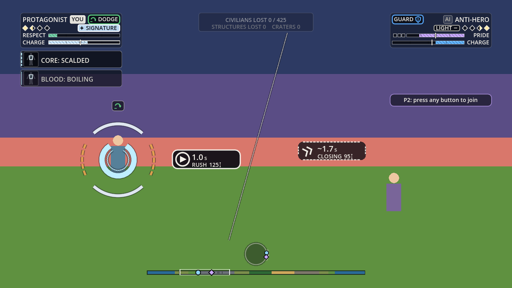 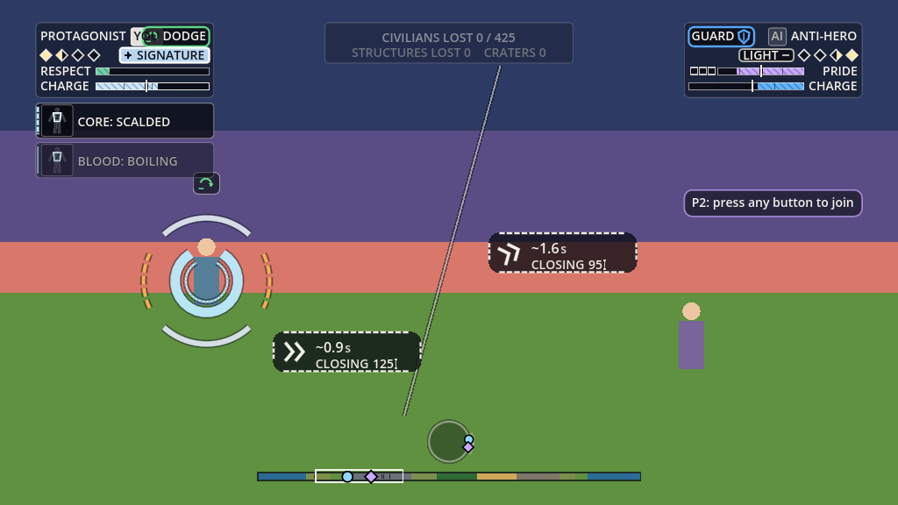

- **The chip.** One per pane, on the edge of the pane's fighter space that he comes from, along the ray from the fighter in `screen_dir`, with an arrow pointing that way. It shows the arrival as a countdown in seconds from `eta` (one decimal under ten, whole seconds above, redrawn tenth by tenth, not every frame), the word RUSH or CLOSING, and the attacker's own distance in fighter heights (`dist_bh`, rounded as the pointer chip rounds it).
- **Aimed against estimated, by shape.** `aimed` (a sim rush is on at him; `eta` is exact): a solid chip with a heavy edge, a target ring round a solid arrow, the word RUSH and a plain number. Under 0.6 s to arrival the chip turns solid light with dark words. Not aimed (he is closing faster than 3,000 units a second; `eta` is an estimate): a dashed chip, two open chevrons, the word CLOSING and a number with a "~" in front. Edge, icon, word and number differ; colour carries nothing, so it is colour-blind safe. It is not animated (the number is the movement), so reduced motion changes nothing about it.
- **When it shows.** Only while the panes are open (the divider is up): nothing in a single view. It shows when the read is `active` and the attacker is off the pane's screen. **A note on `shown`:** Camera's doc says `shown` is true when "the attacker is off this pane", but the code sets it when the attacker is ON the pane's screen (inside its share of the screen). The HUD follows the code: no chip while `shown` is true, since the player sees him. If the doc was meant, Camera flips the field, and the HUD flips one condition (`UiIncoming.data`). It replaces the ordinary edge pointer chip for that pane while it shows (one chip per rival); the other pane keeps its ordinary pointer unless it has its own read. A record with no `incoming`, a malformed one or an `eta` below zero draws none.
- **Placement and room.** The ray runs from the pane's own fighter to the edge of the pane's clear zone (its half of the screen, inside the safe area and the divider's margin, between the plates and the strip, and never over the columns: the layout's `clear_zone`). The chip's rectangle is held inside it and a fighter height clear of its own fighter (it slides along the edge to a clear spot). At the smallest desktop window (1024 by 576) it still shows; where the pane is too small for the full chip it shrinks to the compact one (the arrow and the countdown), and where that does not fit the ordinary pointer stands in. Both panes can have a chip at once.
- **Cost and determinism.** The chip is a small node the HUD moves by position (it eases as the pointer chips do, at once under reduced motion); its picture redraws when the arrow turns about 5 degrees or the countdown, the distance or the look changes, about ten times a second while it counts. UI only reads the record: it never writes sim state.
- **Tests.** `hud_check`: the countdown's format (decimals, whole seconds, "~"); the placement at 15 sizes and six arrow directions (in the fighters' space, in its own pane, clear of its fighter, along the arrow, the aimed flag per pane); a desktop split always has room; the edge it sits on; both panes at once; nothing when `shown` or inactive, in a single view, with no read, a malformed one or no arrival time; aimed, estimated and urgent are different pictures; the smallest window and a pane too small; all four looks and the compact chip draw; in the HUD the marker is a larger chip node, the countdown redraws about ten times a second, reduced motion gives the same chip, and the ordinary pointer returns when it is not wanted.
- **Stills.** Both pictures are the real HUD on the web build in headless Chrome (a scratch web export of the HUD demo scene, 1280x720 and 1024x576, with Camera's record faked as the demo does for the pointers; the demo reads its options from the page's query string on the web: `?scenario=hero_vs_proud&at=0.4&nofeed&split&nolegend&incoming`). They are not stills from a real match: the real split with Camera's rig needs the game build and a posed fight.

## 35. The Brawler layout is retired (2026-10-05)

Orb's stance layout puts stances on RB and RT, the buttons the Brawler's attacks used, so Controls retired the Brawler pad layout and migrates a saved choice to Arena (`sim/input/remap.gd`, `data/input/layouts.json`). The HUD follows: the controller layout choices are Arena and Simple (`pad_preset`, `pad_preset_p2`), the legend has no Brawler scheme, Remap lists five layouts, and the Settings and Remap words for it are gone. Earlier sections that name the Brawler (22, 26, 27, 30, 31, 33) describe the build of their day.

- **A saved setting.** `UiData.clamp_option` (which `set_option` and `load_saved_options` both go through) maps a choice the data no longer offers to what replaced it: a saved `brawler` reads as `arena`, any other unknown choice as the option's default. The host hears `arena` from `option_changed`; nothing errors. `hud_check` covers a saved player-one and player-two `brawler`, an unknown choice and a real one.


## 36. The stance badge, the beat ring and the composed intro (2026-10-06)

Orb's stance layout (`docs/ep/vision.md`, `docs/design/melee-press-feel.md` section 10) and questionnaire 18, and Simulation's dynamic intros (`docs/architecture/dynamic-intros.md`).

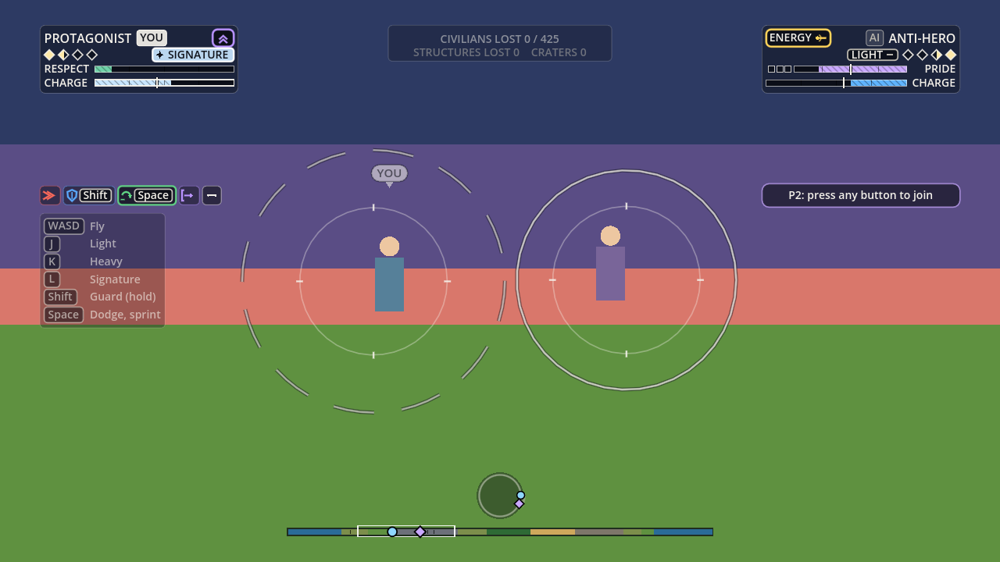 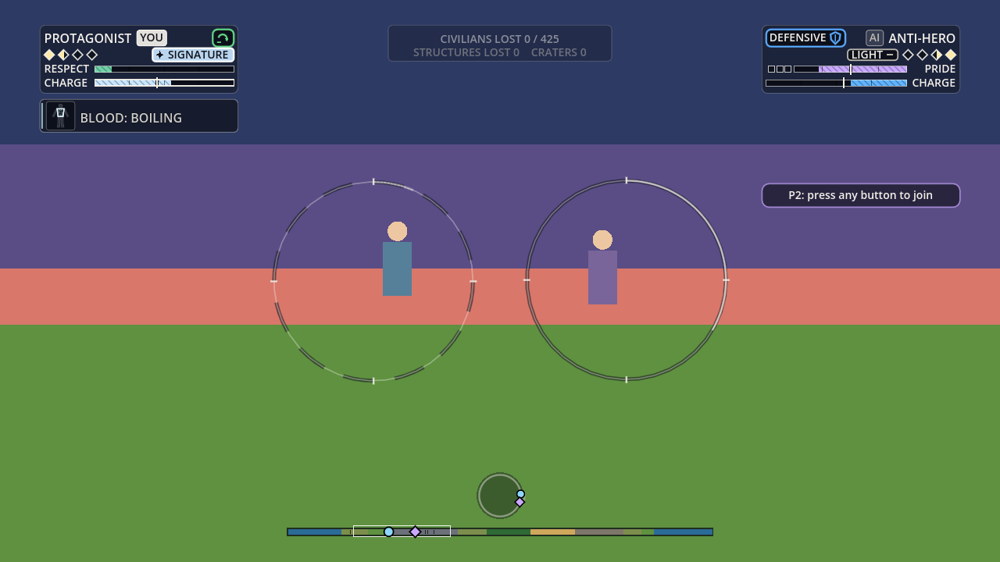

**The five stances and the words.** `ui/data/stances.json` has them in Orb's order: martial arts (nothing held, mask 0), defensive (LB, 1), energy arts (RB, 2), charging (RT, 4), manoeuvre (LT, 8). Each has the badge word, the full name, how it is entered and the four face buttons' names (X quick, Y strong, A context, B signature), drafted from section 10 of the melee notes for Narrative to edit; the key help and the move list will read the same file. The player is the fighter, so the words name what you do. Costs are not in it (Game Design's data; the zip strike is 20 ki). A draft schema for Tools is `docs/ui/ui-stances.schema.json`; until it is in `tools/schemas/` the validator warns "no schema" for the file.

**The badge.** The plate's stance chip is now the five-stance badge, on both plates, the rival's included, **always shown** (Orb, questionnaire 18). `UiStance` turns the held-button mask into a stance (RT dominates, then LT, then LB, then RB; a hybrid reads as its newer button, which is what the sim reads). Each stance has its own icon (`UiIcons.stance5`: martial arts the press chevrons, defensive the shield, manoeuvre the curved dash, energy a blast leaving a point, charging the rising carets), its own word and its own colour, so colour is never the only cue. A change of stance pulses the badge for 0.8 s (not under reduced motion), so the rival's change is seen. Where the name, the YOU or AI tag and the brink mark leave no room (a 720p plate), the badge is the icon alone; the icon and the colour still say which stance. The mask comes from `UiSimBridge.patch` (`f.input.stanceMask`; the AI's is 0 until its stance slice, so the AI badge reads martial arts until then). The prompt row's four old stance chips (PRESS, GUARD, DODGE, ESCAPE) are untouched and go with the key-help piece.

**The beat ring (option `beat_ring`, off by default, Controls section of Settings).** Every blow of the running exchange lands on a tick the director already knows (the pending `strike` and `chainStrike` beats of `S.dirS.ex`). `UiSimBridge.beat_windows` reads them: for each pending blow within 0.45 s of landing, the seconds to contact on the fighter who will be struck, into `UiFighterModel.beats` (a patch key, `beats`). With the option on, `UiBeatRing` draws a ring on that fighter that closes onto a fixed target ring and four notches at the contact tick. It covers both fighters' blows (Orb, questionnaire 18): a ring on the rival for the blows the player throws, on the player's own fighter for the blows coming at him. A **solid** ring is a blow a human throws, a **dashed** one is the AI's (shape, not colour). Reduced motion: the ring does not shrink; a still ring fills clockwise from the top to a notch. It redraws in twentieths of its closing, never in a sim pause or the intro, and it reads state only (the sim hash is the same with and without a HUD; checked on seeds 3 and 7 for 1,500 ticks).

**The composed intro.** `{"play": true, ...}` in the setup's `intro` plays a composed opening (`dynamic-intros.md` section 3). The HUD needed no new code for it: it hides from `intro_start` to `clock_start` (section 32) and shows the skip hint. Two additions: the events layer (cards, the bark lane and captions) now stays visible while the rest hides, so a caption for an `intro_line` the dialogue system turns into words is not lost to a player who reads it; and the skip words and delay come from the composed `intro_start` (`dur` is the composed length, 5 to 7.6 s). **The line that asks for it is not in UI's paths:** `render/core/main.gd` `_match_setup` (Rendering's). Seeds 1 to 12 give different intros (three templates, who arrives first, the gap) and the same one on a second run of the same seed; see the report.

**Tests.** `hud_check` (3207 checks): the words file (order, masks, the four cells each, the section 10 names), mask to stance (including hybrids), five distinct colours, the icons draw, both plates carry the badge and redraw on a mask, the pulse and no redraw once it ends; the option (default off, in Settings), the windows from a faked exchange (attacker's and defender's strikes, chained strikes, a too-far, a done and a non-strike beat left out, no exchange), the ring's nearest-two rule and its twentieth-second redraw key, solid and dashed, closing and still, in the HUD: off draws nothing, on draws, the redraw rate, reduced motion, gone with no blow and in a sim pause; and an intro caption staying visible. Demo: `--mask=N --rmask=N` and `--beats=SECONDS` (web: the same as a query string).


## 37. The key help for five stances: the prompt row and the live legend (2026-10-05)

Steps A and B of `docs/ui/key-help-plan.md`. The old four stance chips (PRESS, GUARD, DODGE, ESCAPE) are gone from the prompt row, and the legend reads by stance, so the row, the legend and the plate's badge now say the same thing: all three read `UiFighterModel.stance_kind`.

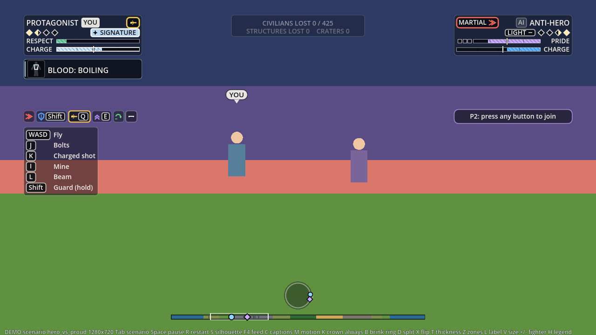 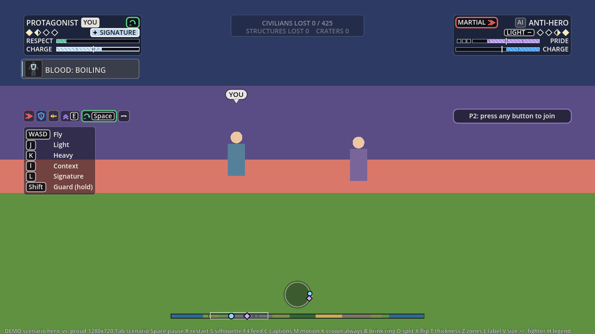

**The prompt row (`UiPrompts`).** Five chips in Orb's order: martial arts, defensive, energy, charging, manoeuvre. Each has its icon (`UiIcons.stance5`) and, except martial arts (nothing is held), the glyph of the button that holds it in the player's own layout: the layout's `guard` binding for defensive, `mode` for energy, `power` for charging, `dodge` for manoeuvre (so LB, RB, RT, LT on Arena; Shift, Q, E, Space on the solo keyboard; Shift, E, Q, Space for shared player one and Semicolon, O, Slash, Period for player two). The held stance's chip is filled and edged in its colour. The row shows for 3 s at the start and for 3 s after every stance change, always with Show prompts on, never for an AI. The weight mark and the Transform chip keep their places.
- **Fit tiers.** The chips narrow before anything else gives way, in four tiers: **0** every chip with its glyph; **1** glyphs on the held chip and its neighbours; **2** the held chip's glyph only; **3** icons only. `UiPrompts.fit_tier` takes the first tier whose five chips fit the row's width less the room reserved for the weight mark and, when it is wanted, the short Transform chip. On the solo keyboard at 1080p every chip carries its glyph; at 720p the row is at tier 1.
- The held chip is the badge's stance by construction. Touch has no row (a phone gives it no height), as before.

**The live legend (`UiHints`).** For a layout with the stance buttons (it binds a mode and a power button: Arena and the three keyboard layouts) the rows read: Fly; the four face buttons; the four stance buttons, the row of the stance held now marked with a bar on the box's edge; Specials; Escape; and Transform last, only while a form is ready. **A stance's names are shown only while they are true on the live build.** `ui/data/stances.json` has a `_live` flag for each stance (an underscore key until Tools promotes it):
- **Live:** the four face rows are named as the held stance names them (the layout's Light, Heavy, Context and Signature glyphs, labelled X, Y, A and B from the stance's cells), and its stance button reads "Defensive (hold)", "Energy (hold)" or "(toggle)" by the player's setting, "Charging (hold)" or "Manoeuvre (hold)".
- **Not live:** the face rows keep the words the legend had before (Light, Heavy, Context, Signature, per layout; Simple's are its own) and the stance button keeps its old word (Guard (hold), Power (hold), Dodge, sprint; Energy (hold) is the same either way).
- **The Specials row** stays until the charging stance is live (`UiStance.specials_row`); then its cells name the specials (B as "Ultimate (hold)") and the row is dropped. Flipping any stance to live is that data change only.
- **Set on HEAD (2026-10-05), checked against what the sim does with that stance held:** only the **energy** stance is live (a bolt on X, a charged shot on Y, a mine on A outside an exchange and the signature beam on B all exist). **Martial arts** is not live (no grab and throw on A: the context press does nothing with nothing held); **defensive** is not (no check, push or counter: X and Y are the ordinary attacks in the guard state, A is a reversal only just after a block); **charging** is not (the specials exist but B is the plain signature, not an ultimate); **manoeuvre** is not (the sim reads the dodge button's hold as a sprint; no zip strike, zip heavy, zip tackle or terrain art).
- **A stance change shows the legend for 3 s** (`UiHints.legend_alpha`; the last half second fades), even after its first 12 s are over, unless Control hints is off. The YOU marker keeps the old rule. Simple keeps its rows as written (its choreographer picks the stance).
- Every word is data (`stances.json`: the cells, `_legend`, `_legend_toggle`, `_live`), so Orb's edits change no code. At 720p the column holds about six legend rows, so the lower rows are cut off there as before; the prompt row beside it carries the same four buttons with their glyphs.

**The finisher telegraph answers.** Game Design's rulings (melee notes sections 10 and 11): a launch is answered by the defensive stance, a melee by the manoeuvre stance, a beam by the Signature press from the martial, energy or charging stance. The telegraph chip's "ANSWER WITH" icon and words now come from `stances.json` `_counters` ("the defensive stance", "the manoeuvre stance", "the signature"; the beam's icon is the signature star), where the data says; `reads.json` `finisher_counter` (the sim's own answers) is untouched. **What would mislead a player today if the words changed before the sim does:** nothing, because the words name a stance or a press and never a timing. The sim still reads a held guard for a launch (the defensive stance held), a held dodge for a melee (the manoeuvre stance held) and an answering signature for a beam (the Signature press); each of the new words is a way to do the old thing. The words that would mislead are "tap" (the new melee rule counts an LT tap in the last 20 ticks, the old one reads the held stance at the start) and "40 Charge" (the signature costs 45); neither is on the chip.

**Not in this step.** Full touch's four stance buttons' labels and the armed-stance display ("next blow", Controls' `docs/controls/stance-key-help.md`); touch has no legend and no row, so nothing in the row or legend changes for it. How to play's stances page and the Remap and Settings words are the next steps.

**Tests.** `hud_check`: the layouts' own glyphs on the five chips; five chips at 1080p with every glyph; the held chip is the badge's stance for each stance; the chips inside the row at 720p and at every width from 460 to 175 px, with all four tiers reached; the held chip's glyph at every tier but the last; 1024 by 576 fits; the weight mark and the Transform chip share the 720p row; the data's live flags are the build's; at HEAD's flags the energy stance names its four buttons and every other stance keeps the old words, on Arena, the solo keyboard and shared player two; flipping every stance to live, or one, is a data change only; the stance buttons' words by live and by the toggle setting; the Specials row stays until the charging stance is live; the row order; the held-stance mark; Simple unchanged; Transform last and only when ready; the 3 s pop and its fade, the off option and the AI; in the HUD the legend and the row come back on a stance change and fade again; the telegraph's answers from data and the three chips drawn. Stills: the web build in headless Chrome, a scratch export of the HUD demo scene (`?scenario=hero_vs_proud&at=0.4&nofeed&prompts&mask=8`, `&mask=1&device=xbox&preset=arena&ready`).


## 38. How to play's stances page, and the stance words on the controls page and in Remap (2026-10-05)

Steps C and D of `docs/ui/key-help-plan.md` (the plan: `how-to-play-stances-plan.md`). All of it follows the same `_live` flags in `ui/data/stances.json` as the legend, so the card describes the game as it is and promises nothing: a stance's column fills in when its flag flips, by data alone.

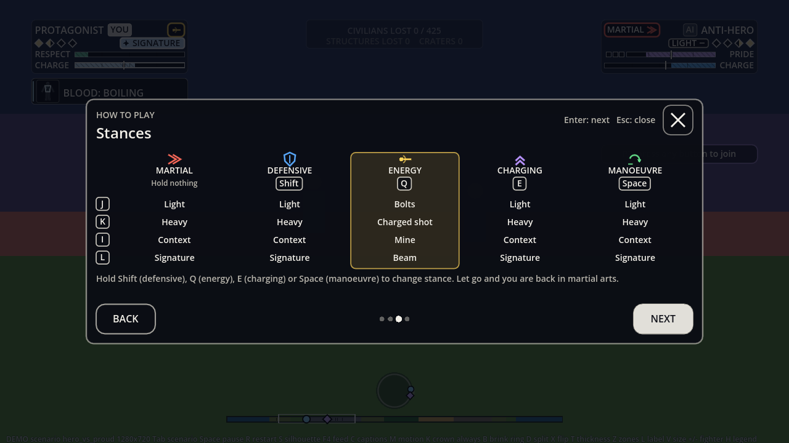 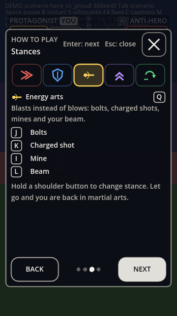

- **A fourth page, Stances,** between Controls and Reading the fight. **Wide screens:** a table of the five stances across and the four face buttons down, with the player's own glyphs on both axes: each stance's header has its icon, its name and the glyph that holds it in the player's layout (martial arts: "Hold nothing"; LB RB RT LT on Arena, Shift Q E Space on the solo keyboard, the shared halves' own), the rows are the layout's Light, Heavy, Context and Signature glyphs. The stance held now has its column tinted. A **live** stance's cells are its four names; a **not-live** stance's cells are what the buttons really do today (the legend's old words), at normal weight and with no tag: the page never says "soon". Under the table, a line that names the player's own inputs from the layout (`{defensive}`, `{energy}`, `{charging}` and `{manoeuvre}` in the data become the keys or buttons that hold them): "Hold Shift (defensive), Q (energy), E (charging) or Space (manoeuvre) to change stance. Let go and you are back in martial arts." on the solo keyboard, LB RB RT LT on Arena, ";", O, "/" and "." for shared player two; on a touch screen "Use the stance buttons to change stance. Let go and you are back in martial arts."
- **Narrow screens** (the table's columns would be under a readable width: a phone, the 360 by 640 window): one stance at a time, five tabs along the top (each at least a touch target, the stance icon and, when the tab is wide enough, its name), the page opens on the held stance, Up and Down (or the pad's D-pad up and down, or a tap) change the tab. The selected stance shows its full name, the glyph that holds it, its one-line description **only while it is live** (`_blurb`), and its four rows.
- **Simple and Simple touch** get one line and no table: "The game picks your stance for you." **Full touch** gets the table with its own button words (LIGHT, HEAVY, CONTEXT, SIGN) and, under it, "Tap a stance button to use it for your next blow, or hold it to stay in the stance" (Controls' arming rule).
- **The idea page's old four-stance list is gone** (PRESS, GUARD, DODGE, ESCAPE). Its second column is now "Your stance": "Nothing held: your martial arts. Hold a shoulder button to change stance." and "Each stance changes what your four buttons do: see Stances."
- **The controls page** names a stance's button for its stance once the stance is live (`_howto`: "Energy stance (hold; Settings can make it a toggle)" now, "Defensive stance (hold)", "Charging stance (hold to charge)", "Manoeuvre stance (hold), dodge (tap)" when theirs flip) and keeps the old rows (Guard (hold), Power (hold to charge), Dodge (tap), sprint (hold)) until then.
- **Remap and Settings.** The Remap rows for the four stance buttons read by the flag: live, the stance's name (`_remap`: "Energy stance (hold)" now, "Defensive stance (hold)", "Charging stance (hold)", "Dodge (tap), manoeuvre stance (hold)") with its help (`_remap_help`); not live, the old words and helps (Guard, Power, Dodge). Settings names no stance beyond "Energy: hold or toggle".
- **The words are all data** (`stances.json`: `_blurb`, `_howto`, `_remap`, `_remap_help`, the cells, the notes in `howto.json`), drafted by UI for Narrative and Orb to edit. The page's three lines are icon-row items in `howto.json` whose `icon` names the line (`stances_table`, `stances_table_touch`, `stances_full`, `stances_simple`), because the howto schema allows any icon name but only two note names; if Tools widens the note names they can become notes.
- **A fix found on the way:** the join prompt ("P2: press any button to join") was drawn over How to play and the pause menu; it is now a layer under them.
- **Tests (`hud_check`):** the page is the third of four; the table at 1920 by 1080 (20 cells, 4 row heads, held marked) and each header's key on the solo keyboard, on Arena and for shared player two; live and not-live columns (HEAD's flags: energy's four names, the rest the old words; all live; no "soon" anywhere); the narrow tabs at 360 by 640, 390 by 844, 750 by 1334 and 1170 by 2532 (five tabs of at least a touch target, the held tab selected, a chosen tab, the one-line description only while live); Simple, Simple touch and Full touch; the page fitting with every cell inside the body at 15 sizes for six layouts, at HEAD's flags and all live; the controls page's words by flag; the Remap rows by flag, flipped and back; in the HUD, Up, Down and a tap choosing a tab and a desktop window showing the table; every mode draws; the layer order. Stills: the web build in headless Chrome at 1280 by 720 and 360 by 640 (`?scenario=hero_vs_proud&at=0.4&nofeed&howto=2&mask=2`).
- **Fixed afterwards:** the Controls page on a shared keyboard did not fit at 360 by 640 or at 1560 by 720 and density 2 (its extra note; on HEAD before this page too). When the type is already at its smallest and a page still does not fit, the card now lays every page out **tight** (rows and gaps closer together, the stances table's too; `UiHowto.plan` returns `tight`), and nothing changes at any size where the pages already fit. The stances page's fit test no longer skips any layout or size.


## 39. The crown's stance mark, Full touch's stance labels and the armed stance (2026-10-06)

The last of `docs/ui/key-help-plan.md`: the old four-stance model is now gone from everything the player sees except the finisher telegraph's legacy read (`reads.json`, which the sim still reads).

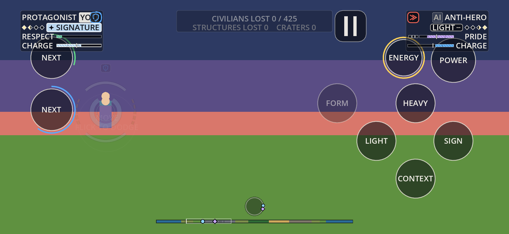 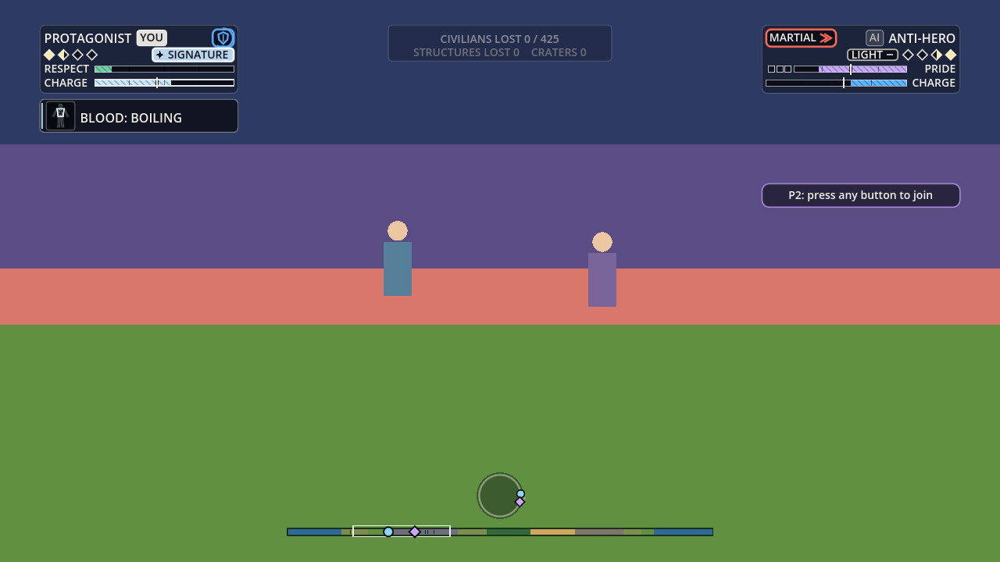

- **The crown's mark.** The small mark above a fighter while its crown is up is the five-stance icon of the held stance (`UiStance`, `UiIcons.stance5`), not the legacy four.
- **Full touch's stance labels.** The four stance buttons (widget ids `guard`, `mode`, `power`, `dodge`) are named for their stance once the stance is live (`UiStance.touch_word`: the stance's badge word, DEFENSIVE, ENERGY, CHARGING, MANOEUVRE, shrunk to fit the button) and keep the old words (GUARD, POWER, DODGE) until then, like the legend and Remap. Energy is live today, so its button reads ENERGY (as it did). Simple touch keeps its own words; its guard button's icon is the defensive stance's.
- **The armed stance** (`docs/controls/stance-key-help.md`: on Full touch a tap on guard, power or dodge arms that stance for the next blow only, lapsing after 90 ticks, a second tap cancels; a hold is the stance while the finger is down; mode's tap latches energy). An armed stance is in the intent's mask, so the badge would show it as held; it is not held, so it says so:
  - **Touch buttons:** an armed button shows a ring in its stance's colour that runs down over the 90 ticks and the word NEXT in place of its name; a latched energy button shows a steady ring (no running down). From the touch state: `full.<id>.armed` (the share of the 90 ticks left, 0 to 1) and `full.<id>.latched` (true).
  - **The plate's badge:** the word NEXT BLOW (the icon alone on a narrow plate) with the same ring round the icon, from `UiFighterModel.stance_armed` (0 to 1, patched by key `stance_armed`). Under reduced motion the ring is steady and whole (the NEXT BLOW word is the cue); it redraws in twelfths of the 90 ticks otherwise.
  - Spent by the blow or lapsed, it is the held stance's badge again. The words are data (`stances.json` `_armed_word` NEXT BLOW, `_armed_short` NEXT).
- **Wired (2026-10-05, on Controls' `hub.armed_stance(slot)` bit 1 defensive, 2 energy, 4 charging, 8 manoeuvre, 0 none, newest if two; `hub.armed_share(slot)` 1.0 down to 0.0; `hub.energy_latched(slot)`; and `SimTouch.display_state()["full"][id].armed/.latched`):** `UiSimBridge.patch_input(hud, hub)` patches `stance_armed` for both slots each tick, and `UiSimBridge.patch(hud, S, hub)` calls it (the third argument is optional; without it nothing changes). The share reaches exactly 0.0 on the last tick before the lapse while the arming still counts, so the HUD treats `armed_stance != 0` as armed and patches at least 0.02 then (the ring is nearly empty, the word still says NEXT BLOW). The latch patches nothing: it is not an arming, the badge is simply energy and Full touch's mode button shows its steady ring from the touch state. A slot with no device, or Simple touch, reads 0 and shows nothing extra. **The one line for Rendering** (`render/core/main.gd`, where `UiSimBridge.patch(ui_hud, S)` is called): `UiSimBridge.patch(ui_hud, S, host.hub)`.
- **Tests (`hud_check`):** the touch words by flag (energy live, the others old, all four live); the armed words; the crown's mark for all five; the touch controls' redraw key for arming, latching, a twelfth of a change and a tick's (none); Full touch drawn armed, latched, held and with the stances live; the plate redrawing for an armed stance, its running ring in twelfths, the steady ring under reduced motion and the plain badge after; against a real `SimInputHub`: arm (player two only), run-down (half at about 45 ticks, armed in the HUD for exactly as long as the hub says, the last 0.0 share included), lapse, a second tap cancelling, a blow spending it, two armed (the newest), the energy latch arming nothing, the plate redrawing, and `UiSimBridge.patch(hud, S, host.hub)` on a real host. Demo: `--armed=SHARE` (Full touch: `--touch=ready --full --dp=2 --armed`). Stills: the web build in headless Chrome.

## 40. Full touch under the plates, and the pointer chip clear of the buttons (2026-10-05)

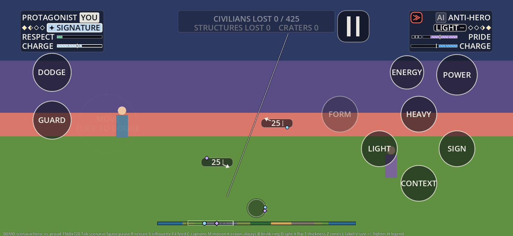 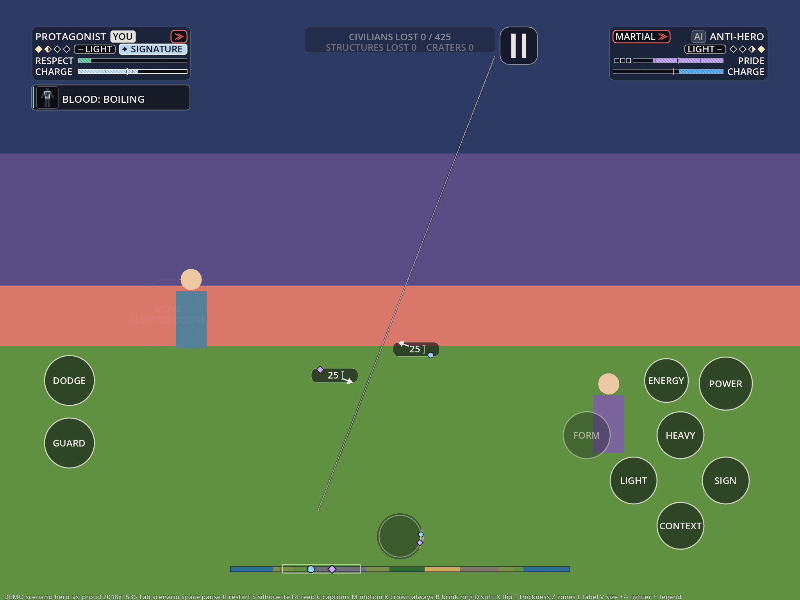

- **The top limit.** `UiLayout.touch_top_limit` is the plates' lower edge plus 4 px at the current scale (`safe.y + plate height`; -1 when the layout is not Full touch). `UiLayout` passes it as `SimTouch.layout`'s last argument, so on a short screen Controls pulls the Full preset up under it (1560 by 720 at density 2 had DODGE, POWER and ENERGY under the plates; now none is). **The host asks `UiHud.touch_top_limit()`** and passes the same value in `touch_layout()` for the hit test, so what is drawn is what is hit.
- **The pointer chip.** The rival's direction chip (diamond, distance, arrow), at the screen edge level with its fighter, now slides along the edge past any touch button (`UiSplit._chip_free`: clear of both fighters and of every button's rectangle, as `UiLayout.touch_keys()` names them, Simple's three or Full's nine) and hides only if there is no clear place. SIGN keeps its place.
- **A plate fix found on the way.** At 1560 by 720 a long name (PROTAGONIST) and its YOU tag left no room for even the icon-only stance chip, which then covered the tag; the chip is now left off a plate where it cannot fit beside the tag. (Replaced in section 41: the badge is now always on the row.)
- **Tests (`_touch_full_rules`, 1560x720 d2 and 2048x1536 d2 added, both hands, every size):** the host's call with the HUD's limit is the HUD's own layout; no button under a plate; no pointer chip over a button (a run of chips at four heights on both sides; without the fix 3 to 4 chips per size were over a button at the tablet sizes).


## 41. Plan, nothing built: the stance badge on every plate with an 11-letter name (2026-10-05)

**The ask.** The fighters are about to read PROTAGONIST and RIVAL on screen, and the rival's stance badge is always shown (Orb). Today (section 36) the badge shares the landscape plate's first row with the name, the YOU, P1, P2 or AI tag and, briefly, the brink mark, and section 40's fix leaves the badge off when nothing fits. That fix is a stopgap: the long name is about to be the normal case.

**What fits, measured** (`UiLayout` at each size, the plate's inner width against the row's parts; text sizes follow the text floor, so the name cannot shrink where it is already at the floor):

| Size, density | Plate inner width | PROTAGONIST | YOU tag | Icon-only badge | Name + tag + badge | Name + badge, no tag |
| :--- | ---: | ---: | ---: | ---: | ---: | ---: |
| 1920x1080, 1.0 | 364 | 168 | 61 | 38 | 311, fits | 216 |
| 1280x720, 1.0 | 243 | 112 | 45 | 27 | 215, fits | 146 |
| 1024x576, 1.0 | 193 | 98 | 42 | 25 | 193, **zero slack** | 128 |
| 844x390, 1.0 | 161 | 98 (at the floor) | 40 | 23 | 188, **misses by 27** | 126 |
| 1560x720, 2.0, touch | 243 | 168 | 66 | 34 | 306, **misses by 63** | 208 |
| 2532x1170, 3.0, touch | 407 | 251 | 101 | 50 | 459, **misses by 52** | 312 |
| 2048x1536, 2.0 | 485 | 223 | 80 | 51 | 413, fits | 288 |

(Name + tag + badge includes the brink mark's width, the worst case: all four parts on the row. The full-word badge fits on none of these with PROTAGONIST and a tag except the largest sizes; icon-only is the normal badge already.) Two cases matter: the player is the Rival and the opponent plate reads PROTAGONIST with an AI tag (a shorter tag; with the brink mark it still misses at 844x390 and at both touch sizes above, and without it only at 1560x720 touch), and the player is the Protagonist (PROTAGONIST + YOU on the player's own plate, the long case); the rival's own plate (RIVAL, 5 letters) always fits. Name + badge with no tag fits at every size, so the room is missing only for the tag and the brink mark.

**The options.**
1. **The name shrinks.** Not available: the name is already at the text floor (14 px, or 12 dp on dense screens) at 844x390 and 1560x720 touch. Orb's text floor is not ours to lower.
2. **The name elides before the badge goes.** Always possible, costs the name's last letters (PROTAGON…); recoverable from the tag line elsewhere (the cards, the crown). Needs one measuring function.
3. **The YOU tag gives way first.** It is the "never in doubt" cue for who the human is; losing it on the smallest plates is the costliest loss of the three.
4. **The badge moves to the plate's second row.** That row already carries the pips, the weight mark and the SIGNATURE chip (and the state chips after the pips), and a second badge position means the rival's badge jumps between two places by size: the worst for a read that has to be found at a glance.
5. **A third plate row only where needed.** It costs about 30 px at the scale in height for every plate at every size and shrinks the fight's clear zone, for a badge that fits on a line by dropping two other items.

**Recommendation: reserve the badge first, then give way in this order, all by measured width.**
1. The badge, icon-only (it is a stance icon and a colour: already readable and what the rival read needs), is reserved at the plate's far end and never dropped. The full word returns only where it fits beside everything else, as now.
2. The brink mark gives way first (a temporary state; the crown, the card and the silhouette say it, and the non-combined plate already drops it first).
3. The tag keeps its shape but gives up its padding (its pill becomes the tag's text with a thin rule: saves about 12 px at the scale).
4. The name elides last, by letters, never below five, with a data short form first when Narrative gives one (`name_short` per fighter in `ui/data`, optional; PROTAG, say): the full name, then the short name, then letters cut with an ellipsis.
5. If even that fails (it should not at any size we ship) the badge still shows and the tag goes, with the plate's colour edge keeping the human's side.

**What it costs.** About a day (size S to M): the first row's layout moves out of `UiPlate.draw` into a pure plan function (`UiPlate.row1_plan(inner_w, name, tag, brink, badge_word, ...)` returning the rectangles and what is shown), which `draw` and the tests share. One optional data key (`name_short`, a closed-schema key Tools adds). No change to the plate's height, the hit areas or the sim. Redraw cost unchanged (the signature already includes the stance and the plate's text).

**Tests I would add (`hud_check`):** at every landscape size in the table plus the 15 sizes of the other rules, both touch settings, both name cases (PROTAGONIST, RIVAL), every tag (YOU, P1, P2, AI) and brink on and off: the badge is on the row, no two of the row's parts overlap, the badge is inside the plate, the name is never cut below five letters, and the badge is the last thing to go (a property of the plan function, so the test needs no drawing).

**Decision for the EP:** the ladder above (badge, then the brink mark, then the tag's padding, then the name) or a different order. The names are in data, so the rename itself does not change code once this lands.


### Built (2026-10-05), on the EP's ruling

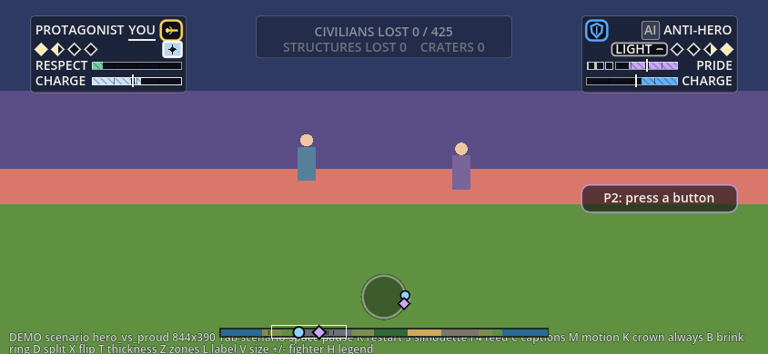 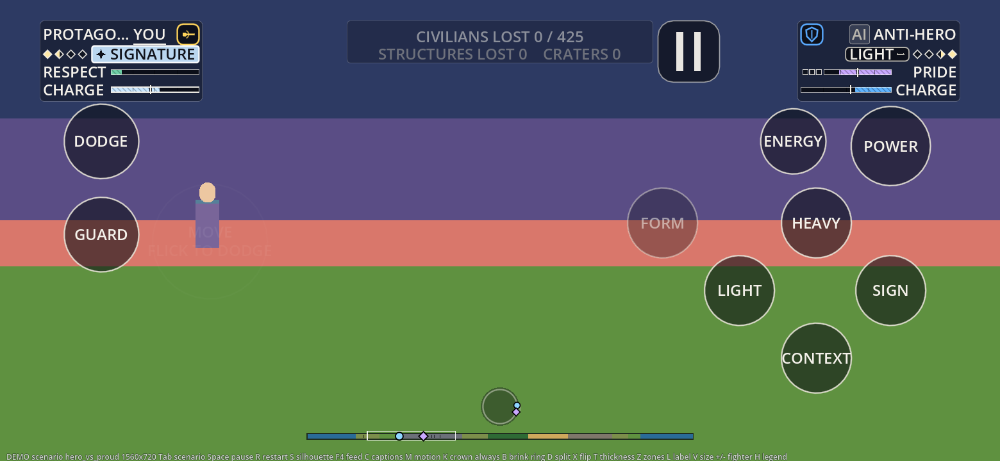

The order stands as written above, with one change: **no `name_short` key.** The fighters' names are placeholders that Orb will replace, so a hand-picked short form would be thrown away; the name is elided by letters only. **Upgrade once real names exist:** an optional short form per fighter in data (a closed-schema key Tools would add), tried between the full name and the letter cut.

- **`UiPlate.row1_plan(inner_w, s, pm, name, tag, brink, word, with_chip)`** is the one function that plans row 1: `draw` uses it, and so do the tests. It returns the shown name (whole or cut), the tag (and whether it has its pill), the brink mark, the badge's word (or "" for the icon alone), and each part's offset from the plate's near edge. The steps it takes, in order: the badge's word goes to the icon alone, the brink mark goes, the tag's pill goes (its text stays, with a rule under it: bright for a human, dim for the AI), the name is cut by letters (never under five letters and an ellipsis), and only then the tag. The badge is never dropped: section 40's stopgap (leaving the chip off) is gone.
- **Portrait plates** use the same function without the badge (it sits on the second row there), so a long name no longer pushes its tag off a narrow phone plate either.
- **Plate height, the hit areas and the redraw signature are unchanged.**
- **Tests (`_plate_row1_rules`):** at 13 sizes, both touch settings, both names, YOU, P1, P2 and AI, the brink mark on and off and four stance words (64 cells per size and setting, about 1,700 in all): the badge is on the row and inside the plate, nothing overlaps, the name keeps five letters (cut only by letters, with an ellipsis), the tag is present, and the order of giving way holds (a cut name has no pill or brink left, a padless tag has no brink, the word shows only when nothing gave way); plus 844x390 (the word, the brink mark and the pill give way, the name stays whole), a very narrow plate (the name is cut, the tag and badge stay), no room at all (the tag goes last) and a roomy plate (nothing gives way).


## 42. Display names and the computer opponent's word (2026-10-06)

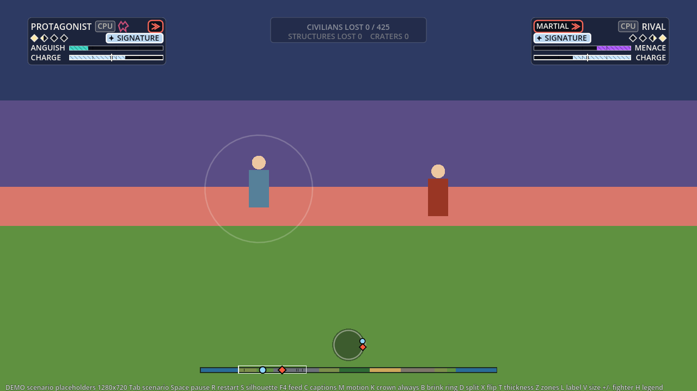 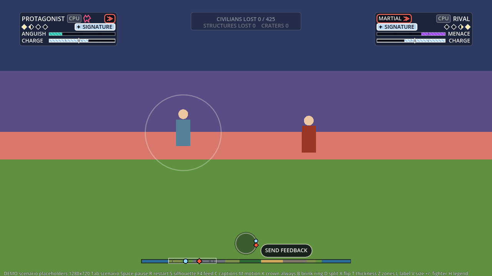 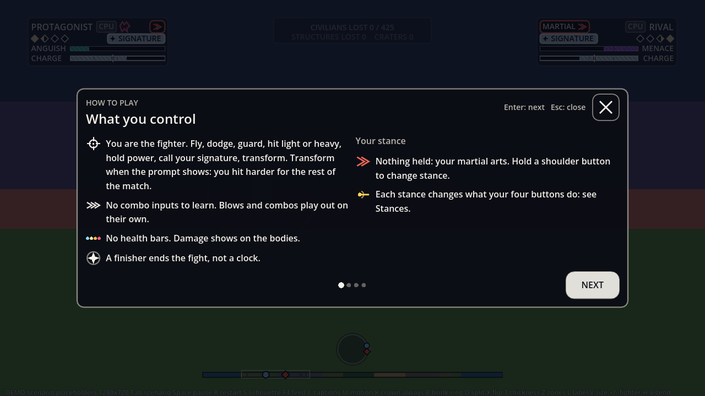

Legal holds promotion of the live build while KAI and VORR are on screen (KAI failed its name screen), and the code rename waits behind two sim slices. So the names a player sees are **looked up**, and the sim, the data and the replays keep the roster ids.

- **The lookup.** `ui/data/fighter_names.json` maps the roster id as the sim spells it today (lower case) to the name drawn: `kai` is PROTAGONIST, `vorr` is RIVAL. `UiData.display_name(name)` returns that, or the name itself when there is no row (the id as the fallback), and `UiData.display_text(text)` does the same for a roster name inside a sentence (whole words only). When the ids are renamed only the keys here change; Orb's real names replace the values.
- **Where it applies.** The fighter model (`UiFighterModel.setup`, and the bridge's per-tick `name` patch), every event's `text` (the sim writes banners such as "K.O.  KAI WINS" and "VORR POWERS UP  TIER 2"; the bark lane's speaker, the plates, the split view's tags, the crown, the feedback report's setup line and the debug feed all read the model or the event) and the debug feed lines. How to play, Remap and Settings never named a fighter.
- **The computer opponent** is "CPU" on the plate's tag (`state.ai`) and "computer" everywhere else in ui/data: the feedback report ("RIVAL (computer)"), "P2 handed back to the computer", "Player two: hand back to the computer", Settings' "Split screen against the computer" and its two helps. Code identifiers, option keys and the sim's `ai.json` are unchanged. CPU is three letters like YOU, so the plate's row-1 plan (section 41) fits it as it did AI.
- **Tests (`_display_name_rules`):** the lookup and the whole-word rule; the models and the roster ids; a tracer on `UiText.draw` collects every line drawn across the plates, the banners, the barks, a KO, the feed, the pause menu, the four How to play pages, Settings, Remap on three layouts, the feedback panel and both join notes: none has KAI or VORR, none has the standalone word AI, and the plate's tag reads CPU; the feedback report says PROTAGONIST, RIVAL and computer; and a walk of every string in `ui/data` (not under a key starting with `_`) finds no AI.
- **Text search of ui/ for the two names**, every hit explained: the roster-id alias rows in `readout_profiles.json` (keys; they stay until the id rename, and the checklist in `docs/architecture/pending/fighter-split.md` section 8 renames them), `fighter_names.json` (the lookup's keys), the mock feed's literals (demo only; its text goes through the lookup), and comments. `hud_check.gd` uses the ids as test input.
- **Stills:** the web build, the placeholders scenario at 1280x720: both plates (PROTAGONIST with CPU, RIVAL with CPU), the match end, How to play. The demo's mock has no KO event, so the sim's "K.O.  X WINS" banner is covered by a test, not a still.

### The statement that the game is built with AI tools: where it goes (built in section 43, as two pages)

No About or Credits screen exists in ui/ today (no such term, page or menu item). Recommendation: **a fifth, text-only page of How to play titled About**, reached the same way as the other pages (Enter or Next, tabs on a narrow screen, nothing new to learn in the controls), with the statement, the licence line when Orb picks one, the credits and the link row. It needs no new screen, layout or input (the page renderer already draws a text-only page with icon rows). The first-run How to play opens on page 0 as now, so a new player is not forced through it. Size S. The words are Legal's and Orb's (the README's disclosure is the source); I draft none. If Legal wants it more visible, the pause menu can later gain an About item that opens How to play on that page (one more item, and the pause menu's item-count tests change).


## 43. The About pages and the pause menu's About entry (2026-10-06)

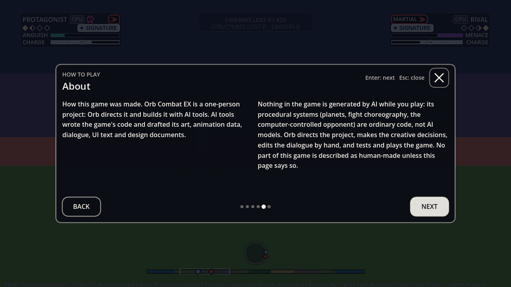 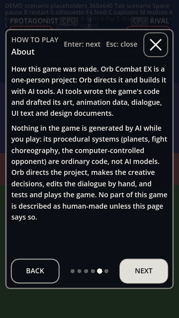 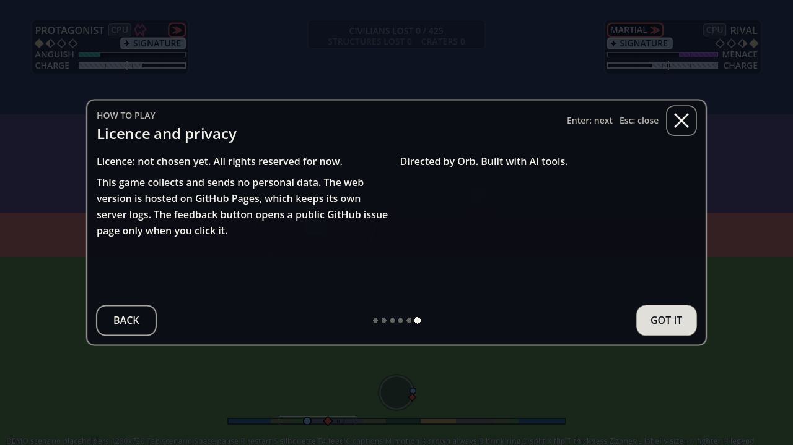 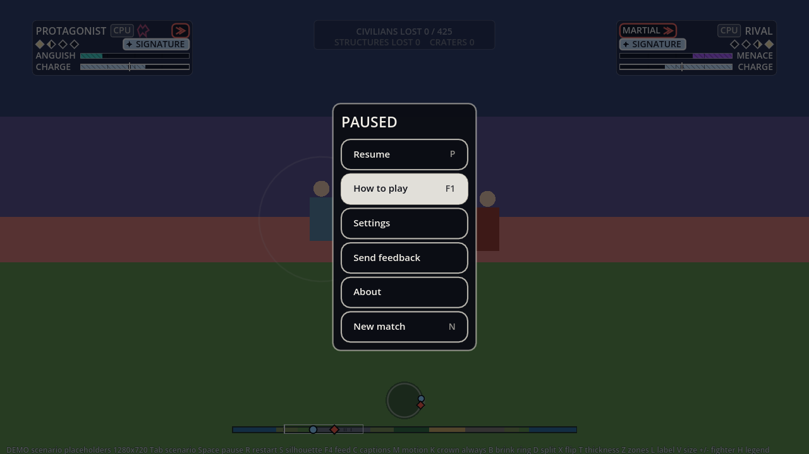

Orb's rule is full disclosure of how the game was made, and it now holds inside the game (section 42 planned it).

- **Two more pages of How to play**, after Reading the fight (six pages in all): **About** and **Licence and privacy**. They are text-only: paragraphs, no icons and no controls, drawn by the same card, so they page, tab, close and fit like the others. The statement did not fit one page on a phone (360 by 640) or at 1560 by 720 and density 2, where the type floor is high, so it is two pages; each fits at the 15 sizes (and with the two flags on).
- **The words are Legal's, verbatim** (`docs/legal/go-to-market.md` section 1 as amended with the procedural-systems clarifier, and its section 9.1 for the privacy line), all in `ui/data/howto.json`:
  - **About:** "How this game was made. Orb Combat EX is a one-person project: ..." and "Nothing in the game is generated by AI while you play: ..." (the clarifier and the human-made line), plus two sentences behind flags (below).
  - **Licence and privacy:** "Licence: not chosen yet. All rights reserved for now.", Legal's privacy line ("This game collects and sends no personal data. ..."), and the credits line "Directed by Orb. Built with AI tools."
  - No link to docs/ep or docs/legal.
- **Two flags, off today** (`ui/data/features.json`): `about_music` ("The music was generated with Suno.") and `about_voice` ("There is no voice acting. Character vocal sounds are synthesised by code."). A page item whose icon is named `about_music` or `about_voice` is that sentence and is laid out only while its flag is on. Turn music on when it ships and the voice one when Orb confirms it; nothing else changes.
- **The pause menu** has an **About** entry before New match (six entries; seven with the hand-back entry while two people play) that opens How to play on the About page. The first-run How to play still opens on page 0 and now runs to six pages.
- **How the items are written** (no schema change; Tools' closed howto schema already allows it): an item with only `col` and `text` is a text-only paragraph (`UiHowto` lays it out across its column, no icon). The two flagged sentences use `icon` as their item name.
- **The word AI** appears on these pages, as Legal's statement says it; hud_check's "no AI on screen" rule exempts the pages whose ids begin with `about` and nothing else.
- **Tests (`_about_rules`):** the page ids and titles; both flags off today; the data equal to Legal's text word for word (constants copied from the doc); the laid-out paragraphs equal the data's text with the flags off, with each flag alone (only its sentence is added) and with both on; both pages fit inside the card with the buttons as targets at 15 sizes, both device families, touch off and on, flags off and on (240 cells); the pause entry (before New match, also with two players) and that choosing it opens the About page; the existing How to play tests now count six pages and the pause tests six or seven entries.
- **Known, not new:** How to play does not fit at 844 by 390 at HEAD (the four older pages fail there too); that size is not one of the 15.


## 44. The privacy line keyed to the feedback target, and the third-party licences (2026-10-06)

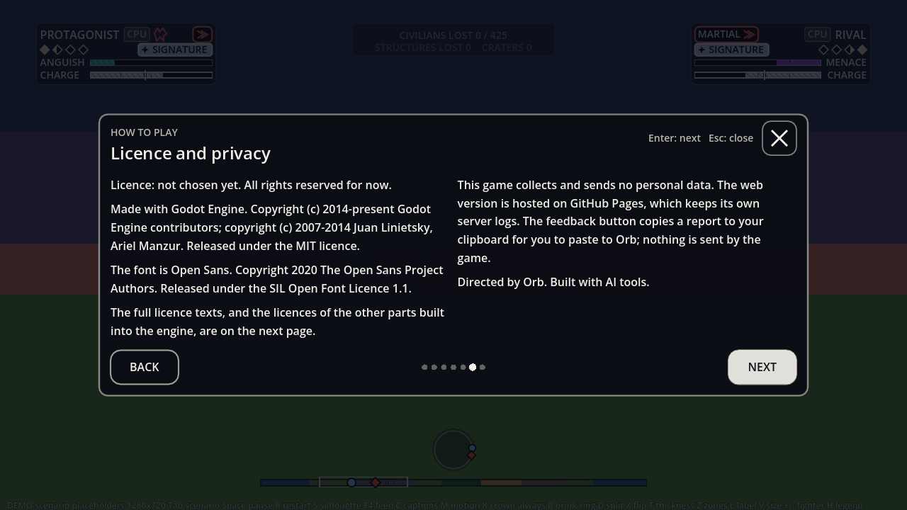 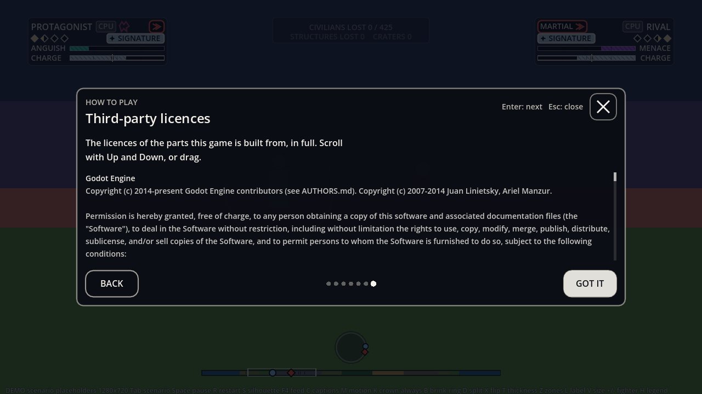 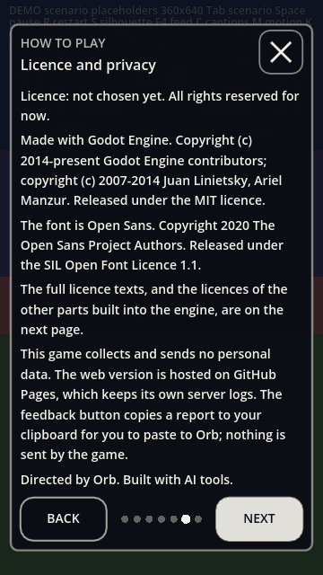 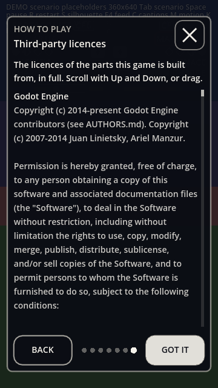

From Legal's live check (`docs/legal/go-to-market.md` section 11, RL-097).

- **The privacy line cannot drift.** It was wrong on the live build (it said the feedback button opens a public GitHub issue page; the target is none, SEND is hidden and COPY REPORT only copies). The Licence and privacy page now holds three versions of the third sentence, and shows the one for the target the feedback button really uses (`UiFeedback.send_target()`, the rule the button itself follows, including that a mailto or form with no address is none): **none** "The feedback button copies a report to your clipboard for you to paste to Orb; nothing is sent by the game."; **github** "The feedback button opens a public GitHub issue page only when you click it."; **mailto or form** "The feedback button opens a private email or form only when you click it. What you send reaches Orb only: please leave out personal details." The first two sentences (collects and sends no personal data; hosted on GitHub Pages) are the same in all three. Items are named by `icon` (`about_privacy_none`, `about_privacy_github`, `about_privacy_private`) like the music and voice sentences; `UiHowto.about_shown` and `privacy_kind` choose. **Note for Legal's 10.5:** under mailto or form the sender's address or answers reach Orb, so the privacy notice (who, why, deletion) is still needed before such a target ships; the line here is the short form only.
- **The notices that must ship** (`docs/legal/licence-register.md` LR-001 and LR-004a) are on Licence and privacy in their short form, with where the full text is: "Made with Godot Engine. Copyright (c) 2014-present Godot Engine contributors; copyright (c) 2007-2014 Juan Linietsky, Ariel Manzur. Released under the MIT licence."; "The font is Open Sans. Copyright 2020 The Open Sans Project Authors. Released under the SIL Open Font Licence 1.1."; and "The full licence texts, and the licences of the other parts built into the engine, are on the next page."
- **The full texts are a scrolling page, not a text page: Third-party licences, the seventh page of How to play.** Why: Godot's licence terms ask for its licence text and copyright notice and the licences of everything built into the engine, and the engine lists 19 licence texts and 102 components (about 90,000 characters, some 2,000 lines on a phone), which no fixed page can hold. The page reads them from the engine itself (`Engine.get_license_text`, `get_copyright_info`, `get_license_info`, as Godot's own documentation and the register's LR-001 suggest), so the text is always the true text for the engine version in the build, nothing is pasted into our data and **no file has to ship in the build**. It has Godot's licence text first, the components with their copyright lines (this is where "Open Sans font: Copyright 2020, The Open Sans Project Authors. Licence: OFL-1.1." is), then every licence text (MIT as Expat, the Open Font License as OFL-1.1, and the rest). Single line breaks inside a licence's hard-wrapped lines are joined and the text re-wrapped to the card; no character changes (a test compares them).
- **Scrolling:** Up and Down (and the pad's d-pad) move three lines, Page Up and Page Down a page less a line, Home and End the ends, the mouse wheel three lines, and a finger or the mouse dragging in the text scrolls it with the finger; a thin bar at the right shows where you are. The page opens at the top on every visit, and Next, Back and Close work as on every page. Only the shown page wraps the text (cached per width and size); the fit passes do not.
- **The first-run How to play now has seven pages** and ends on the licences page.
- **Tests:** the data holds the notices and the three privacy lines word for word; the laid-out page shows the line for the target in use, one case per target (none, github, mailto with and without an address, form) and one that reads send.json itself and fails if the page's line and the file's target disagree; both Licence pages and the licences page fit at the 15 sizes, both device families, touch off and on, the flags off and on; the licences text holds Godot's licence text, every one of the engine's licence texts and component names, the MIT permission text and the Open Sans copyright line and OFL text; wrapping loses no character and fits at three widths; scrolling by key, page, end, wheel and drag, staying inside the text, starting at the top on every visit, and doing nothing on other pages.


## 45. The first run shows the gameplay pages only; the licences page's first wrap, timed (2026-10-06)

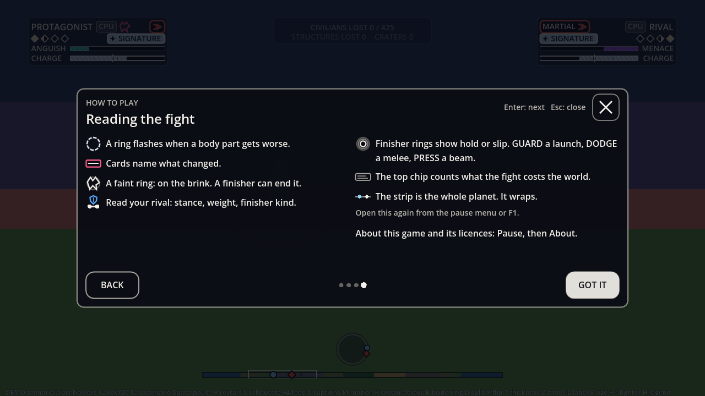

- **First run: four pages.** The first-run How to play (opened by the host with `show_howto(true)`) shows the idea, the controls, stances and reading the fight, and leaves out About, Licence and privacy and Third-party licences (`UiHowto.REFERENCE_PAGES`; the gameplay pages come first, so the page indexes do not move). Its last page (GOT IT on page four) carries one line from data, "About this game and its licences: Pause, then About." (`howto.json`, an item named `first_run_about`, laid out only for the first run). How to play opened from the pause menu or F1 keeps all seven pages, and the pause menu's About entry still opens on About. The fit passes use the pages the card is showing, so the first run's card is sized for its own four.
- **Tests (`_first_run_rules`):** the page ids and counts (four for the first run, seven otherwise); at 15 sizes, both device families, touch off and on: the first-run pages fit, say four pages, put GOT IT on the fourth, carry the line on the last page only, and the full card never carries it (240 cells); in the HUD: the first run's Next walks pages 0 to 3 and closes, the pause menu's How to play walks 0 to 6, and About still opens on its page of the full card. Demo: `--firstrun` with `--howto=PAGE`.
- **The licences page's first wrap, timed** in the web build in headless Chrome (software GL, `Emulation.setCPUThrottlingRate` 4): **before** 381 ms unthrottled and 3,310 ms at 4x on a desktop-width card, 2,024 ms at 4x on a 390 by 844 phone at density 2: over the second. **Fixed:** the wrap measured every trial line; it now measures each distinct word once (a cache per font size) and adds widths, with long words broken by letters. **After:** 59 ms unthrottled; at 4x 526 ms (1280 by 720), 554 ms (390 by 844 at density 2) and 454 ms (360 by 640): all under a second, once per width and size (cached) and only when the licences page is first shown. The text is unchanged (the wrapping test compares every character); it wraps slightly more conservatively (1,431 lines against 1,417 at desktop width).


## 46. Ahead of the fighter rename: every word about a fighter by roster id (2026-10-06)

Part A of `docs/architecture/pending/fighter-split.md` sections 9 and 10, UI's lines. Nothing a player sees changes today, and the sim's hash does not move.

- **`ui/data/fighter_names.json`** rows are `{ name, title, sigName }`, keyed by roster id in lower case, with both spellings during the transition: `kai` and `protagonist` (PROTAGONIST, Martial Artist, Keeper's Lance), `vorr` and `rival` (RIVAL, Challenger, The Barrage). A bare string row is still read as just a name. A fighter with no row shows its id and has no title or signature name.
- **`UiData`:** `display_name(id)`, new `display_title(id)` and `display_sig(id)`, and `display_text`, which now does two passes: the signature key the sim will print (`<ID>.SIG`, any case) becomes the signature's name (the fighter's name if it has none), then a bare roster id **in capitals** becomes the name. Capitals only, because `rival` is also an English word that a bark or a caption may use; the sim's own text is in capitals. The banner is put in capitals where the hub makes it (`UiEventHub`), since the sim stops doing it.
- **`UiSimBridge`:** the readout profile id and the name come from `f.id` (not `f.name`, which becomes the id, or a mirror arm's label); the signature names known to the hub are read through `display_text`, so a banner that is only the signature's key is still dropped like its name.
- **Readout profile: decided (b), the bridge maps roster ids to profiles explicitly.** `readout_profiles.json` gains the aliases `rival` and `stand_in_protagonist` (read like `vorr` and `kai`), and `UiSimBridge.STAND_IN_PROFILES` maps the roster id `protagonist` to `stand_in_protagonist`. **Why not let him read the real Protagonist profile (a):** that profile is a different design, and the stand-in's presentation is built on the sim's own fields. Its meter would be labelled RESPECT while the bridge still feeds it the sim's anguish value (a wrong label over a right number); its rally card would read SECOND WIND instead of RALLY; and its barks would show the real Protagonist's portrait pack (`faces.json` is keyed by the model's id). All of those would change at the rename window, in the same moment as the words; with (b) the window changes words only, which is the proof the plan promises. **What a player would see differ under (a):** the RESPECT meter label, the SECOND WIND card and the Protagonist portrait on barks. **Drop the mapping row** when the real Protagonist replaces the stand-in.
- **Tests (`_rename_rules`):** both spellings of each id give the same name, title and signature name; the signature key reads as the signature's name before the bare id; `rival` the word and a mixed-case `Kai` are left alone; the bridge's profile ids; the aliases read anguish and menace as today and the real Protagonist profile is not anguish; and the HUD against **today's sim and a staged one** (fighters carrying the new ids, no name, no title, only the signature's key): the bridge reads ids and names from the roster id, the plates say PROTAGONIST and RIVAL, the signature names are known, a banner that is only the key is dropped, other banners read the display name in capitals, and every line drawn across the plates, banners, feed and the pause menu shows no KAI, VORR, raw key or alias id.

**Addendum (before the window):** the hub drops a banner that is only a move's name by comparing what a player reads (`UiData.display_text` of the banner, as the bridge does for `move_names`), so it works whether the sim's banner is the move's name today or its key (`PROTAGONIST.SIG`) after the window. `_rename_rules` expects by whether the sim is already renamed (and guards the staging's `title`, a field that will not exist), stages a renamed sim with the id as the name, no title and the signature's key, and drops the signature's banner four ways (key, key again, its name, the rival's key) with none carded or shown twice.


## 47. A press that does nothing is never silent: the marks and the greyed cells; the rumble setting (2026-10-06)

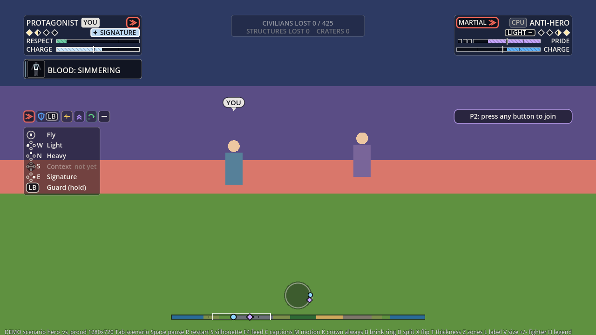 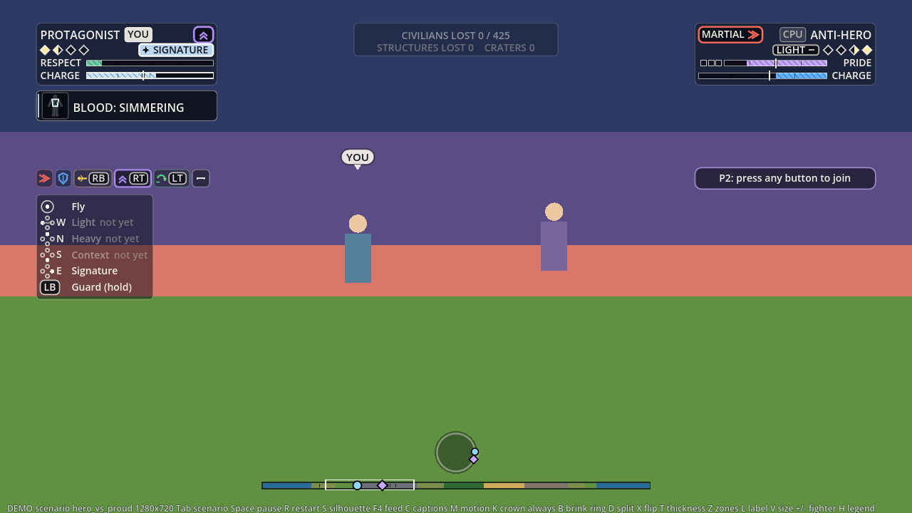 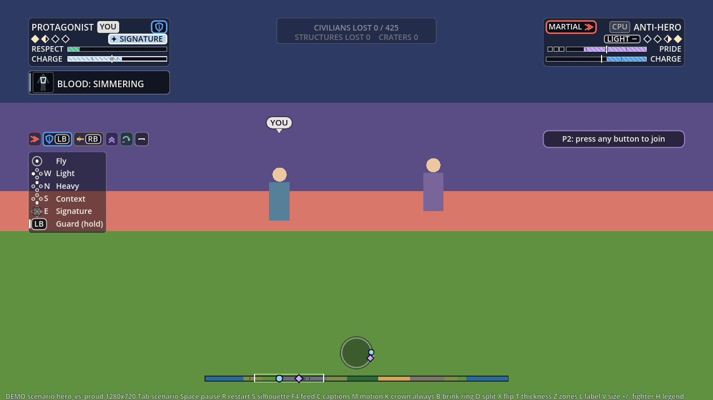 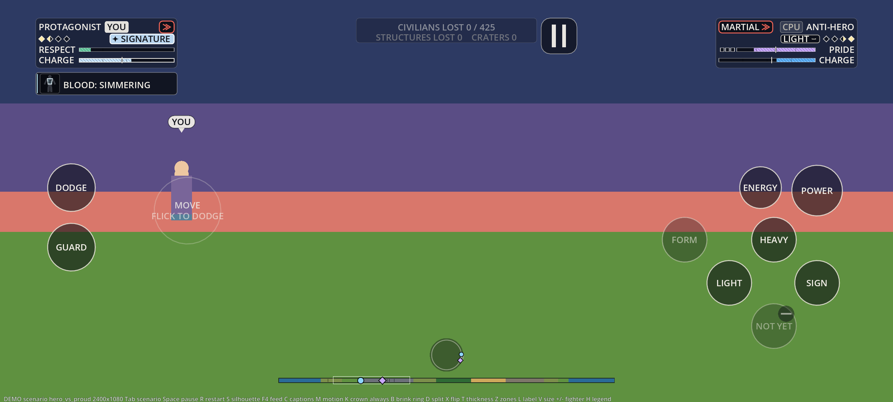 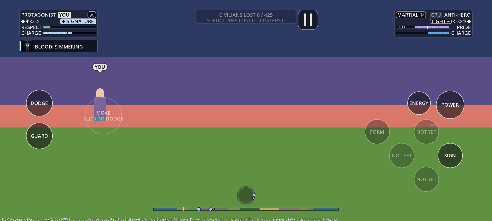

Controls traced two reports from a second player (`docs/controls/q19-input.md`): holding RT and pressing a face button, and the context button, did nothing, and the player was told nothing. The input is right; the moves do not exist yet. So the HUD says so.

- **The press marks.** The brawl's `press_ack` kinds reach the hub (they arrive as a cue named `press_ack` whose `text` is the kind and `source` the face button; the HUD's own `{type: press_ack, kind, cell}` form works too): **refused** (a signature that cannot start; button B), **energy** (a light spent by the energy family; X), **held** (a press kept for his line), **lapsed** (a kept press that timed out) and the new **empty** (a cell with no move in the current stance). Each puts a short grey mark on the pressed button's glyph in the legend (and on the button on Full touch): **a cross** for refused and energy, **a dash** for empty, **a dot** for held and **a ring** for lapsed (a shape, not only a colour), on a small dark disc so it reads over a glyph. It fades in half a second (Orb: cool answers, flash 4 of 10: subtle); **under reduced motion it is a static mark for the same half second**. The legend is held up for 1.3 s after a refused, energy or empty press (so the mark is seen after the first 12 s); a held press is the ordinary flow of a brawl and does not raise it. Off when the legend is off; Simple's touch buttons and portrait have no legend and show nothing (Simple's director picks the moves).
- **The contract for Encounter's `empty`:** `press_ack {actor, kind: "empty", cell: "x"|"y"|"a"|"b"}`; in the brawl's cue form, `cue(S, f, "press_ack", "empty", "<cell>")` (the cell in the cue's `source`). Without a cell the mark defaults to X (B for refused); **please give the cell for `held` and `lapsed` too** (today they say nothing of which button).
- **The greyed cells.** The Specials row (RT plus X, Y, A) and the legend rows of buttons with no move in the stance held now are greyed (45% alpha) and say "not yet" (`terms.json` `prompt.not_yet`); on Full touch the same buttons are greyed and read NOT YET in place of their word. Which cells do nothing today is data, `stances.json` `_works` per stance (a cell not listed works; once a stance is `_live` every cell does), checked against what the sim does (`docs/controls/q19-input.md` section 1): the **martial A** (nothing reads it with nothing held), the **charging stance's X, Y and A** (the sim never reads `special`) and the **manoeuvre A** are greyed; **RT plus B is the plain signature, so Signature is not greyed under RT; A with guard held is the deflect and A in the energy stance a mine, so Context is not greyed in the defensive or energy stance**; X and Y work in every stance. The Specials row is greyed while it is shown (until the charging stance is live, when its cells name the specials and it goes).
- **Tests (`_press_mark_rules`):** the truth table of the cells by stance; the legend's dim rows per stance on Arena, the solo keyboard and the shared keyboard, with the words, and none on Simple; the charging stance flipped live (no greyed row, no Specials row); each ack kind from both forms, with the default cells; unknown kinds ignored; the fade, the static mark under reduced motion and the legend's rise (and its absence for held and with the legend off); the mark on the right row of the plan and the layer redrawing as it fades; on Full touch the greyed buttons by stance, the mark and its redraw key, and NOT YET in place of the word. Demo: `--ack=KIND[:CELL]` with `--mask=N` and, on a pad, `--device=xbox`.

### Rumble: the per-player setting (planned, nothing built)

Orb picked rumble on **every landed blow, closes, launches and landings, buildings breaking and beam struggles, not on the beat** (`docs/controls/q19-input.md` section 6). Rumble is output: it never reaches the sim, the replay or the hash, so the setting lives in UI's options and the host reads it. The plan:

- **Options (per player, beside `energy_style` and its `_p2`):** `rumble` with **off, light, full**, and `rumble_strength` with **low, medium, high** (the motors' scale 0.5, 0.75, 1.0); `rumble_p2` and `rumble_strength_p2` for player two. **Light** is the thumps you take and the landings at half strength (the blows you land and the rest stay quiet); **full** is all four of Orb's picks at the chosen strength. Words (labels, helps, the choices) in `options.json`.
- **Defaults:** **off on the web build** (browser vibration is patchy: Chromium only, and a touch screen only on a handheld), **full on a native pad and on a phone**. The option file's `default` is one value, so this needs a platform default beside it: either `default_web` in `options.json` (Tools' schema first) or the host passing the platform to `UiData` (my preference: one data key, `default_web`, and the HUD reads it where the options load). A player's own choice always wins.
- **Settings screen:** the rows appear only for a player whose device can rumble (`hub.rumble_target(slot).kind` is `pad` or `touch`; a keyboard has none and the rows are hidden, so there is never a setting that does nothing), grouped under Controls as "Rumble" and "Rumble strength". Changing a row sends a short test pulse (the host's call, through a signal `rumble_test(slot)`), so the player feels the new strength at once.
- **What the host does:** reads the player's `rumble` and `rumble_strength` from `hud.opts` (a new accessor `UiHud.rumble_for(slot) -> {mode, strength}`), asks `hub.rumble_target(slot)` each time it pulses (a pad can join or be lost), maps the sim's events to pulses (Controls' section 6 table: a tick for the attacker, a thump for the defender, a strong pulse for closes, launches and landings, medium for buildings, a continuous rumble for a beam struggle) and merges pulses nearer than 4 ticks. "Cannot rumble" is off with no error.
- **Cost:** S. `options.json` rows and words (Tools' schema for `default_web` first), the accessor and signal, the Settings rows with their hide rule, tests (options default and clamp per platform, the rows' presence by device, the accessor, the test pulse), docs. Build it when Controls' `hub.rumble_target` has landed.


## 48. Plan, nothing built: three strengths on three buttons (2026-10-06)

Source: `docs/design/brawl-second-pass.md` sections 2 to 12 (972e598). Orb moved the martial face buttons to **X light, Y medium, B heavy**; **one press is one attack**; the signature moves to **RT + B** (a hold: art at 24 ticks, signature at 48, ultimate 45 more); a tapped A is a shove, a mashed A a clinch, a held A a tackle. The live build still has B as the signature until Encounter's slice C2a, so **nothing here is built, and `stances.json` words and `_works` stay as they are** until the EP briefs C2a. Two things already built carry over unchanged: the grey press mark (section 47: `empty` and `refused` still mark the pressed button) and the 3-tick pair read is Controls' and Encounter's, not the HUD's.

**One switch, so C2a flips a boolean.** Build the whole change behind a flag, `features.json` `three_strengths` (default false), exactly like the `_live` flags: with it off the HUD describes the build as it is today. Every word that changes is chosen by the flag, so nothing a player reads is wrong at any commit. The words below are data (Narrative edits them), listed in section "Words".

### What changes, by surface

| Surface | Today | With three strengths | Size |
| :--- | :--- | :--- | :--- |
| **Legend** (desktop and pad) | Light, Heavy, Context, Signature, then the stance rows and Specials | Martial: **Light** (X), **Medium** (Y), **Heavy** (B) and A's three readings (**Shove**, tap; **Clinch**, mash; **Tackle**, hold). The Signature row becomes the chord **RT + B (hold)**. The stance cells come from `stances.json` (martial `_live`) as built; the greyed "not yet" cells follow `_works`, which Encounter's slice rewrites (A's three readings arrive in C2b and C4) | S |
| **Full touch** | LIGHT, HEAVY, SIGN, CONTEXT | LIGHT, **MEDIUM**, **HEAVY**, CONTEXT; the signature is POWER held with HEAVY (the same RT + B chord), shown on the POWER button's armed state as today | S |
| **Remap and Settings** | Action rows "Light, Heavy, Signature, Context" | Row words by the flag: "Light (X)", "Medium (Y)", "Heavy (B)", "Context (A): shove, clinch, tackle"; the signature appears as the stance table's RT + B | S (data) |
| **How to play** | Controls page "Signature (45 Charge)"; stances page table | The controls page reads the three strengths and A's three readings and says "Hold RT and B for your signature"; the stances table's charging B is "Signature (hold)" and martial B "Heavy" (cells, data) | S (data) |
| **The plate** | The SIGNATURE chip and the weight mark (light or heavy) | The chip stays (the signature still exists, funded and held on RT + B); the **weight mark gains a third value**: light, medium, heavy | S |
| **Prompts** | Weight chip on the stance row | Same, three values | S (with the plate) |

### The wind-up and charge cue on Y and B

A tap on Y or B starts a wind-up on the press (12 and 28 ticks); a hold keeps winding and charges (Y full at 24, B at 44); B's wind-up is armoured. The player has to see **what the press is doing**, since a heavy that "does nothing" for half a second reads as a fault.

- **What the HUD needs from the sim** (a new event, for Encounter): `windup {actor, cell: "y"|"b", kind: "start"|"full"|"end", dur, result}` where `dur` is the wind-up in ticks, `full` fires at the charge's full flash, and `end` says `landed`, `released`, `lost` (a medium or a shove ended it), `whiff` or `fired`. A cue is cheaper than the HUD reading `heavyHeld` and guessing, and it carries the armour. The hub keeps `m.charge_cell`, `m.charge_t`, `m.charge_dur`, `m.charge_full` and `m.charge_armoured`.
- **The cue:** a **ring that fills round the pressed button's glyph** in the legend (and round the button on Full touch) over the wind-up, then holds, and **flashes once at full** (the flash Animation draws on the body is the main cue; the ring is the readable twin). B's ring is **double-banded** (an outer thin ring) for the armour: a shape, not a colour. The legend is held up for the duration (like the press mark), so it is there when the player looks. Quick and quiet: Orb's rule of cool answers, a flash of 4 of 10.
- **A second, optional cue on the fighter:** a small charge arc by the crown (the beat ring's cousin), option `charge_ring`, **off by default**, for players who watch the fighter and not the legend. Same data.
- **Under reduced motion** the ring is steps (quarters) and the flash a steady full ring; nothing animates but the quarters.
- **A failed or lost charge** shows the existing grey mark (`lapsed` ring, or `refused`) on that button; a **whiff** shows the ring emptying and a dash.
- **Size:** M (event contract, model fields, legend ring, Full touch ring, reduced motion, the optional crown arc, tests, stills).

### Simple: one button by hold length

Simple's single Attack button is a light under 12 ticks, a medium from 12 and a heavy from 28 (the longer the hold, the heavier the blow; one blow to a press). Today its ring fills over 12 ticks ("becomes a heavy"). The plan:

- **The ring has two bands with a notch at each threshold** (12 and 28 ticks), filled as the finger stays down; the notch it has passed is lit. A shape cue (notches) and no colour reliance.
- **The host gives ticks, not a fraction:** `touch_state.attack.hold_ticks` (Controls; today `hold` is 0 to 1 over 12). The HUD keeps the old key working until it arrives.
- **The legend row** for Simple pad reads "Attack (hold: stronger)" in place of "Light (hold: heavy)"; Simple has no pair, signature or charge chord, the director picks those (section 47 and `brawl-second-pass.md` 2, 6).
- **Size:** S.

### The two settings (from Controls)

- **Latched charge:** a tap starts the wind-up and the next press lets it go (for players who cannot hold). **Charges off:** every press is a tap.
- **In Settings** as two switches under Controls, per player (`latched_charge`, `latched_charge_p2`, `charges_off`, `charges_off_p2`), off by default, shown for any device; words in `options.json` ("Latched charge: tap to start a charge, tap again to let it go" and "Charges off: every press is a tap"); the HUD hands them to the host through the existing options accessor and Controls' setters. **The cue adapts:** with latched charge the ring shows "held" until the release press, with a dot-and-ring mark when it is waiting; with charges off the ring never shows a charge and the legend drops the "(hold)" words.
- **Size:** S (rows, words, the cue adapting, tests).

### Words (data; for Narrative to edit)

Light, Medium, Heavy; Shove, Clinch, Tackle; "Signature (hold)"; Simple's "Attack (hold: stronger)"; the remap rows above; the two setting labels and helps; the controls page lines. All keyed so the old words remain for the flag off.

### Build order and risks

1. **With C2a** (the taps and the flurries): the flag, the legend, Full touch words, Remap and How to play words, the plate's third weight value (S, data and a little code). Flip `three_strengths` and `martial._live` with Encounter's slice.
2. **With C2a or C2b:** the wind-up cue (M) when Encounter emits `windup`; Simple's two-band ring (S) when Controls gives `hold_ticks`.
3. **With C2b:** the two settings (S) when Controls' setters exist; A's three readings in the legend and `_works`.
4. **With C5:** the signature's hold ladder cue on RT + B (the two flashes at 24 and 48 ticks), the same ring on the B glyph under RT. UI: the two flashes, as the page lists.
- **Risk:** the action ids stay `light`, `heavy`, `context`, `signature` (the sim, Controls and the remap data use them), so a row whose id says `signature` is the heavy in martial and the signature under RT. All words are by the flag and the stance, never by the id. Tests assert it.
- **Risk:** the live-build hold: until C2a the live build's B is the signature, so a flag flipped early lies. The flag is Encounter's slice's to flip.
- **Open question for the EP:** is the optional crown arc wanted at all (it adds a layer the beat ring already has the shape of)? I recommend building the legend and touch rings first and judging after a playtest.

**Part C, after the rename window (2026-10-06):** the roster ids are PROTAGONIST and RIVAL, so the old spellings accepted in part A are gone: the `kai` and `vorr` rows of `fighter_names.json` and of the readout aliases (the stand-ins keep `stand_in_protagonist` and `rival`; `STAND_IN_PROFILES` stays until the real Protagonist replaces the stand-in), the comments in `ui_hud.gd`, `ui_data.gd` and `ui_event_hub.gd`, and the mock's and `hud_check`'s literals (the check's guards that no drawn text says KAI or VORR stay). Display names still come from `fighter_names.json`.


## 49. The flashing-effects notice, and what Reduced motion does today (2026-10-06)

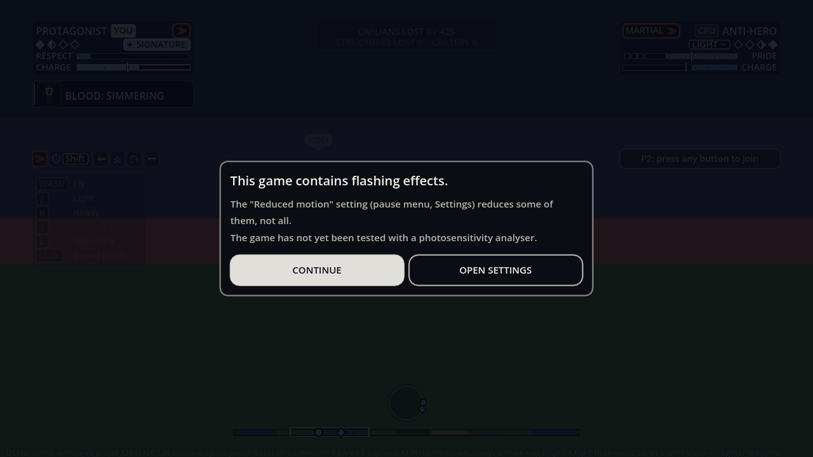 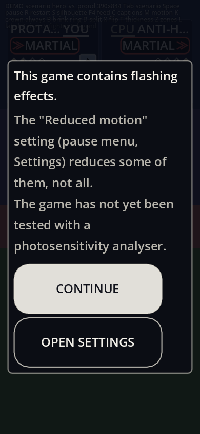

Legal's `docs/legal/photosensitivity-note.md` asks a public web build for a plain notice at first start and a reduced-flash setting. The web build is public, so the notice ships ahead of the combat work.

- **The notice** (`UiNotice`, drawn by the HUD over everything): "This game contains flashing effects." / "The \"Reduced motion\" setting (pause menu, Settings) reduces some of them, not all." / "The game has not yet been tested with a photosensitivity analyser." (`terms.json` `prompt.photo_*`; a `hud_check` case compares it with the sentence in README.md, word for word, and that it claims no more: not "safe", not "tested", not flash-free). Two buttons: **CONTINUE**, and **OPEN SETTINGS**, which opens Settings with the Reduced motion row focused (or moves the focus there if Settings is already open). Keyboard (Enter and Space choose, Left and Right or Tab move, Esc continues), pad (A chooses, the d-pad moves, B and Start continue) and touch (a tap chooses; a tap outside does nothing) all work, and it is a card of two 48 dp buttons at every size (it stacks them on a phone).
- **When it shows.** `UiHud.setup()` (the host's start of the match) opens it **once per session** (a page load or a process), so it comes **before the demo plays**: the fight is held through the same overlay signals the How to play card uses (`howto_opened` and `howto_closed`, once each, so the host's hold and release need no change), the first frame is dimmed under it, and a first-run How to play card asked for in the same moment waits and opens when the notice is dismissed. Keys never skip past it: the first key chooses a button (Enter on CONTINUE), after which the demo plays and a key hands P1 to a human as it always did. It never opens in a headless run (a test or a QA batch), a bench, a frame-limited run, a scripted shot or with `nonotice` in the command line or the page's query, and the HUD demo shows it only with `--notice`.
- **Again on request:** a **Flashing effects notice** row in Settings (Accessibility, right after Reduced motion; Enter or a tap shows it over Settings and gives Settings back). The About pages have no button items, and the sentence did not fit as one more paragraph at 1560 by 720 and density 2 (the Licence and privacy page is already at its limit), so the row is in Settings, where Reduced motion is. The pause menu's Settings entry reaches it.
- **Reduced motion respected by the notice itself:** nothing in it moves (a test counts its redraws over 12 frames), so it is identical with the option on or off.
- **Tests (`_notice_rules`):** the words against README.md and the no-overclaim rule; fit and 48 dp targets at 16 sizes, touch off and on; the flow (opens once and holds the fight once, nothing opens over it, How to play waits for it, Enter, Right, Left and Tab, Esc, the pad's A, B and d-pad, a tap and a tap outside, OPEN SETTINGS landing on the Reduced motion row); the headless, bench, frames, shot and nonotice skips and the once-per-session rule; the Settings row, over Settings without a second hold, and OPEN SETTINGS from there.

### What Reduced motion removes today, and what it does not

Honest list, for Legal and the store page (the notice says "some of them, not all", and this is the some):
- **UI (mine), all under Reduced motion:** every pulse and flicker in the HUD becomes a steady shape: the stance badge's pulse, the brink mark, the form-ready chip and button pulse, the armed-stance ring, the beat ring's closing ring, the press marks (a static mark), the crown ring's flash on a worsened body part (steady, not a flash), the toll and card animations, the split view's swing (a quick fade).
- **Camera:** shake is capped at a quarter.
- **VFX:** the energy stance's full-screen flashes (the full flash of a blast) are removed.
- **Not covered:** explosions, the signature's and the transformation's flashes, hit rings, beam clashes and the building collapse are **not yet under one register**, so Reduced motion does not reduce them; there is no cap across effects, and nothing measures them against the WCAG 2.3.1 thresholds.

### A separate "Reduce flashing" setting: recommended (planned, not built)

Reduced motion is a vestibular setting (steady camera, no swing, no shimmer); photosensitivity is about **luminance flashes**, and the two needs differ: a player who wants a steady camera may want the full spectacle, and a photosensitive player needs the flashes reduced regardless of motion. Legal's table asks for "a reduced-flash setting (it exists for reduced motion)"; folding the two together would also make the notice's sentence true only if every effect honours Reduced motion, which they do not. So:
- **A `reduce_flashing` option** (Accessibility, beside Reduced motion; per player is not needed, it is the screen's), with its own row and help; the notice's second line then names it ("The \"Reduce flashing\" setting ... reduces them") once it exists (Legal to approve the words). **Default:** I recommend **on for the public web build until an analyser report exists**, off otherwise; Orb and Legal decide.
- **What VFX must expose** (`render/vfx`): a single **flash registry** that every effect asks before it draws a full flash: `VfxFlash.request(kind, strength, area) -> allowed_strength`, with one rolling counter across **all** effects (energy, explosions, signatures, transformations, hit rings, beam clashes, collapse), a **cap** (at most 3 full flashes in any second, and under `reduce_flashing` at most 1 a second), a **luminance ceiling** (under `reduce_flashing` no single change above 10% of the maximum, the WCAG general-flash threshold) and an **area ceiling** (no flash covering more than about 25% of the screen); and a **read-only per-frame luminance-delta feed** (`VfxFlash.frame_stats()`) so Tools' WCAG 2.3.1 check can run on the recordings. The option reaches them as `RenderOptions.reduce_flashing`.
- **What UI does with it:** the HUD's own flashes are already steady under Reduced motion; under `reduce_flashing` they would follow the same steady path, so one HUD rule covers both options. The setting is a row and a word change; the work is VFX's and Tools'.
- **Size:** S for UI (the row, the words, the notice line, tests); VFX's registry is the real work (M); Tools' recording check is separate.


## 50. Built behind the flags: the three-strength HUD, and Reduce flashing (2026-10-06)

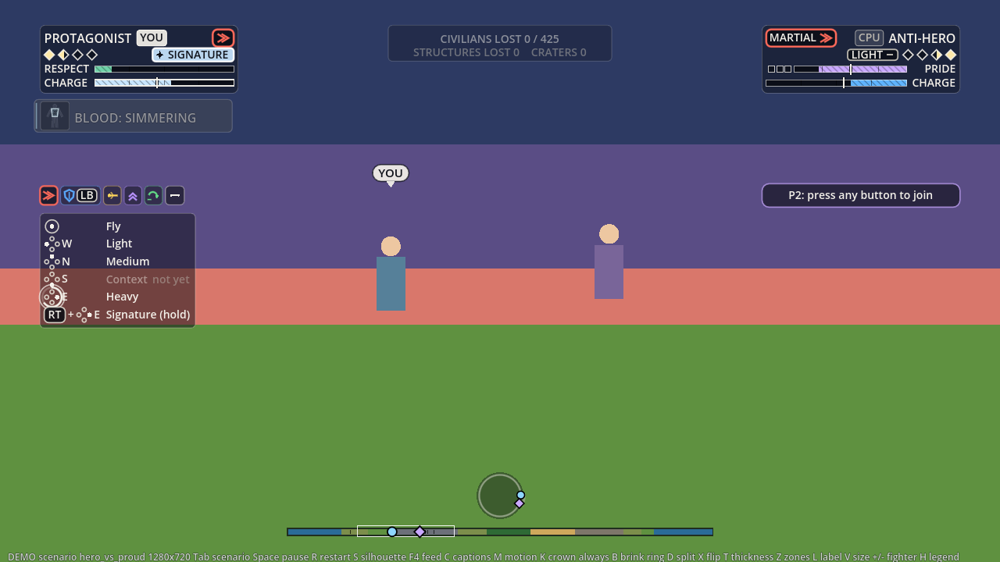 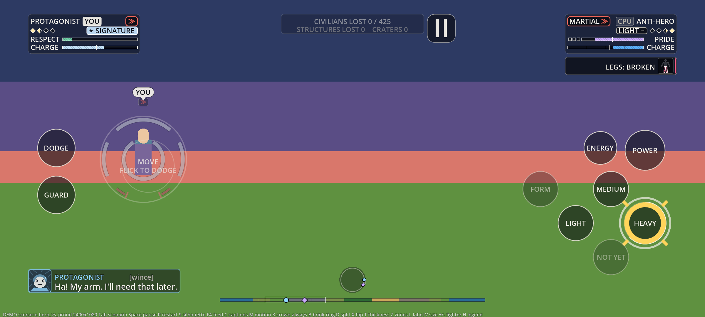 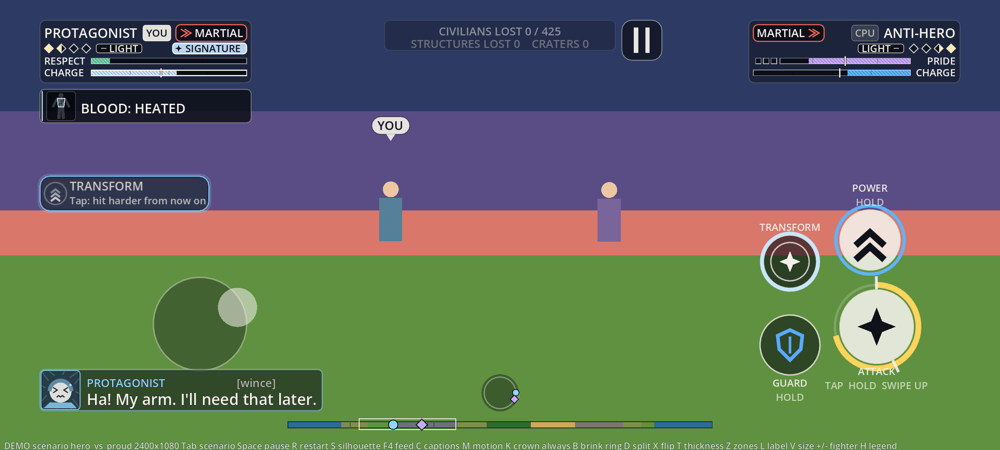

Section 48's plan, built **behind `features.json` `three_strengths`** (default false), plus Reduce flashing behind `reduce_flashing` (default false). With both off the HUD is exactly what it was; nothing flips live until C2a. Encounter's cue names are the ones used.

**Cues from Encounter** (all arrive as a `cue` event: `kind` the name, `text`, `source`, `dur`, `k`, `n`, as the brawl's `press_ack` does):
- **`windup`:** `text` start (`source` the face button, `dur` the length, `n` the landing tick) and end (`k`: 1 thrown, 2 stopped by a blow, 3 lost, 4 a miss). The HUD fills a **ring round the pressed button's glyph** in the legend (and round the button on Full touch) over the wind-up; **B's ring has a second, thin outer ring** (the armour: a shape, not a colour); a quarter at a time under reduced motion. A stopped, lost or missed wind-up leaves the grey mark on that button (a cross, a ring, a dash). A wind-up whose end never comes clears itself. The legend rises while a wind-up runs. **`dur` is read as ticks when over 3 and as seconds otherwise** (a medium is 12 ticks, a heavy 28; with none, those lengths): Encounter to confirm the unit. `full` (the charge's flash) arrives with C2b; the ring will add it then.
- **`launcher_open` and `launcher_close`:** while open, **B's glyph is lit** (a bright ring with four short ticks) in the legend and on the Full touch heavy button, and the legend rises.
- **`press_ack`** kinds as built (section 47), plus `weight_medium`: the plate's weight mark has a third value, **MEDIUM**.

**With `three_strengths` on:**
- **The legend** (Arena, both keyboards): Light (X), **Medium** (Y), **Heavy** (B), Context greyed "not yet" (A: its three readings arrive in C2b), and a **chord row "Signature (hold)"** (the power button with B). Under the power button held: Light, Medium and Context are greyed and B reads **Signature (hold)**. The energy stance keeps its live words; the Specials row stays greyed. The action ids stay `light`, `heavy`, `context` and `signature`: every word goes by flag and stance, never by id.
- **Full touch:** LIGHT, **MEDIUM**, **HEAVY**, CONTEXT (greyed NOT YET while A has no move).
- **Simple:** pad legend "Attack (hold: stronger)" (and a Heavy row where Y is bound); **touch Simple's Attack ring** fills over the hold with a **notch at the medium threshold and at the heavy one** (the heavy's notch is left out when the heavy is a swipe up, `attack.swipe`), a thicker ring for a higher tier; the keys read from Controls' display_state (`hold_ticks`, `tier`, `medium_at`, `heavy_at`, `swipe`; the old `hold` fraction still works without them). Touch Simple has no Context button: nothing to draw until Game Design rules.
- **How to play and Remap:** the controls page says Medium and "Heavy (hold the power button with it for your signature, 45 Charge)"; Remap's rows read Medium and Heavy.
- **The burst:** the legend does **not** say to hold X for a burst: until the burst is built and stable in the sim it would not stay true. Add the words when C2a's burst lands.
- **The settings:** **Latched charge** and **Charges off**, per player (`latch_charge`, `charges_off`, and `_p2` while two people play), off by default, listed in Settings only while the flag is on; they are options the host reads (`option_changed`) and passes to Controls' `hub.set_latch_charge` and `set_charges_off` (the host's line). Rumble stays at the plan (section 47).

**Reduce flashing (flag `reduce_flashing`):** a **Reduce flashing** row in Settings right after Reduced motion, off by default (the web default is Orb's decision; I have not asked). The notice's second line names both: "The \"Reduce flashing\" and \"Reduced motion\" settings (pause menu, Settings) reduce some of them, not all." (**words for Legal to approve**; README's sentence stays as it is until then), and OPEN SETTINGS lands on the new row. The host passes the option to VFX (`host.vfx.reduced_flashing = opts.reduce_flashing`, the host's line; the HUD's own flashes are already steady under Reduced motion).

**The split divider's slam flash is UI's to draw and Camera's to supply:** Camera's split record carries `slam` (0 to 1), and UI draws the bar's brightening and widening. It was the one flash outside the register. Built: `UiHud.flash_fn(kind, strength, area) -> 0..1` (the host sets it from the register's request call), asked once as a slam begins with kind `divider_slam` and the flash scaled by the answer; **under Reduce flashing or Reduced motion the divider does not flash at all**; with no `flash_fn` it is as it was. Camera needs nothing.

**Tests (`_three_strength_rules`, `_reduce_flashing_rules`):** the flags off change nothing; the legend by stance on three layouts; Simple's words; Full touch's words; the controls page and Remap words; the weight mark; the wind-up cue (fill, quarters, each end kind, the length in ticks and seconds, the self-clear); the launcher; Full touch's ring, armour and lit button with their redraw keys; Simple's ring through a real draw pass; the charge settings per player and their absence with the flag off; Reduce flashing's row and place, the notice's line and the OPEN SETTINGS landing; the divider's slam asked once, scaled, and off under both options.
