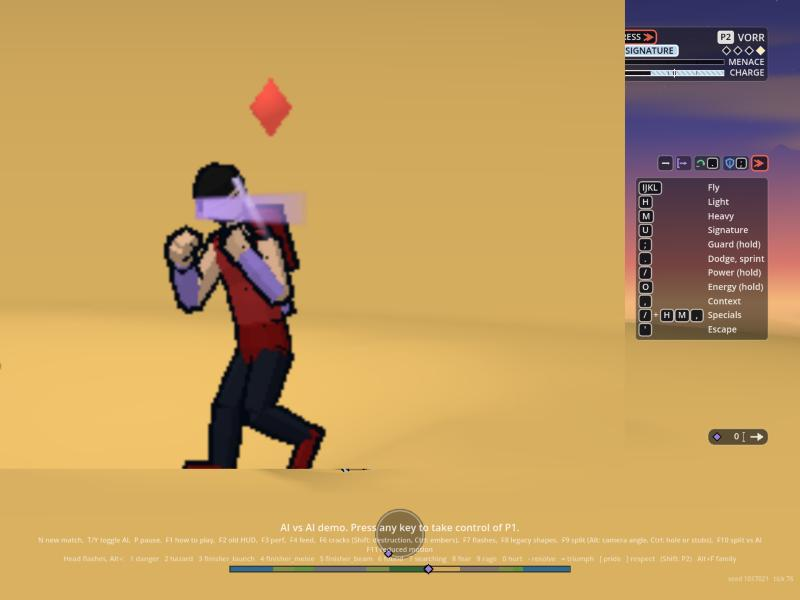
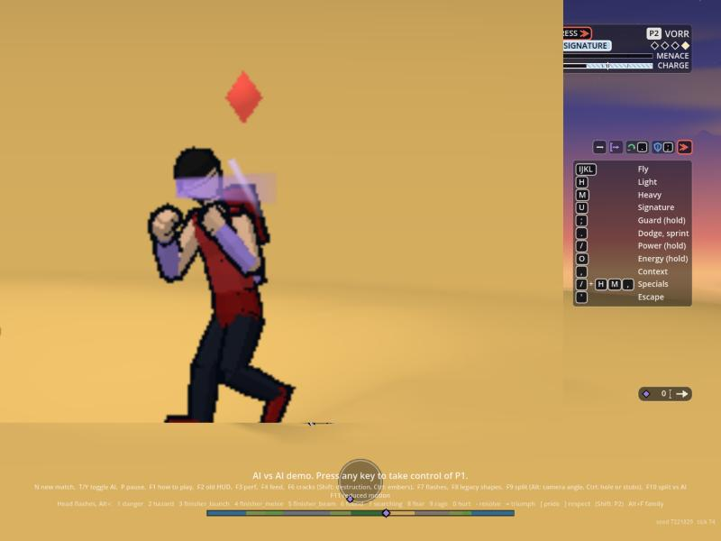

# The rival's glasses glare (2026-10-04)

Orb's answers: the rival's glasses are **frame C, the bare wedge**, and the glare **hides his eyes completely**. Rules: `docs/legal/glasses-rules.md` (RL-066). Code: `render/vfx/glare.gd` (state and envelope), drawn by `_glare()` in `render/vfx/shots_view.gd` (the shots view's one draw). Flag `hub.glare_enabled` (`VfxLook.GLARE_DEFAULT`, on). Presentation only: it reads cues and fighters, draws no random number, writes nothing in the sim. Art is regenerating the sheets with frame C; I worked from `art/concepts/refine/glasses-compare.svg`'s C and `glasses.mjs`'s colours.

## The look

| State | What is drawn |
| :-- | :-- |
| **Glare** (a key moment) | The lens goes opaque: one wedge, narrow toward where he looks, in Art's pale violet `#c0a0ee`, with a deeper violet `#a47ee8` rim so it stays a lens on a light sky, and one lighter violet `#d8c2f8` band cut across it on a slant. Hard-edged, no disc, no star, never white. |
| **Glint** (a signature's wind-up) | The same wedge half-opaque (45 %) with the slash sweeping across it once. The eyes are not hidden. |
| **Crack** (the seal break) | A glare with one dark violet crack across the lens. |

At 24 px the lens reads violet (the tests check each colour is violet, with saturation 0.2 or more, hue between 0.68 and 0.8, and a luma under 0.86; the lightest is `#d8c2f8`, luma 0.79, so in the 12 px greyscale band it is a light grey, not white). Timing: an attack of 3 ticks, a hold of 16 ticks (0.27 s; 8 for a glint), a release of 6 ticks; the hold is capped at 24 ticks (0.4 s) in code. Hit-stop and pause hold it.

Pictures (web build, a scratch staging hook sending the cue as the director would, head zoomed):   

## What triggers it today (events that exist; no beat is added for it)

| Trigger | Event | Look |
| :-- | :-- | :-- |
| His taunt | cue `taunt_start` (actor = the taunter) | glare |
| A signature's wind-up | `attack` with kind `sig` (the director accepted the request) | glint |

Both only for a wearer (`wearers`: fighter name or roster id `VORR`, `antihero` or `rival`: the Anti-hero replaces VORR, and the roster may rename him; today the slot named VORR) and not at all for the Protagonist.

## Rules kept in code

- **Key moments only, never every exchange.** A wearer's glares are at least 200 ticks (3.3 s) apart (the seal break ignores it).
- **Never at a transformation break.** None while he is in a transformation (the hub's `xform.forms` has his slot), so the break flash and a shouted form name never meet it.
- **Stacking.** None while he is in a crouch-and-scream charge (`state == "charging"`) or inside a rubble ring (the rocks' level above 0.25 for his slot). A glare is face-local and brief: in this tint, no mark; it sits beside at most one other.
- **No readout, bar or panel on the lens.** The lens is a flat wedge; the glint is a slash.

## Cues I need (none exists yet; the code accepts them now and nothing sends them)

For Simulation or Encounter, each a `cue` with the rival's slot as `actor`, all inside Legal's list of where the glare may fire:
1. `chin_plant`: On the Chin's plant (the entry beat). A full glare.
2. `pride_threshold`: his Pride crossed a threshold. A full glare. (`mood_band` is the match's mood, not his Pride, and so is not it.)
3. `seal_break`: the seal breaks. A full glare with the crack; it ignores the cooldown.
4. `glare` (optional): any other key moment Game Design names, for example the staredown glint.

## Needs from Rendering (optional)

The glare sits on an estimated head: the pose plus 68 units up, turned with the body's roll, looking the way the sim's `face` says. Close, but the 3D head leads and turns (`TURN_HEAD`), so the lens can sit a few units off the face. If the host offers `fighter_head(i, a) -> Vector3` (world x, y, z of the head's centre, as the head flashes' `head.global_position` already knows), `_head_of()` uses it with no change on my side. The lens's back end also fades onto the hair at gameplay size: when Art's frame C is on the head, the lens size (`w`, `h`, `fwd`, `up` in `VfxGlare.DEFAULTS`) wants one pass against the real face.

## Tested

`effects_check.gd` `_glare()`: on by default; the wearer is the rival's slot and not the Protagonist's; the three colours are violet; the Protagonist's taunt makes none; the rival's taunt starts a full glare; the envelope (attack in under 4 ticks, held 8 to 24 ticks, cleared in 30); it draws its rim, lens and band (3 quads) and nothing without a glare; a signature's wind-up makes a glint; the next two inside the cooldown are not made, and a taunt after it is; the three later cues; the seal break inside the cooldown with a crack; a frozen tick holds it; none in a transformation, a charge or a rubble ring; reduced motion has no ramp; flag off draws nothing; a hidden fighter shows none.

## Sized to Art's lens (2026-10-04)

The EP's note on the first stills: the band ran well past his face. The lens now follows Art's numbers from `art/concepts/refine/approved-rival-turnaround.svg` (each lens 6.2 wide and 3.0 high in head units, the head about 11 wide), scaled to the head's 16 units in the estimate: the wedge is 10 by 4.8 units (`w`, `h`), 4 units forward of the head's centre and 1 up (`fwd`, `up`), in `VfxGlare.DEFAULTS` (code, no JSON). It was 26 by 15. The slash and the rim scale with it. The pictures glare-*.jpg are the earlier, larger size and are due a re-shoot once the frame C head is in.
