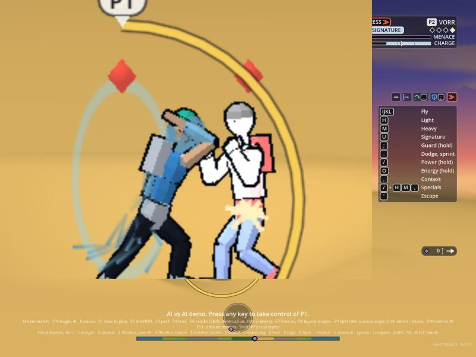
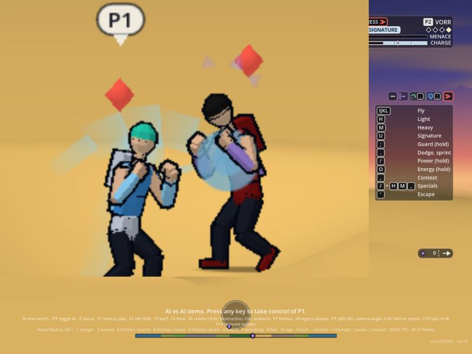
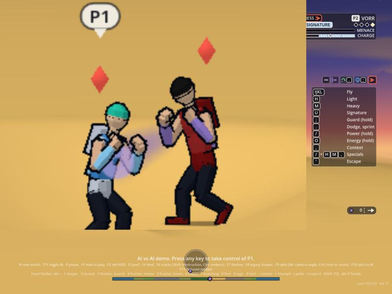
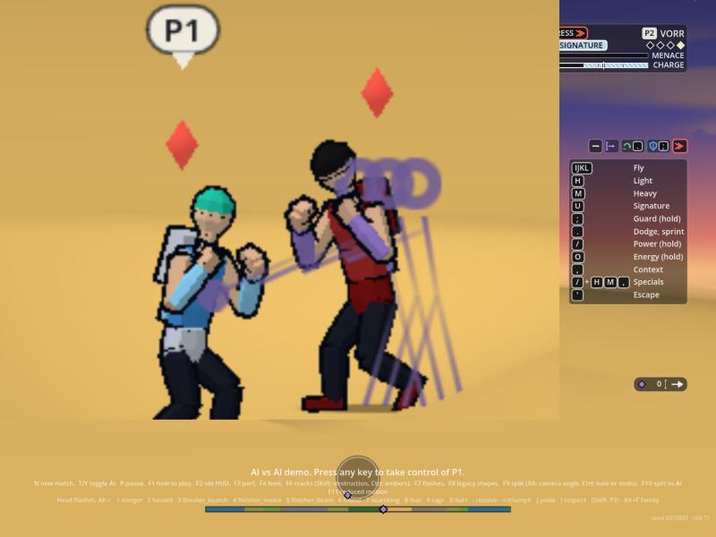
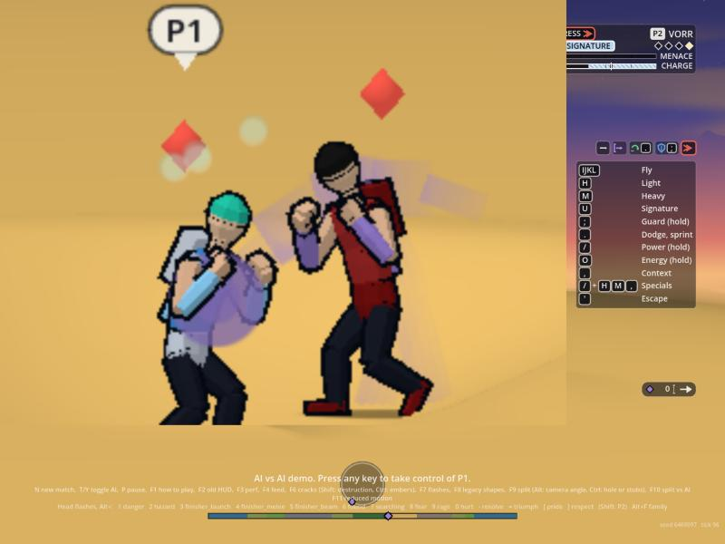
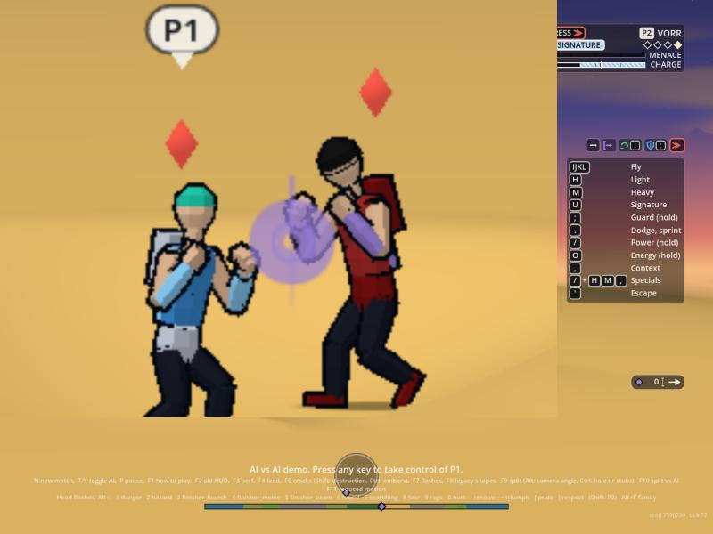
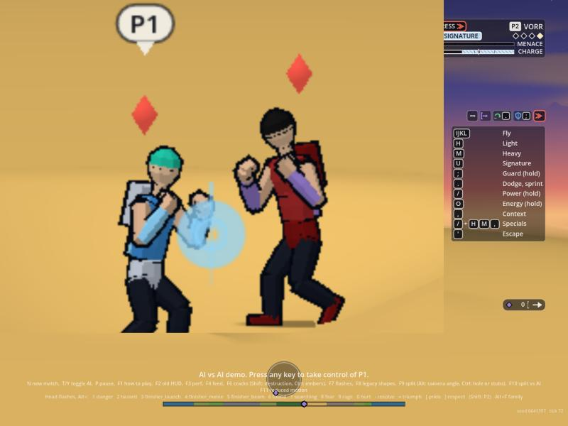
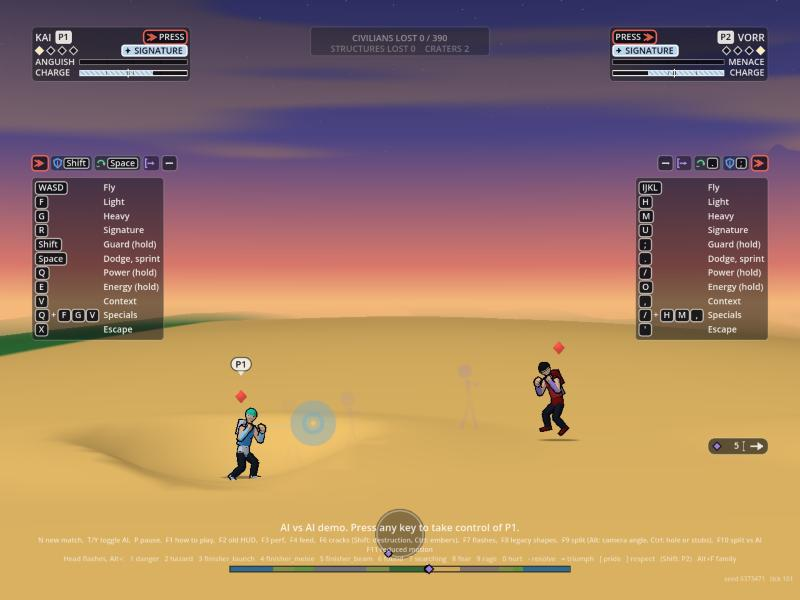

# The melee press styles on screen (2026-10-04)

Orb's approved reference is `docs/ep/prototypes/melee-trade-v2.html`; his words are in `docs/ep/vision.md` (the last two sections): timed blows land instant with an after-image, mashed blows are fast with a fluid blur, held blows are the most fluid with warping and smears; a blocker is never knocked back. This is a **first build**, behind a flag, driven by what exists today. Code: `render/vfx/press.gd` (state and triggers) and `_press()` with its helpers `_figure` and `_line` in `render/vfx/shots_view.gd` (the shots view's one draw); one new shader shape (5, a diamond) in `render/vfx/shaders/transform.gdshader`. Flag `hub.press_enabled` (`VfxLook.PRESS_DEFAULT`, **off**, matching Animation's `RenderAnim.press_styles`; `main.gd` sets one from the other and Shift+F7 flips both). Presentation only: it reads events and fighters, draws no random number, writes nothing in the sim. Numbers are in `VfxPress.DEFAULTS` (code, as the beam plays; an optional `data/vfx/press.json` is read if it exists, none is created so no schema is needed yet).

## The effect per style

| Style | What the prototype shows | What is drawn | Quads |
| :-- | :-- | :-- | :-- |
| **Speed** (mashed) | A soft, filled, overlapping blur along the fist's path; a small round contact ring | Five layered soft discs along the fist's path (guard to contact, the fist alternates height blow to blow), one wide soft streak under them, one small round ring at the contact. Fades in 8 ticks; the ring in 6. | 7 |
| **Tech** (timed) | Three sharp wireframe echoes of the body between the old pose and the strike, popping off one at a time from back to front; a thin straight speed line; a hard diamond contact mark | Three thin wire figures (head ring, torso, two legs, striking arm with the fist at 1/4, 2/4 and 3/4 of the way to the contact) behind the final body by up to 24 units; they pop off at 2.5, 5 and 7.5 ticks, back first. One thin straight line guard to contact (7 ticks) and a hard diamond (shape 5) at the contact (5 ticks). | 17 down to 1 |
| **Heavy** (held) | A shrinking charge ring on the wind-up; on the release a filled crescent smear and stacked body ghosts, and a double contact ring; the target stretching with ghosts as it flies when the heavy ends a string | Wind-up: one ring that shrinks 34 to 9 units around the fist and brightens (cue `tell_heavy`, 26 ticks at most). Release: four filled body ghosts stacked behind him (alpha rising toward the body), a five-segment filled crescent from the back-swing over the top to the contact, and two contact rings (two ticks after the blow). Fly (the sim's `knockback`): three filled ghosts along the target's last 12 ticks of path, for the knockback's duration (40 ticks at most). | 1 (wind-up), 27 (release), 15 (fly) |
| **Block** | A shield line and a block flash; never a knock-back | A thin vertical line in front of the defender (12 ticks, bright then dim) and two flash rings in his lane colour. Nothing here moves anyone. | 3 |

Contact is on the victim's front, at the height of the region hit (head, core or arms, legs). Colours are the attacker's lane colour (the block's the defender's), darkened a little so they read against sand and sky; none is white, gold or red.

## Cost against the budget

Quads only, in the shots view's one draw (cap 380; the busiest test tick before this work was 41). One blow: 1 to 27 quads. The busiest test tick, both fighters landing a heavy and a timed blow with both wind-ups showing and a fly: 84 of 380. Debris pool: none. Not measured: the web build under load and an old laptop (the stills were taken in the web build). `effects_check.gd` `_press()` asserts each count above.

## Animation's hand-off is in (2026-10-04, docs/animation/press-styles.md section 6)

With `RenderAnim.press_styles` on, `press.gd` reads `AnimFighter` (read only, `VfxPress.anim_of`) instead of estimating:

- **Style:** `press.style` of the blow that is playing (after the beat's own `style`, before the press-log read), so the picture and the body agree. A heavy and a guard are still read from the damage kind.
- **Previous pose:** `press_pose(k)`, taken at the blow: the oldest pose within 0.1 s (tech) or 0.4 s (heavy) and the newest, each put through the rig's forward kinematics (`AnimPose.fk`) into 16 joints. The echoes and ghosts are those two poses blended (a quarter, a half, three quarters), drawn as a real body (head ring, spine, both arms, both legs), anchored where he stood back then (the position history). Count: `press.ghosts` (3, 2, 3).
- **Limb path:** `press_path` (the striking tip, model space, x turned by the sign of `vface`): the speed blur's discs and streaks run along it, the tech speed line starts at its start, the heavy crescent is its arc (three or more points), and the contact is where the tip ends.
- **Wind-up:** `press.phase == "load"` with `ticks_to_contact` drives the heavy's shrinking ring (the cue's timer remains as the fallback).
- Without it (flag off, no blow playing) the estimates below still draw, so nothing disappears.

Quads with the real data: a tech blow draws up to 3 whole bodies of 12 quads (36), a line and a diamond: about 38; a heavy's release draws 3 ghost bodies (36) a crescent along the path (up to 11) and two rings: about 50. Both fighters at once stay under 110 of 380.

## What drives it (and what is still estimated)

- **The blow:** the sim's `damage` event (attacker, victim, region, kind light, heavy or guard). A beam's, impact's or landing's damage is ignored.
- **The style of a light blow:** the beat's own `style` field when the director sends one (accepted now: speed, tech, heavy, or the press log's words mash, timed or rhythm, held or hold); else the attacker's press log, **read only** (`DirAlchemy.read`, never its resizing: it is skipped if the log is not sized yet): rhythm is tech, hold is heavy, mash, taps and none are speed. A `heavy` blow is heavy; a `guard` is a block.
- **The wind-up:** the cue `tell_heavy`.
- **The ender:** the sim's `knockback` (it is sent when an exchange ends in a knockback; a blocker never gets one).
- **The old pose and the limb path:** Animation's, when its flag is on (above); otherwise estimates: the fighter's position some ticks ago, at least 24 units back, and a straight guard-to-contact fist path.

## What I still need

**From the director (Encounter):** the style on each strike beat as a `style` field on the `damage` event (or the beat's cue), so Animation's and my read never disagree (the words mash, timed, held work too); a `hand` (0 or 1) for a mash's alternating fists and `ender: true` on a heavy that ends a string (today the flight is read from `knockback`). Animation's own list of beat fields is its docs/animation/press-styles.md section 4.

**From Animation (optional):** squash and stretch on the flying target of a heavy ender (the prototype's stretch cannot be a draw layer); a block's phase on the defender if they want the shield drawn from the body.

## Reduced motion

The same looks in their short forms, with nothing that strobes: speed has no disc layers (one soft streak and its ring, half the length); tech shows only the last echo, the line and the diamond (0.6 of the length); heavy has no body ghosts and a three-segment crescent, and a target's flight shows no ghosts; the wind-up ring and the block's flash are as they are (one steady shrink; a single flash). `effects_check.gd` checks the reduced counts.

## Pictures

Web build with Animation's press styles on (re-shot 2026-10-04 after the hand-off): a scratch staging hook makes the director's own request (`DirExchange.requestAttack`) so the strikes are the real animation, and the page is stopped two ticks after the blow. The tech case reads every light blow as timed through Animation's own data table. Zoomed on the pair; both fighters land each blow in turn (the Protagonist's slot, the rival's slot). The yellow arcs and red diamonds are the game's own UI.

| Speed (mash) | Tech (timed) | Heavy (held) |
| :---: | :---: | :---: |
|  |  |  |
|  |  |  |

Block and a heavy ender's target flying with ghosts (these two are from the earlier staging with sent events, a block and a knockback have no body data to read; the web stills were not re-shot):

  

## Known weak spots

- The new stills show real poses. The tech wire echoes and the heavy ghosts are still faint at the web build's gameplay zoom, and the heavy's crescent can be read as the body's own smear; Orb's eye decides how bold they should be (the alphas are `VfxPress` and `_press`).
- A block and a fly are not tied to a body phase yet.
- The fly's ghosts are the weakest read: flat filled figures at the target's earlier positions; the prototype's stretch (the body itself elongating) is not possible from a draw layer and wants Animation's squash and stretch on the target.
- Rendering's own contact sparks and rings still fire on a hit; this adds to them. Whether it should replace them is the EP's and Orb's call.

## Legal's motion rules applied to the press styles (2026-10-05, docs/legal/zip-screen.md)

The heavy's filled ghosts take the zip ghosts' conditions (m05, m06): one lane-colour tint, 0.35 opacity at most and fainter the older (0.35 times k over n), at most 5, gone in 8 ticks (`ghost_life` is 8). The heavy's wind-up ring (m07) shows only in the last 10 ticks of the wind, thin (2.2 units), hollow and shrinking. The ps-heavy-*.jpg stills above are from before this change (their ghosts were up to 0.5 opaque and the ring showed the whole wind-up); they are not re-shot.
