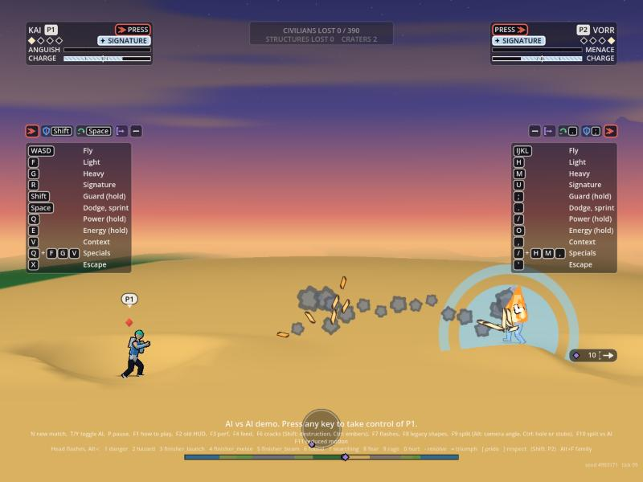

# Energy blasts on screen

Owner: VFX Director. 2026-10-03. Encounter's slice 5 fires shots (`S.shots`, Simulation's `docs/architecture/shots.md`) and nothing in render drew them. This draws them. Presentation only: it reads `S.shots`, the four shot events, the cues and the fighters, and writes nothing, no `S.rng`; the gameplay hash is unchanged (`hash_check.gd`). Code: `render/vfx/shots.gd` (`VfxShots`, `hub.shots`: the state behind the events) and `render/vfx/shots_view.gd` (`VfxShotsView`: the drawing). Flag: `VfxHub.shots_enabled`, default **on** (`VfxLook.SHOTS_DEFAULT`). Numbers: `DEFAULTS` in `shots.gd` (an optional `data/vfx/shots.json` can override them; none yet, so no schema is owed).

## What is drawn

| Thing | How |
| :--- | :--- |
| **Every live shot, each frame, from `S.shots`** | Interpolated: the state is the end of the last tick, so a frame between ticks is drawn a fraction of a tick back along the shot's velocity (none for a shot fired this tick, and none through a hit-stop or a pause, when shots stand still). In its owner's lane colour (`VfxAura.lane_color`: never white, gold or red), so a deflected shot, which the sim hands to the other fighter, changes colour as it turns back |
| **A bolt** | A small cel disc (a darker rim, the lane colour, a lighter core) with a short tapering tail |
| **A charged shot** | Bigger by its power and by its charge (a tap, 44 damage, is smaller than a full 66), with a longer tail and a thin halo ring |
| **A seeking shot** | On a slight arc, zero at both ends (a tenth of a fighter height, more for a longer flight): it leaves and arrives on its true line. Game Design's "may be drawn on a slight arc" |
| **The charge on the hand** (`blast_charge` to `blast_full`) | Each fighter's own look at the forearm of the arm toward the rival, in the lane colour: **plates stacking along the forearm for the Anti-hero** (a villain), **thin rings stacking along it for the others**; one more each fifth of the charge; a pulse ring along the forearm at `blast_full`; gone when the shot leaves, or on `blast_cancel` or `charge_stopped`. Never a sphere growing in a palm, hands at a hip or a two-hand push (Legal), checked: no disc among its quads |
| **A hit** (`shot_hit`) | By outcome: `hit` a flash and a ring; `guard` a splash fanning back toward the shooter; `deflect` a bigger ring in the deflector's colour, and the shot itself is seen turning back; `shrug` and `stop` a smaller flash; `dodge` nothing at him (the shot flies on) |
| **A trade** (`shot_clash`) | A ring in each fighter's colour and a burst of eight short lines |
| **A miss** (`shot_end`) | On the ground: dust and a few chunks off the point (World's crater comes by its own `crater` event, and gets the blast amplification as before); on the water: the water plunge; at the end of its life: a small fading ring |

## Legal

The first energy slice's rule for the charge look (`docs/legal/agency-pass-screen.md` section 3) is kept as above. No white, gold or red (the core is the lane colour lightened a little and checked to stay coloured); no sky change; no lightning or flame. The stacking rule: a shot is not one of the seven marks; the charge on the hand is a thin ring or plate stack, not the crouch, scream or flame aura; the ground puff at a miss is mark 4's one-off (rubble and ground), never a held state.

## Budget

At most 32 live shots (the sim's cap), 4 quads a bolt and 5 a charged shot, so 160 at most, plus up to 14 for the hit and trade effects and 16 for the two charges: **one MultiMesh, one draw call, 224 quads reserved** (the transformation's shader). In the debris pool only for a miss on the ground (no draw call). Not measured: the web build and an old laptop (the hash check's matches fire 60 shots and draw 3 at once at most).

## Where it hangs

The view is a child of `VfxTrailView` (`trail_view.gd`), which the layer already updates every frame, and updated at the start of its `update`; `VfxLayer` is untouched. If you would rather it were the layer's own child, that is a two-line move.

## Checks

`effects_check.gd` `_shots()` (34 cases): a shot in `S.shots` is drawn and none once it is gone; 32 shots in one draw; the interpolation (60, 30 and 0 units back), a shot fired this tick and a hit-stop held in place; the arc's ends; size by kind, power and charge; each shot in its owner's colour, never white, gold or red; each outcome's effect; a trade drawn and gone after its life; a miss on the ground throws dust; the charge starts, builds to full in 30 ticks, pulses, ends when the shot leaves, on cancel and on stop; the Anti-hero's plates and the others' rings; no sphere; flag off; data fallback. `hash_check.gd`: 60 shots fired and up to 3 drawn at once over its matches, hash unchanged. `determinism.gd` passes.

## Pictures

Real sim shots fired by `SimShots.fire` on the desert (the web build in the browser pane, 800x600):

| Volley (three bolts, one trading with VORR's) | A charged shot in flight, the muzzle ring at KAI |
| :---: | :---: |
|  |  |

| The charge on the hand: KAI's rings, VORR's plates | A deflect: the shot turns back in VORR's colour, ring at his hand |
| :---: | :---: |
|  |  |

| A trade: shots fired | A trade: VORR's charged shot meets KAI's bolts |
| :---: | :---: |
|  |  |

Open: the ground burst and the guard splash have no picture; the pressure rings' drawing still waits for Orb.

## Explosions, the knocked-loose look and the mines of concept (2026-10-03)

Orb, after watching AI matches (`docs/ep/vision.md`): the blasts should "erupt into flame and smoke, explosive particles"; a deflected shot should fly off and "hit the ground elsewhere and explode"; and he wants hovering energy mines. Game Design's numbers are in `docs/design/agency-pass.md` section 15 and Legal's look rules in `docs/legal/agency-pass-screen.md` (RL-060 to RL-062). Code: `render/vfx/explode.gd` (`VfxExplode`), `shots.gd` and `shots_view.gd` (the knocked-loose look and the mines), the hex shape in `shaders/transform.gdshader`. Flag: `VfxHub.explosions_enabled`, default **on** (`VfxLook.EXPLOSIONS_DEFAULT`).

### 1. The explosion

A shot's hit and end are now explosions, sized by the **blast radius** from Game Design (`VfxExplode.radius_for`): a bolt or shard 0.5 bh, an arc 1 bh, a lob 1.5 bh, a charged shot 1.5 bh tapped and 2 bh fully charged (damage 60 or more of its 66), times 1.25 at the shooter's tier 3 and 1.5 at tier 4; the smoke stays 2, 3, 4 and 5 seconds by size, for show. Where it goes off decides what it is:

| Where | What |
| :--- | :--- |
| **Ground** (a missed shot) | A flame burst (the cel flames: a pale core, orange, then the dark of the smoke), sparks stepped through Art's ember ramp, thrown chunks of the ground's own earth that fall, dark smoke rising, a flat ring along the ground out to the blast's radius, and **a scorch that smoulders for a few seconds** (a wisp of smoke and the odd ember at the point, one at a time over 0.5 to 3.6 s). World's crater comes by its own `crater` event, as before |
| **Fighter** (a hit) | The same without the chunks, the ring and the scorch, at 0.55 of the size: flame, sparks and smoke at the body. A guard, a deflect, a shrug or a stop gives sparks and smoke only; a dodge nothing at him |
| **Water** | Steam: pale puffs off the surface and a few sparks (the plunge is the water effects') |

The shot's end carries no owner in the event, so the owner, damage and tier are remembered from `S.shots` by shot id.

**Colours (what I used, for Legal).** Fire as environment, as RL-060 allows: the cel flame's own orange body with a lighter mid and a pale core, Art's ember ramp for the sparks (`hot` `#ffd27a` then `warm` then char), dark shadow shades of the biome's dust for the smoke, the biome's earth for the chunks. **The shot's own core stays the shooter's lane colour** (violet for the Anti-hero, blue for the others), as does the fighter's ring and every mine. No sky change: the smoke is local puffs, and the flame stays local and in proportion (a tongue rises about its blast radius and is gone in under a second: never a pillar, no mushroom cloud, nothing planet-scale).

### 2. A shot knocked loose

A shot with `deflected` above zero (the sim changes its owner now, and will send it off at random: the view reads only the count, so it works for both) is drawn **tumbling**: a cross of light turning on it and a tail that wobbles, with **a smoke puff left behind each tick** (at most six such shots trail; every other tick at quality low) and the odd ember. In its new owner's colour. Where it lands, the explosion above. Picture: `img/explode-knocked-loose.jpg` (the deflect here is made in the staging, in a made-up direction, since the sim still sends it straight back).

### 3. Mines (concept, look only; no sim behind them)

Each fighter's own look, never a sphere (RL-062): **the others' mine is a hexagonal plate** (a flat hexagon with a raised inner hexagon and a thin ring round it), **the Anti-hero's a faceted caltrop** (three tapering spikes round a small hexagonal hub). Hovering (face-on, bobbing, a faint line down to a flat shadow on the ground) or on the ground (the plate lies flat; the caltrop stands on its spikes). States: **arming** (30 ticks: the ring or the spikes close in and fade up, dim then bright), **armed** (a slow breathing of the inner hexagon), **the fuse** (about to go: a quick blink, the inner hexagon swelling, the ring drawing in, and one thin warning ring running out to the blast's 2 bh radius), **the blast** (a power-3 full-size explosion: on the ground a ground burst, in the air a burst with no chunks or ring). They hover and wait; no markings, no stars, no row or ring of matching shapes is staged.

The hexagon is a new shape in the transformation's shader (shape 4). The mines draw in the shots view's one draw call (at most 24 held, 320 quads reserved in all).

**What a sim would send** (nothing sends these today, `shots.gd` reads them if it does): `mine_place {id, actor, x, y, z, mode: hover|ground}`, `mine_armed {id}`, `mine_fuse {id}`, `mine_end {id}` (the blast). A mine's radius and the chain 6 ticks apart are the sim's. Until then the tools place them (`VfxShots.add_mine`).

### Pictures

Real sim shots on the desert (the web build in the browser pane); the mines are placed by the staging.

| Before: a charged shot meets the ground, 6 ticks on (the old dust and ring only) | After: the same with explosions on |
| :---: | :---: |
|  |  |

| 40 ticks on: the flames dying, dark smoke, chunks falling | A bolt, for scale |
| :---: | :---: |
|  |  |

| A shot knocked loose: tumbling, smoke trail, in the deflector's colour | |
| :---: | :---: |
|  | |

| The others' mines (hexagonal plates), hovering and on the ground | The Anti-hero's mines (caltrops) |
| :---: | :---: |
|  |  |

| The fuse: blinking, the warning rings running out to the blast radius | The blasts (two on the ground, two in the air) |
| :---: | :---: |
|  |  |

### Cost

Explosions go into the shared debris pool (no draw call), a fixed number of draws a call from the cosmetic streams: a bolt asks for about 9 bits, a full charged shot about 32 plus its 8 smouldering wisps (11 more bits over the next seconds). Caps hold: flames 40 alive, sparks 12 a tick and 100 alive, the pool 460 (twenty full bursts in one tick: 40 flames, 12 sparks, 292 bits, checked); thinned to about 0.35 at quality low, no ring and half the count with reduced motion. The tumbling look is 2 more quads a knocked-loose shot; a mine is 7 to 13 quads. Not measured: the web build and an old laptop.

### Checks

`effects_check.gd` `_explosions()` (32 cases): the radii, the tier factor and the smoke seconds; more of everything for a bigger blast; the ground burst's parts, the ring flat, the chunks falling, the smoulder jobs running; the fighter, guard, water variants; the budgets (twenty bursts, quality low, reduced motion); the events (a missed shot, a hit, a guard, a dodge, flag off); a knocked-loose shot's trail and tumble; the mines (arming, armed, fuse, blast, each fighter's look, hexagons and no filled disc, the events). `hash_check.gd` and `determinism.gd` pass; the gameplay hash is unchanged.

## Round two: real mines, wild deflects, the spray, buildings, air bursts (2026-10-03, on HEAD a56187a)

Simulation's second round (shots.md 13 to 18, applied with its switches off) and World's window (ground-contact.md 27 to 30) are in the tree. This makes each of them read on screen from the events and state that exist, so it is ready the day a director fires them. Code: `shots.gd`, `shots_view.gd`, `explode.gd`. No new flag (it rides `shots_enabled` and `explosions_enabled`); no data file; `vfx_layer.gd` and `transform_view.gd` untouched.

| Behaviour | What the view reads | What is drawn |
| :--- | :--- | :--- |
| **A mine laid by the sim** | An entry of `S.shots` with `mode == SimShots.MINE`: `x y z owner ground arm fuse left total`, plus `mine_trip.dur` for the fuse's length | The same hexagonal plate or caltrop look as the concept (Legal RL-062), now from the sim's own record: hovering (bobbing, a line to a flat shadow) or on the ground (the plate lies flat); `arm` above 0 is dim, 0 is bright and breathing, `fuse` 0 or more is the blink and the warning ring running out to the blast radius (2 bh times the owner's tier factor), and it dims over its last seconds before it fizzles. It is never drawn as a shot in flight, and at gameplay zoom it is told from a bolt: hexagons, a plate about 69 units across against a bolt's 34 round body, standing still, in the lane colour |
| **A mine set off** | `mine_trip` (a flash now), then `shot_end` with cause `mine` (the blast, a chain's too) | A full burst: on the ground a ground burst (flame, sparks, smoke, chunks, a flat ring, a smoulder), in the air an air burst (no chunks, no ring), 2 bh across (3 bh for a tier 4 owner), and the blast radius as a ring. A mine that runs out of life (`life`) fizzles: a pop of sparks and a ring, no flame |
| **A wild deflect** | `shot_deflect {id, actor, kind, x y z, x1 y1, dur}`; the shot itself in `S.shots` (`wild`, a lob) | The knock-off where it was (a flash, a ring in the deflector's colour, sparks), the shot flying off tumbling with a smoke trail (it keeps the shooter's colour: it still belongs to him), and on landing the ground burst at the shooter's radius. **No mark on the ground where it will land** (Orb, 2026-10-04: the landing is a surprise; the thin ring that closed in was removed, `shot_deflect`'s landing x1, y1 and dur are not drawn). `shot_hit` deflect and `shot_deflect` are one deflect: drawn once |
| **The spray** | Nothing new: the shots are in `S.shots` | Each bolt flies as it flies; the muzzle ring is rationed to one every 4 ticks a fighter (a spray has no ring a shot), and every bolt that misses ends in its own small ground burst (bounded by the pool's caps) |
| **A shot against a building** | `shot_end` with cause `building` at the face | A burst at the face at the shot's radius: concrete chips thrown and falling, pale dust, a small flame, sparks and smoke, no ground ring; a charged shot throws about three times what a bolt does. The wear pool and the floors failing are World's, and still draw through `floor_hit` as before |
| **A stray shot out of life** | `shot_end` with cause `life` | An air burst where it is (flame, sparks, smoke), or a ground burst if it is within 1.2 fighter heights of the ground |

Also: a charged shot's radius now reads the kind's own damage (82.5 full, 0.6 of it a tap, as the sim passes it).

### Pictures (the web build in the browser pane; real mines, real shot options)

| Mines and a bolt: the plate and the caltrop hover, the bolt is a round disc with a tail | A bolt sets off a ground mine (a mine is set off by any shot) |
| :---: | :---: |
|  |  |

| A wild deflect: knocked off, tumbling with a smoke trail, and no mark on the ground (re-shot 2026-10-04) | A spray (aim 1, spread 0.3): the bolts that miss explode where they land |
| :---: | :---: |
|  |  |

No picture of a building chip or an air burst (tested: `effects_check.gd` `_blast_round2()`, 19 cases).

### Needs from Simulation (optional; nothing here is blocked)

1. `shot_end` carries no owner or damage, so I remember them from `S.shots` by id (works today). An `actor` and an `amount` on `shot_end` would make that exact for a shot that ends in the tick it was fired.
2. `shot_end` with cause `building` has no direction or face (`ux, uy` of the shot, or a normal). With it the chips would fly out of the face, not both ways.
3. Game Design's wear pool says a light shot shows only scorch until the pool is paid. The event does not say whether this hit paid it, so every building hit shows its small burst. A flag (`chip` or `paid`) on `shot_end` would let a bolt that has not paid show only its grains.
4. A mine's own `blastR` and `tierR` are read from my constants (2 bh, 1.25 and 1.5); the event does not carry them (`mine_trip` has no radius). The warning ring would follow the data exactly with a `r` on `mine_trip`.

## The beam plays (2026-10-03)

Slice 8 of the agency work (docs/director/agency-slice-8.md) made a beam take 20 ticks to reach its target and gave the answer a play: a swat, a split, a walk-through, a wade, and a late answer. Code: `render/vfx/beamplay.gd` (what is happening) and `_beamplay()` in `render/vfx/shots_view.gd` (how it is drawn, in the shots view's one draw). Flag `hub.beamplay_enabled` (`VfxLook.BEAMPLAY_DEFAULT`, on). No sim write, no `S.rng`; the cues `beam_fire`, `beam_swat`, `beam_split`, `beam_walk`, `beam_wade`, `beam_arrive`, `beam_late` and the beams in `S.beams` are only read.

| Play | Cue | What is drawn |
| :-- | :-- | :-- |
| The crossing (every beam, 20 ticks) | `beam_fire`, then the beam's own `p` and `t` | A bright head (two wedges and a pulsing ring) that advances each tick, with thin wake rings let go behind it, so the beam crosses the gap and does not appear. A burst at the muzzle on the fire beat. Gone when it has crossed. |
| Swat | `beam_swat` | A sweep arc from the beam's old angle to the swatter's new one (the shorter way round), at the swatter; the swatted beam is the sim's own new entry in `S.beams`. |
| Split | `beam_split` | A part: two wedges opening from the point of contact, and each fork has its own crossing head. |
| Walk-through | `beam_walk` | A tall bow-wave ring and two long parting wedges that follow him while he walks into it. Ends on `beam_arrive` (a landing ring and 4 dust puffs) or after 70 ticks. |
| Wade | `beam_wade` | Three jittering guard blades and four spray lines (no ring, so it never reads as the walk), plus dust every third tick; 7 dust puffs at the arrive. |
| Late answer | `beam_late` | A cut where the beam's head was when the answer came, and an answer streak that runs to it. |

Pictures (web build, a scratch staging hook, the sim's own `fireBeam`, `_swat` and `_split`):      

Making the plays win over the ground dust (the EP's follow-up): the dust along the beam is my own earth dust (earth.gd `on_dust`, a `dust` event from the sim), so it is thinned by my code and not Rendering's carving. Three things: (1) the plays are drawn 30 units of depth in front of the dust (`PLAY_LIFT`, the puffs are put up to about z 26); (2) when a swat, split, cut or answer is made, the dust puffs already in the pool within 450 units are let go in a fifth of a second (`VfxDebris.thin_puffs`), and new dust within 700 units for 50 ticks is thinned to a fifth (`VfxBeamPlay.calm_at`, a keep multiplier in `on_dust`); (3) the swat's slash and the split's forks have a dark backing wedge, and the forks are wider with a white core. Pictures of the ground beam, the plays' tick plus 4 to 5 ticks: the swat shows the fan of wedges at the defender and the dust cleared round him; the split shows the two lilac forks leaving him through the pink beam. The dust further along the beam, outside the 450 units, is still there on purpose (it is the beam's own scorch). `effects_check.gd` has cases for `thin_puffs` and `calm_at`.

`render/core/beam_view.gd`: no patch needed. Beams that the swat and the split add to `S.beams` are drawn by it as any beam (confirmed in the swat and split pictures: the second beam is drawn, at its own angle).

Tested: `effects_check.gd` `_beamplay()` (the head drawn and advancing every tick for the 20 ticks, 3 to 12 wake rings, gone once crossed; the swat's sweep angle equals the swatter's beam; the split's two forks each with a head; walk 3 quads with one ring against wade 7 quads and no ring, each following him; arrive and timeout; late; every kind distinct; lane colours; flag off draws nothing; the busiest tick 36 quads of 380).
